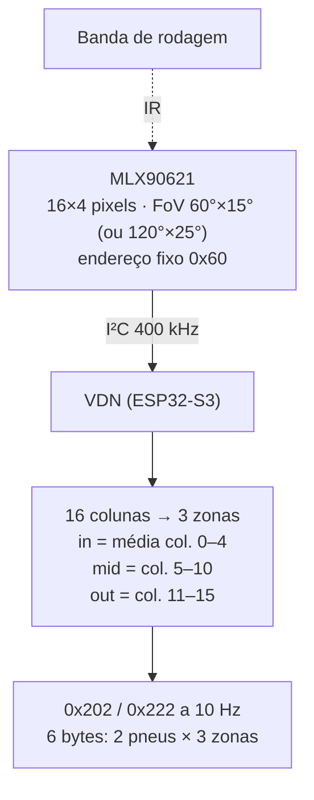

# 🌡️ Matriz Térmica de Pneus MLX90621 & Sensores de Temperatura

> Temperatura da banda de rodagem em **três zonas por pneu** (`tyre_temp_[fl,fr,rl,rr]_[in,mid,out]`, u8 com offset −40 °C, 10 Hz) com **MLX90621 (16×4 pixels)**, um por pneu, nos VDNs. Temperaturas de arrefecimento e do redutor ficam no **nó Térmico** com NTC + ADS1115. Fonte: [[🧭 Plano do Sistema de Telemetria (FSAE Eletrico)]] §4.4, §4.6, §6.1, §6.4.

> [!warning] O que mudou (o nome do arquivo ainda diz MLX90614)
> * **MLX90614 → MLX90621.** O 90614 é um **ponto único**: não mostra gradiente de cambagem, que é o motivo de medir pneu. Três 90614 por pneu resolveriam, mas dão 12 sensores, 12 suportes e um multiplexador por nó.
> * **Sem TCA9548A e sem reprogramar endereço.** O MLX90621 tem endereço **fixo 0x60**; dois no mesmo bus colidem. Solução: **dois controladores I²C** do ESP32-S3 (I²C0 em 8/9, I²C1 em 17/18) — um sensor por bus.
> * **NTC de transmissão saiu do VCU**: virou `gearbox_temp` no nó Térmico, junto com as temperaturas de arrefecimento que não existiam na versão anterior.

---

## 🏎️ 1. O que se quer do pneu

Janela típica de composto FSAE (Hoosier R25B / LC0): frio < 50 °C, ótimo 65–85 °C, degradação > 100 °C. Mas o número que muda o setup não é a média — é o **gradiente interno → externo**:

| Padrão | Diagnóstico | Ação |
| :--- | :--- | :--- |
| Interna muito mais quente que externa | Cambagem negativa demais | Reduzir cambagem |
| Externa mais quente | Cambagem insuficiente (ou pressão baixa) | Aumentar cambagem / pressão |
| Centro mais quente que as bordas | Pressão alta | Baixar pressão |
| Centro mais frio | Pressão baixa | Subir pressão |

Um sensor de ponto único não vê nada disso.

---

## 🔍 2. MLX90621 — matriz 16×4



| Parâmetro | Valor | Nota |
| :--- | :--- | :--- |
| Resolução | 16×4 pixels, 0,1 °C típ. | Só a linha do meio importa; as 4 linhas se somam para reduzir ruído |
| Faixa de objeto | −20 a 300 °C | |
| Taxa interna | 0,5–512 Hz (configurável) | Usar 32 Hz internamente, publicar a 10 Hz |
| Montagem | Suporte na manga de eixo ou no braço da suspensão, 80–120 mm da banda, apontando o eixo longo (16 px) **transversal** ao pneu | Com FoV 60° a 100 mm cobre ~115 mm — a largura de um pneu de 7,5" |
| Emissividade | 0,95 (borracha) | Registrador de configuração |
| Alimentação | 2,6 V / 3,3 V (verificar o módulo) | Módulos *breakout* normalmente aceitam 3,3 V |
| Endereço | **0x60 (dados), 0x50 (EEPROM)** — fixo | Por isso dois barramentos |

**Zonas:** a matriz 16×4 é dividida em 3 grupos de colunas. Cada grupo vira um `u8` = temperatura + 40 (0–255 → −40…215 °C). São 3 bytes por pneu, 6 por frame.

> [!note] Se o MLX90621 não estiver disponível
> O **MLX90640** (32×24, endereço padrão 0x33, **programável por EEPROM**) é o substituto direto. Com endereço programável, dois cabem num só bus — mas manter os dois barramentos I²C mesmo assim: custa zero e isola falha de um cabo.

**Por que um por pneu e não três pontos:** o 90621 custa o mesmo que três 90614 e dá 16 pontos em vez de 3, num só suporte e um só cabo.

---

## 🔌 3. Dois barramentos I²C no VDN

| Bus | Pinos (S3) | Sensor | Canais |
| :--- | :---: | :--- | :--- |
| I²C0 | SDA 8 / SCL 9 | MLX90621 **esquerdo** | `tyre_temp_[fl\|rl]_[in,mid,out]` |
| I²C1 | SDA 17 / SCL 18 | MLX90621 **direito** | `tyre_temp_[fr\|rr]_[in,mid,out]` |

Pull-up 4,7 kΩ para 3,3 V em cada bus, na PCB do VDN. Cabo par trançado até o sensor (< 1 m), blindagem no AGND. Bus travado (SDA preso em LOW) → rotina de recuperação com 9 pulsos de clock e re-init; flag no heartbeat.

```cpp
TwoWire i2c0 = TwoWire(0);
TwoWire i2c1 = TwoWire(1);
void setupI2C() {
    i2c0.begin(8, 9, 400000);
    i2c1.begin(17, 18, 400000);
}
```

---

## ⚙️ 4. Nó Térmico — NTC e PT1000 (arrefecimento e redutor)

Nó separado (ESP32-S3-DevKitC-1, CAN-2, `0x600–0x60F`), perto do radiador. Canais a 5 Hz, ADS1115 em I²C0 (8/9):

| Canal | Sensor | ADS1115 | Divisor |
| :--- | :--- | :---: | :--- |
| `coolant_temp_motor_in` / `_out` | NTC 10 kΩ (β ≈ 3950) ou PT1000 | A0 / A1 | 10 kΩ 0,1 % para 3,3 V |
| `coolant_temp_inv_in` / `_out` | idem | A2 / A3 | idem |
| `gearbox_temp` | NTC 10 kΩ roscado no cárter do redutor | segundo ADS1115 (0x49) A0 | idem |
| `lv_battery_voltage` | GLV 9–16 V | segundo ADS1115 A3 | 33 k / 12 k |

Dois ADS1115 (0x48 e 0x49, pino ADDR) porque são 6 canais analógicos. Vazão (`coolant_flow_lpm`) em PCNT no GPIO 4; PWM de bomba/ventoinha lidos em 5 e 14.

### Equação β para o NTC

$$R_{NTC} = 10\,\text{k}\Omega \cdot \frac{V_{ADC}}{3{,}3 - V_{ADC}} \qquad T = \left[\frac{1}{298{,}15} + \frac{1}{\beta}\ln\frac{R_{NTC}}{10\,\text{k}}\right]^{-1} - 273{,}15$$

Com o ADS1115 alimentado em 3,3 V aqui (não 5 V como no VCU — o divisor é referenciado a 3,3 V). Ganho 1 (±4,096 V) e leitura a 128 SPS bastam para 5 Hz.

**PT1000** se a equipe preferir linearidade: divisor com 1 kΩ, ~3,85 Ω/°C, e a mesma entrada.

---

## 🔗 Próxima Leitura
* [[🟢 No VDN-Front (ESP32 Heltec V3, Entradas Digitais e SPI)|🟢 Nó VDN — pinagem dos dois I²C]]
* [[🔌 Guia Pratico de Conexao de Sensores (Analogicos, Digitais, I2C, SPI e Niveis Logicos)|🔌 I²C: pull-ups e travamento]]
* [[⚡ Circuitos Condicionadores (Divisores 33k-12k, Filtros RC e ADCs MCP3208-ADS131M08)|⚡ ADS1115 e NTC]]
