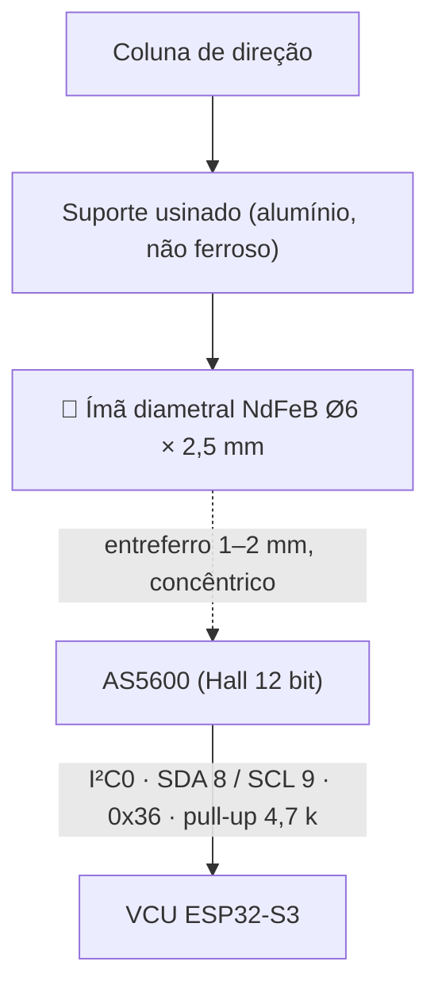
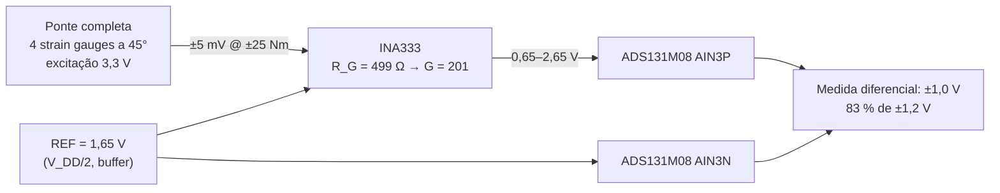

# 🏎️ Sensor de Ângulo AS5600 & Célula de Torque com INA333

> Instrumentação da coluna de direção no **VCU**: ângulo por encoder magnético **AS5600** (I²C0, 0x36) e torque por ponte de extensômetros + **INA333** no **ADS131M08 AIN3, em modo diferencial**. Canais canônicos: `steer_angle` (i16 ×0,1 °, 100 Hz) e `steer_torque` (i16 ×0,01 Nm, 100 Hz), frame `0x103 VCU_Steer`.

> [!warning] Correções em relação à versão anterior
> * Nó: "PCU Heltec V3" → **VCU (ESP32-S3)**. Barramento I²C0 nos GPIOs 8/9.
> * Taxa: 50 Hz → **100 Hz**, no mesmo frame `0x103` com `steer_rate` calculado no VCU.
> * INA333: R_G 390 Ω / REF 1,65 V para "ADC de 0–3,3 V" → **R_G 499 Ω (G = 201), REF = 1,65 V, saída lida diferencialmente contra o REF** no ADS131M08 (FSR ±1,2 V). Single-ended saturaria.

---

## 🧭 1. Ângulo de esterço — AS5600



| Parâmetro | Valor | Nota |
| :--- | :--- | :--- |
| Resolução | 12 bit → 0,088 °/LSB | Curso de ±120 ° usa ~2730 contagens |
| Taxa de leitura | 100 Hz | Registrador `RAW_ANGLE` (0x0C/0x0D); leitura de 2 bytes ≈ 60 µs a 400 kHz |
| Zero | Gravado no NVS do VCU com volante centrado nos cavaletes | Não usar a programação OTP do AS5600 (irreversível) |
| Alinhamento | Ímã concêntrico ao eixo do sensor, ≤ 0,25 mm de excentricidade | Excentricidade vira erro senoidal de até ±2 ° |
| Direção | Sentido horário = ângulo positivo? Definir e fixar na calibração | ISO 8855: esterço à esquerda positivo |

**`steer_rate`** = derivada do ângulo, calculada no VCU com filtro de 1ª ordem (τ = 20 ms) e enviada em `0x103` (i16 ×0,1 °/s). O Pi não precisa derivar.

---

## ⚖️ 2. Torque na coluna — ponte + INA333 + ADS131M08



### Ganho

$$G = 1 + \frac{100\,\text{k}\Omega}{R_G} = 1 + \frac{100\,000}{499} \approx 201$$

$$\Delta V_{out} = \pm 5\,\text{mV} \times 201 \approx \pm 1{,}0\,\text{V}$$

### Por que REF = 1,65 V e leitura diferencial

* O INA333 alimentado em 3,3 V *single-supply* só coloca a saída entre ~0,05 V e ~3,25 V. Uma referência baixa (0,6 V) faria a saída bater no fundo com torque negativo.
* Com REF = 1,65 V a saída fica em 0,65–2,65 V. **Single-ended** isso satura o ADS131M08 (±1,2 V). **Diferencial** (AINP = saída, AINN = REF), o ADC vê ±1,0 V — dentro do FSR, com 17 % de margem para sobretorque.
* Entradas absolutas 0,65–2,65 V ficam entre AGND e AVDD. OK.

### Resolução e ruído

24 bits em ±1,2 V → 0,14 µV/LSB nominal; o ruído efetivo do ADS131M08 a 1 kSPS fica em ~20 bits (≈ 2 µV), equivalente a **0,05 mNm**. O limitante é a ponte, não o ADC: usar cabo blindado, excitação do mesmo 3,3 V que alimenta o REF (medida ratiométrica), e calibrar com pesos conhecidos num braço de alavanca.

### Calibração
1. Volante solto: registrar offset (deve estar próximo de 0 V diferencial).
2. Massa conhecida a 0,30 m do eixo: torque = m·g·0,30. Dois pontos (±) definem ganho e linearidade.
3. Coeficientes no NVS do VCU. `steer_torque` sai em Nm ×0,01.

---

## 💻 3. Firmware — leitura do AS5600 (I²C0 do S3)

```cpp
#include <Wire.h>

#define AS5600_ADDR     0x36
#define REG_RAW_ANGLE_H 0x0C

TwoWire i2c0 = TwoWire(0);

void setupAS5600() {
    i2c0.begin(8, 9, 400000);   // SDA 8, SCL 9
}

uint16_t readAS5600Raw() {
    i2c0.beginTransmission(AS5600_ADDR);
    i2c0.write(REG_RAW_ANGLE_H);
    if (i2c0.endTransmission(false) != 0) return 0xFFFF;   // erro → flag
    if (i2c0.requestFrom(AS5600_ADDR, 2) != 2) return 0xFFFF;
    uint8_t h = i2c0.read(), l = i2c0.read();
    return ((h & 0x0F) << 8) | l;                            // 0..4095
}

// Ângulo em 0,1° a partir do zero salvo no NVS; wrap em ±180°
int16_t steerAngle_x10(uint16_t raw, uint16_t zero) {
    int32_t d = (int32_t)raw - (int32_t)zero;
    if (d > 2048)  d -= 4096;
    if (d < -2048) d += 4096;
    return (int16_t)(d * 3600L / 4096L);
}
```

`0xFFFF` em `raw` → bit `adc_fault` no heartbeat e último valor válido por 500 ms ([[🧭 Plano do Sistema de Telemetria (FSAE Eletrico)]] §9).

---

## 🔗 Próxima Leitura
* [[⚡ Circuitos Condicionadores (Divisores 33k-12k, Filtros RC e ADCs MCP3208-ADS131M08)|⚡ INA333 e ADS131M08 em detalhe]]
* [[🔵 No PCU (Controle, Powertrain, APS, Freios e Direcao)|🔵 Nó VCU]]
* [[⚙️ Calculos de Dinamica em Tempo Real (Slip, AeroBalance e G-Forces)|⚙️ Slip angle a partir do esterço]]
