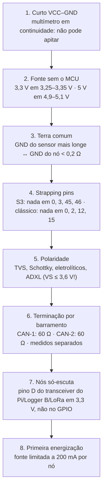

# 📋 Tabela Mestre de Fiação e Pinagem dos Sensores do Veículo

> A "colinha de bancada": pino a pino de cada nó, cor de fio, conector e o checklist antes de energizar. Pinagem copiada de [[🧭 Plano do Sistema de Telemetria (FSAE Eletrico)]] §6 — se divergir, o Plano vence e esta tabela está errada.

> [!danger] A versão anterior desta tabela estava toda errada
> Usava pinos do ESP32 clássico (34, 35, 36, 39, 16, 17, 21, 22) em placas ESP32-S3, mandava APS e freio para o ADC interno, tinha divisor 1,8 k/3,3 k, laser de ride height e TCA9548A. **Nada disso existe mais.** Se alguém montou algo com a tabela antiga, refazer.

---

## 🎨 1. Código de cores do chicote

| Função | Cor | Bitola | Nota |
| :--- | :--- | :---: | :--- |
| Alimentação GLV 12 V | 🔴 Vermelho | 20 AWG | Do PDM/fusíveis até cada nó |
| 5 V (saída do buck do nó) | 🟠 Laranja | 22 AWG | Só sai do nó para o sensor que ele lê (TLE4922, potenciômetro, transdutor) |
| 3,3 V | 🟡 Amarelo | 22 AWG | ADXL, MLX90621, AS5600 |
| GND / AGND | ⚫ Preto | 20 / 22 AWG | Retorno **para o nó que lê o sensor**, nunca pelo chassi |
| Sinal analógico | 🟢 Verde | 24 AWG blindado | Potenciômetros, transdutores, ADXL |
| Pulso (Hall) | 🟣 Roxo | 24 AWG | TLE4922, vazão |
| I²C SDA | 🔵 Azul | 24 AWG par trançado | |
| I²C SCL | ⚪ Branco | 24 AWG par trançado | |
| **CAN-1** H / L | 🟡 Amarelo listra **vermelha** / 🟢 Verde listra **vermelha** | 22 AWG STP 120 Ω | Trativo |
| **CAN-2** H / L | 🟡 Amarelo listra **azul** / 🟢 Verde listra **azul** | 22 AWG STP 120 Ω | Aquisição. **Listra diferente para não cruzar os barramentos** |
| Entradas isoladas do SDC (12 V) | 🟤 Marrom | 22 AWG | Entram só no VCU, via optoacoplador |

---

## 🟢 2. VDN-Front — ESP32-S3-DevKitC-1

* **Local:** *bulkhead* dianteiro. **CAN-2, ponta dianteira → 120 Ω neste nó.**
* Idêntico ao VDN-Rear; jumper GPIO 21 aberto.

| GPIO S3 | Sinal | Tipo | Sensor | Condicionamento na PCB | Alim. sensor | Cor | Conector DTM-F |
| :---: | :--- | :--- | :--- | :--- | :---: | :--- | :--- |
| — (MCP3208 CH0) | `damper_pos_fl` | Analógico 0–5 V | Pot linear 75 mm | Divisor 12 k/24 k + RC 1 k/100 nF | 5 V | 🟢 Verde | P1 sinal · P8 5 V · P9 AGND |
| — (MCP3208 CH1) | `damper_pos_fr` | Analógico 0–5 V | Pot linear 75 mm | idem | 5 V | 🟢 Verde/branco | P2 |
| — (MCP3208 CH2) | `hub_accel_z_fl` | Analógico 0–3,3 V | ADXL377 (eixo Z) | RC 1 k/100 nF | 3,3 V | 🟢 Verde/azul | P3 sinal · P10 3,3 V |
| — (MCP3208 CH3) | `hub_accel_z_fr` | Analógico 0–3,3 V | ADXL377 | RC 1 k/100 nF | 3,3 V | 🟢 Verde/amarelo | P4 |
| — (MCP3208 CH4) | `chassis_accel_z_f` | Analógico 0–3,3 V | ADXL335 (na PCB ou a < 20 cm) | RC 1 k/100 nF | 3,3 V | interno | — |
| **10 / 11 / 12 / 13** | SPI2 CS / MOSI / CLK / MISO | SPI 2 MHz | MCP3208 | — | 3,3 V | interno | — |
| **4** | `wheel_speed_fl` | Pulso open-drain | TLE4922 | Pull-up 4,7 k → 3,3 V + 100 Ω/100 pF | 5 V (PPTC 100 mA) | 🟣 Roxo | P5 sinal · P8 5 V · P9 GND |
| **5** | `wheel_speed_fr` | Pulso open-drain | TLE4922 | idem | 5 V (PPTC) | 🟣 Roxo/branco | P6 |
| **8 / 9** | I²C0 SDA / SCL | I²C 400 kHz | MLX90621 **esquerdo** (0x60) | Pull-up 4,7 k na PCB | 3,3 V | 🔵 Azul / ⚪ Branco | P11 / P12 |
| **17 / 18** | I²C1 SDA / SCL | I²C 400 kHz | MLX90621 **direito** (0x60) | Pull-up 4,7 k na PCB | 3,3 V | 🔵 Azul/preto / ⚪ Branco/preto | P13 / P14 |
| **6 / 7** | CAN-2 TX / RX | TWAI | SN65HVD230 (D / R) | R_s 10 k → GND; PESD1CAN; **120 Ω** | 3,3 V | interno | CAN-H/L: DTM-CAN2 P1/P2 |
| **21** | Jumper ID | Digital | — | Aberto = Front | — | — | — |
| **48** | LED | — | RGB da placa | — | — | — | — |
| `5V` / `GND` da DevKitC | Alimentação | — | Do buck da PCB do nó | Fusível 1 A, SMBJ24A, buck, LDO | GLV | 🔴 / ⚫ | DTM-PWR P1/P2 |

---

## 🟢 3. VDN-Rear — ESP32-S3-DevKitC-1

* **Local:** subchassi traseiro, caixa IP65. **CAN-2, ponta traseira → 120 Ω neste nó.**
* **Mesma tabela do VDN-Front**, trocando `fl→rl`, `fr→rr`, `_f→_r`. Jumper GPIO 21 **em GND**. Conector DTM-R com a mesma numeração de pinos — um chicote de eixo serve para qualquer dos dois.

---

## 🔵 4. VCU — ESP32-S3-WROOM-1 em PCB própria

* **Local:** cockpit, atrás do painel. **CAN-1, ponta do cockpit → 120 Ω neste nó (CAN-1).** No CAN-2 é nó intermediário, sem resistor.

| GPIO S3 | Sinal | Tipo | Sensor / destino | Condicionamento na PCB | Alim. | Cor | Conector |
| :---: | :--- | :--- | :--- | :--- | :---: | :--- | :--- |
| — (ADS131M08 AIN0) | `apps1_raw` | 0,5–4,5 V | APPS 1 | Divisor **33 k/12 k** + 22 nF | 5 V | 🟢 Verde | Molex-Pedais P1 |
| — (**ADS1115 A0**) | `apps2_raw` | 4,5–0,5 V | APPS 2 (invertido) | **Direto** (ADS1115 em 5 V) | 5 V | 🟢 Verde/preto | Molex-Pedais P2 |
| — (ADS131M08 AIN1) | `bse_press_front` | 0,5–4,5 V | Transdutor 0–100 bar F | 33 k/12 k + 22 nF | 5 V | 🟢 Verde/vermelho | Molex-Pedais P3 |
| — (ADS131M08 AIN2) | `bse_press_rear` | 0,5–4,5 V | Transdutor 0–100 bar R | 33 k/12 k + 22 nF | 5 V | 🟢 Verde/amarelo | Molex-Pedais P4 |
| — (ADS131M08 AIN4) | `brake_pedal_pos` | 0–5 V | Pot linear do pedal | Divisor 38 k(39 k)/12 k | 5 V | 🟢 Verde/branco | Molex-Pedais P5 |
| — (ADS131M08 AIN3 P/N) | `steer_torque` | ±5 mV | Ponte + INA333 (na PCB) | INA333 G = 201, REF 1,65 V, leitura diferencial | 3,3 V (excitação) | 🟢 Verde/azul (4 fios blindado) | Molex-Direção P1–P4 |
| — (ADS1115 A1) | `regen_level` | 0–5 V | Pot rotativo de painel | Direto | 5 V | 🟢 Verde/laranja | Molex-Painel P1 |
| **8 / 9** | I²C0 SDA / SCL | I²C | AS5600 (0x36), ADS1115 (0x48), PCF8574 (0x20) | Pull-up 4,7 k | 3,3 V | 🔵 / ⚪ | Molex-Direção P5/P6 (AS5600) |
| **10 / 11 / 12 / 13** | SPI2 | SPI | ADS131M08 | — | 3,3 V | interno | — |
| **21 / 47** | ADS131M08 DRDY / SYNC-RESET | Digital | — | — | — | interno | — |
| **14 / 15 / 16 / 17 / 18** | SPI3 CS / MOSI / CLK / MISO / INT | SPI | MCP2515 (CAN-2) | Cristal 16 MHz; SN65HVD230 nº 2 | 3,3 V | interno | CAN-H/L: DTM-CAN2 |
| **38** | SPI3 CS nº 2 | SPI | microSD (log L1) | — | 3,3 V | interno | — |
| **39 / 40 / 41** | `sdc_ok` / `precharge_done` / `rtd_btn` | 12 V → opto | SDC, relé de pré-carga, botão RTD | PC817 + 2,2 kΩ por entrada | 12 V (SDC) | 🟤 Marrom | DTM-SDC P1–P3 |
| PCF8574 P0–P5 | `imd_ok`, `ams_ok`, `bspd_ok`, `air_pos`, `air_neg`, `tsal` | 12 V → opto | IMD, Orion, BSPD, AIRs, TSAL | PC817 + 2,2 kΩ por entrada | 12 V | 🟤 Marrom/listra | DTM-SDC P4–P9 |
| **42** | INT do PCF8574 | Digital | — | — | — | interno | — |
| **1 / 2 / 4** | RTD sound / TSAL enable / luz de falha | Saída → driver | Buzzer, lógica TSAL, LED do painel | MOSFET / relé | 12 V | 🔴/⚫ | DTM-OUT P1–P3 |
| **6 / 7** | **CAN-1** TX / RX | TWAI | SN65HVD230 nº 1 | R_s 10 k; PESD1CAN; **120 Ω** | 3,3 V | interno | DTM-CAN1 P1/P2 |
| **48** | LED | — | — | — | — | — | — |

---

## 🟣 5. INU — LilyGO T-Beam (ESP32 clássico)

* **Local:** CG. **CAN-2 intermediário, sem 120 Ω.**

| GPIO | Sinal | Tipo | Sensor | Condicionamento | Alim. | Nota |
| :---: | :--- | :--- | :--- | :--- | :---: | :--- |
| **21 / 22** | I²C SDA / SCL | I²C 400 kHz | BNO085 (0x4A) — bus compartilhado com AXP192 (0x34) | Pull-up 2,2 k (já na placa) | 3,3 V | Cabo < 15 cm; BNO085 na mesma caixa |
| **13** | IMU INT | Digital | BNO085 INT | — | — | Era 33 (DIO1 do rádio) — **não voltar** |
| **34** | GPS RX | UART | NEO-M8N TX | nativo da placa | — | Não tocar |
| **12** | GPS TX | UART | NEO-M8N RX | nativo da placa | — | Não tocar |
| **37** | GPS PPS | Interrupção | TIMEPULSE | 100 Ω série | — | **Confirmar na revisão**; alternativas 36/39 |
| **25** | CAN-2 TX | TWAI | SN65HVD230 D | R_s 10 k; PESD1CAN; **sem** 120 Ω | 3,3 V | |
| **4** | CAN-2 RX | TWAI | SN65HVD230 R | — | 3,3 V | Era 26 (DIO0 do rádio) — **não voltar**. LED da placa pisca com tráfego |
| `5V` / `GND` | Alimentação | — | Do buck da PCB do nó | Fusível 1 A, SMBJ24A, buck | GLV | Não usar a bateria 18650 da T-Beam |

---

## 🌡️ 6. Nó Térmico — ESP32-S3-DevKitC-1

* **Local:** junto ao radiador/bomba. **CAN-2 intermediário, sem 120 Ω.**

| GPIO S3 | Sinal | Sensor | Condicionamento | Cor |
| :---: | :--- | :--- | :--- | :--- |
| **8 / 9** | I²C0 → ADS1115 nº 1 (0x48) A0–A3 | `coolant_temp_motor_in/out`, `coolant_temp_inv_in/out` — NTC 10 k | Divisor 10 k 0,1 % → 3,3 V, RC 3,3 k/100 nF | 🟢 Verde |
| **8 / 9** | I²C0 → ADS1115 nº 2 (0x49) A0 / A3 | `gearbox_temp` NTC 10 k / `lv_battery_voltage` | Divisor 10 k → 3,3 V / Divisor 33 k/12 k | 🟢 Verde / 🔴 Vermelho |
| **4** | PCNT — `coolant_flow_lpm` | Sensor de vazão Hall | Pull-up 4,7 k → 3,3 V | 🟣 Roxo |
| **5 / 14** | `pump_duty_pct` / `fan_duty_pct` | Sinal PWM do controlador (12 V) | Divisor 33 k/12 k **ou** opto, para 3,3 V | 🟣 Roxo/listra |
| **6 / 7** | CAN-2 TX / RX | SN65HVD230 | R_s 10 k; PESD1CAN | — |

---

## 📼 7. Logger B — ESP32-S3-DevKitC-1 (só escuta)

| GPIO S3 | Sinal | Nota |
| :---: | :--- | :--- |
| **7** | CAN-2 RX | ← pino R do SN65HVD230 |
| **6** | CAN-2 TX | **Não ligar ao transceiver.** Pino D do SN65HVD230 ligado a 3,3 V (recessivo permanente). Firmware em `TWAI_MODE_LISTEN_ONLY` |
| **10 / 11 / 12 / 13** | SPI2 → microSD | CS / MOSI / CLK / MISO. Cartão industrial ≥ 32 GB |
| **48** | LED | Pisca a cada bloco gravado |

---

## 📡 8. Gateway LoRa — Heltec WiFi LoRa 32 V3 (só escuta)

| GPIO S3 | Sinal | Nota |
| :---: | :--- | :--- |
| **8 / 9 / 10 / 11 / 12 / 13 / 14** | SX1262 NSS / SCK / MOSI / MISO / RST / BUSY / DIO1 | **De fábrica** — é por isso que a Heltec só serve aqui |
| **6** | CAN-2 RX | ← pino R do SN65HVD230 |
| — | CAN-2 TX | **Desconectado.** D do transceiver a 3,3 V |
| **36** | Vext | Controle da alimentação do OLED (ativo em LOW) |
| **17 / 18 / 21** | OLED SDA / SCL / RST | Opcional: mostra RSSI e contador de pacotes |
| Antena | 915 MHz, no *roll hoop*, ≥ 30 cm da antena GPS | Cabo u.FL → SMA curto |

---

## 🍓 9. Raspberry Pi 4 — Logger A (só escuta)

| Interface | Ligação | Nota |
| :--- | :--- | :--- |
| HAT dois CAN (MCP2515 ×2 ou MCP2518FD ×2) | SPI0 CE0 / CE1 | `can0` = **CAN-1**, `can1` = **CAN-2**; ambos `listen-only on` |
| Terminação | **Desligada** nos dois canais (jumpers do HAT) | O Pi nunca é ponta de barramento |
| Alimentação | Buck 5 V / 3 A → **UPS supercap** → USB-C | Sinais "energia caiu" / "pode desligar" em GPIO 17 / 27 |
| Display do piloto | HDMI ou SPI | Alimentado pelo Pi; conteúdo em [[🔴 Gateway e Logger Raspberry Pi (SocketCAN, Logs BLF e CSV)]] |

---

## 🛡️ 10. Checklist anti-queima (antes de energizar qualquer nó)

**Passo 6 em detalhe.** Com tudo desligado, medir `CAN-H`↔`CAN-L` **de cada barramento**:

| Leitura | CAN-1 | CAN-2 |
| :---: | :--- | :--- |
| **60 Ω** | ✅ CVW300 + VCU terminados | ✅ VDN-Front + VDN-Rear terminados |
| 120 Ω | Falta uma ponta (checar terminação interna do CVW300/Orion) | Um VDN desconectado |
| ~40 Ω | Alguém terminou o Pi ou o Orion | Alguém terminou INU / Térmico / Logger B / LoRa / Pi |
| 0 Ω | Curto H–L | Curto H–L |
| Leitura igual nos dois barramentos ao curto-circuitar um deles | ⚠️ **Os dois barramentos estão ligados** — erro grave de chicote. Refazer |

**Passo 8:** DevKitC em repouso consome 50–90 mA; com MCP3208, transceiver e dois MLX90621, < 200 mA em 5 V. Se bater no limite e a tensão cair, desligar e procurar o curto.

---

## 🔗 Navegação
* [[📌 Mapa Definitivo de Pinos do ESP32 (Pinout, Strapping Pins, ADC1 vs ADC2 e Regras de Ouro)|📌 Regras de pino por chip]]
* [[⚡ Circuitos Condicionadores (Divisores 33k-12k, Filtros RC e ADCs MCP3208-ADS131M08)|⚡ Cada divisor, cada ADC]]
* [[🌐 Topologia Macro da Rede CAN 500k e Distribuicao dos Nos|🌐 Onde cada nó fica]]
* [[⚡ Alimentacao Eletrica, Protecoes TVS e Isolamento Galvanico|⚡ Cadeia de alimentação por nó]]
