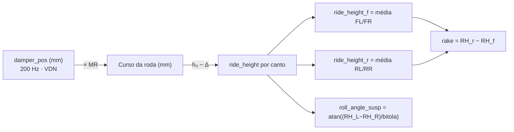
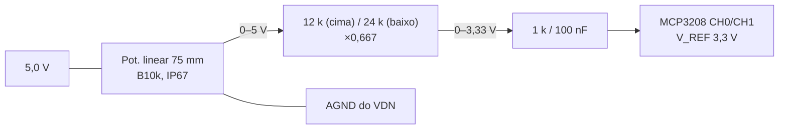

# 📐 Ride Height — Derivado do Amortecedor, Sem Sensor Dedicado

> Decisão fechada em [[🧭 Plano do Sistema de Telemetria (FSAE Eletrico)]] §1: **não há sensor laser/óptico de altura**. `ride_height_f/r` e `rake` são **canais derivados no Pi** a partir dos quatro `damper_pos_*` (potenciômetro linear 75 mm, 200 Hz, MCP3208). Esta nota explica por quê e como calibrar.

> [!warning] O que mudou
> * Os três sensores laser (2 dianteiros, 1 traseiro) e o `X_CHZ_Front/Rear_LSR` **saíram**.
> * O potenciômetro entra no MCP3208 por divisor **12 k / 24 k** (era "33k/12k", que é do ADS131M08).
> * Taxa: 10 Hz → **200 Hz** (velocidade de amortecedor é derivada; a massa não suspensa ressoa a 12–18 Hz).

---

## ❌ 1. Por que o sensor laser saiu

| Candidato | Problema | Veredito |
| :--- | :--- | :--- |
| **Sharp GP2Y0A21** (triangulação IR) | Faixa **10–80 cm**. Ride height de FSAE é 25–50 **mm**. Abaixo de 10 cm a curva é **não-monotônica**: duas distâncias dão a mesma tensão. Não mede o que precisa | Inutilizável |
| **VL53L0X** (ToF) | Resolução ±3 % (≈ 1 mm em 40 mm), 30–50 Hz, sensível a poeira de borracha, asfalto molhado e sol direto. Precisa de I²C até o assoalho | Não vale o chicote |
| Laser industrial (Micro-Epsilon etc.) | Funciona — a R$ 3 000+ por unidade | Fora de orçamento |

E o argumento de dinâmica: o que a equipe quer do ride height é **atitude do chassi** (pitch, roll, rake) e **velocidade de amortecedor**. Os dois vêm melhor do curso do amortecedor, que é rígido, selado e já está lá. A deflexão do pneu (a única coisa que o laser veria a mais) é estimada pelo modelo de rigidez vertical do pneu.

---

## 📏 2. Do curso do amortecedor à altura

$$\Delta z_{roda} = MR \cdot (d - d_0) \qquad RH_i = h_{0,i} - \Delta z_{roda,i}$$

| Símbolo | O que é | De onde vem |
| :--- | :--- | :--- |
| $d$ | Curso do potenciômetro (mm) | `damper_pos_*` |
| $d_0$ | Curso na altura estática com piloto | Calibração nos cavaletes (§3) |
| $MR$ | *Motion ratio* — mm de roda por mm de amortecedor | **Pendência** da Dinâmica Veicular ([[🧭 Plano do Sistema de Telemetria (FSAE Eletrico)]] §12). Tipicamente 0,7–1,2 em *pushrod*; **não é constante** ao longo do curso — usar tabela ou polinômio do CAD |
| $h_{0,i}$ | Ride height estático medido com régua | Setup sheet do carro |

$$rake = RH_r - RH_f \qquad \theta_{rake} = \arctan\left(\frac{rake}{L}\right)$$

Todos derivados **no Pi** (e disponíveis no pós-processamento). Nenhum nó calcula altura.

---

## 📐 3. Calibração do potenciômetro (75 mm, 0–5 V)

Função de transferência:

$$d\,[\text{mm}] = K \cdot (D - D_0) + d_0 \qquad K = \frac{75\,\text{mm}}{D_{75} - D_{0mm}}$$

**Procedimento (nos cavaletes, roda no ar → roda em carga):**
1. Suspensão totalmente estendida (roda no ar): anotar $D_{ext}$.
2. Suspensão no batente (com o pneu no chão e o carro empurrado para baixo até o *bump stop*): anotar $D_{comp}$.
3. Carro no chão, piloto a bordo, balançar e soltar: $D_0$ e o ride height estático $h_0$ com régua nos quatro cantos.
4. Gravar $K$, $D_0$, $h_0$, $MR(d)$ no arquivo de setup do Pi. O VDN envia **contagens brutas convertidas para mm de amortecedor** (u16 ×0,01 mm) — a calibração mecânica fica no Pi, onde pode ser corrigida sem reflashar o nó.

**Sanidade:** $D$ fora de $[D_{ext}-2\%,\ D_{comp}+2\%]$ → `adc_fault`. Potenciômetro desconectado lê 0 (pull-down do divisor) → fora de faixa → flag.

---

## ⏱️ 4. Por que 200 Hz

* **Velocidade de amortecedor** (`damper_vel_*`, derivado no Pi) é o que define o histograma de *shock speed*. Picos de 300–500 mm/s duram poucos ms; a 10 Hz eles desaparecem.
* Massa não suspensa ressoa a **12–18 Hz**; para ver a forma da oscilação precisa de ≥ 10 amostras por ciclo → ≥ 180 Hz.
* O Miro tinha 10 Hz porque copiou a taxa do ride height laser (30–50 Hz de integração óptica). Com o laser fora, a taxa é a da suspensão.

Frame `0x200/0x220` a 200 Hz, 8 bytes — 27 kbps por VDN. Cabe.

---

## 🔗 Próxima Leitura
* [[🟢 No VDN-Front (ESP32 Heltec V3, Entradas Digitais e SPI)|🟢 Canais do MCP3208]]
* [[⚙️ Calculos de Dinamica em Tempo Real (Slip, AeroBalance e G-Forces)|⚙️ damper_vel, ride height e rake no Pi]]
* [[⚡ Circuitos Condicionadores (Divisores 33k-12k, Filtros RC e ADCs MCP3208-ADS131M08)|⚡ Divisor 12k/24k]]
* [[📋 Revisao da Arquitetura Planejada (Miro)|📋 Análise do GP2Y0A21 (§3)]]
