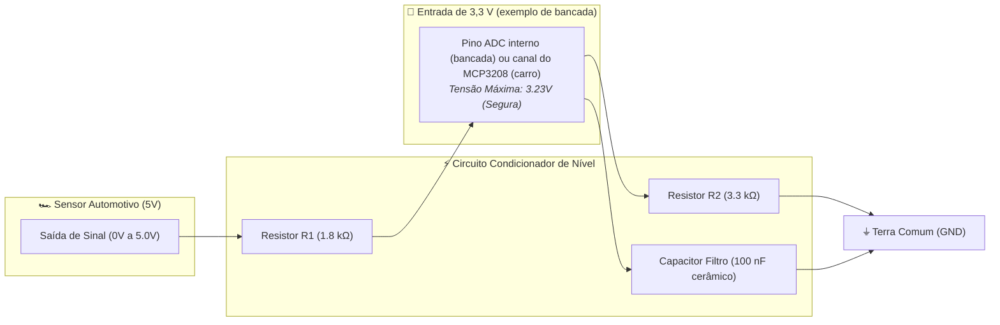
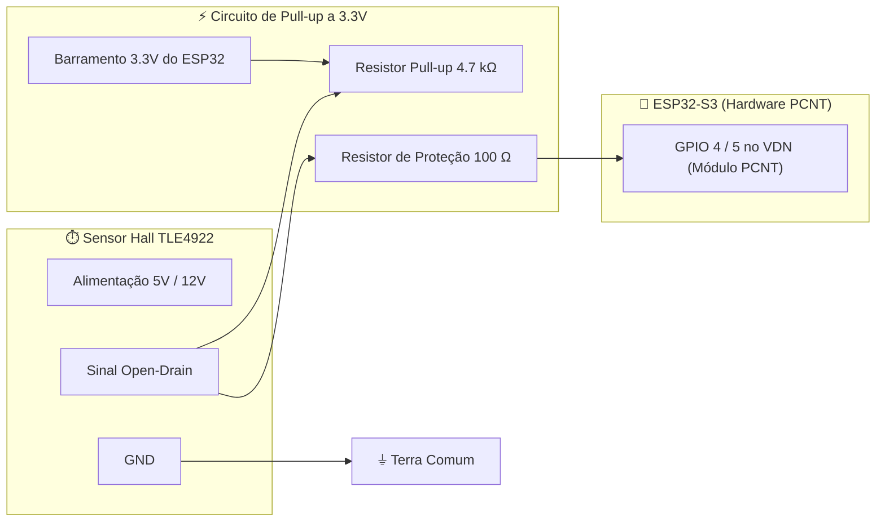
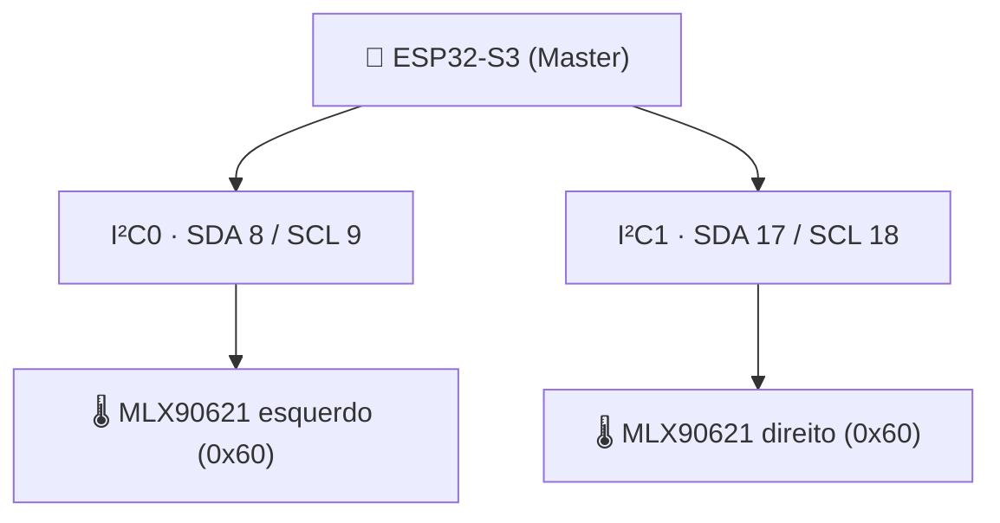
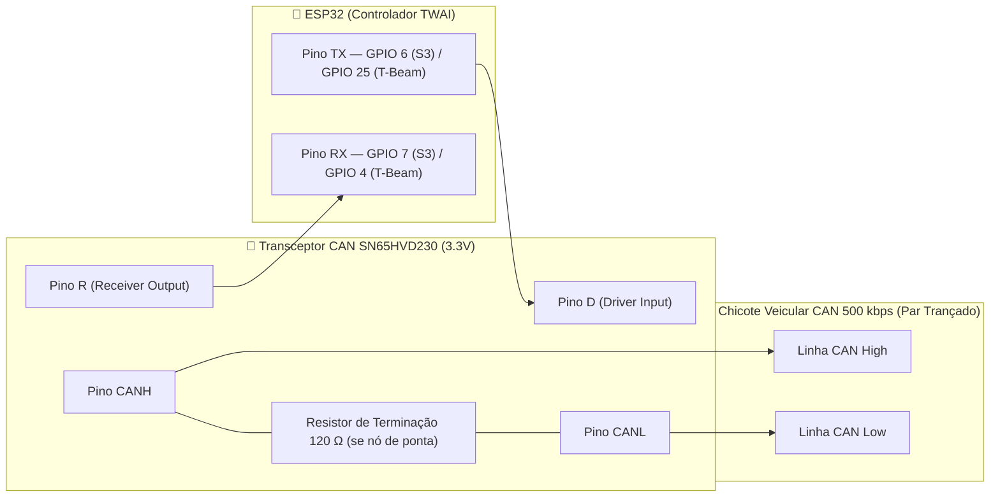

# 🔌 Guia Prático de Conexão de Sensores — Analógicos, Digitais, I2C, SPI e Níveis Lógicos

> Manual de instrumentação e eletrônica de bancada para conexão física, proteção de entrada e condicionamento de sinais dos sensores automotivos da UTForce E-Racing ao microcontrolador ESP32.

> [!info] Revisado em 2026-09-14 — leia antes de usar os exemplos
> Este guia é **didático**: ensina o princípio de cada tipo de conexão. Os valores que valem para o carro estão em [[🧭 Plano do Sistema de Telemetria (FSAE Eletrico)]] §5–§6 e em [[📋 Tabela Mestre de Fiacao e Pinagem dos Sensores do Veiculo]]. Diferenças importantes:
> * **Nenhum sensor analógico do carro entra no ADC interno do ESP32.** Vão para MCP3208 (VDN), ADS131M08 e ADS1115 (VCU, Térmico). O divisor 1,8 k/3,3 k de §2 é exemplo de bancada; os divisores reais são 33 k/12 k (ADS131M08), 12 k/24 k (MCP3208) e nenhum (ADS1115 em 5 V).
> * Os nós usam **ESP32-S3** (pinos 6/7 para CAN, 10–13 para SPI, 8/9 e 17/18 para I²C). Só o INU é ESP32 clássico.
> * Pneu usa **MLX90621** com endereço fixo em **dois barramentos I²C** — não há TCA9548A.
> * São **dois barramentos CAN**, cada um com as próprias duas terminações.

---

## ⚡ 1. Princípios de Ouro da Eletrônica de Sensores

Antes de conectar qualquer sensor a um microcontrolador em um monoposto elétrico de competição, é mandatório dominar dois conceitos físicos que evitam 90% das falhas de telemetria:

### 1.1. O Conceito Obrigatório de Terra Comum (*Common Ground*)
A tensão elétrica ($V$) é, por definição física, uma **diferença de potencial entre dois pontos**. Quando dizemos que um sensor emite um sinal de $2.5\,\text{V}$, isso significa que o sinal está $2.5\,\text{V}$ acima do terminal negativo de referência daquele sensor (**GND**).
* Se o sensor for alimentado por uma bateria ou fonte e o ESP32 por outra, e seus terminais negativos **não** estiverem interligados, o ESP32 não terá referência de zero.
* O pino analógico lerá ruído caótico induzido pelo ambiente (*floating ground*).
* **Regra**: O terminal negativo (**GND**) de todos os sensores, módulos e transceptores deve estar solidamente conectado ao plano de terra do microcontrolador.

### 1.2. O Perigo da Incompatibilidade de Níveis de Tensão ($5\,\text{V} \rightarrow 3.3\,\text{V}$)
* O ESP32 opera internamente com nível lógico de **$3.3\,\text{V}$**.
* Muitos sensores industriais e automotivos operam a **$5\,\text{V}$** (ou até $12\,\text{V}$).
* Conectar um sinal de $5\,\text{V}$ diretamente a uma porta do ESP32 polariza diretamente os diodos de clamp internos e destrói o transistor CMOS por sobretensão.
* **Solução**: Deve-se utilizar um circuito de atenuação passivo (**Divisor Resistivo**) ou ativo (**Conversor de Nível Lógico bidirecional com MOSFET**).



---

## 📈 2. Conectando Sensores Analógicos (Passo a Passo)

### Sensores Típicos no Carro:
* **Potenciômetros Lineares de Suspensão** (medição de curso de amortecedor e altura de rodagem).
* **Transdutores de Pressão Hidráulica** (linhas de freio dianteiro e traseiro).
* **Sensores de Posição do Acelerador (APS)**.

### 2.1. O Circuito de Conexão com Divisor e Filtro RC
Para sensores analógicos de $0$ a $5\,\text{V}$ **em bancada, lendo no ADC interno**, o divisor 1,8 k/3,3 k abaixo ilustra o princípio. **No carro**, o divisor depende do ADC de destino ([[⚡ Circuitos Condicionadores (Divisores 33k-12k, Filtros RC e ADCs MCP3208-ADS131M08)]] §2): 12 k/24 k para o MCP3208 (0–3,3 V), 33 k/12 k para o ADS131M08 (±1,2 V), e **nenhum** para o ADS1115 alimentado em 5 V.
$$V_{OUT} = V_{IN} \cdot \frac{R_2}{R_1 + R_2} = 5.0\,\text{V} \cdot \frac{3300\,\Omega}{1800\,\Omega + 3300\,\Omega} = 5.0\,\text{V} \cdot 0.647 = 3.235\,\text{V}$$

Para filtrar o ruído eletromagnético de alta frequência gerado pela comutação do inversor trifásico de tração, adiciona-se um capacitor cerâmico de desacoplamento de $100\,\text{nF}$ em paralelo com $R_2$. Isso forma um **filtro passa-baixa RC** com frequência de corte:
$$f_c = \frac{1}{2 \pi \cdot (R_1 \parallel R_2) \cdot C} \approx \frac{1}{2 \pi \cdot 1164\,\Omega \cdot 100 \times 10^{-9}\,\text{F}} \approx 1367\,\text{Hz}$$
Essa frequência permite passar sinais mecânicos rápidos da suspensão (que raramente passam de $50\,\text{Hz}$), enquanto barra totalmente o ruído de chaveamento PWM do inversor ($10\,\text{kHz}$ a $20\,\text{kHz}$).

### 2.2. Configuração do ADC do ESP32 no Código (bancada apenas):
No carro a leitura é `readMCP3208(ch)` via SPI ([[🟢 No VDN-Front (ESP32 Heltec V3, Entradas Digitais e SPI)]] §5). O código abaixo serve para testar um sensor com uma DevKitC solta na bancada — no ESP32-S3, ADC1 = GPIO 1–10.

```cpp
#include <Arduino.h>

// ESP32-S3: ADC1 = GPIO 1..10 (no clássico seria 32..39). NUNCA ADC2 com Wi-Fi.
const int PIN_SUSPENSAO_FL = 1;

void setup() {
    Serial.begin(115200);

    // Configura resolução máxima de 12 bits (0 a 4095 divisões)
    analogReadResolution(12);

    // Configura atenuação de 11 dB (permite ler tensões de até ~3.1V a 3.3V)
    analogSetAttenuation(ADC_11db);

    pinMode(PIN_SUSPENSAO_FL, INPUT);
}

void loop() {
    // Leitura bruta de 0 a 4095
    int raw = analogRead(PIN_SUSPENSAO_FL);

    // Conversão para milivolts reais (calibrado)
    uint32_t tensao_mv = analogReadMilliVolts(PIN_SUSPENSAO_FL);

    // Conversão para curso físico em milímetros (exemplo: sensor de 100 mm)
    // Considerando que 3235 mV = 100 mm de curso
    float curso_mm = (tensao_mv / 3235.0f) * 100.0f;

    Serial.printf("Raw: %4d | Tensão: %4d mV | Curso: %6.2f mm\n", 
                  raw, tensao_mv, curso_mm);
    delay(10); // 100 Hz
}
```

---

## ⏱️ 3. Conectando Sensores de Pulso e Frequência (Passo a Passo)

### Sensores Típicos no Carro:
* **Sensores de Efeito Hall TLE4922** (leitura de dentes da roda fônica nos cubos dianteiros e traseiros).
* Sensores de rotação do motor elétrico.

### 3.1. O que é Saída de Coletor Aberto (*Open-Collector*)?
A maioria dos sensores Hall automotivos não emite uma tensão positiva ativamente. Internamente, possuem um transistor NPN ou MOSFET conectado ao GND:
* Quando **não há dente metálico**: o transistor está aberto (o pino fica flutuando se não houver pull-up).
* Quando o **dente metálico passa**: o transistor fecha e puxa a linha para o **GND ($0\,\text{V}$)**.

> [!IMPORTANT]
> ### Por que o Resistor de Pull-Up Externo é Obrigatório?
> Se você ligar o sensor Hall direto no ESP32 sem resistor de pull-up, o pino nunca atingirá o nível alto ($3.3\,\text{V}$), resultando em zero pulsos detectados.
> Conecte um resistor de **$4.7\,\text{k}\Omega$ entre o fio de sinal e a linha de $3.3\,\text{V}$**. Quando o transistor do sensor abre, o resistor puxa a linha para $3.3\,\text{V}$ rapidamente.



### 3.2. Por que Usar o Módulo PCNT e Não `attachInterrupt`?
Se uma roda do carro possui uma roda fônica com 36 dentes e o carro está a $100\,\text{km/h}$ ($27.7\,\text{m/s}$):
$$\text{Rotações por segundo} = \frac{27.7\,\text{m/s}}{2\pi \cdot 0.23\,\text{m}} \approx 19.2\,\text{RPS} \implies f = 19.2 \times 36 \approx 691\,\text{pulsos/segundo por roda}$$
Com 4 rodas, são quase **$2.800$ interrupções por segundo**. No FreeRTOS, trocar de contexto $2.800$ vezes por segundo gera aquecimento de CPU e perda de pacotes CAN.
* **O módulo PCNT** (*Pulse Counter*) do ESP32 conta pulsos em nível de circuito de silício puro sem interromper a CPU nenhuma vez. A CPU lê o total acumulado a cada $10\,\text{ms}$ e calcula a velocidade sobre uma janela de $100\,\text{ms}$ — contar só o que chegou em 10 ms dá 0 ou 1 pulso em baixa velocidade ([[⏱️ Sensores de Roda TLE4922 e Contagem por Hardware PCNT]] §3).

---

## 🔌 4. Conectando Sensores em Barramento I2C (Passo a Passo)

### Sensores Típicos no Carro:
* **Matrizes Térmicas de Pneu MLX90621** (infravermelho 16×4, sem contato).
* **Unidade de Medição Inercial BNO085** (acelerações e giroscópios em 9 eixos).
* **Sensor de Ângulo Magnético AS5600** (posição angular do volante/esterço).
* **Barômetro / Altímetro BMP280**.

### 4.1. Como Funciona a Fiação I2C:
O barramento I2C necessita de apenas 4 fios:
1. `VCC` ($3.3\,\text{V}$).
2. `GND` (Terra Comum).
3. `SDA` (*Serial Data*): Transporte bidirecional de bits de dados.
4. `SCL` (*Serial Clock*): Pulso de sincronismo gerado pelo ESP32 (Master).

> [!WARNING]
> ### Resistores de Pull-up de Linha I2C
> O I2C é um barramento de dreno aberto. O ESP32 possui resistores de pull-up internos ativáveis por software, porém são de valor muito alto ($\approx 50\,\text{k}\Omega$).
> Em um chicote de corrida automotivo, com fios de $50\,\text{cm}$ a $1.5\,\text{m}$, a capacitância parasita do cabo com pull-up fraco de $50\,\text{k}\Omega$ deforma a onda quadrada do clock, fazendo o barramento travar em pista (`I2C Bus Lockup`).
> **Solução**: Sempre adicione dois resistores físicos de **$2.2\,\text{k}\Omega$ a $4.7\,\text{k}\Omega$** conectando SDA ao $3.3\,\text{V}$ e SCL ao $3.3\,\text{V}$ na placa de circuito impresso.

### 4.2. O Problema de Endereço Repetido — dois controladores I²C, não multiplexador
Cada pneu tem **um** MLX90621 (matriz 16×4 — as três zonas interna/centro/externa saem da mesma matriz). O MLX90621 tem endereço **fixo 0x60**; dois sensores no mesmo par SDA/SCL colidem.
* Solução adotada: o ESP32-S3 tem **dois controladores I²C independentes**. O sensor esquerdo vai no I²C0 (GPIO 8/9) e o direito no I²C1 (GPIO 17/18). Sem multiplexador, sem reprogramar endereço, e um cabo rompido não derruba o outro sensor.
* Um TCA9548A só faria sentido com três ou mais sensores de endereço fixo num mesmo nó — não é o caso.



#### Código dos dois barramentos:
```cpp
#include <Wire.h>

TwoWire i2c0 = TwoWire(0);
TwoWire i2c1 = TwoWire(1);

void setup() {
    i2c0.begin(8, 9, 400000);    // MLX90621 esquerdo
    i2c1.begin(17, 18, 400000);  // MLX90621 direito
}

// Cada sensor é lido no seu bus, sem comutar nada:
// readMLX90621(i2c0, ...); readMLX90621(i2c1, ...);
```

---

## 🖧 5. Conectando Sensores em Barramento SPI (Passo a Passo)

### Sensores Típicos no Carro:
* **Conversores ADC Externos de Precisão MCP3208** (12 bits) ou **ADS131M08** (24 bits).
* **Módulos de Memória SD Card** para gravação de logs de contingência.

### Fiação SPI do projeto (SPI2 / FSPI do ESP32-S3):
* `CS` (*Chip Select*) $\rightarrow$ **GPIO 10**
* `MOSI` (Master Out Slave In) $\rightarrow$ **GPIO 11**
* `SCK` (Serial Clock) $\rightarrow$ **GPIO 12**
* `MISO` (Master In Slave Out) $\rightarrow$ **GPIO 13**

São os pinos nativos (IO_MUX) do FSPI no S3. No ESP32 clássico o equivalente (VSPI) seria 23/19/18/5 — só o INU é clássico, e ele não usa SPI. O VCU usa ainda o SPI3 (GPIO 14–18) para o MCP2515 e o microSD.

### Conectando Múltiplos Dispositivos SPI:
Diferente do I2C que usa endereços de software, no SPI os sinais de dados e clock são compartilhados entre todos os módulos, mas cada módulo possui sua própria linha física de **Chip Select (CS)**:
* Quando o ESP32 coloca o pino `CS_ADC` em **LOW**, o conversor analógico assume o barramento.
* Quando o ESP32 coloca o pino `CS_SD` em **LOW**, o cartão de memória grava os dados.

---

## 🌐 6. Conectando ao Barramento Automotivo CAN (TWAI + SN65HVD230)

O ESP32 possui a lógica do protocolo CAN 2.0B dentro do seu processador (**TWAI**), mas suas portas GPIO operam com sinais digitais comuns de $0$ a $3.3\,\text{V}$. O barramento automotivo CAN, por outro lado, transmite dados por **tensão diferencial entre dois fios trançados (`CAN_H` e `CAN_L`)** para anular ruídos de motores elétricos.

Para fazer a interface física, conectamos o transceptor automotivo **SN65HVD230** (Texas Instruments):



> [!IMPORTANT]
> ### O Resistor de Terminação de $120\,\Omega$
> Linhas de alta velocidade CAN comportam-se como linhas de transmissão de rádio frequência. Quando a onda elétrica atinge o fim do cabo, se não encontrar uma carga com a impedância exata do cabo ($\approx 120\,\Omega$), ela reflete de volta e destrói o pacote de dados.
> **Regra**: cada barramento tem exatamente **dois** resistores de $120\,\Omega$, nas pontas físicas. **CAN-2**: VDN-Front e VDN-Rear. **CAN-1**: CVW300 e VCU (conferir se inversor e Orion têm terminação interna). Nós intermediários (INU, Térmico, Logger B, Gateway LoRa, Pi) **não** têm resistor. Com o carro desligado, `CAN_H`↔`CAN_L` de **cada** barramento deve medir **$60\,\Omega$**.
>
> **Nós que só escutam** (Pi, Logger B, Gateway LoRa): o pino TX do controlador **não** vai ao pino D do transceiver — D fica em 3,3 V. Assim nem um bug consegue transmitir.

---

## 📊 7. Tabela Comparativa de Protocolos de Sensores

| Protocolo | Fios Necessários | Velocidade Máxima Típica | Distância Máxima Recomendada | Vantagens no Carro | Cuidados Críticos |
| :--- | :--- | :--- | :--- | :--- | :--- |
| **Analógico (0-3.3V)** | 3 (VCC, GND, Sinal) | Instantânea (Limitada pelo ADC) | $< 1.5\,\text{m}$ (Blindado) | Simples, sem overhead de software, latência zero. | Sensível a ruído EMI do inversor; exige capacitor de filtro cerâmico de 100 nF. |
| **Pulso (PCNT)** | 3 (VCC, GND, Pulso) | Até $10\,\text{MHz}$ por hardware | $< 2.0\,\text{m}$ (Par trançado) | Não gasta tempo de CPU do ESP32; determinístico. | Exige resistor de pull-up externo de $4.7\,\text{k}\Omega$ para saídas open-collector. |
| **I2C** | 4 (VCC, GND, SDA, SCL)| $400\,\text{kbps}$ (Fast Mode) | $< 0.8\,\text{m}$ | Suporta múltiplos sensores em apenas 2 fios de sinal. | Exige pull-ups físicos de $4.7\,\text{k}\Omega$; sensores de endereço idêntico vão em controladores I²C separados (o S3 tem dois). |
| **SPI** | 4 + N (MOSI, MISO, SCK, CS)| Até $40\,\text{MHz}$ | $< 0.4\,\text{m}$ (Curto) | Altíssima taxa de transferência de dados; baixa latência. | Exige muitos fios (um CS individual por sensor); sensível a reflexões se o cabo for longo. |
| **CAN / TWAI** | 2 (CAN_H, CAN_L) por barramento | $500\,\text{kbps}$ | Até $40\,\text{m}$ | **Imunidade eletromagnética máxima**; padrão automotivo internacional. | Exige transceptor externo (SN65HVD230) e terminação de $120\,\Omega$ nas pontas **de cada um dos dois barramentos**. |

---

## 🔗 Próximos Passos & Documentos Relacionados

* 📋 **Consulte o mapa de ligação de cada sensor do carro:** [[📋 Tabela Mestre de Fiacao e Pinagem dos Sensores do Veiculo|Tabela Mestre de Fiação e Pinagem]].
* 📌 **Verifique os pinos seguros do ESP32:** [[📌 Mapa Definitivo de Pinos do ESP32 (Pinout, Strapping Pins, ADC1 vs ADC2 e Regras de Ouro)|Mapa Definitivo de Pinos do ESP32]].
* 📘 **Entenda os núcleos e FreeRTOS:** [[📘 Guia Fundamental do ESP32 (Arquitetura, Dual-Core, Perifericos e Limites Eletricos)|Guia Fundamental do ESP32]].
* ⏱️ **Detalhes do sensor de roda:** [[⏱️ Sensores de Roda TLE4922 e Contagem por Hardware PCNT|Sensores de Roda TLE4922 e PCNT]].
