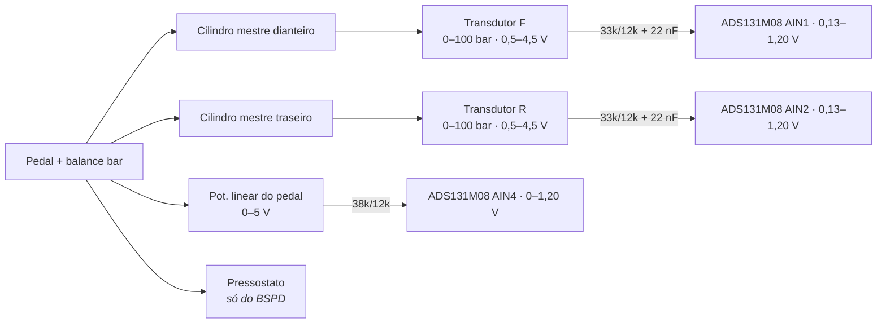
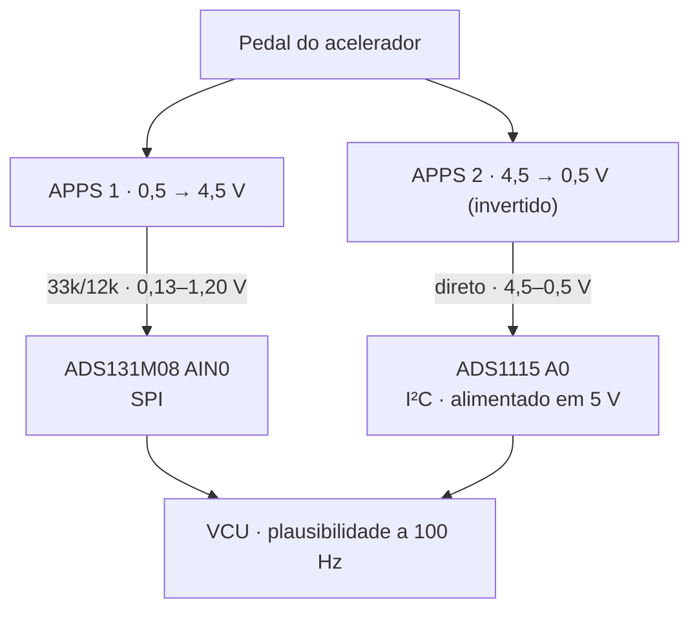
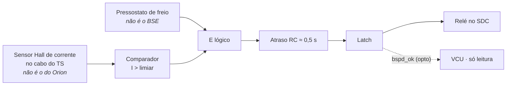

# 🛑 Transdutores de Pressão (BSE), APPS Duplo Redundante & BSPD

> Pedais e freio no **VCU**: dois APPS em **dois ADCs distintos**, dois transdutores de pressão (BSE), potenciômetro do pedal de freio, plausibilidade em firmware — e o **BSPD, que é hardware e tem sensores próprios**. Canais em [[🧭 Plano do Sistema de Telemetria (FSAE Eletrico)]] §4.1; condicionamento em §5.

> [!warning] Correções em relação à versão anterior
> * **APPS1 → ADS131M08 AIN0; APPS2 → ADS1115 A0.** Antes iam os dois no mesmo ADS131M08 — um chip morto derrubava a redundância.
> * **APPS2 com curva invertida** (4,5→0,5 V) e **sem divisor** (ADS1115 em 5 V lê direto).
> * **BSPD adicionado**: a versão anterior não tinha. É obrigatório, analógico, não-programável, e **não** pode compartilhar sensor com o VCU.
> * Algoritmo de plausibilidade reescrito: o anterior perdia o estado (`error_timestamp` era variável local) e não tratava sensor fora de faixa.
> * Taxas: tudo a **100 Hz**.

---

## 🏎️ 1. Transdutores de pressão de freio — `bse_press_front` / `bse_press_rear`



$$P\,[\text{bar}] = \frac{V_{sensor} - 0{,}5}{4{,}0} \times 100 \qquad V_{sensor} = \frac{V_{ADC}}{0{,}2667}$$

* Roscados nos blocos de saída dos cilindros mestres (não na pinça — vibração e calor).
* Faixa 0–100 bar: frenagem forte em FSAE fica em 40–70 bar; 100 bar dá margem sem perder resolução.
* **Fora de faixa:** V_sensor < 0,3 V (aberto/curto ao GND) ou > 4,7 V (curto ao 5 V) → bit `bse_x_fault` em `0x102`, valor NaN após 500 ms.
* **Brake bias** é derivado no Pi: $\text{Bias}_F = P_F/(P_F+P_R)$. O VCU não precisa.
* `brake_pedal_pos` (pot linear no pedal) serve para detectar **pedal acionado sem pressão** (vazamento, ar na linha) e para o mapa de regeneração.

---

## ⚡ 2. APPS duplo — `apps1_raw` / `apps2_raw`



**Por que dois ADCs:** falha de modo comum. Se o ADS131M08 travar, perder o clock SPI ou saturar, os dois APPS morreriam juntos — e a plausibilidade só veria "concordância" em lixo. Com o APPS2 no ADS1115 (outro chip, outro barramento, outra alimentação), qualquer falha de um caminho aparece como discrepância.

**Por que curva invertida:** curto entre os fios de sinal dos dois sensores dá `V1 = V2`, que na curva invertida corresponde a posições **diferentes** → discrepância → corte. Com curvas paralelas o curto passaria despercebido.

| Regra (regulamento EV) | Parâmetro | Onde está |
| :--- | :--- | :--- |
| Discrepância APPS1×APPS2 | > 10 % do curso por > 100 ms → torque 0 | Firmware, constante |
| APPS fora de faixa | < 0,5 V − margem ou > 4,5 V + margem (aberto, curto) → torque 0 | Firmware, constante |
| APPS × freio | APPS > 25 % com freio acionado → torque 0 até APPS < 5 % | Firmware; limiar de "freio acionado" (pressão) é da equipe, no NVS |

---

## 💻 3. Algoritmo de plausibilidade (VCU, 100 Hz)

```cpp
struct AppsState {
    uint32_t discrep_since_ms = 0;   // 0 = sem discrepância corrente
    bool     apps_implausible = false;
    bool     bse_apps_latched = false;
};

static AppsState st;   // estado persiste entre chamadas

// Constantes do regulamento
constexpr float APPS_DELTA_MAX_PCT = 10.0f;
constexpr uint32_t APPS_DELTA_MAX_MS = 100;
constexpr float APPS_BRAKE_CUT_PCT  = 25.0f;
constexpr float APPS_BRAKE_RESET_PCT = 5.0f;
// Parâmetro da equipe (NVS)
extern float g_brake_active_bar;   // ex.: 30 bar

static inline float pctFromV(float v, bool inverted) {
    float p = (v - 0.5f) / 4.0f * 100.0f;
    if (inverted) p = 100.0f - p;
    return constrain(p, 0.0f, 100.0f);
}

static inline bool inRange(float v) { return v > 0.30f && v < 4.70f; }

// Retorna apps_pct válido, ou -1 se torque deve ser zero
float appsPlausibility(float v1, float v2, float bse_front_bar, float bse_rear_bar, uint32_t now_ms) {
    // 1. sensor fora de faixa = implausível imediato
    if (!inRange(v1) || !inRange(v2)) { st.apps_implausible = true; return -1.0f; }

    float p1 = pctFromV(v1, false);
    float p2 = pctFromV(v2, true);

    // 2. discrepância > 10 % por > 100 ms
    if (fabsf(p1 - p2) > APPS_DELTA_MAX_PCT) {
        if (st.discrep_since_ms == 0) st.discrep_since_ms = now_ms;
        if (now_ms - st.discrep_since_ms > APPS_DELTA_MAX_MS) st.apps_implausible = true;
    } else {
        st.discrep_since_ms = 0;
        st.apps_implausible = false;      // regulamento permite recuperação automática
    }
    if (st.apps_implausible) return -1.0f;

    float apps = 0.5f * (p1 + p2);

    // 3. APPS x freio: latch até APPS < 5 %
    bool brake_active = (bse_front_bar > g_brake_active_bar) || (bse_rear_bar > g_brake_active_bar);
    if (brake_active && apps > APPS_BRAKE_CUT_PCT) st.bse_apps_latched = true;
    if (apps < APPS_BRAKE_RESET_PCT) st.bse_apps_latched = false;
    if (st.bse_apps_latched) return -1.0f;

    return apps;
}
```

Saídas para o frame `0x101`: `apps1_raw`, `apps2_raw`, `apps_pct` (u16 ×0,01 %), flags (`apps_implausible`, `bse_apps_implausible`, `apps1_fault`, `apps2_fault`). Qualquer transição de flag também dispara `0x010` por evento. Três cópias do registro: microSD do VCU, Pi, LoRa ([[🧭 Plano do Sistema de Telemetria (FSAE Eletrico)]] §2.2).

---

## 🛡️ 4. BSPD — hardware, fora do VCU

O *Brake System Plausibility Device* abre o circuito de shutdown quando há **frenagem forte e potência alta ao mesmo tempo** por mais de ~0,5 s. O regulamento exige que seja **não-programável** (sem microcontrolador) e o Plano exige que tenha **sensores próprios**.



| Elemento | Especificação | Por quê separado |
| :--- | :--- | :--- |
| Sensor de corrente | Hall de malha aberta (isolado), no cabo DC do TS, limiar equivalente a ~5 kW | Se usasse o shunt do Orion, falha do Orion = falha do BSPD |
| Pressostato | Contato NA, ajustado em ~30 bar, na linha dianteira | Se usasse o BSE, falha do transdutor = falha do BSPD |
| Lógica | Comparadores + porta E + RC + latch (ex.: LM393 + 74HC + 555 ou discreto) | Regulamento: não pode ser software |
| Saída | Relé com contato no SDC; latch só rearma por ciclo de energia | |
| Telemetria | Saída do latch → optoacoplador → PCF8574 do VCU → bit `bspd_ok` em `0x010` | O VCU **observa**, não controla |

**Teste T8 do Plano:** com o VCU desligado, freio forte e corrente alta → o BSPD abre o SDC sozinho. Se precisar do VCU para funcionar, está errado.

---

## 🔗 Próxima Leitura
* [[🔵 No PCU (Controle, Powertrain, APS, Freios e Direcao)|🔵 Nó VCU: pinos, frames, cadeia de segurança]]
* [[⚡ Circuitos Condicionadores (Divisores 33k-12k, Filtros RC e ADCs MCP3208-ADS131M08)|⚡ Divisores por ADC]]
* [[🏎️ Sensor de Angulo AS5600 e Célula de Torque com INA333|🏎️ Direção]]
