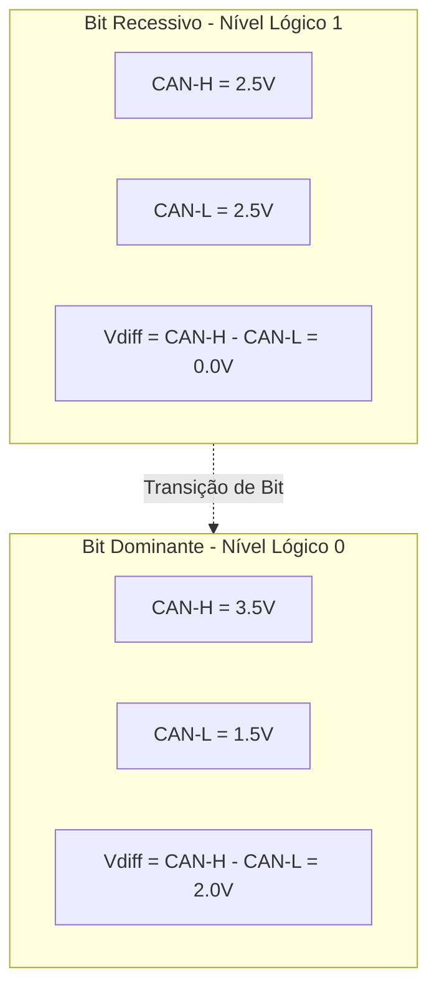
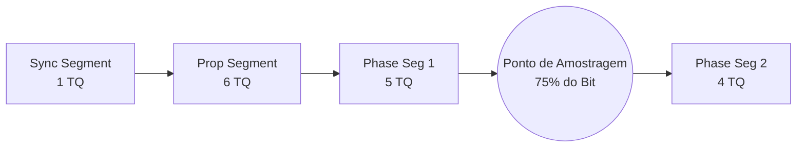

# 🌐 Arquitetura CAN 2.0B (500 kbps), Transceivers & Terminação

> Camada física diferencial, temporização de bits do controlador TWAI do ESP32, dimensionamento de terminação de $120\,\Omega$ e transceivers **SN65HVD230** operando a $500\text{ kbps}$ — **nos dois barramentos** (CAN-1 Trativo e CAN-2 Aquisição, [[🧭 Plano do Sistema de Telemetria (FSAE Eletrico)]] §3.1).

> [!info] Revisado em 2026-09-14
> * O carro tem **dois barramentos** CAN 2.0A (11 bits), cada um com as próprias duas terminações. Tudo abaixo vale para cada um separadamente.
> * Pinos TWAI: **GPIO 6/7** nos nós ESP32-S3; **25/4** no INU (T-Beam). O VCU tem um segundo controlador (MCP2515) para o CAN-2.
> * Nós que **só escutam** (Pi, Logger B, Gateway LoRa): `TWAI_MODE_LISTEN_ONLY` **e** pino D do transceiver desconectado do GPIO.
> * "2.0B" no título: o hardware suporta, mas o projeto usa só identificadores de 11 bits (2.0A).

---

## ⚡ 1. Camada Física Diferencial (CAN-H e CAN-L)

O protocolo CAN utiliza sinalização diferencial de tensão para cancelar o ruído de modo comum (*Common-Mode Noise*) gerado pelos motores e inversores do carro:



* Quando qualquer nó da rede transmite um bit **Dominante (`0`)**, ele força a diferença de tensão para $2.0\text{V}$, sobrepondo-se ao estado **Recessivo (`1`)**. Essa característica elétrica viabiliza a **arbitragem não destrutiva por prioridade de ID**.

---

## 🔌 2. Transceiver Texas Instruments SN65HVD230

O CI **SN65HVD230** é a interface entre o controlador digital TWAI do ESP32 ($3.3\text{V}$) e as linhas físicas diferenciais do chicote veicular:

```mermaid
graph LR
    subgraph ESP32 ["Controlador TWAI ESP32-S3 (INU: 25/4)"]
        TXD[Pino TXD GPIO 6]
        RXD[Pino RXD GPIO 7]
    end

    subgraph TransceiverCAN ["SN65HVD230"]
        TXD --> D_Pin[Pino D / TX]
        RXD <-- R_Pin[Pino R / RX]
        VCC33[Alimentação 3.3V] --- VCC_Pin[VCC]
        GND[GND] --- GND_Pin[GND]
        Rs_Pin[Pino Rs - Controle de Slope] --- R_Slope[Resistor 10 kΩ para GND]
        CANH_Pin[CANH]
        CANL_Pin[CANL]
    end

    subgraph ChicoteVeicular ["Barramento Diferencial"]
        CANH_Pin === CAN_H_Line[Linha CAN High]
        CANL_Pin === CAN_L_Line[Linha CAN Low]
        TVS[Diodo TVS PESD1CAN] --- CAN_H_Line & CAN_L_Line
    end

```

* **Controle de Rampa (*Slope Control - Pino Rs*):** O pino $R_s$ conectado ao terra via resistor de $10\,\text{k}\Omega$ reduz a velocidade de subida e descida das bordas de tensão (*slew rate*), diminuindo drasticamente a emissão de ruído eletromagnético irradiado no chicote veicular.
* **Nós somente-escuta (Pi, Logger B, Gateway LoRa):** o pino **D** do SN65HVD230 **não** vai ao GPIO — fica ligado a 3,3 V (recessivo permanente). O controlador roda em `TWAI_MODE_LISTEN_ONLY` (sem ACK, sem error frames). Dupla garantia: nem bug de firmware transmite.
* **VCU no CAN-2:** o ESP32-S3 tem um único TWAI, então o segundo barramento entra por um **MCP2515** (SPI3, cristal 16 MHz) com o próprio SN65HVD230. O MCP2515 tem filtro de recepção fechado: o VCU só **escreve** no CAN-2.

---

## ⏱️ 3. Configuração de Temporização de Bit (Bit Timing a 500 kbps)

Para a taxa de **$500\text{ kbps}$**, a largura de cada bit é de:

$$T_{\text{bit}} = \frac{1}{500\,000\text{ bps}} = 2.0\,\mu\text{s} = 2000\text{ ns}$$

O controlador de hardware TWAI do ESP32 divide cada bit em $16\text{ Time Quanta (TQ)}$:

$$\text{TQ} = \frac{T_{\text{bit}}}{16} = \frac{2000\text{ ns}}{16} = 125\text{ ns} \implies f_{\text{TQ}} = 8\text{ MHz}$$



* **Ponto de Amostragem (*Sample Point*):** Configurado em **$75\%$** do comprimento do bit ($12\text{ TQ}$), oferecendo tolerância máxima a atrasos de propagação no chicote veicular.
* **Synchronization Jump Width (SJW):** $3\text{ TQ}$.

---

## 🛑 4. Regras Críticas de Terminação e Derivações (*Stubs*)

1. **Terminações de $120\,\Omega$ — duas por barramento:**

| Barramento | Ponta A | Ponta B | Sem terminação |
| :--- | :--- | :--- | :--- |
| **CAN-1** Trativo | CVW300 | VCU | Orion, Pi (`can0`) — **verificar se CVW300 e Orion têm terminação interna selecionável** |
| **CAN-2** Aquisição | VDN-Front | VDN-Rear | VCU (MCP2515), INU, Térmico, Logger B, Gateway LoRa, Pi (`can1`) |

   Com o chicote conectado e os nós desligados, `CAN-H`↔`CAN-L` de **cada** barramento deve marcar **$60\,\Omega$**. Se um curto num barramento mudar a leitura do outro, os dois estão ligados — erro grave de chicote.
2. **Comprimento de Derivações (*Stubs*):**
   * A $500\text{ kbps}$, qualquer derivação perpendicular ao cabo principal deve ter **menos de $20\text{ cm}$**. No monoposto da UTForce, os conectores são montados em topologia passante (*in-and-out*), mantendo os stubs em menos de $3\text{ cm}$.

---

## 🔗 Próxima Leitura
* [[📊 Matriz de Mensagens CAN e Dicionario de IDs (DBC Veicular)|📊 Matriz de IDs CAN e Estrutura de Payloads]]
* [[💻 Arquitetura de Firmware PlatformIO (C++, FreeRTOS e Core Pinning)|💻 Firmware em C++ e Inicialização do Driver TWAI]]
* [[🌐 Topologia Macro da Rede CAN 500k e Distribuicao dos Nos|🌐 Topologia dos dois barramentos]]
