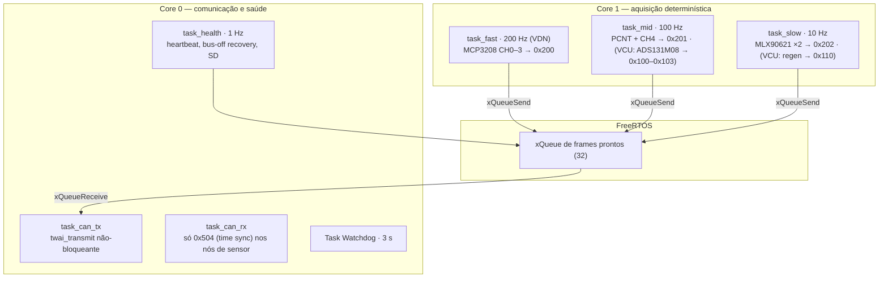

# 💻 Arquitetura de Firmware PlatformIO (C++, FreeRTOS & Core Pinning)

> Estrutura comum a todos os nós ESP32 e, principalmente, o **comportamento em falha** — é o firmware que torna a redundância do [[🧭 Plano do Sistema de Telemetria (FSAE Eletrico)]] real (§9). Um binário por tipo de nó; VDN-Front e VDN-Rear compartilham o mesmo.

> [!warning] O que mudou
> * Alvo: `esp32-s3-devkitc-1` para VDN/Térmico/Logger B, PCB própria (S3) para o VCU, `ttgo-t-beam` para o INU, `heltec_wifi_lora_32_V3` para o Gateway LoRa.
> * Task rápida do VDN a **200 Hz** (era 100); tasks separadas por taxa porque **um frame = uma taxa**.
> * Seção nova de **comportamento em falha**: bus-off com *backoff*, sensor fora de faixa, watchdog de 3 s, heartbeat, `LISTEN_ONLY` nos nós que só escutam.
> * Watchdog: 500 ms → **3 s** (o valor antigo resetaria o nó numa rotação de arquivo do SD).

---

## 🏗️ 1. Núcleos e tasks



| Task | Core | Prioridade | Período | Nota |
| :--- | :---: | :---: | :---: | :--- |
| `task_fast` | 1 | 6 | 5 ms (`vTaskDelayUntil`) | Só leitura SPI + escala + fila. Nada de `Serial.print` |
| `task_mid` | 1 | 5 | 10 ms | PCNT acumulado, janela de 100 ms |
| `task_slow` | 1 | 3 | 100 ms | I²C pode bloquear até 10 ms — por isso prioridade baixa e task própria |
| `task_can_tx` | 0 | 5 | evento (fila) | `twai_transmit(&msg, 0)` — se a fila TX do driver estiver cheia, descarta e conta |
| `task_can_rx` | 0 | 4 | evento | Nós de sensor filtram só `0x504`; VCU recebe `0x300`, `0x400–0x402` |
| `task_health` | 0 | 2 | 1 s | Heartbeat, estado do controlador, SD, `esp_task_wdt_reset()` |

**Regra:** toda task periódica usa `vTaskDelayUntil` (não `vTaskDelay`) para não acumular *drift*; toda task alimenta o watchdog; nenhuma task chama `delay()`.

---

## 📁 2. Estrutura do repositório

```
firmware-utforce/
├── platformio.ini            # [env:vdn] [env:vcu] [env:inu] [env:thermal] [env:loggerb] [env:lora_gw]
├── lib/
│   ├── can_ids/              # can_ids.h — gerado a partir da Matriz CAN (IDs, DLC, fatores)
│   ├── hb/                   # heartbeat.h — layout comum do 0x?0F
│   └── hal/
│       ├── mcp3208.cpp       # SPI2
│       ├── ads131m08.cpp     # SPI2 + DRDY
│       ├── ads1115.cpp       # I²C
│       ├── mlx90621.cpp      # I²C, dois buses
│       ├── pcnt_wheel.cpp    # driver/pulse_cnt.h, janela deslizante
│       ├── twai_node.cpp     # init, listen-only, bus-off recovery, contadores
│       ├── mcp2515.cpp       # só VCU
│       └── sdlog.cpp         # blocos 4 kB, rotação 10 min — VCU e Logger B
├── src/
│   ├── vdn/main.cpp
│   ├── vcu/main.cpp
│   ├── inu/main.cpp
│   ├── thermal/main.cpp
│   ├── loggerb/main.cpp
│   └── lora_gw/main.cpp
└── test/                     # testes nativos das funções de escala e do CRC16
```

`can_ids.h` é **gerado**, não escrito à mão — a mesma tabela produz o DBC e o header. Divergência entre firmware e DBC deixa de ser possível.

---

## 💻 3. TWAI: inicialização, *listen-only* e recuperação de bus-off

```cpp
#include "driver/twai.h"

struct CanStats { uint8_t tx_err, rx_err, bus_off; };
static CanStats g_can;

bool twaiInit(gpio_num_t tx, gpio_num_t rx, bool listen_only) {
    twai_general_config_t g = TWAI_GENERAL_CONFIG_DEFAULT(
        tx, rx, listen_only ? TWAI_MODE_LISTEN_ONLY : TWAI_MODE_NORMAL);
    g.tx_queue_len = 32;
    g.rx_queue_len = 32;
    twai_timing_config_t t = TWAI_TIMING_CONFIG_500KBITS();
    twai_filter_config_t f = TWAI_FILTER_CONFIG_ACCEPT_ALL();   // nós de sensor: filtrar só 0x504
    if (twai_driver_install(&g, &t, &f) != ESP_OK) return false;
    return twai_start() == ESP_OK;
}

// Chamada pela task_health a cada 100 ms
void twaiHealth() {
    twai_status_info_t st;
    twai_get_status_info(&st);
    g_can.tx_err = (uint8_t)min<uint32_t>(st.tx_error_counter, 255);
    g_can.rx_err = (uint8_t)min<uint32_t>(st.rx_error_counter, 255);

    static uint32_t backoff_ms = 100, next_try = 0;
    if (st.state == TWAI_STATE_BUS_OFF) {
        if (millis() >= next_try) {
            twai_initiate_recovery();             // 128 × 11 bits recessivos
            next_try   = millis() + backoff_ms;
            backoff_ms = min<uint32_t>(backoff_ms * 2, 3200);   // 100 → 3200 ms
            g_can.bus_off++;
        }
    } else if (st.state == TWAI_STATE_STOPPED) {
        twai_start();                             // após recuperação o driver fica STOPPED
        backoff_ms = 100;
    }
}
```

* **`LISTEN_ONLY`** para Logger B e Gateway LoRa: o controlador não envia ACK nem error frames. Somado ao **TX fisicamente desconectado**, o nó é invisível ao barramento.
* **Backoff exponencial** (100 ms → 3,2 s): um nó com transceiver em curto não fica martelando o barramento a cada 100 ms. Cada tentativa incrementa `bus_off_count` no heartbeat.
* Nós de sensor configuram o **filtro de aceitação** para receber só `0x504` (time sync): a CPU não acorda para os outros 900 frames/s.

---

## 🛡️ 4. Comportamento em falha (implementa §9 do Plano)

| Falha | Detecção | Reação do firmware | Onde aparece |
| :--- | :--- | :--- | :--- |
| Bus-off | `twai_get_status_info` | Recuperação com *backoff* 100 ms → 3,2 s | `bus_off_count` no heartbeat |
| Sensor fora de faixa (< 2 % ou > 98 % do ADC) | Comparação por canal na task de aquisição | Bit em `adc_fault_flags`; **último valor válido por até 500 ms, depois `0xFFFF`/`0x7FFF` (NaN)**. Nunca valor inventado | Heartbeat + campo NaN no frame |
| I²C travado (SDA em LOW) | `endTransmission()` ≠ 0 três vezes seguidas | 9 pulsos de SCL manuais, `begin()` de novo, flag | `adc_fault_flags` |
| Fila TX cheia | `twai_transmit` retorna `ESP_ERR_TIMEOUT` | Descarta o frame **mais antigo da mesma taxa**, conta | `can_tx_err` |
| microSD cheio ou erro de escrita | Retorno de `f_write` | Rotação de arquivo; se persistir, `sd_status = 3` e o nó **continua transmitindo** | `sd_status` |
| Travamento de task | Task Watchdog (TWDT) 3 s, todas as tasks inscritas | Reset do nó (~300 ms até voltar a transmitir) | `uptime_s` zera |
| Heartbeat ausente > 2 s (de outro nó) | VCU e Pi | Display do piloto mostra o nó em falha | Evento no log |
| Perda do `0x504` | Task RX sem time sync por > 5 s | Continua carimbando com `millis()`; flag `time_unsynced` no heartbeat | Pós-processamento alinha pelo último válido |

Princípio: **falha detectada vale mais que falha silenciosa.** Toda reação gera um bit que alguém vê.

---

## 🧪 5. Estrutura de um frame e envio

```cpp
#include "can_ids.h"   // gerado

struct __attribute__((packed)) VdnDamper {     // 0x200 / 0x220, DLC 8
    uint16_t damper_l_x100;   // 0,01 mm
    uint16_t damper_r_x100;
    int16_t  hub_az_l_x100;   // 0,01 g
    int16_t  hub_az_r_x100;
};

static inline uint16_t toU16_x100(float v) {
    if (isnan(v)) return 0xFFFF;                      // NaN canônico
    return (uint16_t)constrain(v * 100.0f, 0.0f, 65534.0f);
}

void sendDamper(uint16_t base_id, float dl, float dr, float al, float ar) {
    VdnDamper p{ toU16_x100(dl), toU16_x100(dr),
                 (int16_t)constrain(al * 100.0f, -32767.0f, 32766.0f),
                 (int16_t)constrain(ar * 100.0f, -32767.0f, 32766.0f) };
    twai_message_t m{};
    m.identifier = base_id + 0x00;
    m.data_length_code = sizeof(p);
    memcpy(m.data, &p, sizeof(p));
    if (twai_transmit(&m, 0) != ESP_OK) g_can.tx_err = min(g_can.tx_err + 1, 255);
}
```

`__attribute__((packed))` + `memcpy` = o layout na memória é o layout no barramento (o ESP32 é little endian, igual ao DBC). Nada de montar byte a byte.

---

## ⚙️ 6. `platformio.ini` (essência)

```ini
[env]
framework = arduino
monitor_speed = 115200
build_flags = -DCORE_DEBUG_LEVEL=1 -DCONFIG_ESP_TASK_WDT_TIMEOUT_S=3

[env:vdn]
platform = espressif32
board = esp32-s3-devkitc-1
build_src_filter = +<vdn/>

[env:vcu]
platform = espressif32
board = esp32-s3-devkitc-1        ; mesma variante de chip da PCB própria
build_src_filter = +<vcu/>
lib_deps = autowp/autowp-mcp2515

[env:inu]
platform = espressif32
board = ttgo-t-beam
build_src_filter = +<inu/>
lib_deps = sparkfun/SparkFun BNO08x Cortex Based IMU, sparkfun/SparkFun u-blox GNSS v3

[env:lora_gw]
platform = espressif32
board = heltec_wifi_lora_32_V3
build_src_filter = +<lora_gw/>
lib_deps = jgromes/RadioLib
```

Arduino-ESP32 3.x (ESP-IDF 5.x): usar `driver/pulse_cnt.h` (não `driver/pcnt.h`) e `driver/twai.h`.

---

## 🔗 Próxima Leitura
* [[📊 Matriz de Mensagens CAN e Dicionario de IDs (DBC Veicular)|📊 Layout dos frames que este firmware monta]]
* [[⏱️ Sensores de Roda TLE4922 e Contagem por Hardware PCNT|⏱️ Driver PCNT novo]]
* [[🔴 Gateway e Logger Raspberry Pi (SocketCAN, Logs BLF e CSV)|🔴 Quem grava e decodifica]]
* [[📘 Guia Fundamental do ESP32 (Arquitetura, Dual-Core, Perifericos e Limites Eletricos)|📘 FreeRTOS e núcleos]]
