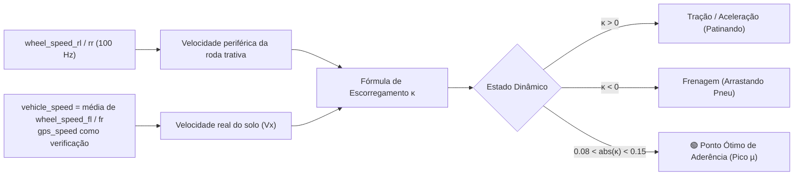
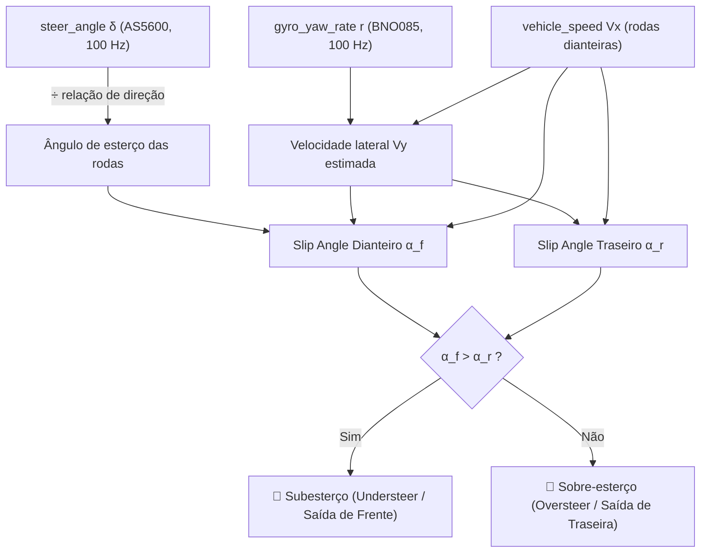

# ⚙️ Cálculos de Dinâmica em Tempo Real (Slip, AeroBalance & G-Forces)

> Modelagem matemática embarcada executada pelo Raspberry Pi: transformação de leituras puras de sensores em métricas fundamentais de dinâmica veicular para piloto e engenheiros. Todos os canais desta nota são **derivados** — não são adquiridos nem reenviados ao CAN ([[📊 Dicionario Completo de Canais, Fontes e Taxas de Amostragem (Hz)]] §3).

> [!info] Revisado em 2026-09-14
> * Entradas com os **nomes canônicos** e as taxas reais: `wheel_speed_*` a 100 Hz, `damper_pos_*` a 200 Hz, `steer_angle` e `gyro_yaw_rate` a 100 Hz.
> * **Ride height e rake** agora são derivados do amortecedor (§5, novo) — não há sensor laser.
> * **AeroBalance** (§3) fica como modelo de pós-processamento: depende de $C_LA$ dianteiro/traseiro de CFD ou túnel, que o carro não mede. Não aparece no display.
> * Velocidade de referência: média das **rodas dianteiras** (não trativas), com GPS como verificação — o carro é tração traseira.

---

## 🏎️ 1. Escorregamento Longitudinal (*Slip Ratio - $\kappa$*)

O *Slip Ratio* mede a discrepância entre a velocidade angular da roda e a velocidade real do veículo em relação ao solo:

$$\kappa = \frac{\omega_{\text{roda}} \cdot R_{\text{din}} - V_{\text{solo}}}{\max(\omega_{\text{roda}} \cdot R_{\text{din}}, V_{\text{solo}})}$$

* **Aplicação no Carro:** mostra ao engenheiro, volta a volta, quando as traseiras patinam na saída de curva e quando as dianteiras travam na frenagem. Um TCS de verdade precisaria rodar no VCU a 100 Hz com as rodas do CAN-2 — fora do escopo atual ([[🧭 Plano do Sistema de Telemetria (FSAE Eletrico)]] §2.1: a telemetria escuta, não arbitra).
* **Por que 100 Hz nas rodas:** a dinâmica de uma roda travando dura 50–100 ms. A 10 Hz (versão anterior) o evento inteiro cabia numa amostra.

---

## 📐 2. Ângulo de Deriva Lateral (*Slip Angle - $\alpha$*)

O *Slip Angle* é o ângulo entre o vetor de velocidade da roda e o plano de rotação da roda:

### Modelo Cinemático de Bicicleta
Para os eixos dianteiro e traseiro:

$$\alpha_f = \delta - \arctan\left(\frac{V_y + a \cdot r}{V_x}\right)$$

$$\alpha_r = -\arctan\left(\frac{V_y - b \cdot r}{V_x}\right)$$

Onde $a$ e $b$ são as distâncias do centro de gravidade (CG) aos eixos dianteiro e traseiro, $r$ é a taxa de guinada (*Yaw Rate*) e $\delta$ é o ângulo de esterço das **rodas** (= `steer_angle` ÷ relação de direção da cremalheira). $V_y$ é estimada integrando $a_y - V_x r$ com *reset* em reta — ou, mais robusto, assumida ≈ 0 no eixo traseiro para uma primeira aproximação de $\alpha_r$. Sem sensor de velocidade lateral (óptico/Kistler), o slip angle é uma **estimativa**, e a nota deve dizer isso no gráfico.

---

## 🛩️ 3. Carga Aerodinâmica & Balanço Aerodinâmico (*AeroBalance*)

O modelo aerodinâmico calcula o *downforce* gerado pelo conjunto de asas e difusor de solo:

$$F_{\text{Aero, Tot}} = \frac{1}{2} \cdot \rho_{\text{ar}} \cdot V_x^2 \cdot (C_L A)$$

$$F_{\text{Drag}} = \frac{1}{2} \cdot \rho_{\text{ar}} \cdot V_x^2 \cdot (C_D A)$$

### Equação de AeroBalance
Mede a distribuição percentual da força vertical direcionada para o eixo dianteiro:

$$\text{AeroBalance}_{\text{Front}}(\%) = \left(\frac{F_{\text{Aero, Front}}}{F_{\text{Aero, Tot}}}\right) \times 100\%$$

* **Onde roda:** pós-processamento. $C_LA$ e $C_DA$ por eixo vêm de CFD/túnel e mudam com o rake medido (§5). O carro **não mede** downforce — mediria só com células de carga nos *pushrods*, que não estão no plano. Por isso AeroBalance não vai ao display nem ao LoRa.

---

## ⏱️ 4. Velocidade de Pistão do Amortecedor (*Damper Velocity*)

Derivando `damper_pos_*` (potenciômetros lineares de $75\text{ mm}$, **200 Hz**) ao longo do tempo — a taxa de 200 Hz existe para isto:

$$v_{\text{damper}}(t) = \frac{d\left(x_{\text{susp}}\right)}{dt} \approx \frac{x(t) - x(t - \Delta t)}{\Delta t} \quad (mm/s)$$

* **Classificação de Amortecimento:**
  * **Baixa Velocidade ($|v| < 50\text{ mm/s}$):** Controla a rolagem e o afundamento da carroceria (*chassis body control* em curvas e frenagens).
  * **Alta Velocidade ($|v| > 150\text{ mm/s}$):** Absorção de irregularidades da pista, zebras e solavancos (*bump absorption*).
* **Histograma de velocidade de amortecedor** (*shock histogram*): a ferramenta de setup por excelência. Com 200 Hz, uma volta de 90 s dá 18 000 amostras por canto — o suficiente para um histograma de 21 classes. A 10 Hz seriam 900 e o histograma não tem forma.
* Derivada numérica com filtro: diferença central + passa-baixa de 25 Hz, para não amplificar o ruído de 1 LSB do MCP3208 (0,03 mm → 6 mm/s a 200 Hz sem filtro).

---

## 📐 5. Ride Height, Rake e Ângulos de Suspensão (derivados do amortecedor)

Não há sensor de altura. Do curso de cada amortecedor, com o *motion ratio* $MR$ da suspensão (pendência da Dinâmica Veicular) e a altura estática $h_0$:

$$RH_i = h_{0,i} - MR_i \cdot (d_i - d_{0,i}) \qquad i \in \{FL, FR, RL, RR\}$$

$$RH_f = \tfrac{1}{2}(RH_{FL}+RH_{FR}) \qquad RH_r = \tfrac{1}{2}(RH_{RL}+RH_{RR}) \qquad rake = RH_r - RH_f$$

$$\phi_{susp} = \arctan\frac{RH_{L} - RH_{R}}{t} \qquad \theta_{susp} = \arctan\frac{rake}{L}$$

($t$ = bitola, $L$ = entre-eixos.) O `att_roll/pitch_angle` do BNO085 mede a atitude **absoluta** (inclui a inclinação da pista); $\phi_{susp}$ e $\theta_{susp}$ medem só o que a suspensão fez. A diferença entre os dois é a inclinação da pista + deflexão do pneu — útil por si só. Detalhe e calibração em [[📐 Ride Height (Laser vs Potenciometro Linear) e Calibracao]].

---

## 🔗 Próxima Leitura
* [[🛡️ Resiliencia contra Queda Abrupta de Energia e Modo Read-Only|🛡️ Proteção de Arquivos contra Desligamento]]
* [[🔴 Gateway e Logger Raspberry Pi (SocketCAN, Logs BLF e CSV)|🔴 Visão Geral do Logger no Raspberry Pi]]
* [[📡 Modulo LoRa SX1262, Bit-Packing Compacto e CRC16|📡 Transmissão dos Resultados para os Boxes]]
