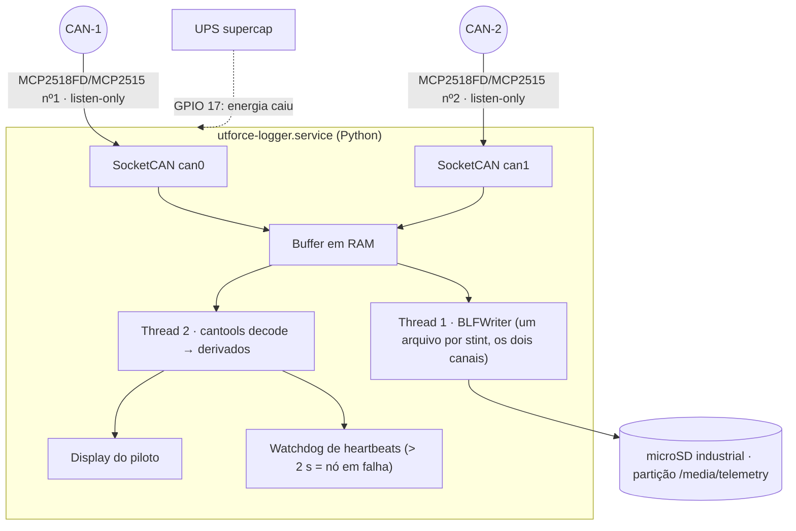

# 🔴 Logger A (Raspberry Pi) & Logger B (ESP32) — Registro em Camadas

> O Raspberry Pi **não é gateway**. É o **Logger A**: escuta os dois barramentos em *listen-only*, grava tudo em BLF, deriva canais e alimenta o display. Quem faz gateway é o VCU. Redundância de registro: **Logger B** (ESP32-S3 + microSD no CAN-2) e o log local L1 do VCU. Fonte: [[🧭 Plano do Sistema de Telemetria (FSAE Eletrico)]] §3.2, §8.

> [!warning] O que mudou (o nome do arquivo ainda diz "Gateway")
> * Pi passa a ter **dois CAN** (`can0` = CAN-1, `can1` = CAN-2) e roda os dois em **`listen-only on`**. Nunca transmite, não dá ACK.
> * Pi deixa de ser ponto único de falha do registro: entra o **Logger B**.
> * **UPS com supercapacitor** e desligamento limpo — corrupção de SD por queda de energia era a falha mais provável do projeto anterior.
> * O `0x6xx` "cálculos do Pi no CAN" saiu: canais derivados ficam no Pi e no pós-processamento, não voltam ao barramento.

---

## 🧭 1. Camadas de registro

| Camada | Onde | O que grava | Sobrevive a |
| :--- | :--- | :--- | :--- |
| **L1** | microSD no **VCU** | `0x010`, `0x100–0x103`, `0x300` a 100 Hz; buffer circular 2 h | Falha do CAN-2, Pi, Logger B, rádio |
| **L2a — Logger A** | **Raspberry Pi 4** | Tudo dos dois barramentos, BLF, com timestamp de chegada | Falha do rádio |
| **L2b — Logger B** | **ESP32-S3 + microSD** no CAN-2 | Tudo do CAN-2, formato candump binário | Falha do Pi (SD, kernel, queda de tensão) |
| **L3** | Estação do box | Resumo a 10 Hz, 41 bytes via LoRa | Destruição do carro |

Dado de segurança tem três cópias (L1 + L2a + L3); dado de dinâmica tem duas (L2a + L2b).

---

## 🍓 2. Logger A — Raspberry Pi 4



### 2.1 Hardware

| Item | Especificação | Nota |
| :--- | :--- | :--- |
| Placa | Raspberry Pi 4 B, 2–4 GB | Pi 5 também serve; o gargalo é o SD, não a CPU |
| CAN | HAT com **dois** controladores (MCP2518FD ×2 recomendado — FIFO maior, menos perda em rajada; MCP2515 ×2 aceitável a 500 kbps) | Terminação **desligada** nos dois canais |
| Cartão | microSD industrial (SLC/pSLC ou "High Endurance"), ≥ 32 GB | O cartão comum morre em meses de escrita contínua |
| Alimentação | Buck 5 V / 3 A → UPS supercapacitor → USB-C | [[⚡ Alimentacao Eletrica, Protecoes TVS e Isolamento Galvanico]] §2 |
| Display | HDMI 5–7" ou SPI | Nó em falha, flags de segurança, SOC, temperaturas |

### 2.2 SocketCAN — dois canais, somente escuta

```bash
# /etc/systemd/network/80-can.network  (ou script no boot)
for IF in can0 can1; do
  ip link set $IF down
  ip link set $IF type can bitrate 500000 listen-only on restart-ms 0
  ip link set $IF txqueuelen 1
  ip link set $IF up
done
```

* **`listen-only on`**: o controlador não transmite nem ACK. `restart-ms 0` porque um nó em *listen-only* não entra em bus-off (não conta erros de TX).
* Conferir com `ip -details link show can0` → deve aparecer `LISTEN-ONLY`.
* Teste T7 do Plano: curto no CAN-2 não pode aparecer como error frame em `candump can0`.

### 2.3 Daemon de gravação

```python
#!/usr/bin/env python3
"""utforce-logger: grava can0 (CAN-1) e can1 (CAN-2) num BLF por stint."""
import can, cantools, os, signal, time
from datetime import datetime

DBC = {0: cantools.database.load_file('/opt/utforce/dbc/utforce_can1.dbc'),
       1: cantools.database.load_file('/opt/utforce/dbc/utforce_can2.dbc')}
LOG_DIR = '/media/telemetry/stints'
FSYNC_S = 1.0

def main():
    os.makedirs(LOG_DIR, exist_ok=True)
    path = f"{LOG_DIR}/stint_{datetime.now():%Y%m%d_%H%M%S}.blf"
    buses = [can.Bus(channel='can0', interface='socketcan', receive_own_messages=False),
             can.Bus(channel='can1', interface='socketcan', receive_own_messages=False)]
    # BLF grava em contêineres comprimidos; 16 kB ≈ 1 s de tráfego → perda máxima num corte
    writer = can.BLFWriter(path, max_container_size=16 * 1024)
    notifier = can.Notifier(buses, [writer, Decoder()], timeout=0.1)

    stop = False
    def on_stop(*_):
        nonlocal stop; stop = True
    signal.signal(signal.SIGTERM, on_stop)     # vem do UPS via systemd

    last = time.monotonic()
    while not stop:
        time.sleep(0.05)
        if time.monotonic() - last > FSYNC_S:
            writer.file.flush(); os.fsync(writer.file.fileno()); last = time.monotonic()

    notifier.stop(); writer.stop()
    for b in buses: b.shutdown()

class Decoder(can.Listener):
    """Decodifica por canal e alimenta display / watchdog de heartbeats."""
    def on_message_received(self, msg):
        ch = 0 if msg.channel == 'can0' else 1
        try:
            sig = DBC[ch].decode_message(msg.arbitration_id, msg.data)
        except KeyError:
            return
        # 0x?0F → atualiza last_seen[nó]; > 2 s → alarme no display
        # 0x010 / 0x701 → flags de segurança no display
        # 0x200/0x220 → damper_vel, ride height, rake (derivados)

if __name__ == '__main__':
    main()
```

O BLF só vai ao disco quando um contêiner fecha; com `max_container_size=16 kB` isso acontece a cada ~1 s de tráfego, e o `fsync` periódico empurra o que já fechou. Junto com o UPS ([[🛡️ Resiliencia contra Queda Abrupta de Energia e Modo Read-Only]] §4), a perda num corte fica em ≤ 1 s — e o Logger B cobre esse segundo.

O `channel` de cada `Message` identifica o barramento no BLF — um só arquivo, dois canais, alinhados pelo relógio do Pi. `0x504` do INU entra pelo `can1` e é a referência para alinhar com os logs do VCU e do Logger B no pós-processamento.

### 2.4 Formato

**BLF** (Vector Binary Logging Format) via `python-can`: ~4 bytes/frame comprimido, abre em CANalyzer, `asammdf`, `python-can`. CSV só por exportação no pós-processamento (`can.CSVWriter` ou script com `cantools`). Um arquivo por stint; rotação forçada a cada 30 min por segurança.

---

## 📼 3. Logger B — ESP32-S3-DevKitC-1 + microSD

O seguro contra o Pi. Custa menos de R$ 100 e não roda sistema operacional.

| Item | Valor |
| :--- | :--- |
| Barramento | CAN-2, RX no GPIO 7, **TX desconectado** (pino D do transceiver em 3,3 V) |
| Driver | `TWAI_MODE_LISTEN_ONLY`, filtro aceita tudo |
| Armazenamento | microSD em SPI2 (10–13), FAT32, cartão industrial |
| Formato | Binário fixo de 16 bytes por frame: `[millis u32][id u16][dlc u8][flags u8][data 8]` — conversível para candump/BLF por script |
| Escrita | Blocos de **4 kB** (256 frames), `f_sync` a cada bloco → perde no máximo o último bloco num corte |
| Rotação | Novo arquivo a cada 10 min (`stint_NNNN_MMM.bin`) |
| Taxa | CAN-2 a 900 frames/s → 14 kB/s → 50 MB/h. Um cartão de 32 GB dura mais de 600 h |
| Indicação | LED 48 pisca a cada bloco; apagado = SD com problema |

Sem heartbeat no CAN (não transmite). O estado do SD vai num registro próprio no arquivo a cada 10 s.

---

## 🖥️ 4. Display do piloto

Alimentado pelo Pi (decodificação em tempo real). Conteúdo mínimo, em ordem de prioridade:

1. **Nó em falha** (heartbeat ausente > 2 s) — nome do nó em vermelho.
2. **Flags de segurança** de `0x010`/`0x701`: `apps_implausible`, `bse_apps_implausible`, `imd_ok`, `ams_ok`, `bspd_ok`.
3. SOC, `cell_t_max`, `ts_pack_voltage`.
4. `motor_temp`, `inverter_igbt_temp`, `coolant_temp_*`.
5. `lv_battery_voltage` com alerta < 11,5 V.

Se o Pi cair, o display cai junto — aceitável, porque **nada de segurança depende dele** (o VCU corta torque sozinho). O que a equipe perde é informação, não proteção.

---

## 🧮 5. Canais derivados (Pi, tempo real e pós)

`damper_vel_*`, `ride_height_[f,r]`, `rake`, `slip_ratio_*`, `slip_angle_*`, `brake_bias_front`, `accel_lin_*`, `energy_consumed_kwh`, `lap_*`. Fórmulas em [[⚙️ Calculos de Dinamica em Tempo Real (Slip, AeroBalance e G-Forces)]]. **Não são reenviados ao CAN.**

---

## 🔗 Próxima Leitura
* [[🛡️ Resiliencia contra Queda Abrupta de Energia e Modo Read-Only|🛡️ Overlay read-only, partição de dados e UPS]]
* [[📊 Matriz de Mensagens CAN e Dicionario de IDs (DBC Veicular)|📊 O que está no BLF]]
* [[⚙️ Calculos de Dinamica em Tempo Real (Slip, AeroBalance e G-Forces)|⚙️ Derivados]]
