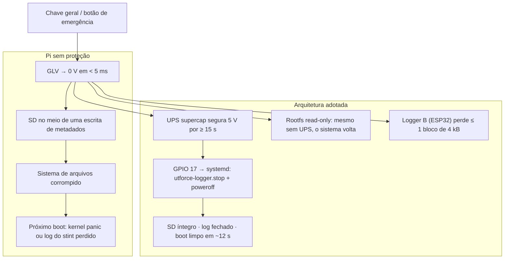

# 🛡️ Resiliência contra Queda Abrupta de Energia & Modo Read-Only

> O Pi perde energia sem aviso toda vez que alguém puxa a chave geral ou o botão de emergência. Três defesas em camadas: **sistema em read-only** (o Pi sempre volta a bootar), **partição de dados com fsync** (o log de segundos atrás está no disco) e **UPS com supercapacitor + desligamento limpo** (o log do último segundo também). E, fora do Pi, o **Logger B**. Fonte: [[🧭 Plano do Sistema de Telemetria (FSAE Eletrico)]] §8, teste T5.

> [!warning] O que mudou
> * A versão anterior confiava em OverlayFS + fsync e num "aviso" por divisor de tensão no GPIO 27. Divisor de tensão não dá tempo nenhum: quando a linha cai abaixo de 10,5 V, o buck já está a milissegundos de desligar. **Entrou o UPS de supercapacitor**, que dá ≥ 15 s.
> * Redundância fora do Pi: **Logger B**.
> * Critério de aceitação explícito: **10 cortes abruptos com o log gravando, SD íntegro nas 10** (T5).

---

## ⚡ 1. O problema



---

## 🔒 2. Sistema em read-only (OverlayFS)

O `/` fica em **somente-leitura**; escritas de sistema vão para `tmpfs` em RAM e somem no desligamento.

```bash
sudo raspi-config
# Performance Options → Overlay File System → Enable
# (também põe /boot em read-only)
```

* Protege o **sistema operacional**, não o log. Um Pi com overlay ativo sobrevive a qualquer corte — mas se o log estava no `/`, ele evaporou com a RAM.
* Desligar o overlay para atualizar o software; religar antes de ir para a pista. Colocar isso no checklist de pré-stint.
* `journald` em `Storage=volatile`; nada de swap.

---

## 💾 3. Partição de dados

| Item | Valor | Por quê |
| :--- | :--- | :--- |
| Partição | Separada, montada em `/media/telemetry` | Corrupção nela não derruba o boot |
| Sistema de arquivos | **ext4** com `data=journal` (ou **f2fs**) | Journal completo: metadados **e** dados |
| Opções de montagem | `noatime,commit=1,sync` para a pasta dos BLFs | `commit=1` força o journal a cada 1 s |
| fsync | A cada 1 s no daemon (`os.fsync`) e no fechamento | Ver [[🔴 Gateway e Logger Raspberry Pi (SocketCAN, Logs BLF e CSV)]] §2.3 |
| Cartão | Industrial (pSLC / High Endurance) | Cartão de consumo corrompe sozinho depois de meses de escrita |
| `fsck` | Automático no boot para `/media/telemetry` | Se o UPS falhar, o Pi ainda tenta recuperar |

Com `max_container_size` de 16 kB no `BLFWriter` e fsync a 1 s, a janela de perda sem UPS é de **~1–2 s**.

---

## 🔋 4. UPS de supercapacitor e desligamento limpo

```mermaid
sequenceDiagram
    participant GLV
    participant UPS as UPS supercap
    participant Pi as Raspberry Pi
    participant SVC as utforce-logger

    GLV->>UPS: 5 V some
    UPS->>Pi: GPIO 17 = LOW ("energia caiu") em < 10 ms
    Pi->>SVC: systemctl stop (SIGTERM)
    SVC->>SVC: notifier.stop(); writer.stop(); fsync
    Pi->>Pi: sync; poweroff (~5–8 s)
    Pi->>UPS: GPIO 27 = LOW ("pode cortar")
    UPS->>Pi: corta a saída — supercap não descarrega até o fim
    Note over UPS: GLV volta → UPS recarrega em segundos → Pi liga
```

| Requisito | Valor |
| :--- | :--- |
| Autonomia | ≥ 15 s a 1,5 A (o Pi 4 em `poweroff` consome menos que em operação) |
| Tecnologia | **Supercapacitor** — sem célula de lítio na caixa de eletrônica, carrega em segundos, tolera 60 °C |
| Sinais | Dois GPIOs: entrada "energia caiu", saída "pode cortar" |
| Módulos | Comerciais para Pi (ex.: Juice4halt e similares) ou próprio com 2× 2,7 V / 25 F em série + *boost* |
| Integração | `systemd` unit com `ExecStop` do logger e regra `udev`/`gpio-shutdown` (`dtoverlay=gpio-shutdown,gpio_pin=17`) |

`dtoverlay=gpio-shutdown` no `config.txt` faz o kernel iniciar o `poweroff` sozinho na borda do GPIO 17 — não depende do daemon Python estar vivo. O `ExecStop` do serviço garante que o BLF é fechado antes.

---

## 📼 5. Fora do Pi: Logger B

Mesmo com tudo acima, o Pi continua sendo um computador com sistema operacional. O **Logger B** (ESP32-S3 + microSD no CAN-2, [[🔴 Gateway e Logger Raspberry Pi (SocketCAN, Logs BLF e CSV)]] §3) grava em blocos de 4 kB com `f_sync` a cada bloco e sem sistema de arquivos com journal para corromper. Corte abrupto: perde ≤ 256 frames (~0,3 s). É a resposta ao teste **T2** (desligar o Pi: Logger B continua).

---

## ✅ 6. Teste de aceitação T5

1. Carro parado, todos os nós transmitindo, Pi gravando há ≥ 5 min.
2. Cortar o GLV pela chave geral. Aguardar o Pi desligar (LED verde apaga). Religar.
3. Repetir **10 vezes**.
4. Critério: `fsck` limpo nas 10; os 10 BLFs abrem em `python-can` e o último frame de cada um está a < 2 s do instante do corte; o Logger B tem os frames dos 2 s finais.

Se falhar uma vez, o problema é de projeto, não de sorte.

---

## 🔗 Próxima Leitura
* [[⚡ Alimentacao Eletrica, Protecoes TVS e Isolamento Galvanico|⚡ Buck + UPS do Pi]]
* [[🔴 Gateway e Logger Raspberry Pi (SocketCAN, Logs BLF e CSV)|🔴 Logger A e Logger B]]
* [[📡 Modulo LoRa SX1262, Bit-Packing Compacto e CRC16|📡 Camada L3]]
