# 💻 Estação Receptora de Boxes (USB Serial Bridge & Integração PySide6)

> Hardware receptor de pista, firmware de recepção e ponte de integração contínua com a aplicação desktop em **PySide6 / pyqtgraph** desenvolvida por Lucas Christen.

> [!info] Revisado em 2026-09-14
> * Pacote de **41 bytes** (não 48) — ver [[📡 Modulo LoRa SX1262, Bit-Packing Compacto e CRC16]] §3. O receptor valida `sync == 0xAA`, comprimento 41 e CRC-16 antes de repassar.
> * O receptor pode ser **outra Heltec WiFi LoRa 32 V3** (mesmos pinos do SX1262) — um só modelo de placa de rádio na equipe.
> * O software desktop atual é antigo e será otimizado à parte ([[🔍 Auditoria Tecnica da Documentacao de Telemetria]]). A ponte serial deve emitir o dicionário com os **nomes canônicos** do [[📊 Dicionario Completo de Canais, Fontes e Taxas de Amostragem (Hz)|Dicionário]]; a GUI faz o *mapping* para os rótulos que exibe.
> * A estação também conta pacotes perdidos (`session_ms` pula > 150 ms) — é o único lugar onde a perda de link aparece; no carro, nada muda.

---

## 🧭 1. Arquitetura da Estação de Recepção nos Boxes

Nos boxes da equipe, o sinal de rádio emitido pelo carro em pista é capturado por uma antena direcional acoplada a um receptor dedicado **ESP32 LoRa**, que injeta os dados na aplicação desktop através de uma porta USB Serial de alta velocidade:

```mermaid
graph LR
    Carro["🏎️ Monoposto na Pista"] -.->|"LoRa 915 MHz"| AntenaBox["Antena Yagi Direcional (Boxes)"]
    AntenaBox --> MCU_RX["Nó Receptor ESP32 LoRa (Bancada Box)"]

    subgraph ReceptorFirmware ["Firmware do Receptor LoRa"]
        MCU_RX --> ValidateCRC["Validação de CRC16 e Desempacotamento"]
        ValidateCRC --> SerialBridge["Serial CDC USB (115200 ou 921600 baud)"]
    end

    SerialBridge -->|"Cabo USB"| Notebook["💻 Notebook dos Engenheiros"]

    subgraph SoftwareDesktop ["Aplicação Telemetria-Christen-UTFORCE"]
        Notebook --> SerialThread["QThread: serial_reader.py"]
        SerialThread -->|"Qt Signal: data_updated(dict)"| DataProc["DataProcessor (data_processor.py)"]
        DataProc --> GUI["Telas PySide6 / pyqtgraph (60 FPS)<br><i>Car Monitoring, Lap Comparison, Setup</i>"]
    end

```



---

## 💻 2. Firmware do Receptor de Boxes (ESP32)

```cpp
#include <RadioLib.h>

// Heltec WiFi LoRa 32 V3: NSS 8, DIO1 14, RST 12, BUSY 13
SX1262 radio = new Module(8, 14, 12, 13);
constexpr size_t PKT_LEN = 41;

uint16_t crc16_ccitt(const uint8_t* d, size_t n);   // mesma função do gateway

void setup() {
    Serial.begin(921600);
    // 915 MHz, BW 500 kHz, SF7, CR 4/5, sync word 0x12, preâmbulo 8
    int state = radio.begin(915.0, 500.0, 7, 5, 0x12, 10, 8);
    if (state != RADIOLIB_ERR_NONE) {
        Serial.println("{\"error\":\"Falha ao iniciar radio LoRa\"}");
    }
}

void loop() {
    uint8_t buf[64];
    int state = radio.receive(buf, sizeof(buf));
    if (state != RADIOLIB_ERR_NONE) return;

    size_t len = radio.getPacketLength();
    if (len != PKT_LEN || buf[0] != 0xAA) return;             // tamanho e sync
    uint16_t crc_rx = buf[39] | (buf[40] << 8);                // little endian
    if (crc16_ccitt(buf, 39) != crc_rx) return;                // CRC da aplicação

    // Repassa o pacote binário íntegro + RSSI/SNR como 2 bytes extras
    int8_t rssi = (int8_t)radio.getRSSI();
    int8_t snr  = (int8_t)radio.getSNR();
    Serial.write(buf, PKT_LEN);
    Serial.write((uint8_t*)&rssi, 1);
    Serial.write((uint8_t*)&snr, 1);
}
```

---

## 🐍 3. Módulo de Ingestão Real no PySide6 (`serial_reader.py`)

Para substituir o simulador de dados (`data_simulator.py`) pela leitura dos dados físicos reais do carro, basta plugar o leitor serial emitindo o mesmo dicionário de variáveis já suportado pela interface gráfica:

```python
import serial
import struct
from PySide6.QtCore import QThread, Signal

class SerialTelemetryReader(QThread):
    data_received = Signal(dict)
    
    def __init__(self, port='/dev/ttyACM0', baudrate=921600):
        super().__init__()
        self.port = port
        self.baudrate = baudrate
        self.running = True

    def run(self):
        try:
            ser = serial.Serial(self.port, self.baudrate, timeout=1.0)
            while self.running:
                # Procura byte de sincronismo 0xAA
                sync = ser.read(1)
                if sync == b'\xAA':
                    raw = ser.read(40 + 2)   # 40 bytes restantes do pacote + RSSI + SNR
                    if len(raw) == 42:
                        payload = b'\xAA' + raw[:40]
                        rssi, snr = struct.unpack('<bb', raw[40:])
                        data = self.decode_telemetry(payload)
                        if data:
                            data['rssi_dbm'], data['snr_db'] = rssi, snr
                            self.data_received.emit(data)
        except Exception as e:
            print(f"Erro serial: {e}")

    # Layout de 41 bytes — espelho da struct LoRaPayload do gateway
    FMT = '<B I H H H H h h h h H H BBBB H h B b H B B H'
    KEYS = ['sync', 'session_ms', 'vehicle_speed', 'apps_pct', 'bse_press_front',
            'bse_press_rear', 'steer_angle', 'accel_x', 'accel_y', 'gyro_yaw_rate',
            'damper_f_avg', 'damper_r_avg', 'tyre_temp_fl_mid', 'tyre_temp_fr_mid',
            'tyre_temp_rl_mid', 'tyre_temp_rr_mid', 'ts_pack_voltage', 'ts_pack_current',
            'soc_pct', 'cell_t_max', 'motor_speed_rpm', 'safety_flags', 'node_flags', 'crc16']
    SCALE = {'vehicle_speed': 0.01, 'apps_pct': 0.01, 'bse_press_front': 0.1, 'bse_press_rear': 0.1,
             'steer_angle': 0.1, 'accel_x': 0.001, 'accel_y': 0.001, 'gyro_yaw_rate': 0.01,
             'damper_f_avg': 0.01, 'damper_r_avg': 0.01, 'ts_pack_voltage': 0.1, 'ts_pack_current': 0.1}
    OFFSET = {'tyre_temp_fl_mid': -40, 'tyre_temp_fr_mid': -40, 'tyre_temp_rl_mid': -40, 'tyre_temp_rr_mid': -40}

    def decode_telemetry(self, b):
        assert struct.calcsize(self.FMT) == 41
        vals = dict(zip(self.KEYS, struct.unpack(self.FMT, b)))
        if crc16_ccitt(b[:39]) != vals['crc16']:      # defesa em profundidade: o receptor já checou
            return None
        data = {k: v * self.SCALE.get(k, 1) + self.OFFSET.get(k, 0)
                for k, v in vals.items() if k not in ('sync', 'crc16')}
        # nomes canônicos; a GUI mapeia para os rótulos antigos (ex.: 'speed', 'throttle')
        return data
```

---

## 🔗 Próxima Leitura
* [[🤖 Arquitetura de Transicao: Da Telemetria Convencional ao Driverless|🤖 Início do Módulo 06: Transição para o Carro Autônomo]]
* [[📡 Modulo LoRa SX1262, Bit-Packing Compacto e CRC16|📡 Detalhes do Formato Bit-Packing e CRC]]
* [[📊 Dicionario Completo de Canais, Fontes e Taxas de Amostragem (Hz)|📊 Dicionário de Canais do Software]]
