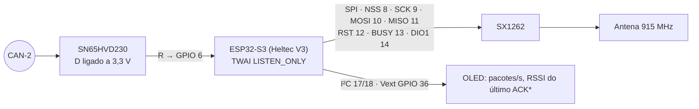

# 📡 Gateway LoRa SX1262, Pacote Compacto & CRC16

> Camada **L3** do registro: um resumo de **41 bytes a 10 Hz**, montado a partir do **CAN-2** por uma **Heltec WiFi LoRa 32 V3** que só escuta, e transmitido a 915 MHz para o box. Se o rádio cair, nada muda no carro. Fonte: [[🧭 Plano do Sistema de Telemetria (FSAE Eletrico)]] §3.2, §6.6.

> [!warning] Correções
> * **O pacote tem 41 bytes, não 48.** A `struct` da versão anterior somava 41; o texto dizia 48. Time-on-air recalculado: **≈ 21,8 ms**.
> * O gateway é um nó **dedicado** (a Heltec V3 é a placa certa **aqui e só aqui**), escuta **CAN-2** em `LISTEN_ONLY` com **TX desconectado**.
> * Campos renomeados para os canais canônicos; `rh_front/rear_avg` virou **estimativa derivada** (não há laser); entram flags de segurança e estado dos nós.
> * A Heltec da versão anterior nos VDNs saiu: o SX1262 ocupa GPIO 8–14, onde o MCP3208 precisava ficar.

---

## 📻 1. Orçamento de rádio

| Parâmetro | Valor | Nota |
| :--- | :--- | :--- |
| Frequência | 915 MHz (ISM Brasil, 902–907,5 / 915–928 MHz) | Antena de ¼ onda no *roll hoop*, ≥ 30 cm da antena GPS |
| Modulação | LoRa SF7, BW 500 kHz, CR 4/5 | Bitrate bruto ≈ **21,9 kbps** |
| Potência | +20 dBm (100 mW) | Limite do SX1262 e da regulamentação |
| Payload | **41 bytes** | §2 |
| Time-on-air | **≈ 21,8 ms** (preâmbulo 8, CRC on, header explícito) | 10 Hz → duty cycle ≈ 22 % |
| Alcance | 1–2 km em visada num autódromo | Yagi no box ajuda mais que potência no carro |
| Taxa de pacotes | **10 Hz** | 20 Hz daria 44 % de ocupação e sem margem para retransmissão — não |

Não há ACK nem retransmissão: pacote perdido é pacote perdido. O log completo está no carro (L1, L2a, L2b).

---

## 🔌 2. Hardware — Heltec WiFi LoRa 32 V3



\* RSSI só se a estação enviar um beacon ocasional; opcional.

* CAN RX no **GPIO 6**; **não existe** CAN TX neste nó (pino D do transceiver em 3,3 V).
* Filtro de aceitação do TWAI: `0x200–0x22F`, `0x410`, `0x500–0x504`, `0x600–0x601`, `0x700–0x702`.
* Alimentação pela cadeia padrão do nó (buck 5 V no `5V` da Heltec); a bateria LiPo da placa **não** é usada.

---

## 📦 3. Pacote — 41 bytes

Montado a cada 100 ms com o **último valor recebido** de cada canal (sem interpolação). Se um canal não chegou há > 500 ms, o campo vai com o valor NaN do tipo e o bit correspondente em `node_flags` marca o nó.

```cpp
#pragma pack(push, 1)
struct LoRaPayload {                      // 41 bytes
    uint8_t  sync;                        // 0xAA                              [1]
    uint32_t session_ms;                  // millis do gateway                  [4]  → 5
    uint16_t vehicle_speed_x100;          // média wheel_speed_fl/fr, 0,01 km/h [2]  → 7
    uint16_t apps_pct_x100;               // de 0x700                          [2]  → 9
    uint16_t bse_front_x10;               // 0,1 bar, de 0x700                 [2]  → 11
    uint16_t bse_rear_x10;                // 0,1 bar                           [2]  → 13
    int16_t  steer_angle_x10;             // 0,1 °                             [2]  → 15
    int16_t  accel_x_x1000;               // 0,001 g, de 0x500                 [2]  → 17
    int16_t  accel_y_x1000;               // 0,001 g                           [2]  → 19
    int16_t  gyro_yaw_rate_x100;          // 0,01 °/s                          [2]  → 21
    uint16_t damper_f_avg_x100;           // média damper_pos_fl/fr, 0,01 mm   [2]  → 23
    uint16_t damper_r_avg_x100;           // média damper_pos_rl/rr            [2]  → 25
    uint8_t  tyre_mid_fl, tyre_mid_fr;    // °C + 40, zona central             [2]  → 27
    uint8_t  tyre_mid_rl, tyre_mid_rr;    //                                   [2]  → 29
    uint16_t ts_pack_voltage_x10;         // 0,1 V, de 0x410                   [2]  → 31
    int16_t  ts_pack_current_x10;         // 0,1 A                             [2]  → 33
    uint8_t  soc_pct;                     // %                                 [1]  → 34
    int8_t   cell_t_max;                  // °C                                [1]  → 35
    uint16_t motor_speed_rpm;             // de 0x702                          [2]  → 37
    uint8_t  safety_flags;                // cópia do byte 0 de 0x701          [1]  → 38
    uint8_t  node_flags;                  // bit por nó sem dado há > 500 ms   [1]  → 39
    uint16_t crc16;                       // CRC-16/CCITT-FALSE dos 39 bytes   [2]  → 41
};
#pragma pack(pop)
static_assert(sizeof(LoRaPayload) == 41, "payload deve ter 41 bytes");
```

`node_flags`: bit0 VDN-F · bit1 VDN-R · bit2 INU · bit3 Térmico · bit4 Orion(CAN-2) · bit5 VCU gateway · bit6 — · bit7 gateway sem `0x504` há > 5 s.

O `static_assert` é o que impede a divergência "41 no código, 48 no texto" de voltar. Ride height **não** vai no pacote: é derivado no box a partir de `damper_*_avg` com o *motion ratio*.

---

## 🔒 4. CRC-16/CCITT-FALSE

Polinômio 0x1021, valor inicial 0xFFFF, sem reflexão, sem XOR final — calculado sobre os **39 bytes** anteriores ao campo `crc16`.

```cpp
uint16_t crc16_ccitt(const uint8_t* d, size_t n) {
    uint16_t crc = 0xFFFF;
    for (size_t i = 0; i < n; i++) {
        crc ^= (uint16_t)d[i] << 8;
        for (uint8_t b = 0; b < 8; b++)
            crc = (crc & 0x8000) ? (crc << 1) ^ 0x1021 : (crc << 1);
    }
    return crc;
}
```

O SX1262 já tem CRC de camada física; este CRC é da **aplicação**: sobrevive à ponte serial até o notebook e detecta bytes perdidos no USB. Pacote com CRC errado é descartado no receptor — nunca plotado.

---

## 💻 5. Firmware do gateway (essência)

```cpp
#include <RadioLib.h>
#include "driver/twai.h"

SX1262 radio = new Module(8, 14, 12, 13);   // NSS, DIO1, RST, BUSY — Heltec V3
static LoRaPayload pkt{};
static uint32_t last_seen_ms[8];

void setup() {
    twaiInit(GPIO_NUM_2, GPIO_NUM_6, /*listen_only=*/true);    // TX num GPIO sem fio (driver exige um)
    radio.begin(915.0, 500.0, 7, 5, 0x12, 20, 8);                // BW 500, SF7, CR 4/5, +20 dBm
    pkt.sync = 0xAA;
}

void taskCanRx(void*) {                      // Core 0 — atualiza pkt com o último de cada ID
    twai_message_t m;
    for (;;) if (twai_receive(&m, portMAX_DELAY) == ESP_OK) { updateFromFrame(m); }
}

void taskTx(void*) {                         // Core 1 — 10 Hz
    TickType_t wake = xTaskGetTickCount();
    for (;;) {
        vTaskDelayUntil(&wake, pdMS_TO_TICKS(100));
        pkt.session_ms = millis();
        pkt.node_flags = staleNodes(last_seen_ms, 500);
        pkt.crc16 = crc16_ccitt((uint8_t*)&pkt, sizeof(pkt) - 2);
        radio.transmit((uint8_t*)&pkt, sizeof(pkt));   // ~22 ms bloqueante — ok a 10 Hz
    }
}
```

---

## 🔗 Próxima Leitura
* [[💻 Estacao Receptora de Boxes (USB Serial Bridge e Integracao PySide6)|💻 Receptor no box e ponte para o software]]
* [[📊 Matriz de Mensagens CAN e Dicionario de IDs (DBC Veicular)|📊 De onde vem cada campo]]
* [[🌐 Topologia Macro da Rede CAN 500k e Distribuicao dos Nos|🌐 Onde o gateway fica no CAN-2]]
