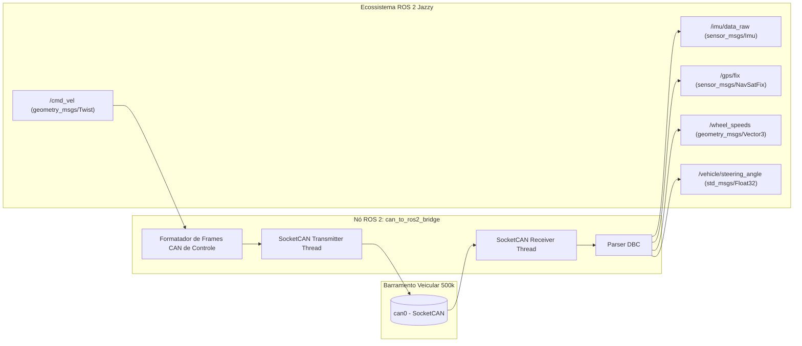

# 🌉 Ponte CAN para ROS 2 (socketcan_bridge & Publicação de Tópicos)

> Nó de integração entre o barramento físico automotivo **CAN 500 kbps** e o middleware de robótica **ROS 2 Jazzy**, convertendo frames de telemetria em tópicos padronizados do ecossistema robótico.

> [!info] Fora do escopo atual — leitura futura
> A prioridade é fazer a telemetria convencional funcionar **com redundância** ([[🧭 Plano do Sistema de Telemetria (FSAE Eletrico)]], Fases 1–6). Esta nota **não foi revisada** contra o Plano de 2026-09-14: ela ainda assume barramento único, nó "PCU", pinos e taxas antigos. O que o Plano já garante para a conversão futura: dois barramentos (o ROS 2 entraria como mais um ouvinte do CAN-2 e, via gateway próprio, escritor no CAN-1), base de tempo por PPS (`0x504`), rodas a 100 Hz e IMU a 100 Hz — as entradas de um EKF. Revisar esta nota **depois** da Fase 6.

---

## 🧭 1. Fluxo Bidirecional de Dados na Ponte

O nó `can_to_ros2_bridge` opera em ciclo bidirecional em tempo real:
1. **Fluxo Ascendente (Sensoriamento):** Escuta o SocketCAN `can0`, decodifica os identificadores veiculares e publica tópicos estruturados para a árvore de nós do ROS 2.
2. **Fluxo Descendente (Comando Autônomo):** Assina tópicos de controle de trajetória (`/cmd_vel`, `/autonomous/steer_target` e `/autonomous/torque_target`) e despacha frames prioritários via CAN para a PCU e inversor.



---

## 📋 2. Mapeamento de Frames CAN para Mensagens Padrão ROS 2

| ID CAN | Variáveis no Frame | Mensagem Padrão ROS 2 | Nome do Tópico Publicado | Taxa |
| :---: | :--- | :--- | :--- | :---: |
| `0x500` | $a_x, a_y, a_z$, Yaw Rate | `sensor_msgs/msg/Imu` | `/imu/data_raw` | $50\text{ Hz}$ |
| `0x501` | Latitude, Longitude, Altitude | `sensor_msgs/msg/NavSatFix` | `/gps/fix` | $10\text{ Hz}$ |
| `0x200` | Rotação Roda FL e FR | `std_msgs/msg/Float32MultiArray` | `/vehicle/wheel_speeds/front` | $20\text{ Hz}$ |
| `0x220` | Rotação Roda RL e RR | `std_msgs/msg/Float32MultiArray` | `/vehicle/wheel_speeds/rear` | $20\text{ Hz}$ |
| `0x101` | Ângulo do Volante e Torque | `geometry_msgs/msg/Vector3` | `/vehicle/steering_state` | $50\text{ Hz}$ |
| `0x100` | Pressões de Freio e APS | `geometry_msgs/msg/Vector3` | `/vehicle/pedals_state` | $50\text{ Hz}$ |

---

## 💻 3. Código do Nó ROS 2 em Python (`rclpy` + `can`)

```python
#!/usr/bin/env python3
import rclpy
from rclpy.node import Node
import can
import struct
from sensor_msgs.msg import Imu, NavSatFix
from std_msgs.msg import Float32MultiArray

class CanToRos2Bridge(Node):
    def __init__(self):
        super().__init__('can_to_ros2_bridge')
        
        # Publicadores ROS 2
        self.imu_pub = self.create_publisher(Imu, '/imu/data_raw', 10)
        self.gps_pub = self.create_publisher(NavSatFix, '/gps/fix', 10)
        self.wheels_f_pub = self.create_publisher(Float32MultiArray, '/vehicle/wheel_speeds/front', 10)
        
        # Inicializa interface SocketCAN
        try:
            self.bus = can.interface.Bus(channel='can0', bustype='socketcan')
            self.get_logger().info('Ponte SocketCAN conectada com sucesso a can0.')
        except Exception as e:
            self.get_logger().error(f'Falha ao abrir SocketCAN: {e}')
            return

        # Timer de escuta de alta frequência (100 Hz / 10 ms)
        self.timer = self.create_timer(0.01, self.can_poll_callback)

    def can_poll_callback(self):
        # Lê todos os frames disponíveis no buffer sem bloquear
        while True:
            msg = self.bus.recv(timeout=0.0)
            if msg is None:
                break
            self.process_can_message(msg)

    def process_can_message(self, msg):
        # 1. Decodifica IMU (ID 0x500)
        if msg.arbitration_id == 0x500 and msg.dlc >= 8:
            ax, ay, az, yaw_rate = struct.unpack('<hhhh', msg.data)
            
            imu_msg = Imu()
            imu_msg.header.stamp = self.get_clock().now().to_msg()
            imu_msg.header.frame_id = 'base_link'
            imu_msg.linear_acceleration.x = (ax / 1000.0) * 9.80665
            imu_msg.linear_acceleration.y = (ay / 1000.0) * 9.80665
            imu_msg.linear_acceleration.z = (az / 1000.0) * 9.80665
            imu_msg.angular_velocity.z = (yaw_rate / 100.0) * (3.14159265 / 180.0)
            self.imu_pub.publish(imu_msg)

        # 2. Decodifica Rodas Dianteiras (ID 0x200)
        elif msg.arbitration_id == 0x200 and msg.dlc >= 4:
            v_fl, v_fr = struct.unpack('<HH', msg.data[0:4])
            w_msg = Float32MultiArray()
            w_msg.data = [v_fl / 100.0, v_fr / 100.0]
            self.wheels_f_pub.publish(w_msg)

def main(args=None):
    rclpy.init(args=args)
    node = CanToRos2Bridge()
    try:
        rclpy.spin(node)
    except KeyboardInterrupt:
        pass
    finally:
        node.destroy_node()
        rclpy.shutdown()

if __name__ == '__main__':
    main()
```

---

## 🔗 Próxima Leitura
* [[🧭 Fusao Sensorial (EKF com Rodas, IMU e GPS) para Odometria Autonoma|🧭 Fusão Sensorial EKF no ROS 2]]
* [[🏎️ Integracao com o Ecossistema Autonomo (JetBot ROS 2, IA-MONITOR e Controle)|🏎️ Integração com JetBot ROS e Algoritmos de Corrida]]
* [[🤖 Arquitetura de Transicao: Da Telemetria Convencional ao Driverless|🤖 Voltar para Arquitetura de Transição]]
