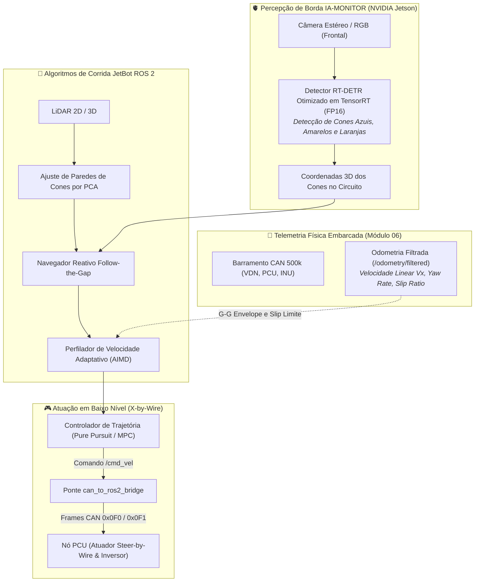

# 🏎️ Integração com o Ecossistema Autônomo (JetBot ROS 2, IA-MONITOR & Controle)

> Convergência de projetos no cofre: como a telemetria embarcada alimenta os algoritmos de corrida autônoma do **JetBot ROS 2** e a percepção de borda em **NVIDIA Jetson** desenvolvida no **IA-MONITOR**.

> [!info] Fora do escopo atual — leitura futura
> A prioridade é fazer a telemetria convencional funcionar **com redundância** ([[🧭 Plano do Sistema de Telemetria (FSAE Eletrico)]], Fases 1–6). Esta nota **não foi revisada** contra o Plano de 2026-09-14: ela ainda assume barramento único, nó "PCU", pinos e taxas antigos. O que o Plano já garante para a conversão futura: dois barramentos (o ROS 2 entraria como mais um ouvinte do CAN-2 e, via gateway próprio, escritor no CAN-1), base de tempo por PPS (`0x504`), rodas a 100 Hz e IMU a 100 Hz — as entradas de um EKF. Revisar esta nota **depois** da Fase 6.

---

## 🌐 1. A Matriz de Convergência Tecnológica no Cofre

O desenvolvimento autônomo da UTForce unifica três iniciativas de engenharia em um pipeline coeso:

---

## 🧠 2. Como a Telemetria Otimiza o Perfilador de Velocidade (AIMD)

No projeto [[📈 Aprendizado Espacial de Velocidade por Trecho (AIMD Profiling)|JetBot ROS 2 Driverless]], documentamos o algoritmo **AIMD (*Additive Increase Multiplicative Decrease*)**, que aprende a velocidade limite trecho a trecho do circuito.

Na pista real, esse algoritmo é alimentado diretamente pelos canais de telemetria da rede CAN:
* **Fase Aditiva ($+A_{\text{inc}}$):** Enquanto os sensores de roda registrarem escorregamento seguro ($|\kappa| < 0.10$) e a IMU BNO085 acusar aceleração lateral abaixo do envelope de tombamento ($a_y < 1.4\text{ g}$), o algoritmo incrementa a velocidade máxima da reta a cada volta completada.
* **Fase Multiplicativa ($\times M_{\text{dec}}$):** Se a telemetria acusar travamento de freio, perda de tração traseira (*spin*) ou subesterço excessivo ($\alpha_f > 8^\circ$), a velocidade permitida para aquele setor específico do mapa é reduzida preventivamente em $25\%$ ($M_{\text{dec}} = 0.75$).

---

## 👁️ 3. Percepção com Cones: Aporte Tecnológico do IA-MONITOR

A arquitetura de visão computacional embarcada em GPU desenvolvida no projeto [[🫀 IA-MONITOR - Visao Geral|IA-MONITOR (NVIDIA Jetson)]] é adaptada para o regulamento de cones da Fórmula SAE:
* **Transfer Learning com NVIDIA TAO Toolkit:** Treinamento do modelo **RT-DETR (Real-Time Detection Transformer)** para as quatro classes de cones regulamentares (Azul: limite esquerdo; Amarelo: limite direito; Laranja pequeno: zebras e slalom; Laranja grande: linha de largada/chegada).
* **Compilação TensorRT:** O motor de inferência roda a mais de **$60\text{ FPS}$** na NVIDIA Jetson com latência inferior a $8\text{ ms}$, eliminando atrasos no loop de controle da direção.

---

## 🛡️ 4. Sistema de Frenagem de Emergência (EBS) e Watchdog de Segurança

Para cumprir as regras do regulamento SAE Driverless:
1. **Heartbeat CAN a $100\text{ Hz}$:** O computador autônomo (Jetson) transmite continuamente um frame de batimento cardíaco (`0x0A0 - Autonomous_Heartbeat`).
2. **Interrupção EBS:** Se a PCU deixar de receber o heartbeat por mais de **$100\text{ ms}$** (indicando congelamento de software do ROS 2 ou falha de alimentação do computador de bordo), a PCU corta o sinal do solenoide pneumático, acionando mecanicamente o **EBS (*Emergency Brake System*)** com pressão máxima nos discos de freio.

---

## 🔗 Navegação e Conexões no Cofre
* 🤖 **Plataforma Autônoma:** [[🤖 Plataforma Autonoma JetBot ROS 2 - Visao Geral|JetBot ROS 2 (Visão Geral)]]
* 🏎️ **Controlador de Corrida:** [[🏎️ Controlador de Corrida Autonoma (race_follower.py)|Algoritmo Follow-the-Gap e PCA]]
* 🫀 **Visão Computacional em Borda:** [[🫀 IA-MONITOR - Visao Geral|Projeto IA-MONITOR (NVIDIA Jetson)]]
* 📡 **Voltar para a Visão Geral de Hardware:** [[📡 Hardware de Telemetria Embarcada - Visao Geral|Hardware de Telemetria Embarcada]]
