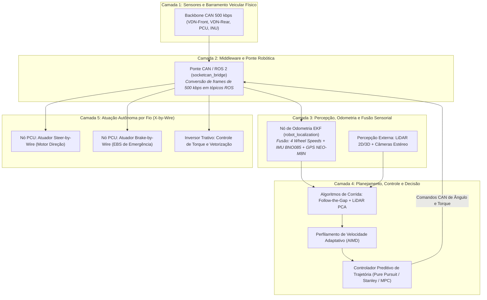

# 🤖 Arquitetura de Transição: Da Telemetria Convencional ao Driverless

> Visão arquitetural de como o ecossistema de sensores físicos e barramento CAN veicular se torna a fundação sensorial de baixo nível para a transformação do protótipo no **Fórmula SAE Driverless (Autônomo)**.

> [!info] Fora do escopo atual — leitura futura
> A prioridade é fazer a telemetria convencional funcionar **com redundância** ([[🧭 Plano do Sistema de Telemetria (FSAE Eletrico)]], Fases 1–6). Esta nota **não foi revisada** contra o Plano de 2026-09-14: ela ainda assume barramento único, nó "PCU", pinos e taxas antigos. O que o Plano já garante para a conversão futura: dois barramentos (o ROS 2 entraria como mais um ouvinte do CAN-2 e, via gateway próprio, escritor no CAN-1), base de tempo por PPS (`0x504`), rodas a 100 Hz e IMU a 100 Hz — as entradas de um EKF. Revisar esta nota **depois** da Fase 6.

---

## 🧭 1. O Elo de Ligação: Do Carro com Piloto ao Carro Autônomo

Na evolução de uma equipe de Fórmula SAE, construir um carro autônomo **não significa descartar a telemetria existente**, mas sim promovê-la a camada de **percepção cinemática primária** do robô:

---

## 🔄 2. Mapeamento de Reutilização de Hardware: Humano vs. Autônomo

| Componente de Telemetria | Papel no Carro com Piloto Humano | Papel na Plataforma Fórmula Driverless |
| :--- | :--- | :--- |
| **Sensores de Roda TLE4922 (x4)** | Medição de velocidade e cálculo de *Slip Ratio*. | **Odometria diferencial de 4 cantos** e estimativa de velocidade longitudinal $V_x$ do chassi sem deriva. |
| **IMU BNO085 (9-DoF)** | Registro de acelerações $G\text{-}G$ e rolagem. | **Estimativa de orientação angular (Yaw, Pitch, Roll)** para os filtros de localização e correção de derrapagem. |
| **GPS u-blox NEO-M8N** | Mapeamento de pista e cronometragem. | **Correção de deriva de posição global** em provas de aceleração e *Trackdrive*. |
| **Nó PCU (ESP32)** | Leitura do pedal do piloto e auditoria de segurança. | **Nó atuador de Steer-by-Wire e corte de emergência (EBS)** recebendo comandos de controle via CAN. |
| **Transdutores de Freio** | Verificação de balanço (*Brake Bias*). | **Validação de desaceleração autônoma** e monitoramento da pressão das pinças no travamento de segurança. |
| **Barramento CAN 500 kbps** | Transporte de telemetria para gravação SD. | **Espinha dorsal de controle determinístico** ligando o computador autônomo (Jetson / RPi) aos atuadores mecânicos. |

---

## 🛡️ 3. Requisitos Regulamentares do FSAE Driverless

A transição para autônomo introduz três subsistemas de segurança obrigatórios integrados à rede CAN:

1. **ASMS (*Autonomous System Master Switch*):** Chave mestra que autoriza o computador de bordo a assumir o controle do volante e acelerador.
2. **EBS (*Emergency Brake System*):** Sistema redundante de frenagem pneumática/hidráulica pressurizado por acumulador de nitrogênio. Se a rede CAN perder comunicação (*heartbeat timeout > 100 ms*) ou o botão de emergência sem fio for acionado, o EBS descarrega a pressão travando as quatro rodas com desaceleração superior a $8\text{ m/s}^2$.
3. **AMI (*Autonomous Mission Indicator*):** Painel de luzes e displays indicando o modo de operação atual (*Acceleration, Skidpad, Autocross, Trackdrive*).

---

## 🔗 Próxima Leitura
* [[🌉 Ponte CAN para ROS 2 (socketcan_bridge e Publicacao de Topicos)|🌉 Ponte de Software SocketCAN para ROS 2]]
* [[🧭 Fusao Sensorial (EKF com Rodas, IMU e GPS) para Odometria Autonoma|🧭 Filtro de Kalman Estendido para Odometria Robótica]]
* [[🏎️ Integracao com o Ecossistema Autonomo (JetBot ROS 2, IA-MONITOR e Controle)|🏎️ Integração com JetBot ROS 2 e IA-MONITOR]]
