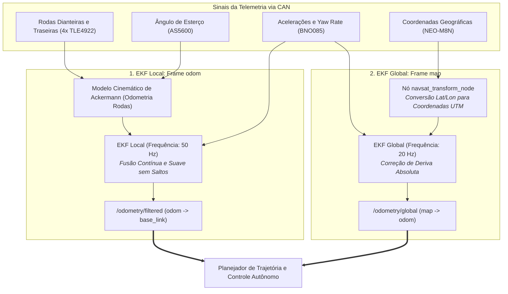

# 🧭 Fusão Sensorial (EKF com Rodas, IMU & GPS) para Odometria Autônoma

> Fusão estocástica de estados via **Filtro de Kalman Estendido (EKF)** utilizando o pacote padrão `robot_localization` do ROS 2 para gerar odometria contínua, estável e livre de deriva para a condução autônoma.

> [!info] Fora do escopo atual — leitura futura
> A prioridade é fazer a telemetria convencional funcionar **com redundância** ([[🧭 Plano do Sistema de Telemetria (FSAE Eletrico)]], Fases 1–6). Esta nota **não foi revisada** contra o Plano de 2026-09-14: ela ainda assume barramento único, nó "PCU", pinos e taxas antigos. O que o Plano já garante para a conversão futura: dois barramentos (o ROS 2 entraria como mais um ouvinte do CAN-2 e, via gateway próprio, escritor no CAN-1), base de tempo por PPS (`0x504`), rodas a 100 Hz e IMU a 100 Hz — as entradas de um EKF. Revisar esta nota **depois** da Fase 6.

---

## 🎯 1. Por que Nenhuma Fonte Sensorial é Suficiente Isoladamente?

| Fonte Sensorial | Vantagens Primárias | Deficiências Críticas se Usada Sozinha |
| :--- | :--- | :--- |
| **Sensores de Roda (TLE4922)** | Alta taxa ($50\text{ Hz}$), excelente resolução de velocidade longitudinal $V_x$. | Em curvas agressivas ou frenagens com travamento/patinagem (*slip*), acumula erro cumulativo de posição rapidamente. |
| **IMU (BNO085)** | Taxa altíssima ($100\text{ Hz}$), capta guinada (*Yaw Rate*) e acelerações instantâneas. | Integrar aceleração duas vezes para estimar distância causa **deriva exponencial (*drift*)** em poucos segundos. |
| **GPS (NEO-M8N)** | Posição absoluta global no planeta sem deriva cumulativa ao longo do tempo. | Taxa lenta ($10\text{ Hz}$), atraso de propagação de pacote (~$60\text{ ms}$) e ruído de multi-percurso. |

### A Solução: Arquitetura Dual-EKF
O pacote `robot_localization` resolve o problema através de dois filtros de Kalman em cascata:



---

## 🧮 2. Vetor de Estados do Filtro de Kalman Estendido

O filtro estima recursivamente um vetor de 15 variáveis de estado contínuas:

$$\mathbf{x} = \begin{bmatrix} x & y & z & \phi & \theta & \psi & \dot{x} & \dot{y} & \dot{z} & \dot{\phi} & \dot{\theta} & \dot{\psi} & \ddot{x} & \ddot{y} & \ddot{z} \end{bmatrix}^T$$

Onde:
* $(x, y, z)$ são as coordenadas métricas cartesianas no circuito.
* $(\phi, \theta, \psi)$ são os ângulos de atitude Euler (*Roll, Pitch, Yaw*).
* $(\dot{x}, \dot{y}, \dot{z})$ e $(\dot{\phi}, \dot{\theta}, \dot{\psi})$ são as velocidades lineares e angulares.
* $(\ddot{x}, \ddot{y}, \ddot{z})$ são as acelerações lineares medidas pela IMU com a gravidade compensada.

---

## ⚙️ 3. Arquivo de Configuração do ROS 2 (`ekf.yaml`)

```yaml
ekf_filter_node_local:
  ros__parameters:
    frequency: 50.0
    sensor_timeout: 0.1
    two_d_mode: true
    transform_time_offset: 0.0
    transform_timeout: 0.0
    print_diagnostics: true
    publish_tf: true

    map_frame: map
    odom_frame: odom
    base_link_frame: base_link
    world_frame: odom

    # Entrada 1: Odometria das 4 Rodas (Kinematics)
    odom0: /vehicle/wheel_odometry
    odom0_config: [false, false, false,
                   false, false, false,
                   true,  false, false,
                   false, false, false,
                   false, false, false]
    odom0_differential: false

    # Entrada 2: IMU BNO085
    imu0: /imu/data_raw
    imu0_config: [false, false, false,
                  false, false, true,
                  false, false, false,
                  false, false, true,
                  true,  true,  false]
    imu0_differential: false
    imu0_relative: false
    imu0_remove_gravitational_acceleration: true
```

---

## 🔗 Próxima Leitura
* [[🏎️ Integracao com o Ecossistema Autonomo (JetBot ROS 2, IA-MONITOR e Controle)|🏎️ Integração com JetBot ROS 2 e Algoritmos de Corrida]]
* [[🌉 Ponte CAN para ROS 2 (socketcan_bridge e Publicacao de Topicos)|🌉 Voltar para Ponte CAN-ROS 2]]
* [[🤖 Arquitetura de Transicao: Da Telemetria Convencional ao Driverless|🤖 Visão Geral da Arquitetura Driverless]]
