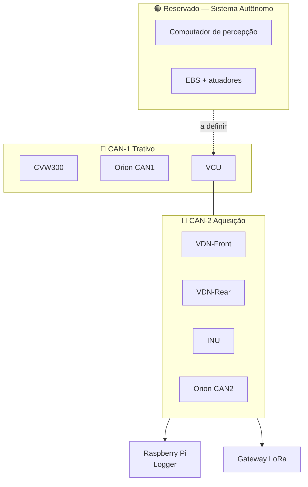

# 📋 Revisão da Arquitetura Planejada

> Análise dos diagramas do Miro (VDN-Front, VDN-Rear, PCU, INU, Gateway, Geral), do guia de sensores e da lista de canais, verificada contra os datasheets dos componentes efetivamente escolhidos.

---

## 🔧 1. Arquitetura confirmada

| Item | Definição |
| :--- | :--- |
| **Acumulador** | 24s10p |
| **BMS** | Orion BMS (original) |
| **Inversor** | WEG CVW300 |
| **Powertrain** | Motor único |
| **Horizonte** | Conversão para autônomo no futuro |

### O que 24s10p significa na prática

Com células Li-ion NMC (3,6 V nominal, 4,2 V carregada, 2,5 V descarregada):

| | Tensão do pack |
| :--- | ---: |
| Carregado (4,2 V/célula) | **100,8 V** |
| Nominal (3,6 V/célula) | **86,4 V** |
| Descarregado (2,5 V/célula) | **60,0 V** |

Duas consequências:

1. **O sistema é de alta tensão para efeito de regulamento.** Acima de 60 VDC valem TSAL, IMD, AIRs, pré-carga, circuito de shutdown — tudo o que a inspeção elétrica verifica.
2. **No fim da descarga o pack encosta em 60 V**, exatamente o limiar que a regra do TSAL usa. Vale verificar em bancada como o TSAL se comporta nessa faixa, para não ter luz oscilando no fim de uma bateria de Endurance.

---

## ⚠️ 2. O achado mais grave: o divisor resistivo

Três documentos de vocês dizem coisas diferentes sobre o mesmo circuito, e **os três ignoram que cada ADC tem uma faixa de entrada diferente**.

### 2.1 O que cada documento diz

| Documento | Divisor | Alvo declarado |
| :--- | :---: | :--- |
| Guia de sensores (Miro) | 33k / 12k = **0,733×** | 0–10/5 V → 0–3,3 V |
| Nota do cofre (Circuitos Condicionadores) | 33k / 12k = **0,2667×** | 0–10 V → 0–2,67 V |

Repare: **o mesmo par de resistores, dois fatores diferentes.** 0,2667 é $12/(33+12)$ — divisor com 33 k em cima. 0,733 é $33/(33+12)$ — com 12 k em cima. São circuitos diferentes descritos com os mesmos valores.

### 2.2 O que o ADS131M08 realmente aceita

Fui ao datasheet. O ADS131M08 tem **referência interna de 1,2 V** e fundo de escala **±1,2 V com ganho 1**. Não é 3,3 V.

| Sinal de entrada | × 0,733 (Miro) | × 0,2667 (cofre) | FSR do ADS131M08 |
| :--- | ---: | ---: | :--- |
| 4,5 V (pressão de freio) | 3,30 V ❌ | **1,20 V ✅** | ±1,2 V |
| 5,0 V (APS no topo) | 3,67 V ❌ | 1,33 V ⚠️ | ±1,2 V |
| 10,0 V | 7,33 V ☠️ | 2,67 V ❌ | ±1,2 V |

**O número do cofre está certo e o do Miro está errado.** O 0,2667 leva 4,5 V a exatamente 1,20 V — fundo de escala perfeito para o ADS131M08. O 0,733 satura o conversor em 2,75× e, com 10 V na entrada, ultrapassa o AVDD e pode danificar o CI.

> [!danger] Corrija o guia do Miro antes de comprar resistor
> O texto "0–10/5 V → 0–3,3 V" e o fator 0,733 estão no cartão de referência que a equipe vai consultar na hora de montar. É o documento mais perigoso do conjunto, porque é o que vai para a bancada.

### 2.3 A correção de raiz: não existe "divisor padrão"

O sistema tem **três ADCs com três faixas diferentes**. Um divisor único não pode servir aos três.

| ADC | Faixa de entrada | Sinal típico | Divisor correto |
| :--- | :--- | :--- | :---: |
| **ADS131M08** | ±1,2 V (ref. interna, ganho 1) | 0,5–4,5 V | **0,267** (33k/12k) |
| **ADS131M08** | ±1,2 V | 0–5,0 V | **0,24** (38k/12k ou PGA ×2 com 0,48) |
| **MCP3208** | 0 a VREF (3,3 V) | 0–5,0 V | **0,66** (12k/24k) |
| **ADS1115** | ±4,096 V no ganho 1, entrada ≤ VDD | 0,5–4,5 V | **Nenhum** — alimentado em 5 V, lê direto |

O ADS1115 alimentado em 5 V lê os transdutores de 0,5–4,5 V **sem divisor nenhum**, com ganho 1. Menos componentes, menos erro, menos ruído. Nos canais de transmissão isso simplifica o circuito.

**Sugestão de documentação:** trocar a seção "Divisor padrão UTForce" por uma tabela de condicionamento **por canal**, com a coluna do ADC de destino. O divisor é propriedade do par sinal-ADC, não do projeto.

### 2.4 Detalhe adicional do ADS131M08

Ele é um conversor **diferencial**. O limite inferior de entrada é AGND − 1,3 V, então sinais realmente *single-ended* referenciados a 0 V exigem cuidado. Use modo pseudo-diferencial, com a entrada negativa amarrada ao retorno de terra do próprio sensor — isso também rejeita ruído de modo comum da fiação, que num carro de corrida não é pouco.

---

## 📏 3. O sensor de ride height não consegue medir ride height

O guia especifica **GP2Y0A21** para ride height.

| | |
| :--- | :--- |
| Faixa do sensor | **10 a 80 cm** |
| Ride height típico de FSAE | **3 a 5 cm** |

O ride height fica **abaixo do mínimo do sensor**. E o problema é pior que ficar fora de faixa: abaixo de 10 cm a curva de saída é **não-monotônica**. A documentação do próprio sensor registra que *"a tensão de saída de um objeto a 2 cm é a mesma de um objeto a 28 cm"*.

Ou seja: o sensor devolve uma tensão plausível, que o firmware converte em um número plausível, e esse número está errado de forma indetectável.

### A solução elimina o sensor

Vocês já vão medir **posição de amortecedor nas quatro rodas**. Ride height sai daí por cinemática:

$$h_{\text{ride}} = h_0 - \frac{x_{\text{damper}}}{MR}$$

onde $h_0$ é a altura de referência medida com o carro parado na mesa de setup e $MR$ é a razão de instalação da suspensão.

Ganhos: três sensores a menos, três furos a menos no assoalho, três canais de ADC liberados, e um dado que passa a ser confiável.

O canal `X_Rake_Calc` da lista de vocês já é calculado assim. A proposta é fazer o mesmo com `Front rh` e `Rear rh`, aposentando `X_CHZ_Front_LSR`, `X_CHZ_Rear_LSR` e `X_Rake_LSR`.

---

## 🔌 4. O inversor não entrega canais de graça

Essa é a correção mais importante à especificação anterior, onde assumi que um inversor comercial publicaria um DBC pronto.

### O CVW300 não é CANopen

O manual do usuário é explícito: o parâmetro P0700 seleciona **"Protocolo CAN Automotivo"** — um protocolo proprietário da WEG, não CANopen nem DeviceNet. Os telegramas são definidos por vocês no **WLP / SoftPLC**.

| Característica | Valor | Consequência de projeto |
| :--- | :--- | :--- |
| Protocolo | CAN Automotivo (WEG) | **Não existe DBC de fábrica.** Vocês escrevem o mapa. |
| Configuração | Configurador CAN no WLP | É tarefa de engenharia, com prazo. Não é plug-and-play. |
| Período mínimo | **10 ms** | **Teto de 100 Hz** por mensagem. |
| Payload | Até 4 WORDs (8 bytes) | Mesmo limite de um frame CAN padrão. |
| Identificador | COBID escolhido por vocês | Dá para encaixar na faixa `0x300~0x33F` do plano. |
| Formato | CAN A (11 bits) ou B (29 bits), Big ou Little Endian | Padronize com o resto do carro: 11 bits, Little Endian. |
| Baud | 10 kbps a 1 Mbps | **500 kbps disponível** ✅ compatível com o backbone. |

**O lado bom:** vocês controlam o layout. Dá para empacotar exatamente o que interessa, na ordem que interessa, sem campos inúteis.

**O lado a planejar:** as grandezas de leitura são marcadores de sistema (`%SW`) mapeados no WLP. Antes de fechar a matriz CAN, alguém precisa sentar com o WLP e levantar quais marcadores expõem corrente, tensão do barramento DC, velocidade, torque e temperatura. Essa é uma tarefa concreta que ainda não está em nenhum roadmap.

### O Orion BMS, sim, entrega

| Característica | Valor |
| :--- | :--- |
| Configuração | **Totalmente programável** — identificador, frequência, tamanho, conteúdo, ordem de bytes e canal |
| Canais CAN | **Dois, independentes**, podendo operar em taxas diferentes |
| Baud | 125 / 250 / 500 kbps / 1 Mbps |
| Documentação | Exporta matriz de comunicação CAN |

> [!tip] Os dois canais do Orion encaixam na arquitetura de dois barramentos
> Configure **CAN1 do Orion no barramento trativo** (mensagens críticas de AMS, limites de corrente, estado dos AIRs) e **CAN2 no barramento de aquisição** (resumo de telemetria: SOC, tensão de pack, célula mín/máx, temperatura mín/máx). O BMS vira a ponte natural entre os dois domínios, sem precisar de gateway em software.

---

## 🧹 5. A lista de canais precisa de deduplicação

A lista tem cerca de 150 nomes. O número de grandezas físicas distintas é bem menor. O padrão de nomes (`X_CHZ`, `X_WHL`, `delta Otake`) indica importação de um template de MoTeC ou Pi Research, sem passar por limpeza.

### 5.1 Um sensor, muitos nomes

| Grandeza física | Sensores reais | Nomes na lista |
| :--- | :---: | :---: |
| Posição de suspensão | 4 | **18** — `Damper Pos ×4`, `X_WHL_FL/FR/RL/RR`, `X_WHL_Front/Rear`, `Hub Pos ×4`, `Susp Position Front L/R`, `Susp Position Rear L/R` |
| Velocidade de roda | 4 | **8** — `Wheel Speed ×4` + `Speed ×4` (vocês já marcaram) |
| Ride height | 0 (passa a ser calculado) | **10** — `X_CHZ_Front_LSR`, `X_CHZ_Rear_LSR`, `X_Rake_LSR`, `Front rh`, `Rear rh`, `FL ride height`, `FR ride height`, `RH_Front_Calc`, `RH_Rear_Calc`, `X_Rake_Calc` |
| **Total** | **8** | **36** |

Trinta e seis nomes para oito medições. Isso não é só desorganização: cada alias vira uma coluna no log, uma linha no DBC e uma dúvida na análise pós-sessão sobre qual canal é o bom.

**Sugestão:** um nome canônico por grandeza física, e os demais viram *alias* de exibição no software de análise — não canais de aquisição.

### 5.2 Herança de combustão que sobrou

`Transmission Pressure x` · `Transmission Pressure y` · `Transmission Pressure z` · `Transmission Temp`

Um redutor de relação única de FSAE elétrico não tem circuito hidráulico com três pressões distintas. Isso veio de câmbio sequencial com embreagem hidráulica. A temperatura do redutor faz sentido manter (um canal, NTC no cárter); as três pressões, não.

### 5.3 O que falta por completo

A lista inteira não tem **nenhum canal elétrico nem de segurança**. Nenhum SOC, tensão de pack, corrente, temperatura de célula, temperatura de motor, temperatura de IGBT, torque, estado de IMD, AMS, AIRs, pré-carga, TSAL ou shutdown.

O carro é elétrico e o catálogo de telemetria não tem um único canal do sistema trativo. É a maior lacuna do plano atual, e é justamente o conjunto que a inspeção elétrica e a estratégia de Endurance dependem.

O catálogo completo do que entra está em [[📐 Especificacao do Sistema de Aquisicao (FSAE Eletrico)]], seções 4.1 a 4.3.

---

## 🏷️ 6. Correções pontuais nos diagramas

| Onde | Problema | Correção |
| :--- | :--- | :--- |
| VDN-Front e VDN-Rear | Os quatro `Hub-az` estão rotulados *"Dado: Aceleração lateral (g)"* | `az` é aceleração **vertical**. O `Acc-Z` ao lado está rotulado corretamente. Trocar os quatro rótulos. |
| VDN-Rear | Título do quadro está **"VND REAR"** | `VDN` (Vehicle Dynamics Node). O quadro do dianteiro está certo. |
| Geral | Todos os nós num único backbone CAN | Separar trativo e aquisição (§7). |
| Geral / VDN / PCU | VDN-Front, VDN-Rear e PCU são **Heltec V3** | O SX1262 embutido ocupa os GPIOs 8–14, onde está o SPI do MCP3208. Ver [[🔍 Auditoria Tecnica da Documentacao de Telemetria]] §3.3. |
| PCU | Nome do nó | O regulamento e a literatura chamam de **VCU** (Vehicle Control Unit). Vale padronizar antes de o nome se espalhar pelo firmware. |

### Sobre a Heltec — vocês já têm a solução no próprio diagrama

O diagrama **Geral** já mostra um *"Gateway ESP32+LoRa"* como nó separado, dedicado ao rádio. Está correto. O problema é que VDN-Front, VDN-Rear e PCU **também** são Heltec V3, e nesses três o rádio embutido não é usado para nada — só rouba quatro pinos de SPI.

Troque esses três por **ESP32-S3-DevKitC-1** ou módulo ESP32-S3-WROOM-1 em PCB própria, sem rádio. A Heltec fica só no gateway, que é onde ela faz sentido.

---

## 🛣️ 7. O plano de virar autônomo muda decisões de hoje

Isso não é problema do futuro. Três decisões precisam ser tomadas agora para não obrigar a refazer depois.

### 7.1 Separe os barramentos agora

Um carro autônomo acrescenta EBS, atuador de direção, atuador de freio, indicadores de status do sistema autônomo e um computador de percepção. Tudo isso gera tráfego e, mais importante, **tráfego com requisito de segurança**.

Se hoje tudo ficar num backbone único, adicionar o sistema autônomo depois obriga a refazer a topologia com o carro já montado.

### 7.2 Direção e freio deixam de ser só telemetria

Hoje `Steered Angle` e `Brake Pos` são canais de análise. No carro autônomo eles viram **realimentação de malha de controle**. Isso muda três coisas:

* **Taxa:** 20 Hz não serve para fechar malha. Vá para 100 Hz desde já.
* **Confiabilidade:** sensor de posição em malha de controle costuma exigir redundância.
* **Latência:** o caminho do sensor até quem decide precisa ser determinístico — mais um argumento para separar barramentos.

### 7.3 O JetBot ROS 2 de vocês é o ensaio disso

Vocês já têm uma plataforma autônoma documentada com ROS 2, fusão sensorial por EKF e ponte CAN-ROS. São exatamente os blocos que o carro vai precisar.

Vale tratar as duas frentes como uma só linha de trabalho: o que for validado no JetBot (tópicos, EKF, `socketcan_bridge`) desce para o carro. Ver [[🤖 Plataforma Autonoma JetBot ROS 2 - Visao Geral]] e [[🌉 Ponte CAN para ROS 2 (socketcan_bridge e Publicacao de Topicos)]].

---

## ⏱️ 8. Revisão da tabela de frequências

A tabela do Miro (20 / 10 / 2 / 1 Hz) é lenta demais para dois cálculos que a própria lista de canais promete entregar.

| Canal | Taxa no Miro | Proposta | Por quê |
| :--- | :---: | :---: | :--- |
| `Damper Pos` | (não listado; a Matriz CAN diz 10 Hz) | **200 Hz** | `Damper Vel` é a derivada da posição. A massa não suspensa ressoa entre 12 e 18 Hz. A 10 Hz o canal `Damper Vel FL/FR/RL/RR` da lista **não pode ser calculado**. |
| `Wheel Speed` | 10 Hz | **100 Hz** | `Slip Ratio FL/FR/RL/RR` precisa resolver dinâmica de roda. A 10 Hz o slip ratio vira ruído. |
| `Throttle Pos` (APS) | 20 Hz | **100 Hz** | A regra de implausibilidade do APPS usa janela de 100 ms. A 20 Hz há 2 amostras nela; a 100 Hz, 10. |
| `Brake Pressure F/R` | 10 Hz | **100 Hz** | Entra na plausibilidade APPS-freio. Mesmo raciocínio. |
| `Steered Angle` | 20 Hz | **100 Hz** | Vira realimentação de controle no autônomo (§7.2). |
| `Gx` / `Gy` | 20 Hz | **100 Hz** | Alinha com as demais entradas de dinâmica para correlação no pós-processamento. |
| `Tyre Temp` | 2 Hz | **10 Hz** | O MLX90614 tem constante térmica própria, então 2 Hz não é absurdo — mas 10 Hz permite ver a variação dentro de uma curva. |
| `Trans Press x/y/z` | 2 Hz | **remover** | Ver §5.2. |
| GPS sats / fix | 1 Hz | 1 Hz ✅ | Correto. |

> [!note] Regra que resolve o conflito entre os dois documentos
> Hoje o Dicionário de Canais e a Matriz CAN discordam em quase todos os canais. A regra de arbitragem é simples: **cada frame CAN tem uma taxa só.** Canais com taxas diferentes vão em frames diferentes. Foi por ignorar isso que o frame `0x100` acabou juntando APPS (rápido) com pressão de freio (lento).

Com essas taxas, e os dois barramentos separados, a ocupação fica em torno de **22% no CAN-2** e **13% no CAN-1** — bem abaixo dos 30–40% que a prática automotiva recomenda como teto.

---

## ✅ 9. Ordem sugerida de ação

1. **Corrigir o divisor no guia do Miro.** É o documento que vai para a bancada. (§2)
2. **Levantar os marcadores `%SW` do CVW300 no WLP.** Sem isso não há matriz CAN do powertrain. (§4)
3. **Exportar a matriz de comunicação do Orion** e transformá-la em DBC. (§4)
4. **Substituir Heltec V3 por ESP32-S3 sem rádio** nos três nós de aquisição. (§6)
5. **Aposentar o GP2Y0A21** e derivar ride height do amortecedor. Precisa do *motion ratio*. (§3)
6. **Deduplicar a lista de canais** — um nome canônico por grandeza. (§5)
7. **Acrescentar os canais elétricos e de segurança**, que hoje não existem no plano. (§5.3)
8. **Trocar o ADXL335** por acelerômetro de faixa adequada.
9. **Separar CAN-1 e CAN-2** antes de fechar a chicote. (§7.1)

Os itens 1 a 3 não dependem de compra nem de decisão de projeto — podem começar esta semana.

---

## 🔗 Relacionados

* [[📐 Especificacao do Sistema de Aquisicao (FSAE Eletrico)]] — a especificação que esta revisão atualiza
* [[🔍 Auditoria Tecnica da Documentacao de Telemetria]] — defeitos na documentação existente
* [[📊 Matriz de Mensagens CAN e Dicionario de IDs (DBC Veicular)]] — precisa incorporar CVW300 e Orion
* [[⚡ Circuitos Condicionadores (Divisores 33k-12k, Filtros RC e ADCs MCP3208-ADS131M08)]] — a nota cujo número está certo

## 📚 Fontes verificadas

* [WEG CVW300 G2 — Manual do Usuário (protocolo CAN Automotivo, P0700/P0702)](https://static.weg.net/medias/downloadcenter/h72/h09/WEG-CVW300-G2-manual-do-usuario-10005423031-pt.pdf.pdf)
* [WEG CVW300 — Manual da SoftPLC (configurador CAN, período mínimo 10 ms, 4 WORDs por mensagem)](https://static.weg.net/medias/downloadcenter/h52/h5a/WEG-cvw300-manual-da-softplc-10002775146-manual-portugues-br.pdf)
* [Orion BMS — CANBUS totalmente programável, dois canais independentes](https://www.orionbms.com/features/fully-programmable-canbus/)
* [Texas Instruments — ADS131M08: referência interna de 1,2 V, FSR ±1,2 V no ganho 1](https://www.ti.com/lit/ds/symlink/ads131m08.pdf)
* [Sharp GP2Y0A21YK0F — faixa de 10 a 80 cm](https://www.pololu.com/product/136)
* [Curva não-monotônica do GP2Y0A21 abaixo de 10 cm: 2 cm dá a mesma tensão que 28 cm](https://www.makerguides.com/sharp-gp2y0a21yk0f-ir-distance-sensor-arduino-tutorial/)
* [Espressif — ADC do ESP32-S3: ADC1 = GPIO 1–10, ADC2 = GPIO 11–20](https://docs.espressif.com/projects/esp-idf/en/v4.4/esp32s3/api-reference/peripherals/adc.html)
* [Pinagem do SX1262 na Heltec V3 — NSS 8, SCK 9, MOSI 10, MISO 11, RST 12, BUSY 13, DIO1 14](https://github.com/JJJS777/Hello_World_RadioLib_Heltec-V3_SX1262)
