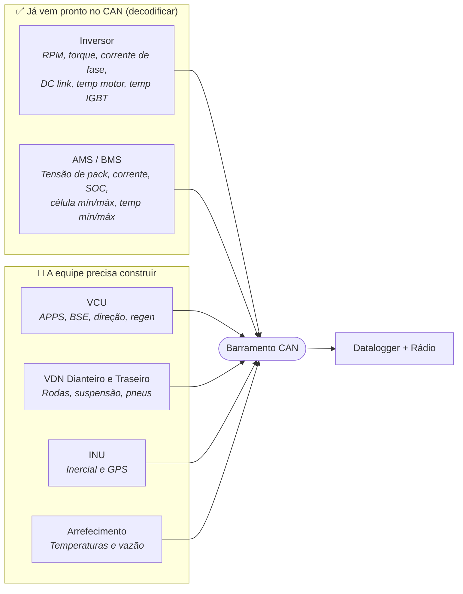
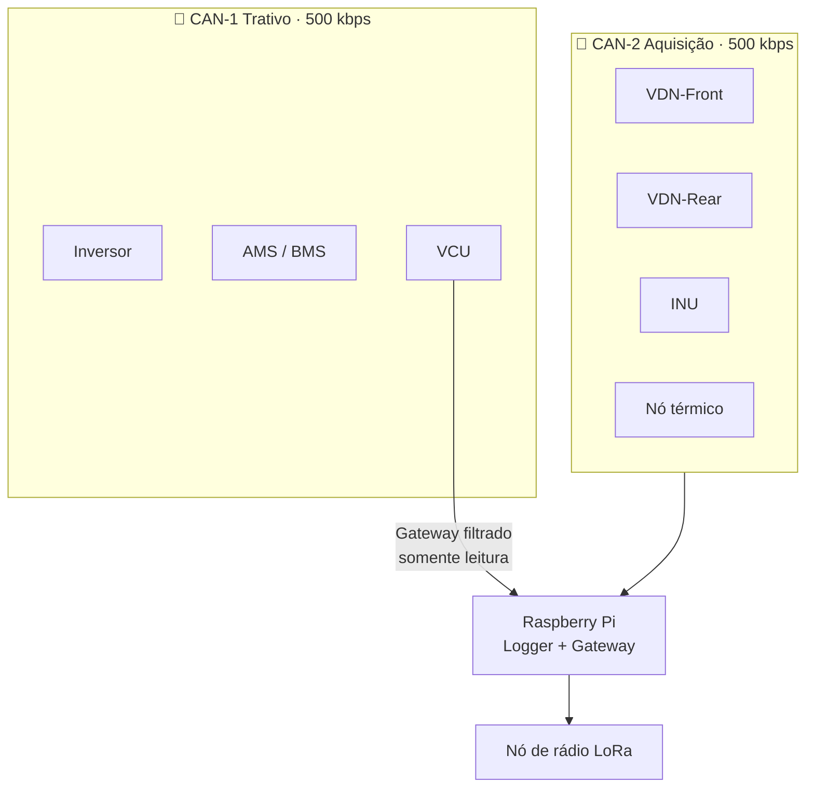
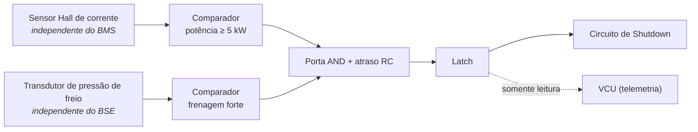

# 📐 Especificação do Sistema de Aquisição — FSAE Elétrico

> Definição do sistema de sensoriamento e telemetria para o monoposto elétrico, partindo do zero. Substitui o catálogo de canais herdado de carro a combustão.

---

## 🎯 1. Premissas desta especificação

| Premissa | Consequência de projeto |
| :--- | :--- |
| **Acumulador 24s10p** | 100,8 V carregado · 86,4 V nominal · 60,0 V descarregado. Sistema de alta tensão para efeito de regulamento. |
| **Orion BMS (original)** | CAN totalmente programável, **dois canais independentes**. Tensões de célula, temperaturas, SOC e corrente vêm prontos. Zero sensor de bateria. |
| **Inversor WEG CVW300** | CAN nativo, mas **protocolo proprietário** configurado no WLP. Não há DBC de fábrica — ver §2.1. |
| **Motor único** | Sem vetorização de torque. Uma malha de controle, não duas. |
| **Conversão futura para autônomo** | Decisões de barramento e de taxa precisam antecipar isso **agora**. |
| **Carro em fase de projeto** | Sem restrição de retrocompatibilidade. A topologia pode ser a correta, não a possível. |

### O princípio que organiza tudo

> **O sistema de aquisição escuta. Ele não arbitra.**

Telemetria nunca entra no caminho de segurança. O inversor, o AMS, o IMD e o BSPD agem sobre o circuito de shutdown por conta própria. A aquisição apenas **lê o estado** deles para registrar e transmitir. Se o datalogger travar, o carro continua seguro.

Isso não é preferência de estilo — é o que separa um sistema aprovável na inspeção elétrica de um que não passa.

---

## ♻️ 2. A divisão fundamental: decodificar vs. instrumentar

A maior mudança em relação à documentação atual é perceber que **a maior parte da telemetria de um carro elétrico já existe no barramento**.

Especificar sensor para medir algo que o inversor ou o BMS já publicam é desperdício de dinheiro, de peso e de canal de ADC. Mas os dois equipamentos escolhidos se comportam de forma bem diferente nesse ponto.

### 2.1 Orion entrega pronto; o CVW300 não

| | **Orion BMS** | **WEG CVW300** |
| :--- | :--- | :--- |
| Protocolo | CAN programável | **CAN Automotivo proprietário** (P0700) |
| Mapa de mensagens | Exporta matriz de comunicação | **Não existe de fábrica** — vocês definem no WLP |
| Esforço | Importar e decodificar | **Tarefa de engenharia com prazo** |
| Período mínimo | Configurável | **10 ms → teto de 100 Hz por mensagem** |
| Payload | Configurável | Até 4 WORDs (8 bytes) |
| Baud | 125 k a 1 M | 10 k a 1 M — **500 kbps disponível** ✅ |

> [!warning] O powertrain não é de graça
> A configuração dos telegramas do CVW300 no WLP é trabalho que ainda não está em nenhum roadmap. Antes de fechar a matriz CAN, alguém precisa levantar quais marcadores de sistema (`%SW`) expõem corrente, tensão do barramento DC, velocidade, torque e temperatura. Detalhes em [[📋 Revisao da Arquitetura Planejada (Miro)]] §4.

---

## 🗑️ 3. Canais a eliminar — o legado de combustão

Dos 77 canais do software atual, **26 não existem em um carro elétrico de Fórmula SAE.** Eles vieram de uma lista de ECU de combustão (padrão MoTeC/Pi) e não de uma análise do veículo.

### 3.1 Combustão pura — não há o que medir

`ecu_fuel_pressure` · `ecu_fuel_pump` · `ecu_fuel_temp` · `ecu_fuel_total` · `tank_fuel` · `tank_fuel_used` · `fuel_economy` · `lap_fuel_left` · `ecu_lambida_1` · `ecu_lambida_2` · `ecu_oil_pressure` · `ecu_oil_temp` · `ecu_oil_lamp` · `oil_temp` · `ecu_airbox_temp` · `ecu_syncro`

Não há combustível, óleo de cárter, escapamento nem virabrequim. Sonda lambda mede oxigênio no escape — um carro elétrico não tem escape.

### 3.2 Transmissão de múltiplas marchas — o carro é de relação única

`ecu_gear` · `ecu_gear_voltage` · `ecu_powershift_on` · `ecu_powershift_sensor`

Praticamente todo FSAE elétrico usa redutor de relação fixa. Não há marcha a engatar nem corte de torque para troca.

### 3.3 Conceitos de automobilismo profissional que não existem no FSAE

`ecu_push_to_pass_on` · `_button` · `_remain` · `_timer` · `_delay` · `_lamp` · `_block` · `ecu_pit_limit_button` · `ecu_pit_limit_on` · `beacon_code`

*Push-to-Pass* é de Stock Car e IndyCar. Limitador de pit lane pressupõe pit stop com limite de velocidade. São sete canais de P2P que ninguém jamais vai olhar.

### 3.4 Renomear, não eliminar

| Canal atual | Vira | Motivo |
| :--- | :--- | :--- |
| `ecu_rpm` | `motor_speed_rpm` | Não há ECU. O dado vem do inversor. |
| `ecu_rpm_limit` | `motor_speed_max_rpm` | Limite do motor, não corte de ignição. |
| `ecu_throttle_pedal` | `apps_position_pct` | É o APPS do regulamento, com nome de regulamento. |
| `ecu_cooler_temp` | `coolant_temp_motor_in` | Precisa dizer **onde** mede. |
| `ecu_voltage` / `box_voltage` | `lv_battery_voltage` | É a bateria de baixa tensão (GLV). |
| `voltage` / `current` | `ts_pack_voltage` / `ts_pack_current` | Deixar explícito que é alta tensão. |
| `energy used` | `energy_consumed_kwh` | Corrige o espaço no nome e a unidade. |
| `alarme_status` | `shutdown_circuit_state` | Nome que descreve o que é. |

---

## ➕ 4. O que falta — e é obrigatório

O catálogo atual não tem **nenhum** canal de segurança do sistema trativo. Para um carro elétrico, esse é o conjunto que a inspeção elétrica vai procurar primeiro.

### 4.1 Circuito de shutdown e segurança

| Canal | Origem | Por quê |
| :--- | :--- | :--- |
| `shutdown_circuit_state` | Entrada digital isolada no VCU | Estado geral do laço de segurança. |
| `imd_status` | Saída do IMD (Bender IR155/IR425 ou equivalente) | Falha de isolamento é desclassificação imediata. |
| `ams_status` | AMS/BMS via CAN + linha discreta | Falha do AMS abre os AIRs. |
| `bspd_status` | Saída do BSPD | Ver §6.3 — hardware dedicado. |
| `air_positive_state` / `air_negative_state` | Realimentação dos contatores | Confirma se os AIRs realmente abriram/fecharam. |
| `precharge_state` | Relé de pré-carga | Sequência de energização do DC link. |
| `tsal_state` | Lógica do TSAL | A luz vermelha piscando a 2–5 Hz quando há alta tensão. |
| `ready_to_drive_state` | VCU | Sequência de RTD: freio pressionado + botão. |
| `bms_fault_flags` | BMS via CAN | Bitmask de falhas do acumulador. |
| `tsms_state` | Chave mestra do sistema trativo | Estado da TSMS. |

> [!warning] Confirme os números contra o seu regulamento
> Consegui verificar as regras de **IMD** (EV 6.3.8, com Bender IR425 e Sendyne SIM101MLQ como aprovados) e **TSAL** (EV 4.10.2, vermelho piscando entre 2 e 5 Hz acima de 60 VDC) na versão 2026 da Fórmula SAE Itália.
> Já os limiares de APPS e BSPD citados aqui vêm de implementações públicas de equipes citando T11.6.x, **não do rulebook que li diretamente**. Antes de fechar o projeto, confira contra o regulamento da SAE Brasil do seu ano. Não use este documento como fonte regulamentar.

### 4.2 Entradas do piloto — o núcleo do regulamento

| Canal | Sensor | Nota de regulamento |
| :--- | :--- | :--- |
| `apps_1_raw` / `apps_2_raw` | **Dois sensores independentes**, com curvas de transferência **diferentes** | O regulamento exige redundância com características distintas, para que uma falha de modo comum seja detectável. Dois potenciômetros idênticos não atendem. |
| `apps_implausibility` | Calculado no VCU | Desvio > 10% entre APPS1 e APPS2 por mais de 100 ms corta o torque. |
| `bse_press_front` / `bse_press_rear` | Transdutores de pressão 0–100 bar | Entrada do BSE e do BSPD. |
| `bse_apps_plausibility` | Calculado no VCU | APPS acima de ~25% com freio acionado corta o torque até o APPS voltar a < 5%. |
| `brake_pedal_travel` | Potenciômetro linear no pedal | Separa modulação de pressão. |
| `steering_angle` | Encoder magnético AS5600 | Já previsto nas notas atuais. Mantém. |
| `steering_torque` | Célula de carga + INA333 | Já previsto. Mantém. |
| `regen_level` | Potenciômetro rotativo de painel | Nível de frenagem regenerativa. |
| `rtd_button` | Botão do cockpit | Sequência de Ready-to-Drive. |

### 4.3 Arrefecimento — crítico e ausente hoje

Um FSAE elétrico tem **três** circuitos térmicos que limitam desempenho em Endurance. Hoje não há nenhum canal deles.

| Canal | Sensor sugerido |
| :--- | :--- |
| `coolant_temp_motor_in` / `_out` | NTC 10 kΩ ou PT1000 |
| `coolant_temp_inverter_in` / `_out` | NTC 10 kΩ ou PT1000 |
| `coolant_flow_rate` | Sensor de vazão de efeito Hall |
| `pump_duty_pct` / `fan_duty_pct` | Realimentação de PWM do VCU |
| `accumulator_temp_max` / `_min` | **Do BMS via CAN** — não instrumentar |
| `motor_temp` / `inverter_igbt_temp` | **Do inversor via CAN** — não instrumentar |

---

## 🔌 5. Arquitetura de barramentos — dois, não um

A documentação atual coloca tudo em um único CAN a 500 kbps. Calculei a carga e ela é baixa (8,6%), então **não é problema de banda**. É problema de **isolamento de falha**.

**Por que separar:** um nó de sensor com firmware instável pode entrar em *bus-off* e inundar o barramento com error frames. Se esse nó dividir barramento com o inversor, ele atrasa o comando de torque e as mensagens do AMS. Um potenciômetro de suspensão nunca deve ser capaz de interferir na comunicação do sistema trativo.

O VCU é o único nó nos dois barramentos, e faz gateway **filtrado e unidirecional** — repassa do CAN-1 para o CAN-2 apenas o que a telemetria precisa ler. Nada volta.

---

## 🧩 6. Topologia de nós revisada

### 6.1 O problema da Heltec V3

As notas atuais especificam **Heltec WiFi LoRa 32 V3** para PCU, VDN-Front e VDN-Rear. Isso tem dois defeitos, detalhados em [[🔍 Auditoria Tecnica da Documentacao de Telemetria]]:

1. O rádio SX1262 embutido ocupa os GPIOs 8 a 14. O SPI do MCP3208 foi especificado justamente em 10–13, em cima dele.
2. A Heltec V3 é **ESP32-S3**, mas o mapa de pinos do cofre documenta o **ESP32 clássico**. As regras de ADC1/ADC2 são outras.

### 6.2 Nós propostos

| Nó | Placa | Barramento | Função |
| :--- | :--- | :---: | :--- |
| **VCU** | ESP32-S3-WROOM-1 em PCB própria | CAN-1 + CAN-2 | APPS, BSE, plausibilidades, comando de torque, RTD, gateway |
| **VDN-Front** | ESP32-S3-DevKitC-1 (**sem rádio**) | CAN-2 | Rodas FL/FR, suspensão, pneus dianteiros |
| **VDN-Rear** | idêntica ao VDN-Front | CAN-2 | Espelho traseiro |
| **INU** | LilyGO T-Beam (ESP32 clássico) | CAN-2 | IMU + GPS |
| **Térmico** | ESP32-S3 DevKit ou expansão do VCU | CAN-2 | Arrefecimento |
| **Rádio** | **Heltec V3** — aqui ela faz sentido | CAN-2 | Lê CAN, empacota, transmite LoRa |
| **Logger** | Raspberry Pi + SocketCAN | CAN-2 | Grava em disco, calcula canais derivados |

> [!tip] A Heltec não é desperdício — só está no lugar errado
> Ela foi projetada para ser um nó de rádio. Como nó de aquisição, o SX1262 embutido é um estorvo que rouba quatro pinos de SPI. Dedique **uma** Heltec ao papel de transmissor de telemetria e use placas sem rádio nos nós de sensor. O conflito de pinos desaparece por construção, e não por remapeamento.

### 6.3 O BSPD é hardware separado — não é firmware

Verifiquei isto e é categórico: o **Brake System Plausibility Device precisa ser um circuito não-programável**. Implementações públicas que citam T11.6.x usam comparadores analógicos e atraso RC, justamente porque o regulamento não aceita microcontrolador nesse papel.

Os valores típicos citados pelas implementações que consultei — potência ≥ 5 kW, frenagem forte, resposta em até 0,5 s, latch até *power cycle* — **precisam ser confirmados no seu regulamento**.

Repare na seta pontilhada: o VCU **lê** o estado do BSPD para telemetria, mas não participa da decisão. O BSPD age sozinho sobre o shutdown.

---

## ⏱️ 7. Tabela mestre de taxas — com justificativa física

Esta tabela substitui as duas versões conflitantes que existem hoje no cofre (o Dicionário de Canais diz 20/10/2 Hz; a Matriz CAN diz 100/50/10 Hz para os mesmos canais).

**Regra de arbitragem:** cada frame CAN tem **uma** taxa. Canais com taxas diferentes vão em frames diferentes. Foi esse o erro estrutural do frame `0x100` atual, que junta APPS (rápido) com pressão de freio (lento).

| Taxa | Canais | Por que essa taxa |
| :---: | :--- | :--- |
| **200 Hz** | Posição de amortecedor ×4, acelerômetro de cubo ×4 | A frequência natural da massa não suspensa em FSAE fica entre 12 e 18 Hz. Velocidade de amortecedor é a **derivada** da posição, e derivada amplifica ruído — precisa de sobreamostragem generosa. **A 10 Hz da especificação atual é impossível calcular velocidade de amortecedor.** |
| **100 Hz** | APPS1, APPS2, plausibilidades, BSE F/R, curso do pedal, ângulo e torque de direção, velocidade de roda ×4, ride height F/R, comando e realimentação de torque, acelerações e taxas angulares da IMU | A regra de implausibilidade do APPS usa janela de 100 ms; a 100 Hz há 10 amostras dentro dela. Velocidade de roda a 100 Hz é o mínimo para *slip ratio* utilizável. |
| **20 Hz** | Corrente e tensão do pack, potência instantânea, estado do inversor | Dinâmica elétrica relevante para análise de energia, sem inundar o log. |
| **10 Hz** | GPS (lat, lon, velocidade), SOC, temperatura de motor e IGBT, temperatura de pneu | O NEO-M8N só atinge 10 Hz com uma constelação. Térmicos são lentos por natureza. |
| **5 Hz** | Temperaturas de líquido de arrefecimento, vazão, PWM de bomba e ventoinha | Constante de tempo térmica de um circuito de arrefecimento é de segundos. |
| **1 Hz** | Tensão de célula mín/máx, temperatura de célula mín/máx, satélites GPS, tensão da bateria LV | Diagnóstico lento. |
| **Por evento** | Falhas do AMS, IMD, BSPD, mudança do circuito de shutdown, transições de AIR | Nunca amostrar estado de segurança por polling: transmitir na mudança, e repetir a cada 1 s como *heartbeat*. |

### Carga de barramento resultante

Recalculei com as taxas acima, usando a estimativa de pior caso de $55 + 10 \times \text{DLC}$ bits por frame padrão:

| Barramento | Ocupação | Margem |
| :--- | :---: | :--- |
| **CAN-2 (aquisição)** | ≈ 111 kbps → **22%** | Confortável mesmo com os 200 Hz dos amortecedores |
| **CAN-1 (trativo)** | ≈ 63 kbps → **13%** | Sobra folga para frames do inversor e do BMS |

Boa prática automotiva mantém ocupação abaixo de 30–40% para preservar latência de arbitragem. Os dois barramentos ficam bem dentro disso.

---

## 🔬 8. Revisão da seleção de sensores

Três escolhas das notas atuais precisam mudar. As demais estão corretas.

### 8.1 Acelerômetro de cubo — ADXL335 não serve

O ADXL335 mede **±3 g**. A matriz CAN especifica `Hub_az` em **±15 g**, e a matriz está certa: massa não suspensa passando por zebra ultrapassa 3 g com folga. O sensor satura e você registra uma linha reta no momento exato que interessa.

| Alternativa | Faixa | Interface |
| :--- | :---: | :--- |
| **ADXL377** | ±200 g | Analógico — reaproveita o MCP3208 |
| **H3LIS331DL** | ±100 / 200 / 400 g | Digital I²C/SPI |

### 8.2 Ride height a laser — o VL53L0X é o sensor errado

O VL53L0X é um ToF infravermelho de baixo custo, projetado para ambiente interno. Sob sol direto, apontando para asfalto (superfície escura e difusa, péssima refletividade no IR), a leitura degrada muito. É um sensor de robótica de mesa, não de pista.

**Sugestão: eliminar o sensor.** Ride height é calculável a partir da posição do amortecedor e da cinemática da suspensão, que vocês já vão medir a 200 Hz com potenciômetro linear:

$$h_{\text{ride}} = h_0 - \frac{x_{\text{damper}}}{MR}$$

onde $MR$ é a razão de instalação (*motion ratio*) da suspensão. Um canal a menos, um furo a menos no assoalho, e o dado fica mais confiável.

Se quiserem ride height medido de forma independente para validar o modelo aerodinâmico, aí o caminho é sensor de triangulação a laser industrial — outra faixa de preço.

### 8.3 Temperatura de pneu — um ponto não diz nada

O MLX90614 mede **um único ponto**. O que informa decisão de setup é o **gradiente através da banda de rodagem**: interno, meio e externo. É isso que revela se a cambagem está certa e se a pressão está adequada.

| Alternativa | Resolução | Comentário |
| :--- | :--- | :--- |
| **MLX90621** | 16×4 | Bom custo-benefício, I²C |
| **MLX90640** | 32×24 | Perfil térmico completo; mais dados para transportar |

Com array, transmita apenas 3 zonas por pneu no CAN (interno/meio/externo) e guarde o quadro completo no log do Raspberry Pi.

### 8.4 O que está correto e deve ser mantido

| Sensor | Aplicação | Observação |
| :--- | :--- | :--- |
| **TLE4922** | Velocidade de roda | Bom. Use roda fônica com ≥ 30 dentes para resolução em baixa velocidade, e o periférico PCNT do ESP32 como já previsto. |
| **AS5600** | Ângulo de direção | Encoder magnético sem contato. Correto. |
| **INA333 + célula de carga** | Torque de direção | Correto. |
| **BNO085** | IMU 9-DoF | Bom. Configure saída **raw** de acelerômetro e giroscópio além da fusão — para análise de dinâmica você quer o dado cru, não filtrado pelo fusion do chip. |
| **Transdutores 0–100 bar** | Pressão de freio | Correto. Use unidades **separadas** para BSE e para BSPD: o BSPD precisa ser independente. |
| **MCP3208 / ADS131M08** | ADC externo | Correto, e resolve o problema de ADC do ESP32-S3. Atenção à impedância: o divisor 33k/12k tem 8,8 kΩ de Thévenin, acima do ideal para o MCP3208 — o capacitor de 100 nF do filtro RC ajuda como reservatório de carga, mas vale medir o erro de acomodação na bancada. |
| **NEO-M8N** | GPS | Aceitável. A 10 Hz opera com uma constelação só, o que degrada a precisão. Se o orçamento permitir, NEO-M9N dá 10 Hz multiconstelação. |

---

## 📡 9. Impacto no pacote LoRa

Com o catálogo revisado, o pacote de telemetria ao vivo muda de conteúdo. Fora os canais de combustão, entram os de segurança e energia — que são o que a equipe realmente olha no box durante Endurance.

Prioridade para os 41 bytes já dimensionados (ver correção em [[🔍 Auditoria Tecnica da Documentacao de Telemetria]] — a nota atual diz 48, mas a `struct` soma 41):

1. **Segurança primeiro:** `shutdown_circuit_state`, `imd_status`, `ams_status`, `bspd_status` cabem em 1 byte de bitmask.
2. **Energia:** SOC, tensão e corrente do pack, energia consumida na volta. É o que decide estratégia de Endurance.
3. **Térmico:** temperatura máxima de célula, de motor e de IGBT. São os três limitadores de desempenho.
4. **Dinâmica resumida:** velocidade, APPS, freio, ângulo de direção, G lateral e longitudinal.

O resto fica no log do Raspberry Pi e se analisa depois da sessão.

---

## ❓ 10. Decisões que faltam

### Respondidas

| Pergunta | Resposta | Onde entrou |
| :--- | :--- | :--- |
| Inversor e BMS | Orion BMS original + WEG CVW300 | §1 e §2.1 |
| Configuração do acumulador | 24s10p | §1 |
| Um ou dois motores | **Um** — sem vetorização de torque | §1 |
| Horizonte do projeto | Conversão futura para autônomo | §1 e [[📋 Revisao da Arquitetura Planejada (Miro)]] §7 |
| Regulamento | Sem prioridade no momento | Números de regra seguem marcados como "a confirmar" |

### Em aberto

1. **Razão de instalação da suspensão (*motion ratio*)?** Necessária para a fórmula de ride height da §8.2, que substitui o sensor laser. Sem esse número a proposta fica no conceito.
2. **Quais marcadores `%SW` do CVW300 expõem as grandezas de powertrain?** Depende de abrir o WLP. É o que trava a matriz CAN do sistema trativo.
3. **Qual célula exatamente no 24s10p?** Define a capacidade em kWh, os limites de corrente e a faixa real de tensão do pack.

---

## 🔗 Documentos relacionados

* [[📋 Revisao da Arquitetura Planejada (Miro)]] — achados contra os diagramas e a lista de canais reais
* [[🔍 Auditoria Tecnica da Documentacao de Telemetria]] — os defeitos que motivaram esta revisão
* [[📡 Hardware de Telemetria Embarcada - Visao Geral]]
* [[📊 Matriz de Mensagens CAN e Dicionario de IDs (DBC Veicular)]] — precisa ser reescrita conforme a §7
* [[📌 Mapa Definitivo de Pinos do ESP32 (Pinout, Strapping Pins, ADC1 vs ADC2 e Regras de Ouro)]] — precisa ser dividida em ESP32 clássico e ESP32-S3

## 📚 Fontes verificadas

* [Formula SAE Italy 2026 — Regras EV (IMD em EV 6.3.8, TSAL em EV 4.10.2)](https://www.formula-ata.it/wp-content/uploads/2025/12/FSAE-Italy-2026-Information_Rules.pdf)
* [BSPD não-programável citando T11.6.x — implementação pública de referência](https://github.com/motawe3theking/Brake-System-Plausibility-Device-BSPD)
* [Espressif — ADC do ESP32-S3: ADC1 = GPIO 1–10, ADC2 = GPIO 11–20](https://docs.espressif.com/projects/esp-idf/en/v4.4/esp32s3/api-reference/peripherals/adc.html)
* [Heltec WiFi LoRa 32 V3 — GPIO 36 é controle de Vext](https://devices.esphome.io/devices/heltec-wifi-lora-32-v3/)
* [Pinagem do SX1262 na Heltec V3 — NSS 8, SCK 9, MOSI 10, MISO 11, RST 12, BUSY 13, DIO1 14](https://github.com/JJJS777/Hello_World_RadioLib_Heltec-V3_SX1262)
