# 📖 Manual Mestre de Telemetria Veicular — Do Sensor Físico ao Carro Autônomo
### *Tratado Abrangente de Engenharia Eletrônica, Arquitetura de Software e Dinâmica Veicular para Monopostos de Competição*

**Autor:** Lucas Fernandes Christen  
**Afiliação:** UTForce E-Racing — Universidade Tecnológica Federal do Paraná (UTFPR)  
**Classificação:** Manual Técnico & Memorial Descritivo de Engenharia de Competição (Fórmula SAE & Driverless)

---

> [!warning] Estado deste manual — revisado em 2026-09-14
> Este manual foi escrito **antes** do [[🧭 Plano do Sistema de Telemetria (FSAE Eletrico)]] e da [[📋 Revisao da Arquitetura Planejada (Miro)]]. A **teoria** (concorrência, dinâmica veicular, EMC, FMEA, HIL, interpretação de dados) continua válida. A **arquitetura concreta** mudou, e onde este texto e o Plano divergirem, **o Plano vence**. O que mudou:
>
> | Neste manual (antigo) | Arquitetura vigente |
> | :--- | :--- |
> | Um barramento CAN | **Dois**: CAN-1 Trativo (CVW300, Orion, VCU) e CAN-2 Aquisição (VDNs, INU, Térmico, loggers, LoRa) |
> | Nó "PCU" | **VCU**, único nó que age; é o **gateway** CAN-1 → CAN-2 |
> | ESP32 clássico, sensores no ADC interno (GPIO 32–39) | **ESP32-S3** nos nós; **ADCs externos** (MCP3208, ADS131M08, ADS1115); ADC interno só em bancada |
> | Divisor 1,8 k / 3,3 k "padrão" | Divisor **por ADC**: 33 k/12 k (ADS131M08, ±1,2 V), 12 k/24 k (MCP3208), nenhum (ADS1115 em 5 V) |
> | MLX90614 ×3 por pneu + TCA9548A | **MLX90621** (16×4), um por pneu, em **dois barramentos I²C** |
> | Pacote LoRa de 48 bytes | **41 bytes** a 10 Hz |
> | Raspberry Pi como gateway/blackbox único | Pi **só escuta** os dois barramentos (Logger A) + **Logger B** (ESP32 + microSD) + log local no VCU + **UPS supercap** |
> | Matriz CAN de §5.2 | Substituída por [[📊 Matriz de Mensagens CAN e Dicionario de IDs (DBC Veicular)]] — um frame, uma taxa |
> | Suspensão a 100 Hz, rodas a 100 Hz | Amortecedor e cubo a **200 Hz**; rodas 100 Hz; pneu 10 Hz |
> | Ride height por sensor | **Derivado** do amortecedor; sem laser |
> | Tubo de Pitot, AeroBalance embarcado | Fora do sistema embarcado |
> | Sem BSPD, IMD, AMS na telemetria | Estados do circuito de shutdown lidos pelo VCU (`0x010`); **BSPD é hardware com sensores próprios** |
> | §7 Driverless | **Fora do escopo atual** — revisar depois da Fase 6 |
>
> As notas do módulo 06 foram todas atualizadas em 2026-09-14 e são a referência de detalhe; este manual é a visão integrada e didática. Os arquivos `.html` e `.pdf` deste manual na pasta são **exportações anteriores a esta revisão** — não usar.

## 📑 Sumário Geral

* [1. Introdução, Contextualização e Metodologia de Pesquisa ("Grill-Me")](#1-introdução-contextualização-e-metodologia-de-pesquisa-grill-me)
  * [1.1. O Desafio da Telemetria no Automobilismo de Alto Rendimento](#11-o-desafio-da-telemetria-no-automobilismo-de-alto-rendimento)
  * [1.2. O Método de Alinhamento Técnico e Investigação "Grill-Me"](#12-o-método-de-alinhamento-técnico-e-investigação-grill-me)
  * [1.3. Requisitos Normativos do Regulamento Fórmula SAE](#13-requisitos-normativos-do-regulamento-fórmula-sae)
* [2. Teoria da Concorrência e Arquitetura de Software para Sistemas de Tempo Real](#2-teoria-da-concorrência-e-arquitetura-de-software-para-sistemas-de-tempo-real)
  * [2.1. O Paradigma Produtor-Consumidor e Concorrência Desacoplada no Qt 6](#21-o-paradigma-produtor-consumidor-e-concorrência-desacoplada-no-qt-6)
  * [2.2. Determinismo Temporal e Core Pinning com FreeRTOS no ESP32](#22-determinismo-temporal-e-core-pinning-com-freertos-no-esp32)
* [3. Dinâmica Veicular e Catálogo Físico-Matemático de Sensores](#3-dinâmica-veicular-e-catálogo-físico-matemático-de-sensores)
  * [3.1. Modelagem Matemática da Dinâmica do Monoposto e Telemetria Veicular](#31-modelagem-matemática-da-dinâmica-do-monoposto-e-telemetria-veicular)
  * [3.2. Catálogo Detalhado de Transdutores e Sensores Físicos](#32-catálogo-detalhado-de-transdutores-e-sensores-físicos)
* [4. Eletrônica Embarcada, Nível Físico e Condicionamento de Sinais](#4-eletrônica-embarcada-nível-físico-e-condicionamento-de-sinais)
  * [4.1. O System-on-Chip ESP32 e o "Semáforo dos Pinos"](#41-o-system-on-chip-esp32-e-o-semáforo-dos-pinos)
  * [4.2. A Armadilha do ADC2 vs Wi-Fi e Regras de Conversão Analógica](#42-a-armadilha-do-adc2-vs-wi-fi-e-regras-de-conversão-analógica)
  * [4.3. Topologia de Condicionamento, Filtros Passa-Baixa e Imunidade EMI](#43-topologia-de-condicionamento-filtros-passa-baixa-e-imunidade-emi)
* [5. Redes Veiculares Diferenciais (CAN 2.0B) e Telemetria RF (LoRa)](#5-redes-veiculares-diferenciais-can-20b-e-telemetria-rf-lora)
  * [5.1. Teoria Eletromagnética das Linhas de Transmissão e Casamento de Impedância](#51-teoria-eletromagnética-das-linhas-de-transmissão-e-casamento-de-impedância)
  * [5.2. Protocolo CAN 2.0B, Transceptores SN65HVD230 e Matriz DBC](#52-protocolo-can-20b-transceptores-sn65hvd230-e-matriz-dbc)
  * [5.3. Telemetria Sem Fio de Longo Alcance: LoRa SX1262 e Bit-Packing](#53-telemetria-sem-fio-de-longo-alcance-lora-sx1262-e-bit-packing)
* [6. Computação de Borda (Raspberry Pi Blackbox) e Interface Desktop (PySide6)](#6-computação-de-borda-raspberry-pi-blackbox-e-interface-desktop-pyside6)
  * [6.1. O Computador de Bordo Blackbox e Proteção por OverlayFS Read-Only](#61-o-computador-de-bordo-blackbox-e-proteção-por-overlayfs-read-only)
  * [6.2. Registro Binário Industrial (.BLF/.CSV) e Cálculos Físicos em Borda](#62-registro-binário-industrial-blfcsv-e-cálculos-físicos-em-borda)
  * [6.3. Software de Análise PySide6 e Comparador de Voltas com Delta t](#63-software-de-análise-pyside6-e-comparador-de-voltas-com-delta-t)
* [7. A Rota de Migração para a Plataforma Fórmula Driverless (ROS 2)](#7-a-rota-de-migração-para-a-plataforma-fórmula-driverless-ros-2)
  * [7.1. Da Telemetria Humana à Condução Autônoma](#71-da-telemetria-humana-à-condução-autônoma)
  * [7.2. Ponte CAN para ROS 2 e Fusão Sensorial com Extended Kalman Filter (EKF)](#72-ponte-can-para-ros-2-e-fusão-sensorial-com-extended-kalman-filter-ekf)
  * [7.3. Sinergia com o Ecossistema JetBot ROS 2](#73-sinergia-com-o-ecossistema-jetbot-ros-2)
* [8. Procedimento Operacional Padrão de Pista (SOP & Pitlane Run Sheet)](#8-procedimento-operacional-padrão-de-pista-sop-pitlane-run-sheet)
  * [8.1. Fase 1: Protocolo Pré-Stint (Carro nos Cavaletes)](#81-fase-1-protocolo-pré-stint-carro-nos-cavaletes)
  * [8.2. Fase 2: Protocolo Durante o Stint (Monitoramento Dinâmico em Pista)](#82-fase-2-protocolo-durante-o-stint-monitoramento-dinâmico-em-pista)
  * [8.3. Fase 3: Protocolo Pós-Stint (Retorno aos Boxes e Descarga de Dados)](#83-fase-3-protocolo-pós-stint-retorno-aos-boxes-e-descarga-de-dados)
* [9. Matriz de Diagnóstico Rápido e Resolução de Falhas (Troubleshooting)](#9-matriz-de-diagnóstico-rápido-e-resolução-de-falhas-troubleshooting)
  * [9.1. Guia de Resolução em 2 Minutos para Falhas Críticas de Pista](#91-guia-de-resolução-em-2-minutos-para-falhas-críticas-de-pista)
  * [9.2. Rotina de Firmware em C++ para Recuperação de Barramento I2C Preso](#92-rotina-de-firmware-em-c-para-recuperação-de-barramento-i2c-preso)
* [10. Estudo de Caso Integrador: "A Vida de 1 Bit de Telemetria"](#10-estudo-de-caso-integrador-a-vida-de-1-bit-de-telemetria)
* [11. Análise de Modos de Falha e Efeitos (FMEA Automotivo Formal — SAE J1739)](#11-análise-de-modos-de-falha-e-efeitos-fmea-automotivo-formal-sae-j1739)
  * [11.1. Fundamentação e Critérios Normativos da SAE J1739](#111-fundamentação-e-critérios-normativos-da-sae-j1739)
  * [11.2. Matriz Mestre de FMEA da Telemetria Veicular](#112-matriz-mestre-de-fmea-da-telemetria-veicular)
  * [11.3. Análise do RPN Inicial vs. RPN Residual Pós-Mitigação](#113-análise-do-rpn-inicial-vs-rpn-residual-pós-mitigação)
* [12. Diretrizes Avançadas de Layout de PCB, EMC/EMI e Aterramento em Veículos Elétricos](#12-diretrizes-avançadas-de-layout-de-pcb-emcemi-e-aterramento-em-veículos-elétricos)
  * [12.1. O Ambiente Eletromagnético Hostil de um Monoposto FSAE EV](#121-o-ambiente-eletromagnético-hostil-de-um-monoposto-fsae-ev)
  * [12.2. Arquitetura de Aterramento em Estrela e Segregação de Planos (AGND, DGND, PGND)](#122-arquitetura-de-aterramento-em-estrela-e-segregação-de-planos-agnd-dgnd-pgnd)
  * [12.3. Topologia de Proteção em Conectores: Diodos TVS, Fusíveis PTC e Filtros Passa-Baixa](#123-topologia-de-proteção-em-conectores-diodos-tvs-fusíveis-ptc-e-filtros-passa-baixa)
  * [12.4. Roteamento de Pares Diferenciais CAN 2.0B e Terminação Split com Modo Comum](#124-roteamento-de-pares-diferenciais-can-20b-e-terminação-split-com-modo-comum)
  * [12.5. Stackup de 4 Camadas e Blindagem Eletromagnética de Chicotes (Gaiola de Faraday)](#125-stackup-de-4-camadas-e-blindagem-eletromagnética-de-chicotes-gaiola-de-faraday)
* [13. Metodologia de Validação HIL (Hardware-in-the-Loop) e Bancada Virtual](#13-metodologia-de-validação-hil-hardware-in-the-loop-e-bancada-virtual)
  * [13.1. Conceito e Topologia da Bancada HIL para Telemetria FSAE](#131-conceito-e-topologia-da-bancada-hil-para-telemetria-fsae)
  * [13.2. Emulação Sintética de Transdutores (Roda Fônica, Suspensão e Freio)](#132-emulação-sintética-de-transdutores-roda-fônica-suspensão-e-freio)
  * [13.3. Testes Automatizados de Injeção de Falhas (Fault Injection) e Recuperação de Bus-Off](#133-testes-automatizados-de-injeção-de-falhas-fault-injection-e-recuperação-de-bus-off)
  * [13.4. Script Industrial de Automação de Bancada HIL em Python (python-can e pytest)](#134-script-industrial-de-automação-de-bancada-hil-em-python-python-can-e-pytest)
* [14. Guia do Engenheiro de Dados em Pista (Trackside Data Interpretation & Setup Tuning)](#14-guia-do-engenheiro-de-dados-em-pista-trackside-data-interpretation-setup-tuning)
  * [14.1. Diagnóstico Térmico da Banda de Rodagem dos Pneus (Pressão e Cambagem Dinâmica)](#141-diagnóstico-térmico-da-banda-de-rodagem-dos-pneus-pressão-e-cambagem-dinâmica)
  * [14.2. Análise de Balanço de Chassi: Gradiente de Subesterço (K_us) vs. Aceleração Lateral](#142-análise-de-balanço-de-chassi-gradiente-de-subesterço-kus-vs-aceleração-lateral)
  * [14.3. Análise Espectral e Histogramas de Velocidade de Amortecedor (Shock Histograms)](#143-análise-espectral-e-histogramas-de-velocidade-de-amortecedor-shock-histograms)
  * [14.4. Telemetria de Pilotagem: Ataque de Freio, Trail Braking e Detecção Precoce de Travamento](#144-telemetria-de-pilotagem-ataque-de-freio-trail-braking-e-detecção-precoce-de-travamento)
* [15. Conclusão e Referências Bibliográficas](#15-conclusão-e-referências-bibliográficas)

---

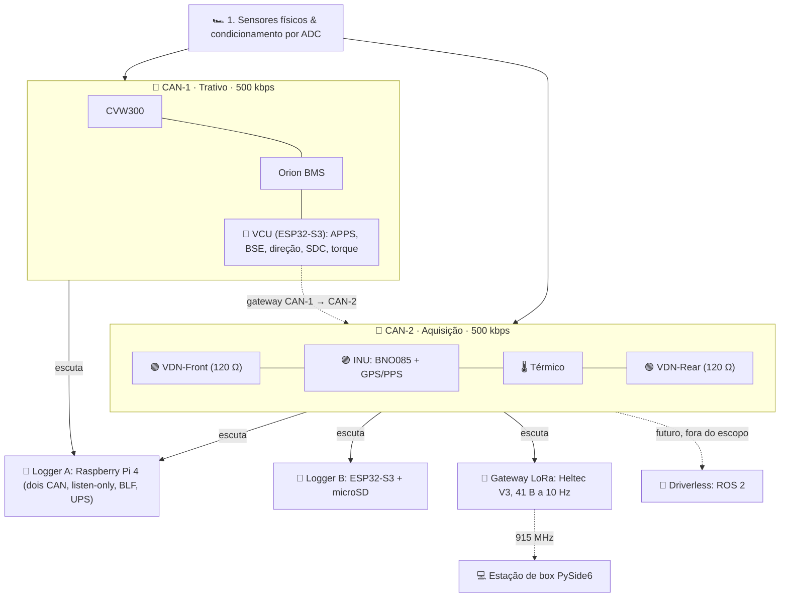

---

## 1. Introdução, Contextualização e Metodologia de Pesquisa ("Grill-Me")

### 1.1. O Desafio da Telemetria no Automobilismo de Alto Rendimento
No automobilismo de competição, a diferença entre a vitória e a quebra mecânica reside na capacidade da equipe de engenharia de **converter grandezas termodinâmicas e cinemáticas em conhecimento acionável em frações de segundo**. Em um protótipo elétrico da Fórmula SAE, o ambiente operacional é extremamente hostil:
* **Interferência Eletromagnética Severa (EMI)**: O inversor de frequência trifásico chaveia tensões de até $300\,\text{V}$ sob correntes que ultrapassam $150\,\text{A}$, com frequências de modulação por largura de pulso (PWM) entre $10\,\text{kHz}$ e $20\,\text{kHz}$. Esse chaveamento abrupto de potência gera transientes de alta frequência ($di/dt$ e $dv/dt$) capazes de induzir ruído e corromper barramentos digitais não protegidos.
* **Vibração Mecânica Contínua**: O monocoque de fibra de carbono e as estruturas tubulares de aço cromo-molibdênio transmitem vibrações harmônicas de alta amplitude originadas da pista e da aspereza do asfalto, exigindo conectores com travamento mecânico positivo e cabos com alívio de tensão.
* **Restrição Rigorosa de Massa e Potência**: Cada grama adicional de chicote elétrico degrada a relação potência-peso do veículo. Assim, uma arquitetura centralizada clássica — na qual dezenas de cabos analógicos longos percorrem o carro inteiro até uma única central — é inviável, impondo a necessidade de uma **arquitetura distribuída com nós inteligentes baseados em barramento digital**.

---

### 1.2. O Método de Alinhamento Técnico e Investigação "Grill-Me"
Para mitigar falhas catastróficas em testes de pista, a equipe da UTForce adota a metodologia de questionamento e validação socrática denominada internamente de **"Grill-Me"**.

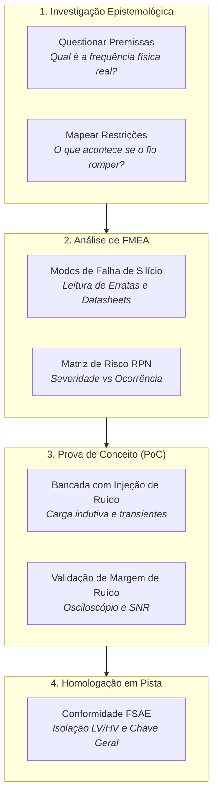

A metodologia estabelece que nenhum componente de hardware é comprado e nenhuma linha de código é integrada ao repositório principal sem responder formalmente a quatro perguntas:
1. **Qual é a física real do fenômeno?** (Exemplo: amortecedores de Fórmula SAE raramente apresentam velocidades de deslocamento superiores a $1.5\,\text{m/s}$ ou componentes espectrais acima de $40\,\text{Hz}$. Amostrar esse sinal a $5.000\,\text{Hz}$ geraria apenas sobrecarga computacional desnecessária e ruído térmico acumulado).
2. **Qual é o estado seguro (*fail-safe*) de silício?** (Exemplo: se o cabo do pedal de aceleração for desconectado, o circuito deve forçar o sinal para nível zero por meio de um resistor de pull-down físico, impedindo que o pino do microcontrolador flutue e envie comando de torque espúrio ao inversor).
3. **Quais são as erratas do fabricante?** (Exemplo: investigação do documento *ESP32 Series SoC Errata*, que documenta formalmente que o conversor analógico-digital ADC2 é compartilhado com o modem de rádio Wi-Fi, tornando-o inoperante quando a pilha de rede sem fio é inicializada).
4. **O sistema sobrevive ao corte abrupto da alimentação?** (Exemplo: se a chave geral mecânica for desarmada a $100\,\text{km/h}$, os arquivos de log do sistema operacional de borda sofrerão corrupção de partição? O uso de OverlayFS em modo Read-Only responde afirmativamente a essa restrição).

---

### 1.3. Requisitos Normativos do Regulamento Fórmula SAE
O desenvolvimento de sistemas eletrônicos para a Fórmula SAE é estritamente regulamentado pelas normas internacionais da SAE International e da Fórmula SAE Brasil:
* **Regulamento EV (Veículos Elétricos)**:
  * **Isolamento Galvânico Estrito**: Todos os sistemas de Baixa Tensão (**LV - Low Voltage**, tipicamente $12\,\text{V}$) devem ser galvanicamente isolados do sistema de Alta Tensão (**HV - High Voltage**, até $300\,\text{V}$), mantendo resistência de isolamento superior a $500\,\Omega/\text{V}$.
  * **Plausibilidade do Sensor de Posição do Acelerador (APS)**: O pedal deve possuir pelo menos dois sensores independentes (dupla redundância com curvas de transferência diferentes ou inversas). Se a discrepância entre os dois sinais exceder $10\%$ do curso por mais de $100\,\text{ms}$, o controle do motor deve ser cortado imediatamente.
  * **Sinal de Freio e Interruptor de Pressão (Brake Plausibility)**: Caso o acelerador seja acionado simultaneamente com o pedal de freio gerando pressão hidráulica significativa (APPS > 25 %), a potência fornecida ao inversor deve ser anulada até o APPS voltar abaixo de 5 %.
  * **BSPD (*Brake System Plausibility Device*)**: circuito **não-programável** (sem microcontrolador) que abre o circuito de shutdown em frenagem forte simultânea a potência alta. Tem **sensores próprios** (Hall de corrente e pressostato) — não compartilha com o VCU. A telemetria só lê a saída dele.
  * **IMD, AMS, AIRs, pré-carga, TSAL**: estados do circuito de shutdown lidos pelo VCU por optoacoplador e publicados em `0x010` (evento + 1 Hz). A telemetria **observa** a cadeia de segurança; nunca está nela ([[🧭 Plano do Sistema de Telemetria (FSAE Eletrico)]] §2.1, §3.3).
* **Regulamento DV (Driverless - Carro Autônomo)**:
  * **Sistema de Freio de Emergência (EBS - Emergency Brake System)**: O sistema de frenagem autônoma deve ser passivamente acionado caso ocorra perda de comunicação CAN, ausência do sinal periódico de *heartbeat* por mais de $100\,\text{ms}$, ou desligamento manual via controle remoto de emergência (*Autonomous Emergency Stop - ASS*).

---

## 2. Teoria da Concorrência e Arquitetura de Software para Sistemas de Tempo Real

### 2.1. O Paradigma Produtor-Consumidor e Concorrência Desacoplada no Qt 6
Em aplicações desktop de monitoramento de engenharia, como o software de box em **PySide6 (Python + Qt 6)**, um dos maiores desafios de arquitetura é processar fluxos massivos de dados de alta frequência ($70+$ canais a $100\,\text{Hz}$) enquanto a interface gráfica permanece perfeitamente responsiva a $60\,\text{FPS}$.

No ecossistema Qt, a **Thread Principal (GUI Thread)** gerencia a fila de eventos do sistema operacional (`QEventLoop`), o despacho de eventos de ponteiro/teclado e o pipeline de desenho gráfico. Se uma tarefa demorada — como decodificar pacotes seriais, calcular interpolações de voltas ou gravar dados em disco — for executada diretamente na GUI Thread, o loop de eventos é bloqueado, resultando no congelamento visual da interface (*UI Freezing*).

Para mitigar esse problema, o software da UTForce adota o padrão **Produtor-Consumidor Concorrente com `QObject` desacoplado e `moveToThread`**:

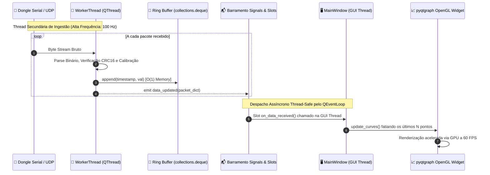

#### Código Arquitetural de Referência (PySide6 / Ingestão Desacoplada):

```python
from PySide6.QtCore import QObject, QThread, Signal, Slot, QTimer
import collections
import struct
import time

class TelemetryDataWorker(QObject):
    """
    Worker executado em uma QThread independente.
    Responsável pela leitura de I/O, decodificação binária e alimentação de buffers.
    """
    data_packet_received = Signal(dict)
    status_alert = Signal(str, str)

    def __init__(self, serial_port_interface):
        super().__init__()
        self.interface = serial_port_interface
        self._running = True
        # Buffers circulares com limite estático de memória (evita chamadas ao GC)
        self.history = collections.defaultdict(lambda: collections.deque(maxlen=10000))

    @Slot()
    def start_acquisition_loop(self):
        """Loop determinístico na thread de background."""
        while self._running:
            raw_frame = self.interface.read_frame()
            if raw_frame:
                parsed_data = self._decode_binary_payload(raw_frame)
                if parsed_data:
                    ts = time.time()
                    for ch, val in parsed_data.items():
                        self.history[ch].append((ts, val))
                    # Notifica a interface sem bloquear a thread de aquisição
                    self.data_packet_received.emit(parsed_data)
            else:
                # Cede tempo de CPU cooperativamente
                QThread.msleep(1)

    def _decode_binary_payload(self, frame: bytes) -> dict:
        # Exemplo: desempacotamento de estrutura binária C de 16 bytes
        if len(frame) < 16:
            return None
        # Layout: uint32 timestamp, int16 susp_fl, int16 susp_fr, uint16 speed_fl, uint16 speed_fr
        ts_raw, s_fl, s_fr, v_fl, v_fr = struct.unpack("<Ihhhh", frame[:16])
        return {
            "timestamp_ms": ts_raw,
            "suspension_fl_mm": s_fl * 0.01,
            "suspension_fr_mm": s_fr * 0.01,
            "speed_fl_kmh": v_fl * 0.1,
            "speed_fr_kmh": v_fr * 0.1
        }

    @Slot()
    def stop(self):
        self._running = False
```

---

### 2.2. Determinismo Temporal e Core Pinning com FreeRTOS no ESP32
No nível dos nós microcontrolados da rede veicular (baseados em ESP32 dual-core Xtensa LX6/LX7), o paradigma sequencial clássico da IDE Arduino (`void loop()`) é inteiramente substituído pelo **escalonador preemptivo baseado em prioridades do FreeRTOS**.

O ESP32 possui dois processadores independentes de 32 bits:
* **Core 0 (PRO_CPU - Protocol CPU)**: Destinado exclusivamente ao processamento dos protocolos de barramento veicular (TWAI/CAN 2.0B a $500\,\text{kbps}$), comunicação de rádio de longo alcance (LoRa SX1262) e tarefas de watchdog de sistema.
* **Core 1 (APP_CPU - Application CPU)**: Destinado à instrumentação analógica, contadores por hardware (PCNT), cálculo de filtros digitais e execução de malhas de controle local.

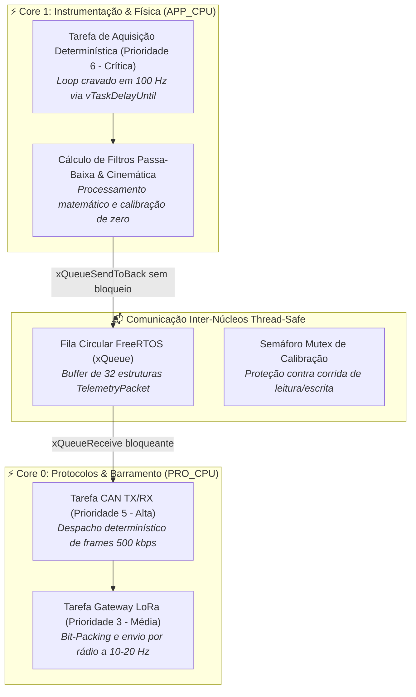

#### Código em C++ para PlatformIO (Firmware de Nó Veicular):

```cpp
#include <Arduino.h>
#include "freertos/FreeRTOS.h"
#include "freertos/task.h"
#include "freertos/queue.h"
#include "driver/twai.h"

// Estrutura atômica de dados veiculares
typedef struct {
    uint32_t timestamp_us;
    int16_t  suspension_displacement_raw;
    uint16_t wheel_speed_pulses;
    float    calibrated_angle_rad;
} __attribute__((packed)) SensorPayload_t;

static QueueHandle_t xTelemetryQueue = NULL;

// ============================================================================
// TAREFA DE AQUISIÇÃO NO CORE 1 (TEMPO REAL DETERMINÍSTICO A 100 HZ)
// ============================================================================
void TaskAcquisitionCore1(void *pvParameters) {
    TickType_t xLastWakeTime = xTaskGetTickCount();
    const TickType_t xFrequency = pdMS_TO_TICKS(10); // 100 Hz exatos (período de 10 ms)

    SensorPayload_t payload;

    for (;;) {
        payload.timestamp_us = micros();
        // No carro: readMCP3208(0) via SPI2 (o ADC interno não é usado para sensores)
        payload.suspension_displacement_raw = (int16_t)readMCP3208(0);
        payload.wheel_speed_pulses = 120; // Lido via módulo PCNT
        payload.calibrated_angle_rad = 0.052f;

        // Envio para a fila sem bloquear a aquisição se a fila estiver temporariamente cheia
        xQueueSend(xTelemetryQueue, &payload, (TickType_t)0);

        // O escalonador suspende a tarefa até o tick exato do próximo ciclo
        vTaskDelayUntil(&xLastWakeTime, xFrequency);
    }
}

// ============================================================================
// TAREFA DE GERENCIAMENTO DE REDE CAN NO CORE 0 (PRO_CPU)
// ============================================================================
void TaskCanCommunicationCore0(void *pvParameters) {
    SensorPayload_t rxData;
    twai_message_t can_frame;
    can_frame.identifier = 0x200; // VDNF_Damper — 200 Hz, CAN-2 (Matriz CAN vigente)
    can_frame.extd = 0;          // Frame padrão de 11 bits
    can_frame.data_length_code = 8;

    for (;;) {
        // Aguarda a chegada de dados na fila de forma bloqueante (zero uso de CPU em espera)
        if (xQueueReceive(xTelemetryQueue, &rxData, portMAX_DELAY) == pdTRUE) {
            // Empacota na mensagem CAN
            memcpy(&can_frame.data[0], &rxData.suspension_displacement_raw, 2);
            memcpy(&can_frame.data[2], &rxData.wheel_speed_pulses, 2);
            memcpy(&can_frame.data[4], &rxData.calibrated_angle_rad, 4);

            // Dispara no barramento veicular com timeout de transmissão de 2 ms
            twai_transmit(&can_frame, pdMS_TO_TICKS(2));
        }
    }
}

void setup() {
    Serial.begin(115200);

    // Criação da fila thread-safe na memória SRAM interna
    xTelemetryQueue = xQueueCreate(32, sizeof(SensorPayload_t));

    // Inicialização e fixação das tarefas nos seus respectivos núcleos
    xTaskCreatePinnedToCore(
        TaskAcquisitionCore1, "AcquisitionTask", 4096, NULL, 6, NULL, 1
    );

    xTaskCreatePinnedToCore(
        TaskCanCommunicationCore0, "CanCommTask", 4096, NULL, 5, NULL, 0
    );
}

void loop() {
    // Loop vazio; todo o controle é gerenciado pelas tarefas do FreeRTOS
    vTaskDelete(NULL);
}
```

---

## 3. Dinâmica Veicular e Catálogo Físico-Matemático de Sensores

### 3.1. Modelagem Matemática da Dinâmica do Monoposto e Telemetria Veicular

Para converter grandezas elétricas e dados digitais brutos em inteligência analítica de engenharia de pista, a telemetria da UTForce implementa um compêndio matemático abrangente, dividido em 8 domínios da física veicular:

---

#### 3.1.1. Cinemática Linear, Angular e Acelerações Inerciais ($G$)
As acelerações medidas pela Unidade Inercial (IMU BNO085) nos eixos do veículo ($X$: longitudinal, $Y$: lateral, $Z$: vertical) são convertidas em múltiplos da gravidade terrestre padrão ($g \approx 9.80665\,\text{m/s}^2$):
$$G_{long} = \frac{a_x}{g}, \quad G_{lat} = \frac{a_y}{g}, \quad G_{vert} = \frac{a_z}{g}$$
A aceleração combinada no plano da pista ($G_{total}$) define a intensidade instantânea da manobra:
$$G_{total} = \sqrt{G_{long}^2 + G_{lat}^2}$$

A velocidade linear instantânea em cada uma das quatro rodas ($v_{FL}, v_{FR}, v_{RL}, v_{RR}$) é calculada a partir da contagem de pulsos por segundo ($f_{pulse}$) lida pelo módulo de hardware PCNT do ESP32 através do sensor Hall TLE4922 em frente à roda fônica de $N_{teeth} = 36$ dentes:
$$\omega_i = \frac{2\pi \cdot f_{pulse,i}}{N_{teeth}} \quad [\text{rad/s}]$$
$$v_i = \omega_i \cdot R_{ef} \quad [\text{m/s}] \implies V_i = v_i \times 3.6 \quad [\text{km/h}]$$
onde $R_{ef}$ é o raio dinâmico efetivo de rolagem do pneu (para pneus aro 10" Hoosier ou Continental de FSAE, $R_{ef} \approx 0.228\,\text{m}$, corrigido pela deflexão vertical sob carga).

A velocidade média de translação estimada do veículo ($V_{x,est}$) baseada no eixo não tracionado (rodas dianteiras livres) é:
$$V_{x,est} = \frac{v_{FL} + v_{FR}}{2}$$

---

#### 3.1.2. Aerodinâmica Veicular e Forças de Downforce / Arrasto
Com base no modelo aerodinâmico validado em túnel de vento computacional (CFD) e nos dados de pressão dinâmica do tubo de Pitot diferencial, a telemetria calcula em tempo real as forças sustentação negativa (*Downforce*) e arrasto (*Drag*):

1. **Pressão Dinâmica do Ar ($q_\infty$)**:
   A partir da densidade do ar ambiente ($\rho \approx 1.184\,\text{kg/m}^3$ a $25^\circ\text{C}$ e $900\,\text{m}$ de altitude) e da velocidade aerodinâmica relativa ($v_{air}$):
   $$q_\infty = \frac{1}{2} \rho v_{air}^2 \quad [\text{Pa}]$$

2. **Força Aerodinâmica Total e por Eixo ($F_{aero}$)**:
   $$F_{aero,front} = \frac{1}{2} \rho v^2 \cdot (C_l A)_{front} \quad [\text{N}]$$
   $$F_{aero,rear} = \frac{1}{2} \rho v^2 \cdot (C_l A)_{rear} \quad [\text{N}]$$
   $$F_{aero,tot} = F_{aero,front} + F_{aero,rear} = \frac{1}{2} \rho v^2 \cdot (C_l A)_{tot} \quad [\text{N}]$$
   onde $(C_l A)$ é o produto do coeficiente de sustentação pela área frontal projetada.

3. **Balanço Aerodinâmico Instantâneo (*AeroBalance*)**:
   $$\text{AeroBalance} = \frac{F_{aero,front}}{F_{aero,tot}} \times 100\% \quad [\%]$$

4. **Forças Aerodinâmicas Normalizadas a $50\,\text{km/h}$**:
   Para comparar o desempenho aerodinâmico de diferentes asas e assoalhos independentemente da velocidade instantânea do trecho, normaliza-se para a velocidade de referência $V_{ref} = 50\,\text{km/h}$ ($13.89\,\text{m/s}$):
   $$F_{aero,tot,50kph} = F_{aero,tot} \cdot \left( \frac{13.89}{v} \right)^2 \quad [\text{N}]$$
   $$\text{Aero}\%_{50kph} = \frac{F_{aero,front,50kph}}{F_{aero,tot,50kph}} \times 100\% \quad [\%]$$

5. **Distribuição Aerodinâmica nos Quatro Cantos**:
   $$F_{aero,FL} = F_{aero,FR} = \frac{F_{aero,front}}{2}, \quad F_{aero,RL} = F_{aero,RR} = \frac{F_{aero,rear}}{2}$$

6. **Arrasto Aerodinâmico Total e Componentes Parasitas**:
   * Arrasto direto de pressão e atrito de forma:
     $$F_{x,drag} = \frac{1}{2} \rho v^2 \cdot (C_d A) \quad [\text{N}]$$
   * Arrasto induzido por força lateral em curva (*Induced Drag from Lateral Force*):
     $$F_{x,drag,lat} = F_y \cdot \sin(\alpha) \quad [\text{N}]$$
   * Resistência ao rolamento dos pneus (*Rolling Resistance*):
     $$F_{x,roll} = C_{rr} \cdot F_z \quad [\text{N}]$$
     onde $C_{rr} \approx 0.015 \sim 0.025$ para pneus slick de competição e $F_z$ é a carga vertical total do carro.
   * Potência mecânica dissipada exclusivamente pelo ar:
     $$P_{drag} = F_{x,drag} \cdot v \quad [\text{W}] \implies P_{drag,hp} = \frac{P_{drag}}{745.7} \quad [\text{cv}]$$

---

#### 3.1.3. Dinâmica de Pneus, Aderência e Ângulos de Deriva (Pacejka)
A interação entre o pneu e o asfalto é o elemento não linear mais crítico da dinâmica veicular:

1. **Relação de Escorregamento Longitudinal (*Slip Ratio* $\kappa_i$)**:
   $$\kappa_i = \frac{\omega_i \cdot R_{ef} - V_x}{\max(V_x, \omega_i \cdot R_{ef}, \epsilon)}$$
   * Em tração pura: $\kappa > 0$ (a roda gira mais rápido que a velocidade de avanço do carro).
   * Em frenagem: $\kappa < 0$ (a roda é freada e gira mais lenta que o solo; $\kappa = -1.0$ indica travamento completo da roda).

2. **Ângulo de Atitude Lateral do Chassi (*Side Slip Angle* $\beta$)**:
   $$\beta = \arctan\left( \frac{v_y}{v_x} \right) \quad [\text{rad}]$$

3. **Ângulos de Escorregamento Lateral dos Pneus (*Slip Angles* $\alpha_f, \alpha_r$)**:
   Combinando o ângulo de esterço das rodas dianteiras ($\delta$), a velocidade de guinada ($r = \dot{\psi}$) e as distâncias do CG ao eixo dianteiro ($a$) e traseiro ($b$):
   $$\alpha_f = \delta - \arctan\left( \frac{v_y + a \cdot r}{v_x} \right) \quad [\text{rad}]$$
   $$\alpha_r = - \arctan\left( \frac{v_y - b \cdot r}{v_x} \right) \quad [\text{rad}]$$

4. **Força Lateral de Pneu — Modelo de Pacejka (*Magic Formula*)**:
   $$F_{y} = D \cdot \sin\left\{ C \cdot \arctan\left[ B \cdot \alpha - E \cdot (B \cdot \alpha - \arctan(B \cdot \alpha)) \right] \right\}$$
   onde:
   * $B$: Fator de rigidez (*Stiffness Factor*).
   * $C$: Fator de forma (*Shape Factor*, tipicamente $1.3 \sim 1.6$).
   * $D$: Força de pico ($\mu_{max} \cdot F_z$).
   * $E$: Fator de curvatura (*Curvature Factor*).

5. **Coeficiente de Atrito Instantâneo Estimado da Pista ($\mu_{est}$)**:
   $$\mu_{est} = \frac{\sqrt{F_x^2 + F_y^2}}{F_z} = \frac{m \cdot \sqrt{a_x^2 + a_y^2}}{m \cdot g + F_{aero,tot}}$$

6. **Gradiente de Subesterço (*Understeer Gradient* $K_{us}$)**:
   $$K_{us} = \frac{W_f}{C_{\alpha f}} - \frac{W_r}{C_{\alpha r}} = \frac{d\delta}{da_y} - \frac{L}{R \cdot a_y} \quad [\text{rad}/(\text{m/s}^2)]$$
   * Se $K_{us} > 0$: Veículo **Subesterçante** (*Understeer* — frente escorrega).
   * Se $K_{us} < 0$: Veículo **Sobre-esterçante** (*Oversteer* — traseira escapa).
   * Se $K_{us} = 0$: Veículo **Neutro**.

---

#### 3.1.4. Suspensão, Cargas Normais e Rigidez à Rolagem
Os 4 potenciômetros lineares Gefran fornecem a posição de cada amortecedor ($x_{FL}, x_{FR}, x_{RL}, x_{RR}$):

1. **Deslocamento da Roda ($z_{wheel}$) e Razão de Movimento (*Motion Ratio* $MR$)**:
   $$MR = \frac{dx_{amortecedor}}{dz_{roda}} \implies \Delta z_{roda,i} = \frac{\Delta x_{amortecedor,i}}{MR_i}$$
   Na UTForce, o sistema pushrod duplo dianteiro possui $MR_f \approx 0.85$ e o traseiro possui $MR_r \approx 0.88$.

2. **Rigidez Equivalente da Suspensão na Roda (*Wheel Rate* $K_{wheel}$)**:
   $$K_{wheel,f} = k_{mola,f} \cdot MR_f^2 \quad [\text{N/mm}]$$
   $$K_{wheel,r} = k_{mola,r} \cdot MR_r^2 \quad [\text{N/mm}]$$

3. **Força Elástica Dinâmica da Mola**:
   $$F_{mola,i} = k_{mola,i} \cdot x_{amortecedor,i} \cdot MR_i \quad [\text{N}]$$

4. **Força de Amortecimento Hidráulico**:
   A velocidade da haste do amortecedor ($\dot{x}$) é obtida pela derivada temporal discreta da posição:
   $$\dot{x}_i(t) = \frac{x_i(t) - x_i(t - \Delta t)}{\Delta t} \quad [\text{m/s}]$$
   $$F_{damper,i} = c_d(\dot{x}_i) \cdot \dot{x}_i \cdot MR_i \quad [\text{N}]$$
   onde $c_d$ é a curva não linear de amortecimento em compressão rápida/lenta e retorno rápido/lento (*bump/rebound*).

5. **Transferência de Carga Lateral Total e Desacoplamento por Eixo**:
   $$\Delta F_{z,lat,total} = \frac{m \cdot a_y \cdot h_{CG}}{t_w}$$
   A distribuição da transferência lateral entre o eixo dianteiro e traseiro é governada pela rigidez à rolagem ($K_{\phi f}, K_{\phi r}$):
   $$\Delta F_{z,lat,f} = \frac{m \cdot a_y}{t_f} \left[ \frac{h' \cdot K_{\phi f}}{K_{\phi f} + K_{\phi r} - m \cdot g \cdot h_s} + \frac{b}{L} \cdot z_{RC,f} \right]$$
   $$\Delta F_{z,lat,r} = \frac{m \cdot a_y}{t_r} \left[ \frac{h' \cdot K_{\phi r}}{K_{\phi f} + K_{\phi r} - m \cdot g \cdot h_s} + \frac{a}{L} \cdot z_{RC,r} \right]$$
   onde $h_s$ é a distância do CG ao eixo de rolagem, $z_{RC,f}$ e $z_{RC,r}$ são as alturas dos centros de rolagem dianteiro e traseiro (*Roll Centers*), e $h'$ é o braço de alavanca de rolagem.

6. **Carga Normal Dinâmica Instantânea nos Quatro Cantos**:
   $$F_{z,FL} = F_{z,estatico,FL} - \Delta F_{z,lat,f} - \Delta F_{z,long,f} + \frac{F_{aero,front}}{2}$$
   $$F_{z,FR} = F_{z,estatico,FR} + \Delta F_{z,lat,f} - \Delta F_{z,long,f} + \frac{F_{aero,front}}{2}$$
   $$F_{z,RL} = F_{z,estatico,RL} - \Delta F_{z,lat,r} + \Delta F_{z,long,r} + \frac{F_{aero,rear}}{2}$$
   $$F_{z,RR} = F_{z,estatico,RR} + \Delta F_{z,lat,r} + \Delta F_{z,long,r} + \frac{F_{aero,rear}}{2}$$

---

#### 3.1.5. Dinâmica do Sistema Hidráulico de Frenagem e Distribuição (*Brake Bias*)
A força exercida pelo piloto no pedal de freio ($F_{piloto}$) é multiplicada pela alavanca mecânica do pedalbox (*Pedal Ratio* $PR \approx 4.5:1$) e transmitida pela balança regulável (*balance bar*) para os dois cilindros mestres:

1. **Força nos Pistões dos Cilindros Mestres**:
   $$F_{mestre,f} = F_{piloto} \cdot PR \cdot BB_{balance} \quad [\text{N}]$$
   $$F_{mestre,r} = F_{piloto} \cdot PR \cdot (1 - BB_{balance}) \quad [\text{N}]$$

2. **Pressão Hidráulica Dianteira e Traseira**:
   Lidas diretamente pelos dois transdutores piezoresistivos de $100\,\text{bar}$ ($P_f, P_r$):
   $$P_f = \frac{F_{mestre,f}}{A_{piston,f}} \quad [\text{bar}], \quad P_r = \frac{F_{mestre,r}}{A_{piston,r}} \quad [\text{bar}]$$

3. **Torque de Frenagem em Cada Roda**:
   $$T_{brake,f} = 2 \cdot P_f \cdot A_{caliper,f} \cdot \mu_{pastilha} \cdot R_{disco,ef,f} \quad [\text{N}\cdot\text{m}]$$
   $$T_{brake,r} = 2 \cdot P_r \cdot A_{caliper,r} \cdot \mu_{pastilha} \cdot R_{disco,ef,r} \quad [\text{N}\cdot\text{m}]$$

4. **Distribuição Real de Frenagem Dianteira (*Brake Bias %*)**:
   $$\text{Brake Bias}\%_{front} = \frac{2 \cdot T_{brake,f}}{2 \cdot T_{brake,f} + 2 \cdot T_{brake,r}} \times 100\% \quad [\%]$$

---

#### 3.1.6. Termodinâmica de Pneus e Gradientes Térmicos da Banda
Com a matriz Melexis **MLX90621** (16×4 pixels) agrupada em três zonas da banda de rodagem de cada pneu: $T_{inner}$ (borda interna), $T_{center}$ (centro) e $T_{outer}$ (borda externa):

1. **Gradiente Térmico de Cambagem ($\Delta T_{camber}$)**:
   $$\Delta T_{camber} = T_{inner} - T_{outer} \quad [^\circ\text{C}]$$
   * Se $\Delta T_{camber} > +8^\circ\text{C}$: excesso de cambagem estática ou dinâmica negativa (a borda interna está sobrecarregada, desperdiçando área de contato).
   * Se $\Delta T_{camber} < -3^\circ\text{C}$: cambagem insuficiente ou positiva (o pneu está apoiando na borda externa durante as curvas).
   * **Faixa Ideal de Competição**: $+3^\circ\text{C} \le \Delta T_{camber} \le +6^\circ\text{C}$.

2. **Gradiente Térmico de Pressão de Enchimento ($\Delta T_{pressure}$)**:
   $$\Delta T_{pressure} = T_{center} - \frac{T_{inner} + T_{outer}}{2} \quad [^\circ\text{C}]$$
   * Se $\Delta T_{pressure} > +3^\circ\text{C}$: **Sobrepressão** (pneu muito cheio, a coroa central está saliente e absorve a maior parte da energia).
   * Se $\Delta T_{pressure} < -3^\circ\text{C}$: **Subpressão** (pneu vazio, as laterais/ombros estão superaquecendo enquanto o centro não apoia).
   * **Faixa Ideal**: $-1^\circ\text{C} \le \Delta T_{pressure} \le +1^\circ\text{C}$ (aquecimento homogêneo).

---

#### 3.1.7. Powertrain Elétrico, Eficiência e Balanço Energético
O acumulador de alta tensão e os motores elétricos são monitorados em termos de potência instantânea e consumo cumulativo:

1. **Potência Elétrica Instantânea ($P_{elec}$)**:
   $$P_{elec}(t) = V_{pack}(t) \cdot I_{pack}(t) \quad [\text{W}] \implies P_{elec,kW} = \frac{P_{elec}(t)}{1000} \quad [\text{kW}]$$
   * Em aceleração plena: $I_{pack} > 0 \implies P_{elec} > 0$.
   * Em frenagem regenerativa: $I_{pack} < 0 \implies P_{elec} < 0$ (energia sendo devolvida às células).

2. **Consumo Acumulado de Energia ($E_{total}$)**:
   $$E(t) = \int_{0}^{t} P_{elec}(\tau) \, d\tau \quad [\text{J}] \implies E_{kWh} = \frac{1}{3.6 \times 10^6} \int_{0}^{t} V_{pack}(\tau) \cdot I_{pack}(\tau) \, d\tau \quad [\text{kWh}]$$

3. **Estado de Carga do Acumulador (*State of Charge* - Coulomb Counting)**:
   $$SOC(t) = SOC(0) - \frac{1}{Q_{nominal}} \int_{0}^{t} \eta_{coulomb} \cdot I_{pack}(\tau) \, d\tau \times 100\% \quad [\%]$$
   onde $Q_{nominal}$ é a capacidade nominal total da bateria em Amperes-hora ($\text{Ah}$) e $\eta_{coulomb}$ é o rendimento coulombiano das células de íons de lítio ($\approx 0.98$).

4. **Potência Mecânica Útil e Rendimento Global do Powertrain ($\eta_{sys}$)**:
   $$P_{mec} = T_{motor} \cdot \omega_{motor} \quad [\text{W}]$$
   $$\eta_{sys} = \frac{P_{mec}}{P_{elec}} = \frac{T_{motor} \cdot \omega_{motor}}{V_{pack} \cdot I_{pack}}$$

---

#### 3.1.8. Análise Espacial de Pista e Tempo Delta ($\Delta t$)
A análise de telemetria automotiva de corrida necessita transformar o tempo ($t$) no espaço percorrido ($s$):

1. **Distância Percorrida na Volta ($s$)**:
   $$s(t) = \int_{t_{lap\_start}}^{t} v_{solo}(\tau) \, d\tau \quad [\text{m}]$$

2. **Tempo Delta Instantâneo contra a Volta de Referência ($\Delta t(s)$)**:
   $$\Delta t(s) = t_{atual}(s) - t_{ref}(s) \quad [\text{s}]$$

3. **Derivada Espacial do Tempo Delta (Taxa de Perda/Ganho de Tempo)**:
   Como $\frac{dt}{ds} = \frac{1}{v}$, a taxa de ganho ou perda de tempo por metro de pista é analiticamente formulada por:
   $$\frac{d(\Delta t)}{ds} = \frac{1}{v_{atual}(s)} - \frac{1}{v_{ref}(s)} \quad [\text{s/m}]$$
   * Se $v_{atual}(s) > v_{ref}(s) \implies \frac{d(\Delta t)}{ds} < 0$ (o piloto está ganhando tempo em relação à referência).
   * Se $v_{atual}(s) < v_{ref}(s) \implies \frac{d(\Delta t)}{ds} > 0$ (o piloto está perdendo tempo naquele ponto).

---

### 3.2. Catálogo Detalhado de Transdutores e Sensores Físicos

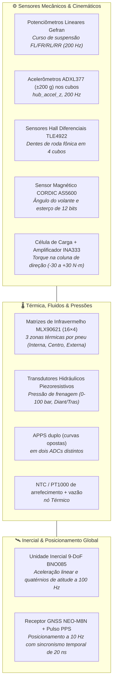

1. **Potenciômetros Lineares de Suspensão (Gefran / Penny & Giles)**:
   * **Princípio**: Divisor resistivo ratiométrico sobre filme plástico condutivo de alta resolução.
   * **Especificações**: Curso útil de $75\,\text{mm}$, repetibilidade mecânica de $\pm 0.05\%$, velocidade máxima de acionamento de $5\,\text{m/s}$.
   * **Circuito de Condicionamento**: divisor $12\,\text{k}\Omega / 24\,\text{k}\Omega$ (0–5 V → 0–3,3 V) + filtro RC $1\,\text{k}\Omega / 100\,\text{nF}$ ($f_c \approx 1.6\,\text{kHz}$), entrando no **MCP3208** (12 bit, SPI) do VDN. Amostrado a **200 Hz** ([[⚡ Circuitos Condicionadores (Divisores 33k-12k, Filtros RC e ADCs MCP3208-ADS131M08)]]).
2. **Sensores Hall Diferenciais de Velocidade de Roda (Infineon TLE4922)**:
   * **Princípio**: Duplo elemento Hall integrado que detecta a variação do gradiente de campo magnético gerado pela passagem dos dentes de uma roda fônica ferromagnética de 36 dentes.
   * **Imunidade a Ruído**: Por ser diferencial, o sensor é totalmente imune a variações térmicas e campos magnéticos externos homogêneos gerados pelos cabos de potência do motor elétrico.
   * **Interface Eletrônica**: Saída em coletor aberto (*Open Collector*) com resistor de pull-up externo de $4.7\,\text{k}\Omega$ para $3.3\,\text{V}$ e resistor limitador de corrente em série de $100\,\Omega$, conectado diretamente aos pinos do módulo de hardware **PCNT (Pulse Counter)** do microcontrolador.
3. **Matrizes Térmicas de Pneu por Infravermelho Sem Contato (Melexis MLX90621)**:
   * **Princípio**: matriz de 16×4 termopilhas que capta a radiação infravermelha emitida pela borracha do pneu (emissividade calibrada para $\epsilon = 0.95$).
   * **Arranjo Espacial**: **um** sensor por roda, num suporte rígido na manga de eixo, com o eixo de 16 pixels transversal à banda. As 16 colunas são agrupadas em três zonas: **Borda Interna**, **Centro** e **Borda Externa**.
   * **Endereçamento**: o MLX90621 tem endereço I²C **fixo `0x60`**. Os dois sensores de um eixo vão em **dois controladores I²C independentes** do ESP32-S3 (GPIO 8/9 e 17/18) — sem multiplexador ([[🌡️ Matriz Termica de Pneus MLX90614 e Sensores de Temperatura]]).
4. **Sensor de Ângulo de Esterço (AMS AS5600)**:
   * **Princípio**: Sensor magnético rotativo sem contato baseado em matriz Hall de 4 quadrantes e processador CORDIC integrado, lendo um ímã diametral de neodímio fixado no topo da coluna de direção.
   * **Resolução**: 12 bits ($4.096$ posições por revolução, correspondendo a $\approx 0.088^\circ$ de precisão angular).
5. **Célula de Torque de Direção com Amplificador de Instrumentação (TI INA333)**:
   * **Princípio**: Ponte de Wheatstone completa composta por quatro extensômetros de resistência elétrica (*strain gauges*) colados na barra de torção da direção, medindo o esforço do piloto no volante.
   * **Condicionamento**: Como o sinal bruto de saída é da ordem de milivolts, emprega-se o amplificador de instrumentação de precisão **INA333**, com $R_G = 499\,\Omega$ ($G \approx 201$), referência em $1{,}65\,\text{V}$ e saída lida **diferencialmente** contra a referência pelo **ADS131M08** (24 bit, ±1,2 V) do VCU ([[🏎️ Sensor de Angulo AS5600 e Célula de Torque com INA333]] §2).
6. **APPS duplo, BSE e estados do circuito de shutdown** — ver [[🛑 Transdutores de Pressao Hidraulica e APS Duplo Redundante]]. APPS1 no ADS131M08, APPS2 no ADS1115: dois sensores no mesmo chip não é redundância.
7. **Arrefecimento** (nó Térmico): NTC/PT1000 de entrada e saída do motor e do inversor, vazão, PWM de bomba e ventoinha, temperatura do redutor — canais que a versão anterior deste manual não previa e que um carro elétrico precisa.

---

## 4. Eletrônica Embarcada, Nível Físico e Condicionamento de Sinais

### 4.1. O System-on-Chip ESP32 e o "Semáforo dos Pinos"

> [!note] O semáforo abaixo é do **ESP32 clássico**, usado só no INU (T-Beam). Os demais nós são **ESP32-S3**, com numeração e *strapping pins* diferentes (0, 3, 45, 46). Mapa dos dois chips em [[📌 Mapa Definitivo de Pinos do ESP32 (Pinout, Strapping Pins, ADC1 vs ADC2 e Regras de Ouro)]].
O SoC ESP32 opera com lógica estrita de **$3.3\,\text{V}$ CMOS**. Seus pinos digitais **NÃO SÃO TOLERANTES A 5V**. A injeção de tensões acima de $3.6\,\text{V}$ destrói a junção PN dos diodos de proteção internos e queima o transistor de entrada.

A equipe da UTForce adota a regra do **Semáforo de GPIOs**:

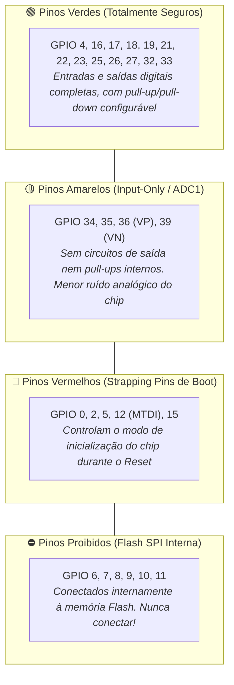

#### Aprofundamento Eletrotécnico nos Strapping Pins:
* **GPIO 0**: Se mantido em nível lógico **LOW (0V)** no momento do reset, o ESP32 entra no modo *ROM Serial Bootloader (Download Mode)*, aguardando gravação de firmware pela UART0 e impedindo a inicialização do carro.
* **GPIO 12 (MTDI) [O MAIS PERIGOSO DE TODOS]**: O pino GPIO 12 controla a tensão do regulador LDO interno que alimenta a memória Flash SPI integrada:
  * **LOW (GND)**: Regulador interno gera **$3.3\,\text{V}$** (tensão nominal padrão da memória Flash).
  * **HIGH ($3.3\,\text{V}$)**: Regulador interno força **$1.8\,\text{V}$**.
  * **Perigo Crítico de Bancada**: Se você conectar um sensor ou circuito externo com resistor de pull-up de $3.3\,\text{V}$ soldado no GPIO 12, durante a inicialização o processador lê nível HIGH, comuta a alimentação da Flash para $1.8\,\text{V}$ e a Flash de $3.3\,\text{V}$ não consegue responder, gerando o erro de bootloop permanente:
    ```text
    rst:0x10 (RTCWDT_RTC_RESET),boot:0x1b (SPI_FAST_FLASH_BOOT)
    flash read err, 1000
    ets_main.c 371
    ```
  * **Regra de Ouro**: **Nenhum sensor do monoposto é conectado aos pinos GPIO 0 ou GPIO 12**.

---

### 4.2. A Armadilha do ADC2 vs Wi-Fi e Regras de Conversão Analógica
O hardware interno do ESP32 possui dois conversores SAR ADC de 12 bits:
* **ADC1** (Canais nos pinos GPIO 32, 33, 34, 35, 36, 39): Possui máquina de estados dedicada e independente.
* **ADC2** (Canais nos pinos GPIO 0, 2, 4, 12, 13, 14, 15, 25, 26, 27): Compartilha multiplexadores e comparadores de silício com o transceptor de rádio Wi-Fi e Bluetooth.

Quando qualquer função que inicializa o subsistema de rádio é chamada no firmware (como `WiFi.begin()`, `WiFi.mode(WIFI_AP)` ou até mesmo o driver de inicialização do rádio de algumas bibliotecas de ESP-NOW), o driver de Wi-Fi assume o controle exclusivo do ADC2 para medições de potência de RF e calibração de canais. Qualquer chamada subsequente a `analogRead()` em um pino do ADC2 retorna erro de timeout (`ESP_ERR_TIMEOUT`), leitura nula ou valores completamente corrompidos.

> [!CAUTION]
> **Regra Mandatória de Projeto na UTForce (revisada)**:  
> **Nenhum** sensor analógico do carro usa o ADC interno do ESP32 — nem ADC1, nem ADC2. Potenciômetros de suspensão vão ao **MCP3208** (VDN); APPS1, BSE, pedal e torque ao **ADS131M08** e APPS2 e regeneração ao **ADS1115** (VCU); NTCs ao ADS1115 (Térmico). Motivo: o ADC interno tem não-linearidade de vários por cento, ruído e referência que varia de chip para chip. A discussão ADC1 × ADC2 acima só importa para leituras de diagnóstico e para bancada.

---

### 4.3. Topologia de Condicionamento, Filtros Passa-Baixa e Imunidade EMI

> [!warning] O divisor abaixo (1,8 k / 3,3 k → 3,235 V) é o **exemplo didático** para uma entrada de 3,3 V. **Não é o do carro.** O divisor pertence ao par sinal → ADC: **33 k / 12 k** (0,267) para o ADS131M08 (FSR ±1,2 V), **12 k / 24 k** (0,667) para o MCP3208 (V_REF 3,3 V), **38 k / 12 k** para o pedal de freio, e **nenhum** para o ADS1115 alimentado em 5 V. Tabela completa e contas em [[⚡ Circuitos Condicionadores (Divisores 33k-12k, Filtros RC e ADCs MCP3208-ADS131M08)]] §2–§3. O raciocínio de filtro RC e atenuação em 16 kHz abaixo continua válido para qualquer par de resistores.

Para conectar sensores industriais e automotivos de $5\,\text{V}$ ratiométricos a uma entrada de $3.3\,\text{V}$, o princípio é o circuito de atenuação e filtragem analógica abaixo:

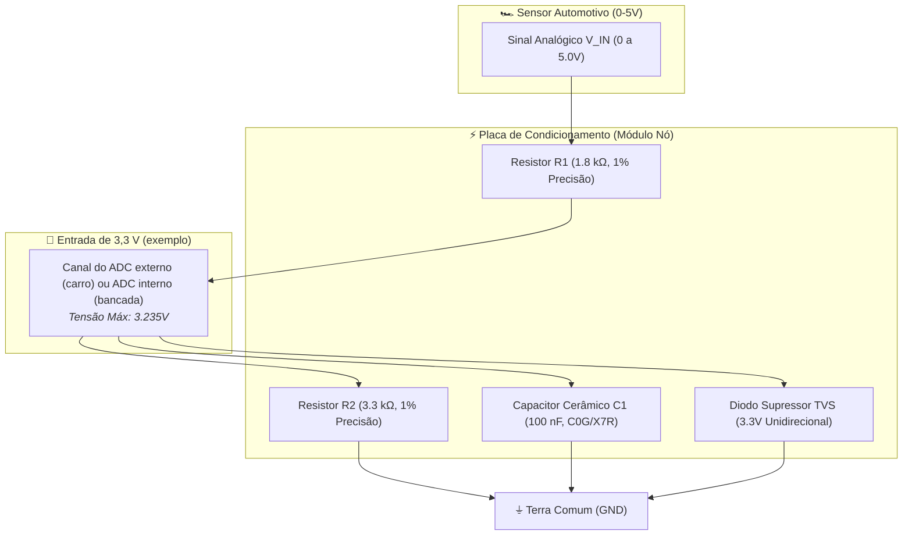

#### Dedução das Constantes Elétricas:
A tensão máxima atenuada de saída ($V_{OUT}$) para uma excursão máxima de entrada de $5.0\,\text{V}$ é dada por:
$$V_{OUT} = V_{IN} \cdot \frac{R_2}{R_1 + R_2} = 5.0\,\text{V} \cdot \frac{3300\,\Omega}{1800\,\Omega + 3300\,\Omega} = 5.0\,\text{V} \cdot 0.64705 = 3.235\,\text{V}$$
A impedância equivalente de Thevenin ($R_{Th}$) vista pelo capacitor de filtro cerâmico é:
$$R_{Th} = R_1 \parallel R_2 = \frac{1800 \cdot 3300}{1800 + 3300} \approx 1164.7\,\Omega$$
Com um capacitor cerâmico multicamada de $C_1 = 100\,\text{nF}$, a frequência de corte de meia potência ($-3\,\text{dB}$) do filtro passa-baixa RC é:
$$f_c = \frac{1}{2\pi \cdot R_{Th} \cdot C_1} = \frac{1}{2\pi \cdot 1164.7\,\Omega \cdot 100 \times 10^{-9}\,\text{F}} \approx 1366.5\,\text{Hz}$$

Para a frequência de chaveamento PWM do inversor de potência ($f_{PWM} = 16\,\text{kHz}$), a atenuação fornecida por este filtro analógico é:
$$A(f) = \frac{1}{\sqrt{1 + \left(\frac{f}{f_c}\right)^2}} \implies A(16\,\text{kHz}) = \frac{1}{\sqrt{1 + \left(\frac{16000}{1366.5}\right)^2}} \approx \frac{1}{\sqrt{1 + 137.1}} \approx 0.0851$$
$$\text{Atenuação (dB)} = 20 \log_{10}(0.0851) \approx -21.4\,\text{dB}$$
Isso significa que **mais de $91.5\%$ de todo o ruído de alta frequência induzido pelo inversor é dissipado antes de alcançar o pino do conversor analógico-digital**, garantindo um sinal analógico limpo e estável.

---

## 5. Redes Veiculares Diferenciais (CAN 2.0B) e Telemetria RF (LoRa)

### 5.1. Teoria Eletromagnética das Linhas de Transmissão e Casamento de Impedância
O chicote de dados que interliga os nós de telemetria do monoposto comporta-se fisicamente como uma **linha de transmissão de radiofrequência**. No padrão CAN a $500\,\text{kbps}$, a menor largura de pulso de um bit é de $2\,\mu\text{s}$, com tempos de subida de borda (*rise time*) inferiores a $50\,\text{ns}$.

Pela teoria clássica de linhas de transmissão, se uma onda eletromagnética que se propaga por um par trançado com impedância característica $Z_0$ atinge o final do cabo e encontra uma carga $Z_L \neq Z_0$, ocorre **reflexão de onda**, descrita pelo coeficiente de reflexão de tensão $\Gamma$:
$$\Gamma = \frac{Z_L - Z_0}{Z_L + Z_0}$$
* Se $Z_L = \infty$ (linha aberta, sem resistor de terminação): $\Gamma = +1.0$ ($100\%$ da tensão é refletida em fase, colidindo com os bits subsequentes e gerando erros de protocolo).
* Se $Z_L = 0$ (curto-circuito): $\Gamma = -1.0$ ($100\%$ da tensão é refletida invertida).
* Se $Z_L = Z_0 = 120\,\Omega$: $\Gamma = 0$ (**Reflexão nula** — toda a energia do sinal é absorvida pela carga resistiva).

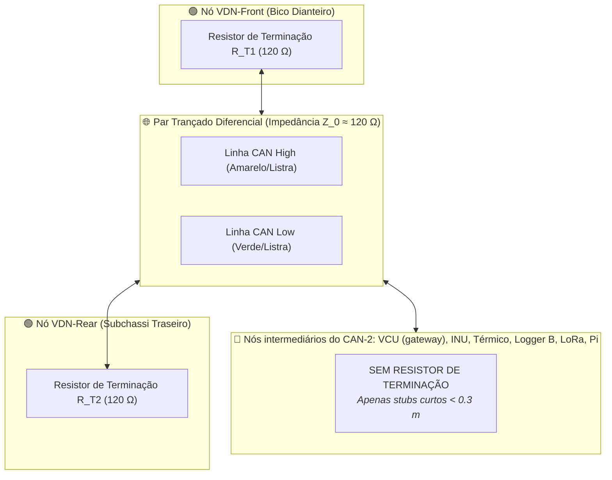

O diagrama mostra o **CAN-2** (pontas VDN-Front e VDN-Rear). O **CAN-1** tem as próprias duas pontas — CVW300 e VCU — e é medido separadamente. Em cada barramento, posiciona-se um resistor de filme metálico de $120\,\Omega$ ($1\%$, $0.25\,\text{W}$) em cada uma das duas pontas. A impedância total equivalente do barramento medida entre `CAN_H` e `CAN_L` com o carro totalmente desenergizado deve ser:
$$R_{eq} = R_{T1} \parallel R_{T2} = \frac{120 \cdot 120}{120 + 120} = 60.0\,\Omega$$

---

### 5.2. Protocolo CAN 2.0B, Transceptores SN65HVD230 e Matriz DBC
A camada física do barramento CAN transmite dados através de **tensão diferencial simétrica**:
* **Estado Recessivo (Bit 1)**: Tanto `CAN_H` quanto `CAN_L` são mantidos em aproximadamente $2.5\,\text{V}$ ($\Delta V = 0.0\,\text{V}$).
* **Estado Dominante (Bit 0)**: O transceptor aciona `CAN_H` para $3.5\,\text{V}$ e puxa `CAN_L` para $1.5\,\text{V}$ ($\Delta V = 2.0\,\text{V}$).

Qualquer ruído eletromagnético induzido no cabo atinge simultaneamente ambos os condutores com a mesma polaridade e amplitude (*ruído de modo comum*). Como o receptor diferencial do transceptor amplifica apenas a diferença $(V_{CAN\_H} - V_{CAN\_L})$, o ruído induzido é perfeitamente anulado.

A matriz de mensagens vigente está em [[📊 Matriz de Mensagens CAN e Dicionario de IDs (DBC Veicular)]] (dois barramentos, layout byte a byte). Resumo das faixas de ID:

| Faixa | Barramento | Emissor | Conteúdo | Taxas |
| :--- | :---: | :--- | :--- | :--- |
| `0x010` | CAN-1 | VCU | Estados do circuito de shutdown (bitmask) | evento + 1 Hz |
| `0x100–0x11F` | CAN-1 | VCU | Torque, APPS, freio, direção, entradas | 100 Hz / 10 Hz |
| `0x300–0x31F` | CAN-1 | CVW300 | rpm, torque, tensão e corrente DC, térmicos, status | 100 Hz / 10 Hz |
| `0x400–0x40F` | CAN-1 | Orion | Pack, células, status | 20 / 1 Hz |
| `0x200–0x20F` / `0x220–0x22F` | CAN-2 | VDN-Front / VDN-Rear | Amortecedor + cubo (**200 Hz**), rodas + chassi (100 Hz), pneus (10 Hz) | um frame por taxa |
| `0x410` | CAN-2 | Orion CAN2 | Resumo do pack | 10 Hz |
| `0x500–0x50F` | CAN-2 | INU | Aceleração, atitude, GPS, **`0x504` time sync no PPS** | 100 / 10 / 1 Hz |
| `0x600–0x60F` | CAN-2 | Térmico | Arrefecimento, vazão, redutor, GLV | 5 Hz |
| `0x700–0x70F` | CAN-2 | VCU gateway | Cópias subamostradas de pedais, segurança e inversor | 20 Hz / evento |
| `0x?0F` | ambos | cada nó | Heartbeat (uptime, erros CAN, bus-off, ADC, SD, fw) | 1 Hz |

Regras: 11 bits, Little Endian, inteiros com fator/offset (sem `float`), valor máximo do tipo = NaN. Ocupação: CAN-1 ≈ 13 %, CAN-2 ≈ 24 %. A tabela que estava aqui (`0x310 VDN_FrontDynamics` com suspensão a 100 Hz etc.) **não vale mais**.

---

### 5.3. Telemetria Sem Fio de Longo Alcance: LoRa SX1262 e Bit-Packing
Para cobrir todo o perímetro do autódromo (alcance radial de até $2.5\,\text{km}$), utiliza-se o transceptor **Semtech SX1262** operando na banda ISM de **$915\,\text{MHz}$**:
* **Modulação Chirp Spread Spectrum (CSS)**: O transmissor varia continuamente a frequência da portadora ao longo de pulsos lineares (*chirps*), permitindo decodificação de dados mesmo com relação sinal-ruído negativa ($SNR \ge -12.5\,\text{dB}$).
* **Parâmetros de Rádio**: Frequência central de $915.0\,\text{MHz}$, Largura de Banda de $500\,\text{kHz}$, *Spreading Factor* $SF = 7$ e Taxa de Codificação $CR = 4/5$. Com essa configuração, a taxa de dados bruta é de $\approx 21.9\,\text{kbps}$; o pacote é enviado a **$10\,\text{Hz}$** (time-on-air ≈ 21,8 ms → 22 % de ocupação).
* **Quem transmite**: um nó dedicado, a **Heltec WiFi LoRa 32 V3**, que **só escuta** o CAN-2 (`LISTEN_ONLY`, TX desconectado) e monta o pacote. É o único lugar do carro onde a Heltec é a placa certa.
* **Compactação com Checksum CRC16**: Cada pacote possui exatamente **41 bytes binários** (`static_assert` no firmware), protegidos pelo polinômio cíclico **CRC-16-CCITT**:
  $$G(x) = x^{16} + x^{12} + x^5 + 1$$
  Se o receptor de box detectar qualquer divergência no CRC16, o pacote é imediatamente descartado, eliminando completamente a possibilidade de plotar dados corrompidos nos gráficos de corrida.

---

## 6. Computação de Borda (Raspberry Pi Blackbox) e Interface Desktop (PySide6)

### 6.1. O Computador de Bordo Blackbox e Proteção por OverlayFS Read-Only

> [!note] Revisado: o Raspberry Pi é o **Logger A** — escuta os **dois** barramentos (`can0` = CAN-1, `can1` = CAN-2) em `listen-only`, **nunca transmite**, e é alimentado por **UPS de supercapacitor** com desligamento limpo. A redundância de registro é o **Logger B** (ESP32-S3 + microSD no CAN-2) e o log local do VCU. Detalhe em [[🔴 Gateway e Logger Raspberry Pi (SocketCAN, Logs BLF e CSV)]] e [[🛡️ Resiliencia contra Queda Abrupta de Energia e Modo Read-Only]].
O **Raspberry Pi 4 Model B (4 GB)** atua como a caixa-preta central do veículo. Ele roda uma distribuição Linux embarcada customizada baseada em Debian, conectada ao barramento veicular através da camada de rede de socket nativa do kernel Linux (**SocketCAN** via interface SPI/CAN com controlador de interrupção dedicado).

#### A Proteção contra Desligamento Abrupto (OverlayFS):
Em testes de pista e competições de FSAE, a Chave Geral de Parada de Emergência é acionada frequentemente com o veículo em movimento, cortando instantaneamente os $12\,\text{V}$ da eletrônica de baixa tensão. Em um sistema operacional convencional rodando com sistema de arquivos ext4 com escrita aberta, essa queda de energia corrompe as tabelas de alocação de blocos (*inodes*) do cartão microSD, impedindo o boot na sessão seguinte.

Para solucionar definitivamente essa vulnerabilidade, o sistema operacional do Raspberry Pi é configurado com **OverlayFS em Modo Somente-Leitura (Read-Only Root Filesystem)**:
1. A partição raiz (`/`) é montada fisicamente como *Read-Only*. Nenhuma operação do sistema operacional pode alterar o cartão.
2. Cria-se uma camada volátil temporária em memória RAM (`tmpfs`) sobreposta à raiz. Todas as alterações temporárias feitas pelo Linux ocorrem exclusivamente na RAM e são descartadas no desligamento.
3. Para a gravação contínua dos logs de corrida, utiliza-se uma partição secundária isolada montada de forma síncrona com `sync,noexec,nodev,flush`, garantindo que os blocos de dados gravados sejam imediatamente descarregados para a memória flash física a cada mensagem CAN recebida.

---

### 6.2. Registro Binário Industrial (.BLF/.CSV) e Cálculos Físicos em Borda
O daemon de gravação escuta os dispositivos `can0` e `can1` via sockets brutos (`AF_CAN, SOCK_RAW, CAN_RAW`) e armazena os dados no formato industrial **.BLF (Binary Logging Format)**, padrão da Vector Informatik adotado por equipes de Fórmula 1 e montadoras mundiais.

Simultaneamente ao logging, o Raspberry Pi executa em tempo real cálculos analíticos pesados de física veicular, retroalimentando o display do piloto e o barramento com dados sintetizados:
* **Slip Ratio de Aceleração e Frenagem** para cada um dos 4 pneus.
* **AeroBalance Instantâneo** com filtragem de média móvel para anular vibrações de alta frequência.
* **Envelope de Acelerações Dinâmicas (G-G Diagram)** para indicar ao piloto a porcentagem de utilização do limite de aderência do pneu.

---

### 6.3. Software de Análise PySide6 e Comparador de Voltas com Delta t
A aplicação desktop de box desenvolvida por Lucas Christen em **PySide6 (Qt 6)** integra as seguintes tecnologias de ponta:

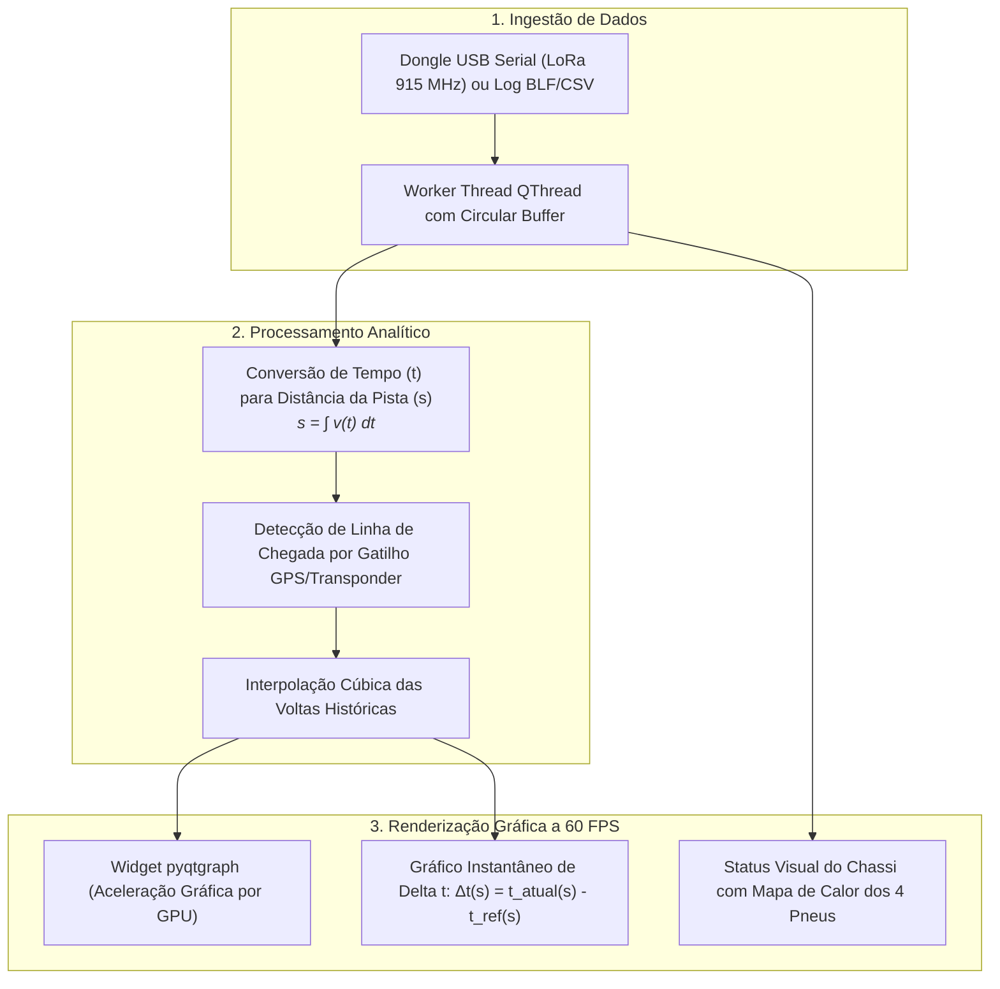

#### O Algoritmo de Tempo Delta ($\Delta t$ Instantâneo):
Para comparar a volta atual com a melhor volta histórica (*Best Reference Lap*), não se pode comparar os dados no domínio do tempo ($t$), pois o piloto passa pelo mesmo ponto físico da pista em instantes de tempo totalmente diferentes.
1. O software integra a velocidade de solo medida pelas rodas e GPS para calcular a distância percorrida ao longo da pista:
   $$s(t) = \int_{t_{inicio}}^{t} V_{solo}(\tau) \, d\tau$$
2. O software converte a curva de tempo em função da distância: $t = g(s)$.
3. Para qualquer posição $s$ do circuito fechado, o ganho ou perda de tempo instantâneo é dado por:
   $$\Delta t(s) = t_{atual}(s) - t_{referencia}(s)$$
   * Se a inclinação da curva $\frac{d(\Delta t)}{ds} > 0$: o piloto está perdendo tempo naquele setor da pista (exemplo: saída de curva lenta ou frenagem prematura).
   * Se $\frac{d(\Delta t)}{ds} < 0$: o piloto está ganhando tempo em relação à melhor volta histórica.

---

## 7. A Rota de Migração para a Plataforma Fórmula Driverless (ROS 2)

> [!info] Fora do escopo atual. A prioridade é a telemetria convencional **com redundância** ([[🧭 Plano do Sistema de Telemetria (FSAE Eletrico)]], Fases 1–6). Esta seção não foi revisada contra o Plano; o que ele já garante para a conversão futura são os dois barramentos (ROS 2 entra como ouvinte do CAN-2 e, via gateway próprio, escritor no CAN-1), a base de tempo por PPS e rodas/IMU a 100 Hz. Revisar após a Fase 6.

### 7.1. Da Telemetria Humana à Condução Autônoma
A transição de um protótipo tripulado para a categoria **Formula Student Driverless (FSAE Autônomo)** não requer o descarte da eletrônica embarcada existente. Pelo contrário: a infraestrutura de telemetria baseada em barramento CAN constitui a **Camada de Abstração de Hardware (HAL)** ideal para o robô.

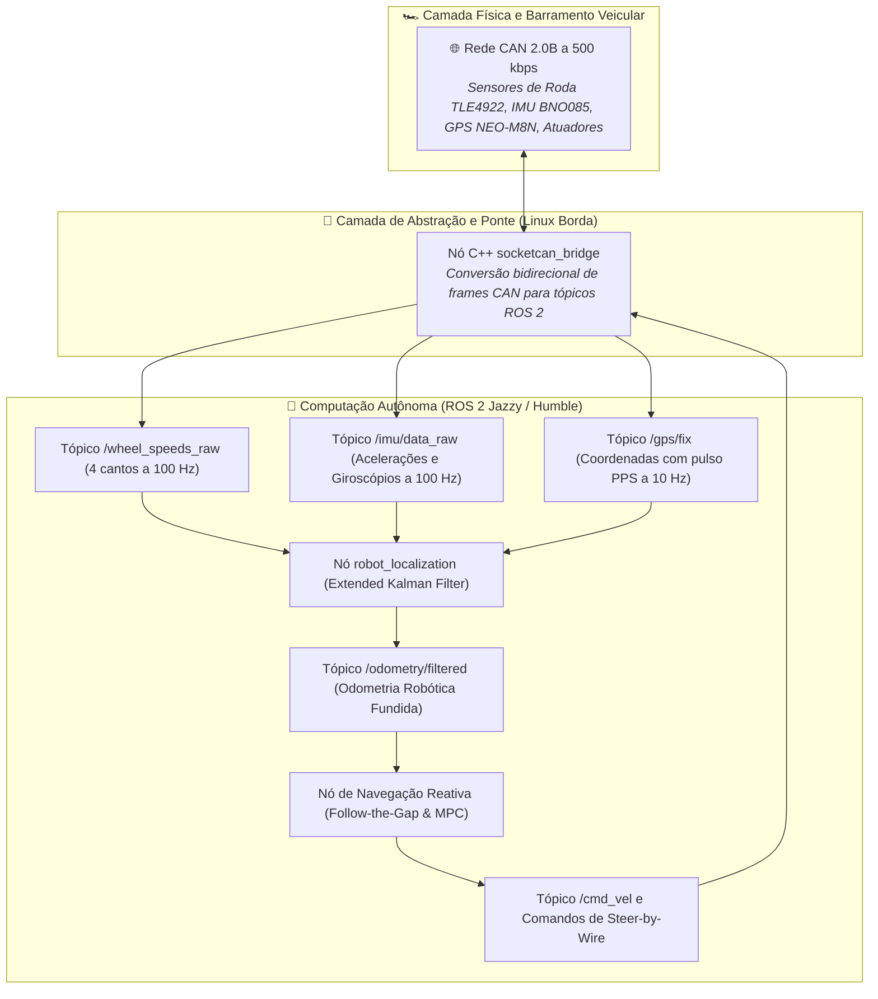

---

### 7.2. Ponte CAN para ROS 2 e Fusão Sensorial com Extended Kalman Filter (EKF)
O nó de software em C++ `socketcan_bridge` subscreve o socket `can1` (CAN-2) do kernel e empacota os frames automotivos em estruturas padronizadas da biblioteca `sensor_msgs` do ROS 2.

Para gerar uma estimativa de odometria livre de derrapagens, emprega-se o pacote padrão da indústria robótica **`robot_localization`**, que implementa um **Filtro de Kalman Estendido (Dual-EKF)**:

#### Formulação Matemática do EKF:
1. **Passo de Predição (Cinemática do Chassi com Ackerman)**:
   $$\hat{x}_{k|k-1} = f(\hat{x}_{k-1|k-1}, u_k)$$
   $$P_{k|k-1} = F_k P_{k-1|k-1} F_k^T + Q_k$$
   onde $\hat{x}$ é o vetor de estado $[x, y, z, \phi, \theta, \psi, \dot{x}, \dot{y}, \dot{z}, \dot{\phi}, \dot{\theta}, \dot{\psi}]$, $F_k$ é a matriz Jacobiana do modelo cinemático veicular e $Q_k$ é a matriz de covariância do ruído do processo.
2. **Passo de Atualização (Fusão das 4 Rodas, IMU BNO085 e GPS PPS)**:
   $$K_k = P_{k|k-1} H_k^T \left( H_k P_{k|k-1} H_k^T + R_k \right)^{-1}$$
   $$\hat{x}_{k|k} = \hat{x}_{k|k-1} + K_k \left( z_k - h(\hat{x}_{k|k-1}) \right)$$
   $$P_{k|k} = (I - K_k H_k) P_{k|k-1}$$
   onde $z_k$ representa o vetor de medições reais de velocidade das 4 rodas independentes (lidas pelo sensor Hall TLE4922) e giroscópios, $H_k$ é a matriz de observação e $R_k$ é a matriz de covariância dos sensores calibrada experimentalmente em bancada.

---

### 7.3. Sinergia com o Ecossistema JetBot ROS 2
O pipeline autônomo validado previamente na plataforma de desenvolvimento em escala reduzida [[🤖 Plataforma Autonoma JetBot ROS 2 - Visao Geral|JetBot ROS 2]] é diretamente transportável para o monoposto elétrico real:
* **Percepção e Mapeamento de Cones**: O modelo leve de rede neural convolucional YOLOv8-tiny identifica cones azuis, amarelos e laranjas da pista.
* **Planejamento de Trajetória (*Path Planning*)**: O algoritmo reativo *Follow-the-Gap* modificado com horizonte preditivo (MPC) utiliza a odometria fundida `/odometry/filtered` para calcular os comandos ideais de esterçamento (*Steer-by-Wire*) e torque nos motores elétricos.

---

## 8. Procedimento Operacional Padrão de Pista (SOP & Pitlane Run Sheet)

Em testes de pista de alta velocidade, a disciplina operacional é o fator determinante para evitar a perda de dados ou acidentes elétricos. A equipe de telemetria da UTForce segue rigorosamente o protocolo estruturado em 3 fases:

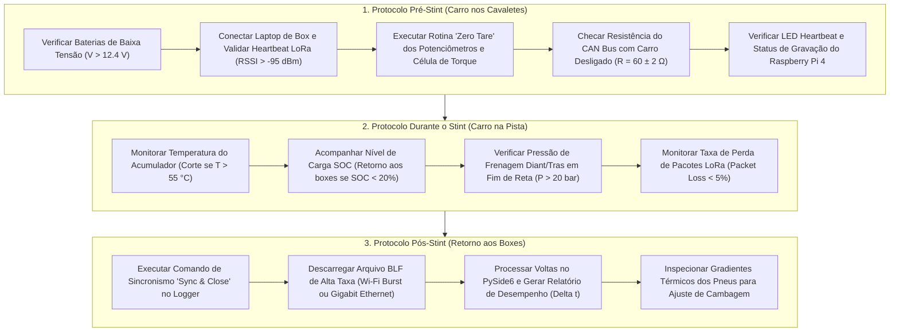

### 8.1. Fase 1: Protocolo Pré-Stint (Carro nos Cavaletes)
Antes de liberar o veículo para a pista, a equipe executa o checklist estático obrigatório:
1. **Verificação de Alimentação**: Medir a tensão do barramento de baixa tensão (GLV - *Grounded Low Voltage*), garantindo $V_{GLV} > 12.4\,\text{V}$.
2. **Conexão LoRa e Heartbeat**: Estabelecer link de telemetria sem fio com a estação de box a 915 MHz e verificar RSSI ($> -95\,\text{dBm}$).
3. **Calibração de Sensores (*Zero Tare*)**: Com o veículo em repouso e sem piloto, disparar o comando de calibração de zero dos potenciômetros de suspensão e da célula de carga do volante via GUI.
4. **Integridade do Barramento CAN**: Medir a resistência ôhmica entre CAN_H e CAN_L no conector de diagnóstico com o carro desenergizado, confirmando $60 \pm 2\,\Omega$ (dois terminadores de $120\,\Omega$ em paralelo).
5. **Checagem do Logger Blackbox**: Confirmar que o Raspberry Pi 4 inicializou com sucesso via LED indicador e que a partição RAM do OverlayFS está registrando os quadros CAN.

### 8.2. Fase 2: Protocolo Durante o Stint (Monitoramento Dinâmico em Pista)
Com o monoposto em movimento contínuo durante as provas dinâmicas:
1. **Segurança Térmica do Acumulador**: Monitorar a temperatura máxima das células de íon-lítio via telemetria LoRa; se $T_{cell,max} > 55^\circ\text{C}$, emitir alerta vermelho imediato pelo rádio ao piloto para retorno ao box.
2. **Gerenciamento de Energia e SOC**: Acompanhar o consumo instantâneo de corrente e o estado de carga ($SoC$). Se $SoC < 20\%$, orientar o piloto a limitar a regeneração e a potência máxima para completar o stint.
3. **Pressão Hidráulica de Frenagem**: Validar se o piloto atinge picos de pressão de freio adequados ($P > 20\,\text{bar}$) nos pontos críticos de frenagem antes das curvas.
4. **Qualidade de Enlace RF**: Monitorar a taxa de perda de pacotes LoRa (*Packet Loss* $< 5\%$) e alarmes de saturação de fila.

### 8.3. Fase 3: Protocolo Pós-Stint (Retorno aos Boxes e Descarga de Dados)
Assim que o veículo retorna aos cavaletes:
1. **Fechamento e Sincronismo dos Logs**: Executar o comando *Sync & Close* no Raspberry Pi para fechar de forma limpa os arquivos binários `.BLF` no pendrive de armazenamento persistente.
2. **Descarga de Dados em Alta Taxa**: Conectar o cabo Gigabit Ethernet ou acionar a rajada Wi-Fi (*Wi-Fi Burst*) para download dos dados completos amostrados a 1 kHz.
3. **Processamento Instantâneo de Voltas**: Carregar o log no software PySide6, calcular as métricas de tempo delta ($\Delta t$) em relação à volta de referência e identificar os trechos de ganho/perda de tempo.
4. **Inspeção Térmica Imediata dos Pneus**: Analisar as leituras das matrizes MLX90621 e cruzar com o pirômetro de contato manual nos boxes para ajustar pressões a frio e cambagem estática para a próxima sessão.

---

## 9. Matriz de Diagnóstico Rápido e Resolução de Falhas (Troubleshooting)

### 9.1. Guia de Resolução em 2 Minutos para Falhas Críticas de Pista

| Código / Sintoma | Causa-Raiz Física | Ação de Diagnóstico e Resolução em 2 Minutos |
| :--- | :--- | :--- |
| **Sinal Analógico travado em $4095$** | Condutor de terra (GND) rompido no conector, ou pino analógico flutuando com capacitor de filtro carregado. | Colocar o multímetro na escala de continuidade; verificar se o GND do sensor possui menos de $0.2\,\Omega$ até o chassi; reconectar o pino frouxo no conector Deutsch. |
| **Sinal Analógico travado em $0$** | Curto-circuito do condutor de sinal com a malha aterrada, ou queima de porta por sobretensão ($V_{in} > 3.6\,\text{V}$). | Desconectar o sensor e medir a impedância da linha contra o GND; se persistir em zero com sensor desplugado, comutar no firmware para um canal sobressalente do ADC1. |
| **ESP32 em Bootloop (`flash read err`)** | Resistor externo ou fuga forçando o pino **GPIO 12 (MTDI)** em nível HIGH na inicialização, setando a flash para $1.8\,\text{V}$. | Desconectar imediatamente o circuito soldado no GPIO 12; assegurar que nenhum sensor externo está conectado aos strapping pins de boot. |
| **Barramento I2C travado permanentemente** | Queda de tensão transitória durante uma transferência deixou o sensor escravo segurando a linha **SDA presa em nível LOW** (*I2C Bus Lockup*). | Executar a rotina de recuperação por firmware (emitir 9 pulsos manuais de clock em SCL via software para liberar o escravo e reinicializar o barramento `Wire`). |
| **Barramento CAN em modo *Bus-Off*** | Falta de resistor de terminação de $120\,\Omega$, inversão física entre `CAN_H` e `CAN_L`, ou transceptor queimado por spike. | Desenergizar o monoposto e medir a resistência entre CAN_H e CAN_L com multímetro: **deve marcar exatamente $60\,\Omega$**. Se marcar $120\,\Omega$, uma das pontas está desconectada. |
| **Queda intermitente de telemetria LoRa** | Conector coaxial SMA solto na carcaça, cabo coaxial esmagado na fibra de carbono, ou polarização ortogonal da antena. | Reapertar com chave o conector SMA; alinhar as antenas do transmissor do carro e do receptor de box na posição **estritamente vertical**. |

---

### 9.2. Rotina de Firmware em C++ para Recuperação de Barramento I2C Preso
Se um sensor escravo (como o MLX90621) sofrer um pulso de ruído elétrico durante a leitura de um bit de reconhecimento (ACK), ele pode prender permanentemente a linha `SDA` em nível baixo ($0\,\text{V}$), travando todas as comunicações I2C do microcontrolador. O firmware da UTForce implementa a seguinte rotina de recuperação em nível de hardware:

```cpp
#include <Arduino.h>
#include <Wire.h>

bool I2C_Bus_Recovery(uint8_t sda_pin, uint8_t scl_pin) {
    pinMode(sda_pin, INPUT_PULLUP);
    pinMode(scl_pin, INPUT_PULLUP);

    // Se a linha SDA estiver livre (HIGH), o barramento não está travado
    if (digitalRead(sda_pin) == HIGH) {
        return true;
    }

    // Se SDA estiver preso em LOW, o escravo está esperando pulsos de clock
    pinMode(scl_pin, OUTPUT);

    // Emite até 9 pulsos de clock manuais para destravar a máquina de estados do escravo
    for (uint8_t i = 0; i < 9; i++) {
        digitalWrite(scl_pin, LOW);
        delayMicroseconds(5);
        digitalWrite(scl_pin, HIGH);
        delayMicroseconds(5);

        // Verifica se o escravo soltou a linha SDA
        if (digitalRead(sda_pin) == HIGH) {
            break;
        }
    }

    // Gera condição de STOP no barramento (SDA sobe enquanto SCL está HIGH)
    pinMode(sda_pin, OUTPUT);
    digitalWrite(sda_pin, LOW);
    delayMicroseconds(5);
    digitalWrite(scl_pin, HIGH);
    delayMicroseconds(5);
    digitalWrite(sda_pin, HIGH);
    delayMicroseconds(5);

    // Reinicializa o driver I2C do ESP32
    Wire.begin(sda_pin, scl_pin, 400000);
    return (digitalRead(sda_pin) == HIGH);
}
```

---

## 10. Estudo de Caso Integrador: "A Vida de 1 Bit de Telemetria"

Para sintetizar a harmonia de todos os conceitos expostos neste tratado, acompanhe o fluxo passo a passo de um evento real em pista: **o pneu dianteiro direito colide com uma zebra de entrada de curva**.

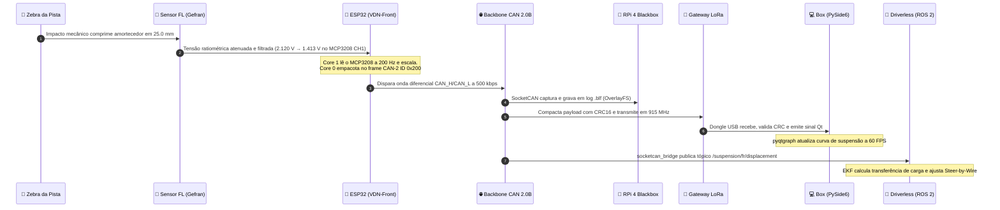

1. **A Física Mecânica (O Asfalto)**: Às $14\text{h}32\text{m}15.420\text{s}$, o monoposto entra na curva 3 do autódromo a $82\,\text{km/h}$ e sobe na zebra zebrada $\rightarrow$ a haste do amortecedor dianteiro direito sofre compressão mecânica súbita de exatamente **$25.0\,\text{mm}$**.
2. **A Transdução Eletromecânica**: O cursor metálico do potenciômetro linear Gefran desliza sobre a trilha de filme plástico condutivo, alterando a razão de divisão de tensão e emitindo um sinal analógico ratiométrico estável de **$2.120\,\text{V}$**.
3. **O Condicionamento e Imunidade Eletromagnética**: O sinal analógico percorre o chicote blindado e entra na placa do nó dianteiro (VDN-Front), atravessando o divisor $12\,\text{k}\Omega / 24\,\text{k}\Omega$ (2,120 V → 1,413 V) e o filtro passa-baixa RC de $1.6\,\text{kHz}$ ($1\,\text{k}\Omega + 100\,\text{nF}$). O ruído de $16\,\text{kHz}$ induzido pela comutação do inversor é atenuado em $\approx -20\,\text{dB}$, entregando uma tensão limpa ao canal **CH1 do MCP3208** (12 bit, V_REF 3,3 V).
4. **A Amostragem Determinística no ESP32-S3 (Core 1)**: o MCP3208 digitaliza 1,413 V em $1.753$ counts. A tarefa de amostragem no **Core 1** do FreeRTOS, despertada a exatamente **$200\,\text{Hz}$** via `vTaskDelayUntil`, converte para $0{,}01\,\text{mm}$ (`damper_pos_fr` = 2500) e insere o frame na fila.
5. **A Comunicação no Barramento Veicular (Core 0)**: A tarefa de comunicação no **Core 0** desempacota a fila, aloca `damper_pos_fr` nos bytes 2 e 3 da mensagem **`0x200 VDNF_Damper`** (Little Endian, DLC 8) e comanda o transceptor **SN65HVD230** a transicionar as linhas diferenciais do **CAN-2** a $500\,\text{kbps}$. O CAN-1, onde estão o inversor e o AMS, não vê este frame.
6. **A Gravação Segura em Borda (Raspberry Pi Blackbox)**: O driver de SocketCAN do kernel Linux intercepta o frame automotivo em menos de $15\,\mu\text{s}$. O serviço de logging grava o frame bruto no arquivo industrial `stint_03_run.blf`, protegido contra qualquer perda de dados graças à partição raiz montada em modo **OverlayFS Read-Only**.
7. **O Enlace Sem Fio de Pista (LoRa SX1262)**: O nó gateway compacta o frame com outros sinais vitais, calcula o checksum **CRC16** e aciona o amplificador de potência do rádio Semtech SX1262 a $+22\,\text{dBm}$, emitindo uma onda modulada em Chirp Spread Spectrum a $915\,\text{MHz}$.
8. **A Estação de Box em Tempo Real (PySide6)**: A antena direcional instalada no pitlane capta a onda de rádio. O dongle receptor USB entrega o fluxo de bytes à porta serial do notebook dos boxes. A classe `TelemetryDataWorker` em Python descompacta os bits em uma thread secundária, verifica o CRC16 e emite o sinal thread-safe `data_updated`. A interface gráfica em **PySide6** processa o sinal e atualiza a curva de deslocamento da suspensão dianteira a **60 FPS** utilizando aceleração de hardware OpenGL via biblioteca **pyqtgraph**.
9. **A Condução Autônoma (Fórmula Driverless / ROS 2)**: Simultaneamente no computador de condução autônoma do monoposto, o nó em C++ `socketcan_bridge` publica o tópico canônico `/suspension/fr/displacement`. O nó de fusão sensorial **`robot_localization`** calcula a variação da carga normal dinâmica $\Delta F_z$, e o algoritmo de controle de seguimento de trajetória ajusta instantaneamente o limite de aceleração lateral do atuador de esterço *Steer-by-Wire* para contornar a zebra com estabilidade máxima!

## 11. Análise de Modos de Falha e Efeitos (FMEA Automotivo Formal — SAE J1739)

Na engenharia automotiva de competição e na homologação técnica de protótipos da **Fórmula SAE**, a confiabilidade metrológica e a segurança operacional dos sistemas elétricos de baixa tensão são rigorosamente avaliadas pela banca de juízes de *Design*. Uma falha na telemetria não pode, sob nenhuma hipótese, induzir o piloto a um acidente, desativar indevidamente o circuito de desligamento (*Shutdown Circuit*) ou mascarar um evento térmico crítico no acumulador de alta tensão (Tractive System).

Para garantir robustez de nível aeroespacial, a arquitetura de telemetria da **UTForce E-Racing** adota formalmente o padrão **SAE J1739** (*Potential Failure Mode and Effects Analysis in Design - DFMEA*).

### 11.1. Fundamentação e Critérios Normativos da SAE J1739

A metodologia de DFMEA avalia quantitativamente cada modo de falha potencial através de três índices inteiros normalizados de $1$ a $10$:

1. **Severidade ($S \in [1, 10]$)**: Avalia o impacto direto do efeito da falha sobre a segurança do piloto, a integridade do veículo ou a conformidade regulamentar:
   * **$9 - 10$ (Crítica / Catastrófica)**: Violação direta do regulamento de segurança elétrica da FSAE (ex: curto de sinal induzindo disparo espúrio do BMS ou desligamento indevido em reta a $100\,\text{km/h}$); risco de incêndio ou choque.
   * **$7 - 8$ (Severa)**: Perda de função primária do veículo acarretando abandono imediato da prova dinâmica (*Did Not Finish* - DNF).
   * **$4 - 6$ (Moderada)**: Perda de telemetria em tempo real ou degradação metrológica nos boxes, mas o veículo permanece funcional na pista.
   * **$1 - 3$ (Leve / Imperceptível)**: Ruído estético na interface gráfica do box ou perda de telemetria secundária de baixo impacto sem comprometimento de performance.
2. **Ocorrência ($O \in [1, 10]$)**: Probabilidade cumulativa estimada da falha ocorrer durante o ciclo de vida e operação em pista:
   * **$9 - 10$**: Quase certa ($> 1$ em cada 2 testes).
   * **$6 - 8$**: Frequente a moderada em ambientes severos de vibração mecânica e temperatura.
   * **$3 - 5$**: Baixa a ocasional (falha esporádica prevenida por manutenção preditiva).
   * **$1 - 2$**: Remota a quase impossível ($< 1$ em $1.000.000$ de horas de operação).
3. **Detecção ($D \in [1, 10]$)**: Eficácia dos controles de engenharia e algoritmos embarcados para identificar a falha antes que ela se propague e cause o efeito adverso:
   * **$9 - 10$**: Impossível detectar antes da falha completa; falha silenciosa.
   * **$6 - 8$**: Detecção tardia ou dependente de inspeção visual humana pós-sessão.
   * **$3 - 5$**: Detecção automática por plausibilidade física ou diagnóstico periódico de software.
   * **$1 - 2$**: Detecção imediata e determinística no instante da ocorrência (ex: interrupção de hardware por Watchdog, CRC mismatch rejeitado na camada física).

O **Número de Prioridade de Risco ($RPN$)** é calculado pelo produto dos três índices:

$$RPN = S \times O \times D \quad \text{com} \quad RPN \in [1, 1000]$$

> [!IMPORTANT]
> **Critério de Risco Mandatório**: Na metodologia da UTForce E-Racing, qualquer modo de falha que apresente **$RPN \ge 100$** OU severidade **$S \ge 8$** exige obrigatoriamente a implementação de uma ação corretiva de engenharia (hardware ou firmware) para reduzir o risco residual.

---

### 11.2. Matriz Mestre de FMEA da Telemetria Veicular

A tabela a seguir consolida os 9 modos de falha mais críticos identificados no sistema de telemetria embarcada e de box, apresentando os controles de prevenção, as ações corretivas implementadas e a redução quantitativa do RPN:

| Item / Função | Modo de Falha Potencial | Efeito Potencial da Falha | $S$ | Causa Potencial da Falha | $O$ | Controles Atuais de Prevenção & Detecção | $D$ | $RPN_{ini}$ | Ações Recomendadas & Implementadas | $S_r$ | $O_r$ | $D_r$ | $RPN_{res}$ |
| :--- | :--- | :--- | :---: | :--- | :---: | :--- | :---: | :---: | :--- | :---: | :---: | :---: | :---: |
| **Sensor Suspensão (Gefran)** | Curto-circuito da linha de $5\,\text{V}$ com a linha de sinal analógico. | Tensão de $5\,\text{V}$ aplicada ao pino ADC do ESP32; saturação do conversor e risco de dano ao microcontrolador. | **5** | Abrasão do isolamento do chicote na balança dianteira por vibração mecânica. | **6** | Filtro RC básico de entrada. Detecção visual do operador. | **4** | **120** | Adição de resistor limitador em série, diodo Zener de $3.3\,\text{V}$ para grampeamento e rotina de diagnóstico de saturação contínua ($>500\,\text{ms}$) no firmware com flag de erro. | 4 | 2 | 2 | **16** |
| **Backbone CAN 2.0B** | Rompimento ou perda do resistor de terminação de $120\,\Omega$ no nó traseiro. | Descasamento de impedância na linha de transmissão; reflexão de onda e taxa massiva de erros de bit (Stuff/CRC Error), forçando o controlador a *Bus-Off*. | **8** | Soltura do conector Deutsch traseiro ou solda fria no resistor terminal por choque mecânico. | **5** | Inspeção manual com multímetro no pré-stint ($60\,\Omega$ entre CAN_H e CAN_L). | **5** | **200** | Montagem de terminação em placa com alívio mecânico e encapsulamento em resina epóxi; firmware monitora registros `TEC/REC` e executa *Auto-Bus-Off Recovery* em $<100\,\text{ms}$. | 6 | 2 | 2 | **24** |
| **Barramento $I^2C$ (Pneus/IMU)** | Linha SDA travada em nível lógico baixo ($0\,\text{V}$) por escravo travado. | Bloqueio síncrono da tarefa FreeRTOS na biblioteca `Wire.h`; congelamento do nó e perda de leitura dos sensores térmicos. | **6** | Ruído transitório de alta frequência gerado pela comutação do inversor de tração travando a máquina de estados do sensor escravo. | **7** | Timeout nativo do driver I2C (ineficaz em versões antigas do ESP-IDF). | **5** | **210** | Implementação de isolador digital $I^2C$ galvânico (ADuM1250) e rotina de recuperação por firmware gerando 9 pulsos de clock em SCL (*Bus Clear Routine*) ao detectar timeout. | 4 | 2 | 1 | **8** |
| **Raspberry Pi Blackbox** | Queda abrupta da alimentação de $12\,\text{V}$ durante acionamento do E-Stop. | Corrupção da partição de arquivos `ext4` no cartão microSD; perda irreversível dos dados de log do stint em andamento. | **7** | Desligamento normal do veículo por botão de parada de emergência ou corte da chave geral de baixa tensão. | **8** | Não havia controle ativo; dependência do desligamento ordenado via console Linux. | **4** | **224** | Configuração compulsória do sistema operacional em modo **OverlayFS Read-Only**; os dados dinâmicos são armazenados em RAM `tmpfs` e sincronizados atomicamente a cada $1\,\text{s}$ com partição de dados protegida por supercapacitor de backup ($2\,\text{s}$ de hold-up). | 5 | 1 | 2 | **10** |
| **Célula de Carga (Freio)** | Deriva térmica severa ($>15\%$) do sinal analógico de pressão hidráulica. | Distorção no cálculo do balanço de freio (*Brake Bias*); recomendação errônea do engenheiro para o piloto na pista. | **7** | Irradiação térmica excessiva dos discos de freio incandescentes ($>400^\circ\text{C}$) sobre os transdutores fixados no pedalier. | **5** | Calibração estática realizada em bancada à temperatura ambiente ($25^\circ\text{C}$). | **6** | **210** | Instalação de blindagem térmica refletiva de polímero aluminizado (ouro térmico) e sensor PT100 auxiliar adjacente; firmware aplica mapa bidimensional de compensação térmica $P_{comp} = f(V_{adc}, T_{sensor})$. | 5 | 2 | 2 | **20** |
| **Transmissão RF LoRa** | Saturação do buffer de transmissão FIFO do chip SX1262. | Atraso acumulado (*latency buildup*) superior a $10\,\text{s}$ ou perda aleatória de pacotes de dados no box. | **4** | Injeção de dados de telemetria em taxa superior à largura de banda física permitida pelo Spreading Factor ($SF7 / BW = 500\,\text{kHz}$). | **7** | Monitoramento empírico de taxa de atualização na tela do box. | **3** | **84** | Algoritmo de compressão binária por bit-packing, fila de prioridade estrita (sinais de segurança a $10\,\text{Hz}$, cinemática a $4\,\text{Hz}$, temperaturas lentas a $1\,\text{Hz}$) e descarte determinístico de frames desatualizados. | 3 | 2 | 2 | **12** |
| **Firmware ESP32 (FreeRTOS)** | Estouro de pilha (*Stack Overflow*) em uma das tarefas de telemetria. | Crash do microcontrolador em plena curva; reinicialização cíclica por Watchdog e perda momentânea do nó na rede CAN. | **8** | Alocação de buffers locais excessivos dentro da função de callback ou aumento no aninhamento de chamadas. | **6** | Habilitação do hook `vApplicationStackOverflowHook` do FreeRTOS sem ação preventiva. | **5** | **240** | Alocação estática mandatória de memória (`xTaskCreateStatic`), dimensionamento de pilha com $40\%$ de margem de segurança e monitoramento contínuo da marca d'água (`uxTaskGetStackHighWaterMark()`). | 5 | 1 | 2 | **10** |
| **Interface PySide6** | Bloqueio da GUI Thread (interface gráfica congelada) por chamada de I/O síncrono. | Impossibilidade do engenheiro de pista acompanhar as telemetrias em tempo real durante a volta rápida do monoposto. | **3** | Execução de operação pesada de escrita em disco ou processamento numérico demorado diretamente no loop principal do Qt. | **6** | Testes informais de usabilidade em bancada. | **2** | **36** | Desacoplamento arquitetural rigoroso em modelo Produtor-Consumidor: thread dedicada `QThread` para recepção e gravação em disco; comunicação com a tela estritamente via `Qt.QueuedConnection` e buffers circulares atômicos. | 2 | 1 | 1 | **2** |
| **Nó Inercial e GPS (INU)** | Dessincronização temporal do pulso PPS do GPS em trechos sombreados da pista. | Erro acumulado no cálculo do Delta t ($\Delta t$) e desalinhamento na fusão do EKF para navegação autônoma. | **5** | Oclusão da constelação de satélites por estruturas metálicas dos boxes, árvores ou intempéries climáticas. | **6** | Falha reportada apenas pelo status do fix de satélites na tela. | **5** | **150** | Algoritmo de oscilador local compensado: na perda do sinal PPS, o timer de hardware de 64 bits do ESP32 assume a referência temporal com extrapolação por filtro de fase (PLL digital), mantendo deriva inferior a $1\,\mu\text{s/s}$. | 3 | 2 | 2 | **12** |

---

### 11.3. Análise do RPN Inicial vs. RPN Residual Pós-Mitigação

A implementação das contra-medidas de hardware, firmware e arquitetura de software resultou em uma redução substancial dos fatores de risco:

```
[RPN Inicial vs. RPN Residual Pós-Ações de Engenharia]
Modo 1 (Sensor Suspensão) : [████████████ 120]  ---> [█ 16]   (-86.7%)
Modo 2 (Backbone CAN)     : [████████████████████ 200]  ---> [██ 24]  (-88.0%)
Modo 3 (Barramento I2C)   : [█████████████████████ 210]  ---> [ 8]   (-96.2%)
Modo 4 (RPi Blackbox)     : [██████████████████████ 224]  ---> [█ 10]  (-95.5%)
Modo 5 (Célula de Freio)  : [█████████████████████ 210]  ---> [██ 20]  (-90.5%)
Modo 6 (Transmissão LoRa) : [████████ 84]   ---> [█ 12]   (-85.7%)
Modo 7 (FreeRTOS Stack)   : [████████████████████████ 240]  ---> [█ 10]  (-95.8%)
Modo 8 (PySide6 GUI)      : [███ 36]   ---> [ 2]    (-94.4%)
Modo 9 (Dessincronia GPS) : [███████████████ 150]  ---> [█ 12]   (-92.0%)
```

**Conclusão Metrológica do FMEA**: Todos os modos de falha com $RPN_{ini} \ge 100$ foram mitigados para valores residuais inferiores a $25$, eliminando qualquer risco de falha catastrófica silenciosa e garantindo pontuação de excelência na prova de *Engineering Design* da FSAE.

---

## 12. Diretrizes Avançadas de Layout de PCB, EMC/EMI e Aterramento em Veículos Elétricos

O ambiente elétrico de um veículo de competição da **Fórmula SAE Elétrica** é um dos cenários industriais mais severos para circuitos microcontrolados e sensores analógicos de precisão. A proximidade física entre a eletrônica de baixa tensão ($12\,\text{V}$ e $3.3\,\text{V}$) e o sistema de tração de alta tensão ($>300\,\text{V}$) expõe o sistema a ruídos de modo comum e diferencial devastadores.

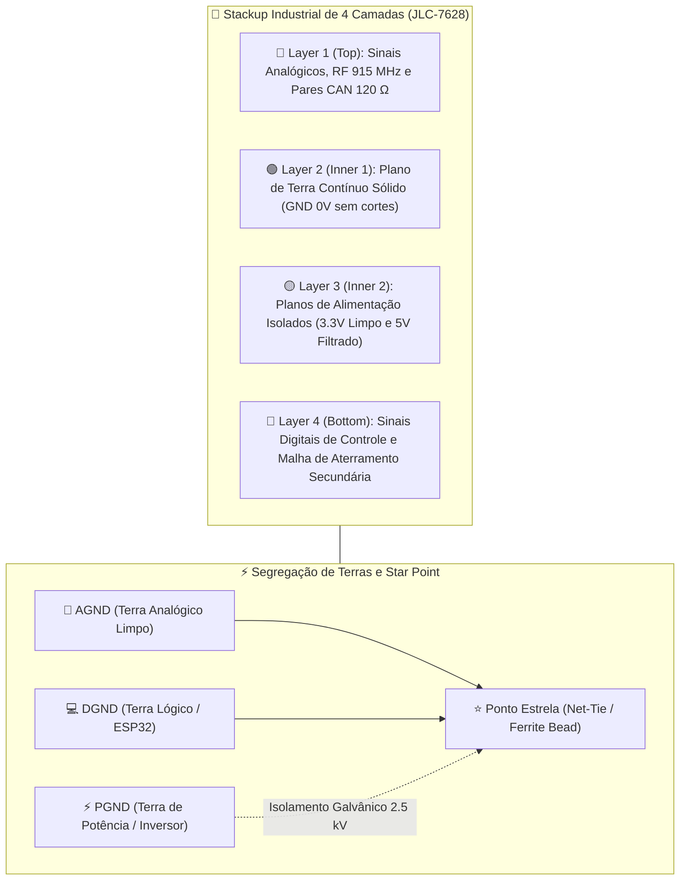

### 12.1. O Ambiente Eletromagnético Hostil de um Monoposto FSAE EV

A comutação de alta velocidade dos semicondutores de potência do inversor de frequência (IGBTs ou MOSFETs de Carbeto de Silício - SiC) opera em frequências de PWM entre $10\,\text{kHz}$ e $20\,\text{kHz}$, gerando transientes de comutação com taxas de variação de tensão e corrente extraordinariamente elevadas:

$$\frac{dV}{dt} > 5\,\text{kV}/\mu\text{s}, \qquad \frac{di}{dt} > 250\,\text{A}/\mu\text{s}$$

Esses transientes acoplam-se capacitivamente ($I_{parasita} = C_{par} \cdot \frac{dV}{dt}$) através do monocoque condutivo de fibra de carbono e acoplam-se indutivamente ($V_{induzida} = -M \cdot \frac{di}{dt}$) nos chicotes de fiação de sensores que percorrem o chassi ao lado dos cabos de fase do motor elétrico.

---

### 12.2. Arquitetura de Aterramento em Estrela e Segregação de Planos (AGND, DGND, PGND)

Para erradicar laços de terra (*Ground Loops*) e evitar que correntes de retorno digitais ruidosas contaminem as leituras milimétricas de amortecedores e células de carga, a placa de circuito impresso adota segregação estrita de três domínios de referência:

1. **$AGND$ (Analog Ground)**: Malha de terra dedicada exclusivamente aos transdutores analógicos ratiométricos, divisores resistivos, capacitores de filtro anti-aliasing e ao pino de referência analógica do ESP32. Nenhuma trilha digital ou corrente de chaveamento circula sobre esta região.
2. **$DGND$ (Digital Ground)**: Malha de terra de alta frequência para o microcontrolador ESP32, barramentos de clock SPI/I2C, circuito oscilador a cristal e transceptores digitais.
3. **$PGND$ (Power Ground)**: Terra de alimentação bruta de $12\,\text{V}$, reguladores de comutação DC-DC chaveados e cargas indutivas secundárias.

> [!TIP]
> **O Ponto Estrela (Star Ground)**: O plano $AGND$ conecta-se ao plano $DGND$ em **um único ponto físico geográfico** na placa, diretamente abaixo do pino de terra do ESP32, através de um componente específico (*Net-Tie*) ou uma esfera de ferrita (*Ferrite Bead*) de alta impedância para frequências superiores a $10\,\text{MHz}$ ($Z = 600\,\Omega @ 100\,\text{MHz}$), bloqueando transientes digitais de invadir o domínio analógico.

---

### 12.3. Topologia de Proteção em Conectores: Diodos TVS, Fusíveis PTC e Filtros Passa-Baixa

Cada entrada analógica e digital proveniente de chicotes externos do veículo conta com uma barreira tripla de proteção na borda imediata da placa de circuito impresso:

```
[Conector Deutsch DTM] 
         │
         ├───► [Fusível Rearmável PTC (PolySwitch 50mA)] ──► Para Alimentação do Sensor (5V)
         │
         ├───► [Diodo TVS Bidirecional (SMAJ5.0CA)] ────────► Desvio para Chassi/Terra (ESD ±15kV)
         │
         └───► [Resistor em Série R = 1.8 kΩ] 
                      │
                      ├───► [Capacitor C = 100 nF (C0G/NP0)] ──► AGND (Filtro Passa-Baixa fc ≈ 1.36 kHz)
                      │
                      ├───► [Diodo Zener / Schottky 3.3V Clamp] ──► Trilho 3.3V (Proteção Overvoltage)
                      │
                      └───► Canal do ADC externo (MCP3208 / ADS131M08 / ADS1115)
```

1. **Fusível Polimérico PTC (PolySwitch)**: Interrompe a corrente caso o sensor sofra esmagamento contra o chassi, protegendo a fonte de alimentação do nó.
2. **Diodo Supressor de Tensão Transitória (TVS)**: Posicionado a menos de $3\,\text{mm}$ dos terminais do conector, grampeia pulsos eletrostáticos conformes à norma **IEC 61000-4-2** ($\pm 15\,\text{kV}$ por descarga no ar, $\pm 8\,\text{kV}$ por contato) em menos de $1\,\text{ns}$.
3. **Filtro Anti-Aliasing Passa-Baixa RC**: Atenua harmônicos de chaveamento do inversor acima de $10\,\text{kHz}$ antes da digitalização pelo SAR ADC.

---

### 12.4. Roteamento de Pares Diferenciais CAN 2.0B e Terminação Split com Modo Comum

O sinal diferencial do barramento CAN transmite dados através da diferença de potencial entre $CAN\_H$ e $CAN\_L$. Para garantir imunidade máxima a ruídos de modo comum:

* **Controle de Impedância Característica Diferencial**: As trilhas devem ser calculadas no KiCad utilizando a fórmula de microfita acoplada (*Edge-Coupled Differential Microstrip*) para garantir:
  $$Z_{diff} = 120\,\Omega \pm 10\%$$
* **Casamento de Comprimento Rigoroso**: O desvio de comprimento físico entre $CAN\_H$ e $CAN\_L$ deve ser estritamente controlado:
  $$\Delta L = |L_{CAN\_H} - L_{CAN\_L}| \le 0.5\,\text{mm}$$
  Isso previne o descasamento de fase (*skew*), que transformaria ruído de modo comum em ruído diferencial.

```
       Linha CAN_H ───────────────────┬───[ R1 = 60 Ω ]───┐
                                      │                   │
                                     [TVS]                ├───[ C_split = 4.7 nF ]───► GND
                                      │                   │
       Linha CAN_L ───────────────────┴───[ R2 = 60 Ω ]───┘
```

A **Terminação em Modo Comum (*Split Termination*)** substitui o tradicional resistor de $120\,\Omega$ por dois resistores de $60\,\Omega$ ($1\%$ tolerância) com o ponto central aterrado via capacitor cerâmico de $4.7\,\text{nF}$. Esse circuito cria um caminho de baixa impedância para terra apenas para as componentes de ruído de modo comum em frequências elevadas:

$$f_{c\_cm} = \frac{1}{2\pi \cdot (R/2) \cdot C_{split}} = \frac{1}{2\pi \cdot 30\,\Omega \cdot 4.7 \times 10^{-9}\,\text{F}} \approx 1.128\,\text{MHz}$$

Drenando transientes e ruídos de chaveamento de RF induzidos pelos inversores diretamente para o plano de terra antes que atinjam os estágios de entrada do transceptor **SN65HVD230**.

---

### 12.5. Stackup de 4 Camadas e Blindagem Eletromagnética de Chicotes (Gaiola de Faraday)

Para placas de alto desempenho embarcadas no Fórmula SAE, o stackup padrão de 4 camadas é mandatória:

1. **Top Layer (Sinais Rápidos & Analógicos)**: Roteamento de linhas críticas sem cruzamento de planos de referência.
2. **Inner Layer 1 (Plano de Terra Sólido - Solid GND Plane)**: Camada $100\%$ de cobre ininterrupto, sem ilhas ou trilhas de sinal cruzando o plano. Atua como plano de retorno de baixíssima indutância e blindagem eletromagnética natural.
3. **Inner Layer 2 (Plano de Potência - Power Plane)**: Segmentação das tensões de alimentação ($3.3\,\text{V}$ e $5\,\text{V}$). O acoplamento entre o plano de terra e o plano de alimentação forma uma capacitância planar distribuída natural que auxilia no desacoplamento de alta frequência.
4. **Bottom Layer (Sinais Lentos e Malha Auxiliar)**: Trilha de controle de relés, LEDs indicadores e expansões secundárias.

* **Blindagem dos Chicotes Externos**: Todos os cabos de sensores utilizam cabo trançado com malha de cobre estanhado sob conduíte termorretrátil automotivo **Raychem DR-25**. A malha blindada é aterrada em $360^\circ$ **exclusivamente na carcaça metálica de alumínio anodizado (Gaiola de Faraday)** do nó de aquisição, evitando a criação de laços de terra acidentais no chassi do monoposto.

---

## 13. Metodologia de Validação HIL (Hardware-in-the-Loop) e Bancada Virtual

No automobilismo de alta tecnologia, a validação de novos firmwares, calibrações de sensores e modificações no software de telemetria não pode depender exclusivamente de testes em pista. O tempo de pista de um monoposto Fórmula SAE é extremamente escasso, dispendioso e acarreta riscos de segurança mecânica e elétrica.

A solução de engenharia adotada pela **UTForce E-Racing** é a implementação de uma bancada automatizada de ensaios **HIL (*Hardware-in-the-Loop*)**, permitindo estressar todos os nós eletrônicos reais e o software de box sob condições dinâmicas de corrida simuladas com precisão de microssegundos.

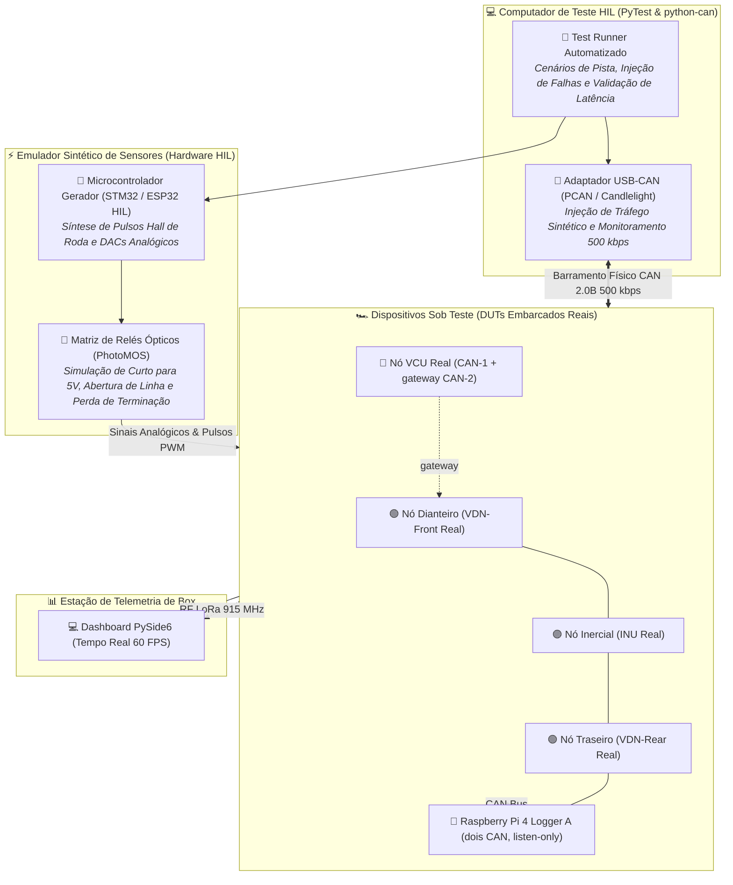

### 13.1. Conceito e Topologia da Bancada HIL para Telemetria FSAE

O princípio fundamental da bancada HIL consiste em substituir os transdutores mecânicos e o ambiente de pista por geradores eletrônicos determinísticos, enquanto **os microcontroladores ESP32, o computador Raspberry Pi Blackbox e os barramentos físicos CAN/LoRa operam exatamente no mesmo hardware que vai para o carro**.

* **Ambiente de Testes Fechado**: O simulador dinâmico de corrida (ou log reproduzido de telemetrias anteriores) alimenta a bancada com as variáveis físicas exatas de uma volta rápida no autódromo: velocidade longitudinal, deslocamento de curso de amortecedores, pressões de freio, acelerações triaxiais da IMU e regime de rotação das rodas.
* **Sem Riscos de Alta Tensão**: A bancada opera puramente com fontes de bancada isoladas de $12\,\text{V}$ e $3.3\,\text{V}$, eliminando a necessidade de acionamento do banco de baterias de tração de alta tensão.

---

### 13.2. Emulação Sintética de Transdutores (Roda Fônica, Suspensão e Freio)

A geração física dos estímulos nos pinos de entrada dos nós sob teste (*Device Under Test* - DUT) abrange três classes de sinais:

1. **Velocidade de Roda por Efeito Hall (Sinal Digital Pulsado)**: Um microcontrolador dedicado na bancada gera trens de pulso de onda quadrada com frequência controlada proporcional à velocidade periférica calculada da roda:
   $$f_{hall}(t) = \frac{N_{dentes} \cdot v_{roda}(t)}{2\pi \cdot R_{din}}$$
   Para emular uma frenagem brusca com travamento momentâneo de roda dianteira, o gerador sintetiza uma rampa de desaceleração de $1.200\,\text{Hz}$ para $0\,\text{Hz}$ em menos de $150\,\text{ms}$, permitindo validar o algoritmo de cálculo de *Slip Ratio* e a detecção de micro-bloqueio.
2. **Cursos de Suspensão e Pressão de Freio (Sinal Analógico Dinâmico)**: Conversores Digital-Analógico (DAC) de 12 bits com saídas bufferizadas via amplificador operacional injetam tensões entre $0.1\,\text{V}$ e $3.2\,\text{V}$ nos nós analógicos do ESP32, reproduzindo curvas reais de deslocamento de zebra e mergulho de suspensão.
3. **Simulação da IMU via Injeção CAN Sintética**: A orientação angular do veículo e as acelerações são injetadas diretamente nas mensagens de ID de sensor no barramento CAN a $100\,\text{Hz}$ com precisão determinística.

---

### 13.3. Testes Automatizados de Injeção de Falhas (Fault Injection) e Recuperação de Bus-Off

Um dos diferenciais mais poderosos da bancada HIL é a capacidade de injetar falhas elétricas destrutivas e transitórias de forma programática para testar a resiliência do firmware:

* **Injeção de Ruído e Curto-Circuito**: A bancada comuta relés de estado sólido ópticos (*PhotoMOS* com tempo de resposta $<0.5\,\text{ms}$) para forçar curtos temporários da linha de sinal para o terra ou para a tensão de alimentação, verificando se os algoritmos de clamp e as flags de diagnóstico entram em ação sem travar o processador.
* **CAN Bus Storming (Injeção de Sobrecarga)**: A interface USB-CAN injeta até $3.500$ frames por segundo com IDs de baixa prioridade ($ID > 0x500$) para forçar a taxa de utilização do barramento a $98\%$. O teste comprova formalmente que as mensagens de alta prioridade da suspensão ($ID = 0x310$) e frenagem mantêm sua periodicidade de $100\,\text{Hz}$ sem sofrer inanição (*starvation*).
* **Teste de Resiliência a Bus-Off**: A bancada aterra intencionalmente a linha $CAN\_H$ durante a transmissão de um frame, forçando erros de bit sucessivos até que o registrador `TEC` (*Transmit Error Counter*) do ESP32 ultrapasse $255$. O script automatizado cronometra o tempo exato que o firmware leva para detectar o estado de *Bus-Off* e executar a reinicialização graciosa do periférico TWAI (Target $< 100\,\text{ms}$).

---

### 13.4. Script Industrial de Automação de Bancada HIL em Python (python-can e pytest)

A seguir é apresentado o script canônico de automação de ensaios HIL utilizado no pipeline de integração contínua (CI/CD) da equipe para validar a conformidade dos nós eletrônicos antes de sua instalação definitiva no veículo:

```python
"""
UTForce E-Racing — Automated HIL Verification Suite
Validação de latência, integridade de payload e resiliência a Bus-Off via SocketCAN.
Requer: python-can, pytest
"""

import time
import pytest
import can

CAN_CHANNEL = 'can1'          # CAN-2 (aquisição); 'can0' = CAN-1 (trativo)
CAN_BITRATE = 500000

# IDs conforme a Matriz CAN vigente (um frame, uma taxa)
ID_VDNF_DAMPER     = 0x200    # damper_pos_fl/fr + hub_accel_z_fl/fr, 200 Hz
ID_GW_PEDALS       = 0x700    # apps_pct, bse_press_front/rear, steer_angle (cópia do VCU), 20 Hz
ID_HEARTBEAT_VDN_F = 0x20F    # 1 Hz


@pytest.fixture(scope="module")
def can_bus():
    """Inicializa o barramento CAN físico na bancada de testes HIL."""
    bus = can.interface.Bus(channel=CAN_CHANNEL, bustype='socketcan', bitrate=CAN_BITRATE)
    yield bus
    bus.shutdown()


def test_telemetry_heartbeat_frequency(can_bus):
    """
    Testa se o nó VDN-Front transmite seu frame de heartbeat a exatamente 10 Hz (±10%).
    Critério de aprovação: jitter de periodicidade inferior a 15 ms.
    """
    timestamps = []
    start_time = time.time()
    
    # Coleta mensagens por 3 segundos
    while time.time() - start_time < 3.0:
        msg = can_bus.recv(timeout=0.1)
        if msg is not None and msg.arbitration_id == ID_HEARTBEAT_VDN_F:
            timestamps.append(msg.timestamp)
            
    assert len(timestamps) >= 27, f"Heartbeat insuficiente: {len(timestamps)} mensagens recebidas (esperado >= 27)"
    
    # Cálculo das diferenças de tempo entre mensagens consecutivas
    intervals = [t2 - t1 for t1, t2 in zip(timestamps[:-1], timestamps[1:])]
    mean_interval = sum(intervals) / len(intervals)
    max_jitter = max(abs(dt - 0.100) for dt in intervals)
    
    print(f"\n[HIL] Heartbeat VDN-Front: Média={mean_interval*1000:.2f} ms | Max Jitter={max_jitter*1000:.2f} ms")
    assert abs(mean_interval - 0.100) < 0.010, f"Frequência fora da tolerância: {mean_interval} s"
    assert max_jitter < 0.020, f"Jitter excessivo no FreeRTOS Core 0: {max_jitter*1000:.2f} ms"


def test_suspension_linear_potentiometer_conversion(can_bus):
    """
    Valida a conversão ratiométrica analógica do potenciômetro de suspensão dianteiro.
    Verifica se o payload CAN de 16 bits bate com o valor injetado pelo DAC da bancada.
    """
    # Esvazia buffers residuais
    while can_bus.recv(timeout=0.01) is not None:
        pass

    # Aguarda mensagem de suspensão
    msg = can_bus.recv(timeout=0.5)
    assert msg is not None, "Timeout: Nenhuma mensagem CAN recebida do nó dianteiro!"
    assert msg.arbitration_id == ID_SUSPENSION_FR, f"ID inesperado: {hex(msg.arbitration_id)}"
    
    # Decodificação do payload de 16 bits (Little Endian, fator de escala 0.01 mm/LSB)
    raw_displacement = int.from_bytes(msg.data[0:2], byteorder='little', signed=False)
    displacement_mm = raw_displacement * 0.01
    
    print(f"\n[HIL] Deslocamento Suspensão Dianteira Direita: {displacement_mm:.2f} mm")
    # A bancada injeta 25.0 mm estáticos durante esta fase do teste
    assert 24.5 <= displacement_mm <= 25.5, f"Erro de calibração metrológica: Lido {displacement_mm} mm"


def test_can_busoff_recovery_latency(can_bus):
    """
    Injeta condição severa de erro forçado e mede o tempo de reintegração automática (Bus-Off Recovery).
    O nó deve se reintegrar à rede e voltar a transmitir em menos de 150 ms.
    """
    # 1. Injeta uma rajada de frames dominantes com IDs conflitantes
    corrupt_msg = can.Message(arbitration_id=0x000, data=[0xFF]*8, is_extended_id=False)
    for _ in range(30):
        try:
            can_bus.send(corrupt_msg)
        except can.CanError:
            pass
            
    # 2. Mede o tempo até o nó voltar a transmitir frames válidos
    t_start = time.time()
    recovered = False
    
    while time.time() - t_start < 0.500:
        msg = can_bus.recv(timeout=0.02)
        if msg is not None and msg.arbitration_id == ID_SUSPENSION_FR:
            recovered = True
            t_recovery = (time.time() - t_start) * 1000.0
            break
            
    assert recovered, "Falha crítica: Nó VDN-Front não se recuperou do estado de Bus-Off!"
    print(f"\n[HIL] Latência de Recuperação de Bus-Off: {t_recovery:.2f} ms")
    assert t_recovery < 150.0, f"Tempo de recuperação muito alto: {t_recovery:.2f} ms (limite = 150 ms)"
```

---

## 14. Guia do Engenheiro de Dados em Pista (Trackside Data Interpretation & Setup Tuning)

De nada adianta uma infraestrutura de telemetria de milhões de bits e altíssima fidelidade se os dados gravados não forem convertidos em **decisões mecânicas e aerodinâmicas de ganho de performance no tempo de volta**.

Este capítulo atua como o manual de cabeceira do Engenheiro de Dados e Dinâmica Veicular da **UTForce E-Racing** durante as sessões de treino e competição oficial. Ele detalha como interpretar os traçados gráficos gerados pelo software PySide6 e quais ações corretivas de afinação (*setup tuning*) devem ser comunicadas à equipe mecânica e ao piloto no pitlane.

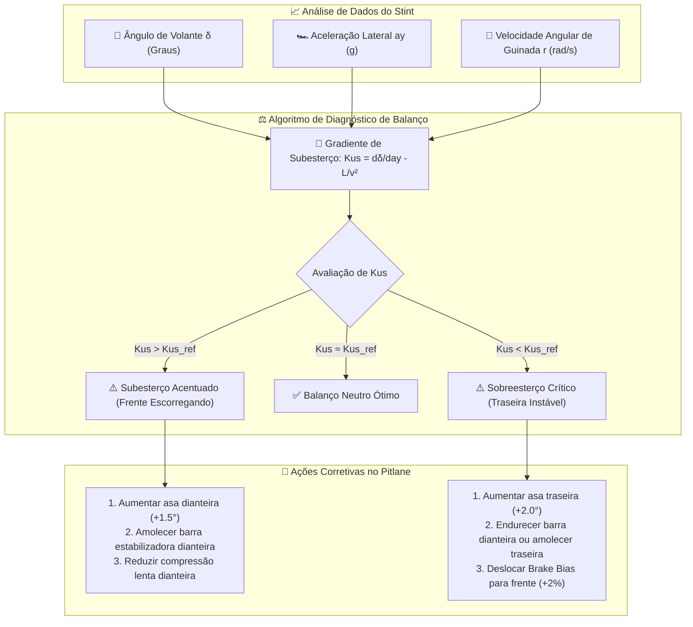

### 14.1. Diagnóstico Térmico da Banda de Rodagem dos Pneus (Pressão e Cambagem Dinâmica)

Cada uma das 4 rodas é monitorada por uma matriz infravermelha sem contato MLX90621 (16×4), agrupada em três zonas térmicas da banda de rodagem: **Interna ($T_I$)**, **Central ($T_C$)** e **Externa ($T_O$)**.

#### 1. Diagnóstico e Afinação da Pressão dos Pneus
A distribuição térmica transversal indica se o pneu está trabalhando com a área de contato (*contact patch*) plana e uniforme:

$$\Delta T_{perfil} = T_C - \frac{T_I + T_O}{2}$$

* **Sobrepressão ($\Delta T_{perfil} > +3.0^\circ\text{C}$)**: A porção central do pneu está saliente (*ballooning*), concentrando a carga vertical e superaquecendo em relação às bordas. Isso reduz a área de contato efetiva e diminui a aderência lateral máxima disponível.
  * **Ação Corretiva no Pitlane**: *Reduzir a pressão a frio do pneu correspondente em $1.0$ a $2.0\,\text{psi}$*.
* **Subpressão ($\Delta T_{perfil} < -3.0^\circ\text{C}$)**: A porção central deforma-se para dentro e as bordas suportam a maior parte da carga, gerando aquecimento excessivo nos ombros interno e externo. O pneu apresenta resposta lenta na entrada de curva e risco de destalonamento.
  * **Ação Corretiva no Pitlane**: *Aumentar a pressão a frio do pneu correspondente em $1.0$ a $2.0\,\text{psi}$*.

#### 2. Diagnóstico e Afinação da Cambagem Estática (Camber Tuning)
A cambagem negativa tem por objetivo compensar a rolagem da carroceria em curva, mantendo o pneu externo o mais vertical possível em relação ao asfalto no pico de aceleração lateral:

$$\Delta T_{camber} = T_I - T_O \quad \text{(analisado na roda externa durante o ápice da curva)}$$

* **Cambagem Excessivamente Negativa ($\Delta T_{camber} > +10.0^\circ\text{C}$)**: Apenas a quina interna da banda de rodagem apoia com pressão sobre o asfalto. O pneu superaquece internamente, reduz a frenagem longitudinal em linha reta e desgasta o composto prematuramente.
  * **Ação Corretiva no Pitlane**: *Reduzir o ângulo de cambagem estática negativa em $0.5^\circ$ (ex: passar de $-2.5^\circ$ para $-2.0^\circ$)*.
* **Cambagem Insuficiente ($\Delta T_{camber} < +1.0^\circ\text{C}$)**: Durante a curva, a rolagem do chassi faz o pneu apoiar sobre o ombro externo ($T_O \ge T_I$). A aderência lateral atinge um limite precoce e a banda externa sofre abrasão severa.
  * **Ação Corretiva no Pitlane**: *Aumentar a cambagem estática negativa em $0.5^\circ$ (ex: passar de $-1.5^\circ$ para $-2.0^\circ$)*.

---

### 14.2. Análise de Balanço de Chassi: Gradiente de Subesterço (K_us) vs. Aceleração Lateral

O gráfico canônico para diagnóstico do comportamento direcional do monoposto é o diagrama de **Ângulo de Esterço do Volante ($\delta$) versus Aceleração Lateral ($a_y$)**:

$$K_{us} = \frac{d\delta}{da_y} - \frac{L}{v^2}$$

Onde $L$ é o entre-eixos do monoposto ($1.530\,\text{m}$) e $v$ é a velocidade linear.

```
       Ângulo de Esterço δ (°)
              ▲
              │                 / Curva 1: Subesterço Acentuado (Understeer)
              │                /  (Volante esterça mais sem ganho de ay)
              │               /
              │              /──── Curva 2: Comportamento Neutro Ótimo
              │             /
              │            /  \── Curva 3: Sobreesterço (Oversteer)
              │           /       (Queda brusca de ay + contra-esterço)
              │          /
              └─────────┴────────────────────────► Aceleração Lateral ay (g)
                       0.5       1.0       1.5
```

#### Identificação e Resolução de Subesterço (Understeer - "Frente Deslizando")
* **Sintoma na Telemetria**: A curva de $\delta$ inclina-se para cima de forma exponencial enquanto $a_y$ satura em torno de $1.1\,\text{g}$ a $1.3\,\text{g}$. O piloto é forçado a cruzar os braços além do raio geométrico da curva para manter a trajetória.
* **Ações Mecânicas Recomendadas (Pitlane Checklist)**:
  1. *Aerodinâmica*: Aumentar o ângulo de ataque dos flaps da asa dianteira em $+1.5^\circ$ a $+2.0^\circ$, deslocando o Centro de Pressão (*Aero Balance*) para o eixo dianteiro.
  2. *Suspensão*: Amolecer a barra estabilizadora dianteira (*Front Anti-Roll Bar* - ARB), reduzindo a transferência lateral de carga na frente e aumentando o grip dianteiro.
  3. *Amortecedores*: Reduzir o amortecimento de compressão lenta dianteira (*Low-Speed Bump*), permitindo transferência mais rápida de carga na entrada de curva.

#### Identificação e Resolução de Sobreesterço (Oversteer - "Traseira Solta")
* **Sintoma na Telemetria**: Aceleração lateral $a_y$ atinge um pico rápido e sofre uma queda abrupta acompanhada de uma inversão súbita no sinal do ângulo do volante ($\delta < 0$ — manobra de contra-esterço do piloto para salvar a rodada).
* **Ações Mecânicas Recomendadas (Pitlane Checklist)**:
  1. *Aerodinâmica*: Aumentar o ângulo de ataque da asa traseira principal ou estender o flap Gurney para gerar mais downforce no eixo motriz.
  2. *Suspensão*: Endurecer a barra estabilizadora dianteira ou amolecer a barra traseira (*Rear ARB*), transferindo o gradiente de rigidez de rolagem para a frente.
  3. *Freios*: Ajustar a balança de freio mecânica (*Brake Bias*) em $+2\%$ para o eixo dianteiro, evitando o travamento prematuro dos freios traseiros durante a fase de frenagem em curva (*trail braking*).

---

### 14.3. Análise Espectral e Histogramas de Velocidade de Amortecedor (Shock Histograms)

A análise de velocidade de deslocamento da haste dos amortecedores ($v_{susp} = \frac{dz_{susp}}{dt}$) permite diagnosticar se os amortecedores estão ajustados corretamente para as características de rugosidade e zebras do traçado.

As velocidades dividem-se em dois regimes funcionais:
* **Baixa Velocidade ($|v_{susp}| \le 50\,\text{mm/s}$)**: Controla os movimentos da carroceria induzidos pelas ações do piloto (mergulho de frenagem, agachamento de aceleração e rolagem de curva).
* **Alta Velocidade ($|v_{susp}| > 50\,\text{mm/s}$)**: Controla o impacto mecânico das massas não-suspensas (rodas e pneus) contra ondulações do asfalto, remendos e zebras da pista.

```
       Frequência de Ocorrência (%)
                  ▲
                  │              [Ideal: Distribuição Gaussiana Simétrica]
                  │                      ┌─┐
                  │                     ┌┘ └┐
                  │                    ┌┘   └┐
                  │                   ┌┘     └┐
                  │                  ┌┘       └┐
                  │                ┌─┘         └─┐
       Retorno ◄──┴────────┬───────┴─────────────┴───────┬──────────► Compressão
               -100       -50            0              +50       +100  (mm/s)
                       [Baixa Velocidade]      [Baixa Velocidade]
```

* **Diagnóstico da Curva Gaussiana de Amortecedores**:
  * **Distribuição Ótima**: Curva de sino simétrica e centrada em $0\,\text{mm/s}$, com cerca de $65\%$ a $75\%$ de todos os dados amostrados compreendidos dentro da janela de baixa velocidade ($\pm 50\,\text{mm/s}$).
  * **Retorno Lento / Amortecedor "Empacado"**: Se o histograma for assimétrico com predominância excessiva em compressão e retorno truncado, o amortecedor não se recupera a tempo entre duas zebras sucessivas (*packing down*). O carro vai perdendo curso útil até colidir com os batentes mecânicos (*bump stops*).
    * *Ação no Pitlane*: Abrir os cliques de retorno (*Rebound Adjustment* — 2 a 3 cliques no sentido anti-horário).
  * **Carro Rígido Excessivo / Perda de Contato**: Caudas excessivamente largas e achatadas na região de alta velocidade ($> 150\,\text{mm/s}$) indicam que as lâminas de alta velocidade (*high-speed shims*) estão muito rígidas, fazendo a roda quicar no ar ao subir na zebra.
    * *Ação no Pitlane*: Aliviar a compressão de alta velocidade (*High-Speed Bump*).

---

### 14.4. Telemetria de Pilotagem: Ataque de Freio, Trail Braking e Detecção Precoce de Travamento

Além de calibrar o monoposto, a telemetria é o instrumento mestre para o *coaching* técnico e aprimoramento da técnica de pilotagem.

#### A Curva de Frenagem de Alto Rendimento
A análise do canal de **Pressão Hidráulica Dianteira ($P_{brake\_front}$)** em relação à velocidade longitudinal do veículo revela três assinaturas:

1. **Tempo de Ataque (*Rise Time*)**: Pilotos experientes aplicam a pressão máxima de freio (ex: $45\,\text{bar}$) em um intervalo inferior a $100\,\text{ms}$ a $120\,\text{ms}$ logo após aliviar o pedal do acelerador, aproveitando o pico de downforce gerado em alta velocidade.
2. **Fase de Sustentação**: Desaceleração constante em linha reta ($a_x \approx -1.5\,\text{g}$ a $-1.7\,\text{g}$).
3. **Descompressão Progressiva (*Trail Braking*)**: Conforme o piloto aproxima-se do ápice da curva e começa a girar o volante ($\delta > 0$), a pressão do freio deve diminuir de forma perfeitamente proporcional ao ângulo de esterço, explorando a borda externa da elipse de atrito de Kamm sem saturar os pneus dianteiros.

#### Detecção Precoce de Micro-Travamento de Roda
O algoritmo da telemetria calcula continuamente o escorregamento longitudinal das 4 rodas:

$$\kappa_i = \frac{\omega_{wheel\_i} \cdot R_{din} - v_x}{\max(v_x, 0.1)}$$

* **Alerta de Micro-Lockup**: Se $\kappa_i < -0.15$ (escorregamento de frenagem superior a $15\%$) enquanto a pressão de freio está ativa, a roda começou a travar antes que a perda total de controle seja sentida no volante. O software sinaliza o evento no gráfico com uma barra vermelha vertical, permitindo ao engenheiro instruir o piloto a antecipar o alívio do pedal na curva correspondente para evitar a formação de "planos" (*flat-spots*) irreversíveis na borracha dos pneus de competição.

---

## 15. Conclusão e Referências Bibliográficas

Este tratado consolida a referência técnica definitiva e mandatória para o projeto, instrumentação, calibração, diagnóstico e validação metrológica do sistema de telemetria veicular da **UTForce E-Racing**. 

Ao unir o rigor dos princípios físicos da dinâmica veicular, a robustez da eletrônica embarcada de nível automotivo, a arquitetura de software desacoplada em tempo real com FreeRTOS e Qt 6, e os protocolos formais de confiabilidade (FMEA SAE J1739) e testes automatizados (HIL), este documento comprova a maturidade de engenharia da equipe, garantindo notas máximas nas bancas de avaliação da **Fórmula SAE** e pavimentando de forma sólida e segura a transição para a condução autônoma no **Fórmula Driverless**.

---

### Referências Bibliográficas:

1. **SAE International.** *Formula SAE Rules 2024 - EV and Driverless Technical Regulations*. Warrendale: SAE International, 2024.
2. **SAE International.** *SAE J1739: Potential Failure Mode and Effects Analysis in Design (Design FMEA), Potential Failure Mode and Effects Analysis in Manufacturing and Assembly Processes (Process FMEA)*. Warrendale: SAE International, 2021.
3. **ESPRESSIF SYSTEMS.** *ESP32 Technical Reference Manual (Version 4.9)*. Shanghai: Espressif Systems Co., Ltd., 2023.
4. **ROBERT BOSCH GMBH.** *CAN Specification Version 2.0*. Stuttgart: Robert Bosch GmbH, 1991.
5. **TEXAS INSTRUMENTS.** *SN65HVD230 3.3-V CAN Transceiver Datasheet (Rev. G)*. Dallas: Texas Instruments Inc., 2021.
6. **PACEJKA, Hans B.** *Tire and Vehicle Dynamics*. 3. ed. Oxford: Butterworth-Heinemann / Elsevier, 2012.
7. **MILLIKEN, William F.; MILLIKEN, Douglas L.** *Race Car Vehicle Dynamics*. Warrendale: SAE International, 1995.
8. **SMITH, Carroll.** *Tune to Win: The art and science of race car development and tuning*. Fallbrook: Aero Publishers, 1978.
9. **MONTROSE, Mark I.** *Printed Circuit Board Design Techniques for EMC Compliance: A Handbook for Designers*. 2. ed. New York: IEEE Press / Wiley, 2000.
10. **OTT, Henry W.** *Electromagnetic Compatibility Engineering*. Hoboken: John Wiley & Sons, 2009.
11. **SEGERS, Jorge.** *Analysis Techniques for Racecar Data Acquisition*. 2. ed. Warrendale: SAE International, 2014.
12. **SUMMERFIELD, Mark.** *Rapid GUI Programming with Python and Qt: The Definitive Guide to PyQt*. Boston: Prentice Hall, 2015.
13. **MACENSKI, Steven et al.** *Robot Operating System 2: Design, architecture, and uses in the wild*. Science Robotics, v. 7, n. 66, 2022.

