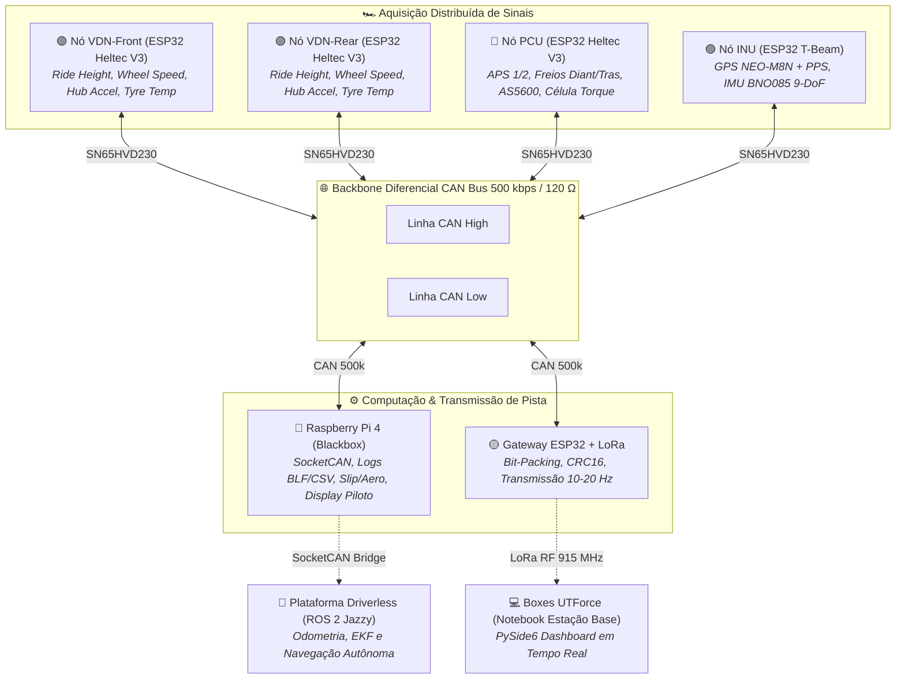
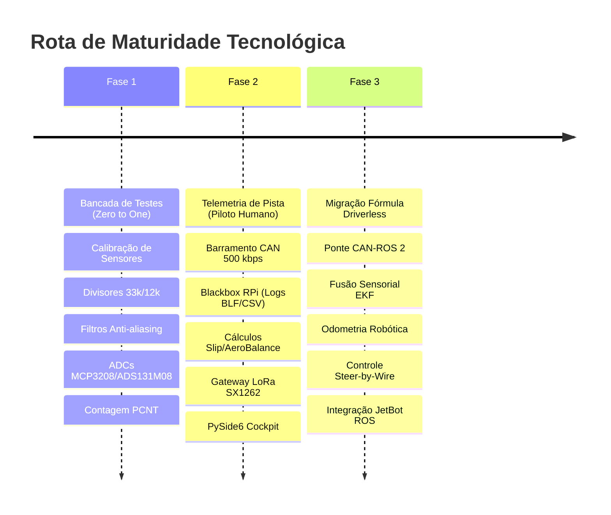

# 📡 Hardware de Telemetria Embarcada — UTForce E-Racing

> [!important] Este hub foi superado — a fonte única agora é o Plano
> Em 2026-09-14 a arquitetura foi revisada contra os datasheets dos componentes escolhidos (Orion BMS, CVW300, ADS131M08, Heltec V3, T-Beam, GP2Y0A21). Vários números das notas abaixo estão **errados ou conflitantes** entre si.
>
> Consulte, nesta ordem:
> 1. [[🧭 Plano do Sistema de Telemetria (FSAE Eletrico)]] — **o que construir**, com pinagem, matriz CAN, condicionamento e fases
> 2. [[📐 Especificacao do Sistema de Aquisicao (FSAE Eletrico)]] — as justificativas de engenharia
> 3. [[📋 Revisao da Arquitetura Planejada (Miro)]] — o que estava errado e por quê
>
> As notas listadas abaixo ficam como **histórico**. Onde discordarem do Plano, o Plano vale. Em especial: a [[📊 Matriz de Mensagens CAN e Dicionario de IDs (DBC Veicular)]], o [[📊 Dicionario Completo de Canais, Fontes e Taxas de Amostragem (Hz)]] e o [[📌 Mapa Definitivo de Pinos do ESP32 (Pinout, Strapping Pins, ADC1 vs ADC2 e Regras de Ouro)]] foram integralmente substituídos pelas seções 4, 6 e 7 do Plano.

> Arquitetura física, eletrônica embarcada, barramento CAN diferencial, computação de borda e aquisição distribuída de sinais de alta frequência para o monoposto da UTForce E-Racing.

---

## 🏎️ 1. Propósito e Filosofia de Engenharia

O sistema de telemetria embarcada da UTForce foi concebido para resolver o maior desafio de engenharia em testes de pista: **transformar grandezas físicas mecânicas e térmicas em dados limpos, sincronizados e de alta frequência (até 100 Hz), com imunidade eletromagnética a inversores de alta tensão e garantia de integridade contra desligamento súbito**.

O projeto adota uma **arquitetura distribuída em nós inteligentes** interconectados pelo barramento padrão automotivo **CAN 2.0B a 500 kbps**, evitando chicotes elétricos longos e pesados com fios analógicos suscetíveis a ruído EMI.

---

## 🗺️ 2. A Jornada Evolutiva em 3 Fases

Para garantir escalabilidade, modularidade e mitigação de riscos, a engenharia de telemetria é dividida em três estágios:

1. **Fase 1 — Bancada de Testes & Coleta Inicial (*Zero to One*):**
   * Calibração individual de sensores analógicos (0-5V e 0-10V ratiométricos).
   * Circuitos dedicados de condicionamento: divisores $33\,\text{k}\Omega / 12\,\text{k}\Omega$, filtros passa-baixa RC ($1\,\text{k}\Omega / 100\,\text{nF}$, corte a $1.6\,\text{kHz}$), e amplificadores de instrumentação **INA333** ($G \approx 200 \sim 300\times$).
   * Amostragem de alta fidelidade sem ruído do ADC interno via conversores externos **MCP3208** (12-bit SPI), **ADS131M08** (24-bit simultâneo) e **ADS1115** (16-bit).
   * Contagem determinística de dentes de roda fônica com **TLE4922** através do periférico de hardware **PCNT** (*Pulse Counter*) do ESP32.

2. **Fase 2 — Telemetria Completa de Pista com Piloto:**
   * Integração de todos os nós no backbone CAN a 500 kbps com transceivers **SN65HVD230** e terminação de $120\,\Omega$.
   * Computador de bordo **Raspberry Pi 4** gravando continuamente frames raw CAN em formato industrial `.blf` (*Binary Logging Format*) e `.csv`, imune a desligamento forçado por queda de chave geral.
   * Modelagem de física veicular embarcada: cálculo de *Slip Ratio*, *Slip Angle*, *AeroBalance*, e acelerações $G\text{-}G$ em tempo real alimentando o display do piloto.
   * Gateway **ESP32 + LoRa SX1262** com algoritmo de *bit-packing* e verificação CRC16, transmitindo telemetria prioritária com alcance de 1 a 3 km até a Estação Base nos boxes.
   * Interface gráfica de engenharia nativa em **PySide6 / pyqtgraph** desenvolvida por Lucas Christen ([[📡 Software de Telemetria UTForce - Visao Geral|Software de Telemetria]]).

3. **Fase 3 — Transição para Plataforma Fórmula Driverless:**
   * Transformação da rede CAN na espinha dorsal sensorial de baixo nível para condução autônoma.
   * Ponte bidirecional `socketcan_bridge` convertendo frames veiculares em tópicos ROS 2 padronizados (`/wheel_speeds`, `/imu/data_raw`, `/gps/fix`, `/steering_angle`).
   * Fusão sensorial com Filtro de Kalman Estendido (**EKF** via nó `robot_localization`) unindo velocidades de roda dos 4 cantos, acelerações/orientação da IMU BNO085 e coordenadas GPS NEO-M8N sincronizadas por sinal PPS.
   * Interligação direta com o pipeline autônomo já validado no projeto [[🤖 Plataforma Autonoma JetBot ROS 2 - Visao Geral|JetBot ROS 2]] (LiDAR PCA, Follow-the-Gap e perfilamento adaptativo de velocidade AIMD).

---

## 📂 3. Navegação Estruturada do Módulo

> [!TIP]
> ### 📖 Manual Mestre Unificado
> Para uma leitura linear e completa de todo o sistema — da física do asfalto ao carro autônomo, incluindo padrões de código, metodologia "Grill-Me", SOP de pista e troubleshooting — consulte o **[[📖 Manual Mestre de Telemetria Veicular - Do Sensor Fisico ao Carro Autonomo|📖 Manual Mestre de Telemetria Veicular]]**.

### 📘 Guias Fundamentais & Formação Técnica (Onboarding de Bancada)
* 📘 **Arquitetura & Dual-Core:** [[📘 Guia Fundamental do ESP32 (Arquitetura, Dual-Core, Perifericos e Limites Eletricos)|Guia Fundamental do ESP32 (Arquitetura, Dual-Core e Limites)]]
* 📌 **Pinout & Strapping Pins:** [[📌 Mapa Definitivo de Pinos do ESP32 (Pinout, Strapping Pins, ADC1 vs ADC2 e Regras de Ouro)|Mapa Definitivo de Pinos do ESP32 (Pinout e Regras de Ouro)]]
* 🔌 **Conexão de Sensores:** [[🔌 Guia Pratico de Conexao de Sensores (Analogicos, Digitais, I2C, SPI e Niveis Logicos)|Guia Prático de Conexão de Sensores (Analógicos, Digitais, I2C, SPI e Níveis Lógicos)]]
* 📋 **Tabela Mestre de Fiação:** [[📋 Tabela Mestre de Fiacao e Pinagem dos Sensores do Veiculo|Tabela Mestre de Fiação, Pinagem dos Nós e Checklist Anti-Queima]]

### 🏎️ Especificações de Engenharia & Módulos do Sistema
| Módulo Técnico | Descrição dos Tópicos Abordados |
| :--- | :--- |
| **[[🌐 Topologia Macro da Rede CAN 500k e Distribuicao dos Nos|01 - Topologia & Nós]]** | Arquitetura do barramento, chicote Deutsch, nós VDN-Front, VDN-Rear, PCU e INU, fontes de alimentação e proteções elétricas TVS. |
| **[[📊 Dicionario Completo de Canais, Fontes e Taxas de Amostragem (Hz)|02 - Sensores & Condicionamento]]** | Catálogo exaustivo de 70+ canais, taxas de 20 Hz / 10 Hz / 2 Hz / 1 Hz, esquemáticos de divisores, filtros RC, ADCs MCP3208/ADS131M08 e montagens mecânicas. |
| **[[🌐 Arquitetura CAN 2.0B (500 kbps), Transceivers SN65HVD230 e Terminacao|03 - Barramento CAN & Firmware]]** | Matriz DBC de mensagens, transceivers SN65HVD230, firmware PlatformIO em C++ com FreeRTOS, Core Pinning e filas circulares de baixa latência. |
| **[[🔴 Gateway e Logger Raspberry Pi (SocketCAN, Logs BLF e CSV)|04 - Gravação Blackbox (RPi)]]** | Serviço SocketCAN no Linux, gravação binária BLF sem corrupção em queda de energia (OverlayFS), cálculos matemáticos de AeroBalance e Slip. |
| **[[📡 Modulo LoRa SX1262, Bit-Packing Compacto e CRC16|05 - Telemetria Sem Fio (LoRa)]]** | Compressão de payloads binários por bit-packing, CRC16, modulação SX1262 a 915 MHz, receptor USB Serial e ponte para a GUI PySide6. |
| **[[🤖 Arquitetura de Transicao: Da Telemetria Convencional ao Driverless|06 - Migração Driverless (ROS 2)]]** | Ponte CAN-ROS 2, tópicos de dinâmica veicular, odometria EKF, atuadores Steer-by-Wire e fusão com o simulador Gazebo e JetBot ROS 2. |

---

## 🔗 Relação com Outros Projetos no Cofre
* 💻 **Software de Telemetria de Boxes:** [[📡 Software de Telemetria UTForce - Visao Geral|Software Desktop PySide6]]
* 🤖 **Plataforma Autônoma:** [[🤖 Plataforma Autonoma JetBot ROS 2 - Visao Geral|JetBot ROS 2 (Jazzy / Harmonic)]]
* 🫀 **Percepção e Visão Computacional:** [[🫀 IA-MONITOR - Visao Geral|IA-MONITOR (NVIDIA Jetson / IC)]]
* 📋 **Hub Pessoal & Portfólio:** [[📡 Telemetria Embarcada & IoT - Hub Pessoal & Portfolio|Hub Pessoal Telemetria Embarcada]]
* 🏎️ **Visão Geral da Equipe:** [[🏎️ UTForce E-Racing - Visao Geral|UTForce E-Racing FSAE]]
