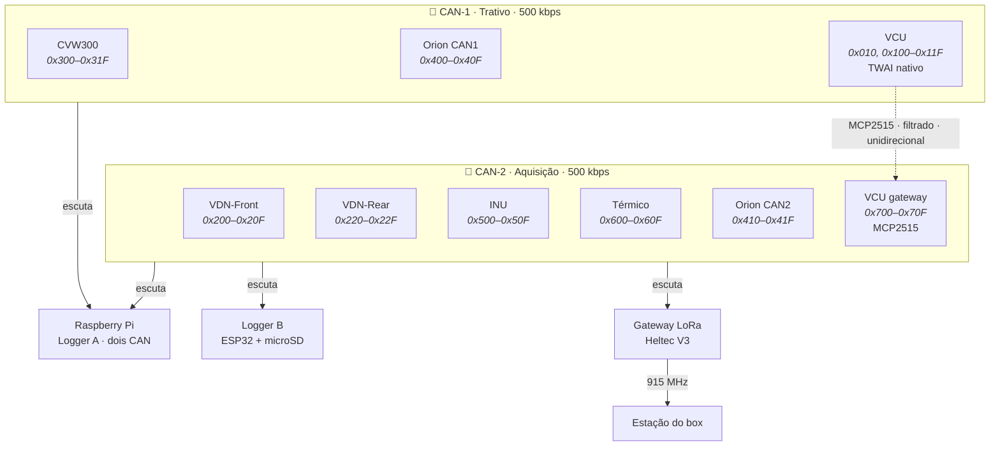
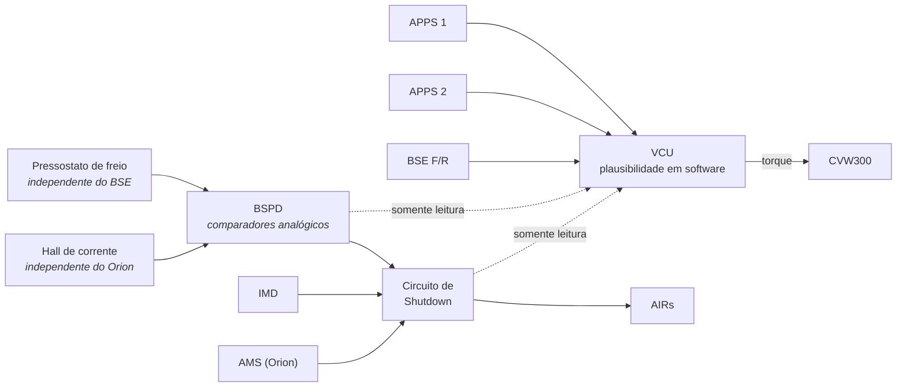

# 🧭 Plano do Sistema de Telemetria — FSAE Elétrico

> Versão executável. Substitui os diagramas do Miro e as notas de especificação anteriores como **fonte única** do projeto de aquisição. Tudo que está aqui foi verificado contra datasheet ou manual do fabricante; o que não foi está marcado.

**Escopo:** telemetria convencional com piloto humano. Conversão para autônomo fica fora deste plano — só se garante que as decisões daqui não a impeçam.

---

## 1. Decisões fechadas

Estas não estão mais em discussão. Mudar qualquer uma reabre o plano.

| Decisão | Valor | Motivo curto |
| :--- | :--- | :--- |
| Acumulador | 24s10p | Definido pela equipe |
| BMS | Orion BMS (original), CAN programável, 2 canais | Definido pela equipe |
| Inversor | WEG CVW300, CAN proprietário via WLP | Definido pela equipe |
| Motor | Um | Definido pela equipe |
| Barramentos | **Dois** CAN 2.0A a 500 kbps: Trativo e Aquisição | Isolamento de falha, §3.1 |
| MCU dos nós de sensor | **ESP32-S3-DevKitC-1** (sem rádio) | Elimina conflito com SX1262 da Heltec |
| MCU do INU | LilyGO T-Beam (GPS embutido) | GPS justifica a placa; pinos corrigidos em §6.3 |
| Rádio | **Uma** Heltec V3 dedicada, só transmite | É o que a placa foi feita para fazer |
| Logger principal | Raspberry Pi, dois CAN, **somente escuta** | Nunca transmite em nenhum barramento |
| Logger secundário | ESP32 + microSD no CAN-2, somente escuta | Redundância de registro, §3.2 |
| BSPD | Circuito analógico não-programável, fora do VCU | Exigência regulamentar, §3.3 |
| Ride height | Derivado do amortecedor; **sem sensor dedicado** | GP2Y0A21 não mede a faixa, ver [[📋 Revisao da Arquitetura Planejada (Miro)]] §3 |
| Nome do nó de controle | **VCU** (era PCU) | Nomenclatura padrão |

---

## 2. Princípios

Quatro regras. Toda escolha abaixo decorre de uma delas.

1. **A telemetria escuta, não arbitra.** Nenhum nó de aquisição está no caminho de segurança. Se todo o sistema de telemetria morrer, o carro continua seguro, porque quem age sobre o shutdown é o AMS, o IMD, o BSPD e o VCU — e o VCU age pelo CAN-1, que a telemetria não toca.

2. **Dado de segurança tem três cópias; dado de dinâmica tem duas.** APPS, freio, estados do circuito de shutdown: log local no VCU, log no Raspberry Pi, transmissão LoRa. Suspensão, rodas, IMU: log no Pi, log no Logger B. Nenhum registro depende de um único componente.

3. **Falha detectada vale mais que falha silenciosa.** Todo nó emite *heartbeat*. Ausência de heartbeat aparece no display do piloto em até 2 segundos. Sensor fora de faixa gera flag, não valor inventado.

4. **Um frame, uma taxa.** Canais com frequências diferentes vão em frames diferentes. É a regra que resolve o conflito entre o Dicionário de Canais e a Matriz CAN antigos.

---

## 3. Arquitetura

### 3.1 Topologia

**Por que dois barramentos.** Um nó de sensor com firmware instável pode entrar em *bus-off* e inundar o barramento com error frames. Se estiver no mesmo barramento do inversor, atrasa o comando de torque e as mensagens do AMS. No CAN-2, o pior que acontece é perder telemetria — que é exatamente o que a §2.1 permite.

**Por que o VCU é o gateway, e não o Pi.** O gateway precisa ser determinístico e estar sempre ligado. O ESP32-S3 tem **um único controlador TWAI**, então o segundo barramento entra por um MCP2515 em SPI. O Pi fica só escutando os dois — e nunca transmite.

### 3.2 Camadas de registro

| Camada | Onde | O que grava | Sobrevive a |
| :--- | :--- | :--- | :--- |
| **L1 — Local no VCU** | microSD no VCU | APPS, freio, direção, estados de segurança, torque; 100 Hz; buffer circular de 2 h | Falha do CAN-2, do Pi, do Logger B, do rádio |
| **L2a — Logger A** | Raspberry Pi | Tudo dos dois barramentos, formato BLF ou candump | Falha do rádio |
| **L2b — Logger B** | ESP32 + microSD no CAN-2 | Tudo do CAN-2 | Falha do Pi (queda de tensão, SD corrompido, kernel travado) |
| **L3 — Rádio** | Estação do box | Resumo a 10 Hz, 41 bytes | Destruição do carro |

O Logger B custa menos de R$ 100 e elimina o Raspberry Pi como ponto único de falha do registro. É a peça de melhor relação custo/benefício de todo o plano.

### 3.3 Cadeia de segurança — o que a telemetria só observa

Três exigências que saem daqui:

* **BSPD é hardware.** Comparadores, atraso RC, latch. Sem microcontrolador. Verificado contra implementações públicas que citam T11.6.x.
* **O BSPD tem sensores próprios.** Sensor Hall de corrente separado do Orion, pressostato separado dos transdutores do BSE. Se compartilhar sensor com o VCU, uma falha derruba os dois.
* **APPS1 e APPS2 vão em ADCs diferentes.** Dois sensores no mesmo chip não é redundância — é dois fios. Ver §5.

---

## 4. Catálogo de canais

Nome canônico único por grandeza. Os nomes antigos (`X_WHL`, `Hub Pos`, `Susp Position`, `delta Otake`…) viram alias de exibição no software de análise, não canal de aquisição.

### 4.1 Segurança e sistema trativo — VCU, CAN-1

| Canal | Tipo | Origem | Taxa |
| :--- | :--- | :--- | :---: |
| `sdc_ok` | bit | Entrada isolada do circuito de shutdown | evento + 1 Hz |
| `imd_ok` | bit | Saída OK do IMD | evento + 1 Hz |
| `ams_ok` | bit | Saída discreta do Orion | evento + 1 Hz |
| `bspd_ok` | bit | Saída do latch do BSPD | evento + 1 Hz |
| `air_pos_closed` / `air_neg_closed` | bit | Contato auxiliar dos AIRs | evento + 1 Hz |
| `precharge_done` | bit | Relé de pré-carga | evento + 1 Hz |
| `tsal_active` | bit | Lógica do TSAL | evento + 1 Hz |
| `rtd_active` | bit | Máquina de estados do VCU | evento + 1 Hz |
| `apps1_raw` / `apps2_raw` | u16 | Dois sensores, dois ADCs | 100 Hz |
| `apps_pct` | u16 × 0,01 % | Calculado após plausibilidade | 100 Hz |
| `apps_implausible` | bit | Desvio > 10 % por > 100 ms | 100 Hz |
| `bse_press_front` / `bse_press_rear` | u16 × 0,1 bar | Transdutores 0–100 bar | 100 Hz |
| `brake_pedal_pos` | u16 × 0,1 mm | Potenciômetro linear | 100 Hz |
| `bse_apps_implausible` | bit | APPS > 25 % com freio acionado | 100 Hz |
| `steer_angle` | i16 × 0,1 ° | AS5600 | 100 Hz |
| `steer_torque` | i16 × 0,01 Nm | Célula de carga + INA333 | 100 Hz |
| `regen_level` | u8 % | Potenciômetro de painel | 10 Hz |
| `torque_cmd` / `torque_actual` | i16 × 0,1 Nm | VCU / CVW300 | 100 Hz |

### 4.2 Powertrain — CVW300, CAN-1, telegramas definidos no WLP

| Canal | Tipo | Taxa | Observação |
| :--- | :--- | :---: | :--- |
| `motor_speed_rpm` | i16 | 100 Hz | Teto do CVW300: período mínimo 10 ms |
| `motor_torque_actual` | i16 × 0,1 Nm | 100 Hz | |
| `dc_bus_voltage` | u16 × 0,1 V | 100 Hz | |
| `dc_bus_current` | i16 × 0,1 A | 100 Hz | |
| `motor_temp` | i16 × 0,1 °C | 10 Hz | |
| `inverter_igbt_temp` | i16 × 0,1 °C | 10 Hz | |
| `inverter_status_word` / `inverter_fault_word` | u16 | 10 Hz + evento | |

> [!warning] Tarefa pendente
> Estes canais dependem de mapear os marcadores `%SW` do CVW300 no WLP. Ainda não foi feito. É pré-requisito para a matriz CAN do trativo (§7).

### 4.3 Acumulador — Orion, CAN-1 (crítico) e CAN-2 (resumo)

| Canal | Tipo | Barramento | Taxa |
| :--- | :--- | :---: | :---: |
| `ts_pack_voltage` | u16 × 0,1 V | CAN-1 e CAN-2 | 20 Hz / 10 Hz |
| `ts_pack_current` | i16 × 0,1 A | CAN-1 e CAN-2 | 20 Hz / 10 Hz |
| `soc_pct` | u8 % | CAN-1 e CAN-2 | 20 Hz / 10 Hz |
| `dcl` / `ccl` | u16 A | CAN-1 | 20 Hz |
| `cell_v_min` / `cell_v_max` | u16 mV | CAN-1 | 1 Hz |
| `cell_v_min_id` / `cell_v_max_id` | u8 | CAN-1 | 1 Hz |
| `cell_t_min` / `cell_t_max` | i8 °C | CAN-1 e CAN-2 | 1 Hz |
| `bms_fault_flags` | u16 | CAN-1 | evento + 1 Hz |
| `energy_consumed_kwh` | u16 × 0,001 | Calculado no Pi a partir de V×I | — |

### 4.4 Dinâmica — VDN-Front e VDN-Rear, CAN-2

| Canal | Tipo | Sensor | Taxa | Por quê |
| :--- | :--- | :--- | :---: | :--- |
| `damper_pos_[fl,fr,rl,rr]` | u16 × 0,01 mm | Potenciômetro linear 75 mm | **200 Hz** | Velocidade de amortecedor é derivada; massa não suspensa ressoa a 12–18 Hz |
| `hub_accel_z_[fl,fr,rl,rr]` | i16 × 0,01 g | **ADXL377** (±200 g) | 200 Hz | Zebra passa de 3 g; o ADXL335 saturava |
| `chassis_accel_z_[f,r]` | i16 × 0,001 g | ADXL335 (±3 g) — aqui serve | 100 Hz | Massa suspensa fica dentro de ±3 g |
| `wheel_speed_[fl,fr,rl,rr]` | u16 × 0,01 km/h | TLE4922 + roda fônica ≥ 30 dentes, PCNT | 100 Hz | Slip ratio precisa resolver dinâmica de roda |
| `tyre_temp_[fl,fr,rl,rr]_[in,mid,out]` | u8 + offset −40 °C | **MLX90621** (16×4) | 10 Hz | Um ponto não mostra gradiente de cambagem |

Canais **derivados no Pi** a partir destes — não são adquiridos: `damper_vel_*`, `ride_height_[f,r]`, `rake`, `slip_ratio_*`, `slip_angle_*`, `roll_angle_susp`, `pitch_angle_susp`.

### 4.5 Inercial e posição — INU, CAN-2

| Canal | Tipo | Taxa |
| :--- | :--- | :---: |
| `accel_[x,y,z]` | i16 × 0,001 g, **saída raw** do BNO085 | 100 Hz |
| `gyro_[roll,pitch,yaw]_rate` | i16 × 0,01 °/s | 100 Hz |
| `att_[roll,pitch]_angle` | i16 × 0,01 ° (fusão do BNO085) | 100 Hz |
| `gps_lat` / `gps_lon` | i32 × 1e-7 ° | 10 Hz |
| `gps_speed` / `gps_heading` / `gps_alt` | u16 × 0,01 km/h / u16 × 0,01 ° / i16 m | 10 Hz |
| `gps_sats` / `gps_fix` | u8 | 10 Hz (viajam em `0x503`) |
| `time_sync` | u32 epoch + u16 ms, na borda do PPS | **1 Hz** — base de tempo de todo o sistema |

### 4.6 Arrefecimento — nó Térmico, CAN-2

| Canal | Sensor | Taxa |
| :--- | :--- | :---: |
| `coolant_temp_motor_[in,out]` | NTC 10 kΩ ou PT1000 | 5 Hz |
| `coolant_temp_inv_[in,out]` | NTC 10 kΩ ou PT1000 | 5 Hz |
| `coolant_flow_lpm` | Sensor de vazão Hall | 5 Hz |
| `pump_duty_pct` / `fan_duty_pct` | Realimentação do PWM | 5 Hz |
| `gearbox_temp` | NTC 10 kΩ no cárter do redutor | 5 Hz |
| `lv_battery_voltage` | Divisor para o ADC | 5 Hz (viaja em `0x601`) |

### 4.7 Diagnóstico — todos os nós

Cada nó emite um frame de heartbeat a 1 Hz com: `uptime_s`, `can_tx_err`, `can_rx_err`, `bus_off_count`, `adc_fault_flags`, `sd_status`, `free_heap_kb`, `fw_version`.

### 4.8 O que foi eliminado

Os 26 canais de combustão e os 10 de P2P/pit-limiter da lista antiga; as três `Transmission Pressure`; os três sensores laser de ride height; os 36 nomes duplicados. Detalhe em [[📐 Especificacao do Sistema de Aquisicao (FSAE Eletrico)]] §3 e [[📋 Revisao da Arquitetura Planejada (Miro)]] §5.

---

## 5. Condicionamento por canal

Não existe "divisor padrão". O divisor pertence ao par sinal → ADC. Verificado contra os datasheets:

| ADC | Faixa de entrada real |
| :--- | :--- |
| **ADS131M08** | **±1,2 V** (referência interna 1,2 V, ganho 1). Diferencial; entrada negativa não pode ficar abaixo de AGND − 1,3 V. |
| **MCP3208** | 0 a V_REF. Com V_REF = 3,3 V, **0–3,3 V**. |
| **ADS1115** | ±4,096 V no ganho 1, mas entrada limitada a V_DD. **Alimentado em 5 V lê 0,5–4,5 V direto.** |

| Canal | Sinal | ADC de destino | Condicionamento | Saída no ADC |
| :--- | :--- | :--- | :--- | :---: |
| `apps1_raw` | 0,5–4,5 V | ADS131M08 AIN0 | Divisor **33 k / 12 k** (0,267) | 0,13–1,20 V |
| `apps2_raw` | 4,5–0,5 V (curva **invertida**) | **ADS1115 A0** (ADC separado) | **Nenhum**, ADS1115 em 5 V | 4,5–0,5 V |
| `bse_press_front` | 0,5–4,5 V | ADS131M08 AIN1 | 33 k / 12 k | 0,13–1,20 V |
| `bse_press_rear` | 0,5–4,5 V | ADS131M08 AIN2 | 33 k / 12 k | 0,13–1,20 V |
| `steer_torque` | ±5 mV (ponte) | ADS131M08 AIN3, **diferencial** (AINN = REF) | INA333, G ≈ 201 (R_G = 499 Ω), REF = 1,65 V (o INA333 em 3,3 V *single-supply* não desce abaixo de ~0,05 V) | ±1,0 V em torno de 1,65 V |
| `brake_pedal_pos` | 0–5 V pot | ADS131M08 AIN4 | Divisor **38 k / 12 k** (0,24) | 0–1,20 V |
| `regen_level` | 0–5 V pot | ADS1115 A1 | Nenhum | 0–5 V |
| `lv_battery_voltage` | 10–15 V | ADS1115 A2 | Divisor 33 k / 12 k (0,267) | 2,7–4,0 V |
| `damper_pos_*` | 0–5 V pot | MCP3208 CH0/CH1 | Divisor **12 k / 24 k** (0,667) | 0–3,33 V |
| `hub_accel_z_*` | 0–3,3 V (ADXL377 em 3,3 V) | MCP3208 CH2/CH3 | Só filtro RC 1 k / 100 nF | 0–3,3 V |
| `chassis_accel_z_*` | 0–3,3 V (ADXL335 em 3,3 V) | MCP3208 CH4 | Só filtro RC 1 k / 100 nF | 0–3,3 V |
| NTCs | Divisor com 10 k para 3,3 V | ADS1115 (nó Térmico) | Nenhum além do próprio divisor | 0–3,3 V |

**Filtro RC:** 1 kΩ / 100 nF (f_c ≈ 1,6 kHz) antes de todo canal do MCP3208. O capacitor também serve como reservatório de carga para o SAR, compensando a impedância de Thévenin do divisor (8,8 kΩ no 33 k/12 k).

> [!danger] Apague o "0,733×" do guia do Miro
> Esse fator leva 4,5 V a 3,30 V, que **satura o ADS131M08 em 2,75×**. Com 10 V na entrada dá 7,33 V — acima do AVDD. É o cartão de referência que vai para a bancada; corrigir antes de qualquer montagem.

---

## 6. Pinagem dos nós

### 6.1 VDN-Front e VDN-Rear — ESP32-S3-DevKitC-1

Idênticos em hardware e firmware; o ID do nó vem de um jumper lido no boot.

| Função | GPIO | Observação |
| :--- | :---: | :--- |
| CAN TX / RX | 6 / 7 | SN65HVD230, terminação só nas pontas do barramento |
| SPI2 — MCP3208 CS / MOSI / CLK / MISO | 10 / 11 / 12 / 13 | Pinos nativos do FSPI no S3 — os mesmos da Heltec, mas aqui livres |
| PCNT — roda esquerda / direita | 4 / 5 | Pull-up 4,7 k para 3,3 V |
| I²C0 — MLX90621 esquerdo SDA / SCL | 8 / 9 | |
| I²C1 — MLX90621 direito SDA / SCL | 17 / 18 | **Dois barramentos I²C** porque o MLX90621 tem endereço fixo 0x60 — dois no mesmo bus colidem |
| Jumper de ID | 21 | Aberto = Front, GND = Rear |
| LED de status | 48 | RGB da própria DevKitC |
| Livres para expansão | 14, 15, 16, 38–42, 47 | |

**Não usar:** 0, 3, 45, 46 (*strapping*), 19/20 (USB), 26–37 (flash e PSRAM do módulo), 43/44 (console UART0).

### 6.2 VCU — ESP32-S3-WROOM-1 em PCB própria

| Função | GPIO | Observação |
| :--- | :---: | :--- |
| CAN-1 TX / RX (TWAI nativo) | 6 / 7 | Barramento trativo |
| SPI2 — ADS131M08 CS / MOSI / CLK / MISO | 10 / 11 / 12 / 13 | |
| ADS131M08 DRDY / SYNC-RESET | 21 / 47 | DRDY em interrupção |
| SPI3 — MCP2515 CS / MOSI / CLK / MISO / INT | 14 / 15 / 16 / 17 / 18 | Segundo CAN, para o CAN-2 |
| SPI3 — microSD CS | 38 | Compartilha SPI3 com o MCP2515 |
| I²C0 SDA / SCL | 8 / 9 | AS5600 (0x36), ADS1115 (0x48), PCF8574 (0x20) |
| Entradas diretas isoladas: `sdc_ok`, `precharge_done`, `rtd_btn` | 39 / 40 / 41 | Optoacoplador, as três que o VCU precisa para agir |
| Entradas via PCF8574: `imd_ok`, `ams_ok`, `bspd_ok`, `air_pos`, `air_neg`, `tsal` | expansor I²C | Só telemetria; INT do expansor em 42 |
| Saídas: RTD sound, TSAL enable, luz de falha | 1 / 2 / 4 | Via driver |
| LED de status | 48 | |

### 6.3 INU — LilyGO T-Beam (ESP32 clássico)

Correção dos conflitos da nota anterior:

| Função | GPIO antigo | GPIO corrigido | Motivo |
| :--- | :---: | :---: | :--- |
| GPS RX (do NEO-M8N) | 34 | **34** ✅ | Correto; confere com a placa |
| GPS TX (para o NEO-M8N) | 12 | **12** ✅ | Correto |
| GPS PPS | 34 no diagrama / 37 na tabela | **37** | O diagrama estava errado; 34 já é o UART |
| CAN TX | 25 | **25** ✅ | Livre |
| CAN RX | **26** | **4** | **GPIO 26 é reservado ao rádio da placa** (DIO0) — verificado |
| IMU SDA / SCL | 21 / 22 | 21 / 22 ✅ | Compartilha com o AXP192 (0x34); BNO085 em 0x4A. Sem conflito. |
| IMU INT | **33** | **13** | 33 é tipicamente DIO1 do rádio; não confirmei nesta revisão da placa — trocar por segurança |

**Confirmar na sua placa:** PPS em 37 depende da revisão do T-Beam. Se não responder, use 36 ou 39 (entrada-apenas, servem para interrupção).

### 6.4 Nó Térmico — ESP32-S3-DevKitC-1

CAN em 6/7; **dois ADS1115** em I²C0 (8/9) — 0x48 para as quatro temperaturas de arrefecimento, 0x49 para `gearbox_temp` (A0) e `lv_battery_voltage` (A3); entrada de vazão em PCNT no GPIO 4; leitura de PWM de bomba e ventoinha nos GPIOs 5 e 14.

### 6.5 Logger B — ESP32-S3-DevKitC-1

CAN RX em 7 (**TX desconectado fisicamente** — não pode transmitir nem por bug), microSD em SPI2 (10–13), LED em 48. Firmware: `candump` para SD em blocos de 4 kB, rotação de arquivo a cada 10 min.

### 6.6 Gateway LoRa — Heltec WiFi LoRa 32 V3

Único nó onde a Heltec é a placa certa. SX1262 nos pinos de fábrica (NSS 8, SCK 9, MOSI 10, MISO 11, RST 12, BUSY 13, DIO1 14). CAN RX em 6, **TX desconectado**. Escuta CAN-2, monta o pacote de 41 bytes, transmite a 10 Hz.

---

## 7. Matriz CAN

11 bits, Little Endian, 500 kbps nos dois barramentos. IDs terminados em `F` são heartbeats.

### 7.1 CAN-1 — Trativo

| ID | Nome | Emissor | Taxa | DLC | Payload |
| :---: | :--- | :--- | :---: | :---: | :--- |
| `0x010` | `VCU_Safety` | VCU | evento + 1 Hz | 2 | bitmask dos 9 estados de §4.1 + contador de eventos |
| `0x100` | `VCU_Torque` | VCU | 100 Hz | 6 | `torque_cmd` i16, `torque_limit` i16, `mode` u8, `enable` u8 |
| `0x101` | `VCU_APPS` | VCU | 100 Hz | 7 | `apps1_raw` u16, `apps2_raw` u16, `apps_pct` u16, flags u8 |
| `0x102` | `VCU_Brake` | VCU | 100 Hz | 7 | `bse_front` u16, `bse_rear` u16, `pedal_pos` u16, flags u8 |
| `0x103` | `VCU_Steer` | VCU | 100 Hz | 6 | `angle` i16, `torque` i16, `rate` i16 |
| `0x110` | `VCU_Inputs` | VCU | 10 Hz | 2 | `regen_level` u8, botões u8 |
| `0x10F` | `VCU_Heartbeat` | VCU | 1 Hz | 8 | §4.7 |
| `0x300` | `INV_Status` | CVW300 | 100 Hz | 8 | `rpm` i16, `torque_act` i16, `dc_v` u16, `dc_i` i16 |
| `0x301` | `INV_Thermal` | CVW300 | 10 Hz | 8 | `motor_t` i16, `igbt_t` i16, `status` u16, `fault` u16 |
| `0x400` | `BMS_Pack` | Orion CAN1 | 20 Hz | 8 | `pack_v` u16, `pack_i` i16, `soc` u8, `dcl` u16, `ccl` u8 |
| `0x401` | `BMS_Cells` | Orion CAN1 | 1 Hz | 8 | `v_min` u16, `v_max` u16, `id_min` u8, `id_max` u8, `t_min` i8, `t_max` i8 |
| `0x402` | `BMS_Status` | Orion CAN1 | evento + 1 Hz | 4 | `fault_flags` u16, `relay_state` u8, `charge_mode` u8 |

**Ocupação: ≈ 69 kbps → 14 %.**

### 7.2 CAN-2 — Aquisição

| ID | Nome | Emissor | Taxa | DLC | Payload |
| :---: | :--- | :--- | :---: | :---: | :--- |
| `0x200` | `VDNF_Damper` | VDN-Front | **200 Hz** | 8 | `damper_fl` u16, `damper_fr` u16, `hub_az_fl` i16, `hub_az_fr` i16 |
| `0x201` | `VDNF_Wheel` | VDN-Front | 100 Hz | 6 | `ws_fl` u16, `ws_fr` u16, `chassis_az_f` i16 |
| `0x202` | `VDNF_Tyre` | VDN-Front | 10 Hz | 6 | FL in/mid/out u8×3, FR in/mid/out u8×3 |
| `0x20F` | `VDNF_Heartbeat` | VDN-Front | 1 Hz | 8 | |
| `0x220–0x22F` | `VDNR_*` | VDN-Rear | idem | | Espelho |
| `0x500` | `INU_Accel` | INU | 100 Hz | 8 | `ax` i16, `ay` i16, `az` i16, `yaw_rate` i16 |
| `0x501` | `INU_Attitude` | INU | 100 Hz | 8 | `roll_rate` i16, `pitch_rate` i16, `roll` i16, `pitch` i16 |
| `0x502` | `INU_GPS_Pos` | INU | 10 Hz | 8 | `lat` i32, `lon` i32 |
| `0x503` | `INU_GPS_Vel` | INU | 10 Hz | 8 | `speed` u16, `heading` u16, `alt` i16, `sats` u8, `fix` u8 |
| `0x504` | `INU_TimeSync` | INU | 1 Hz | 8 | `epoch` u32, `ms` u16, `pps_count` u16 — **na borda do PPS** |
| `0x50F` | `INU_Heartbeat` | INU | 1 Hz | 8 | |
| `0x600` | `THM_Coolant` | Térmico | 5 Hz | 8 | 4 temperaturas i16 |
| `0x601` | `THM_Flow` | Térmico | 5 Hz | 7 | `flow` u16, `pump` u8, `fan` u8, `gearbox_t` i16, `lv_v` u8 |
| `0x60F` | `THM_Heartbeat` | Térmico | 1 Hz | 8 | |
| `0x410` | `BMS_Summary` | Orion CAN2 | 10 Hz | 6 | `soc` u8, `pack_v` u16, `pack_i` i16, `t_max` i8 |
| `0x700` | `GW_Pedals` | VCU gateway | 20 Hz | 8 | `apps_pct` u16, `bse_f` u16, `bse_r` u16, `steer` i16 — subamostrado |
| `0x701` | `GW_Safety` | VCU gateway | evento + 1 Hz | 2 | Cópia de `0x010` |
| `0x702` | `GW_Inverter` | VCU gateway | 20 Hz | 8 | Cópia subamostrada de `0x300` |

**Ocupação: ≈ 118 kbps → 24 %.**

### 7.3 Base de tempo

O INU publica `0x504` na borda de subida do PPS. Cada nó guarda `(millis_local, epoch_recebido)` a cada `0x504` e carimba seus frames com `millis_local`. O Pi e o Logger B registram o instante de chegada de cada frame. No pós-processamento, os logs se alinham por `0x504`. Não há relógio de tempo real em nenhum nó além do GPS — e não precisa.

---

## 8. Alimentação e proteção

Cada nó tem regulação própria a partir da bateria de baixa tensão (GLV). Nenhum nó alimenta outro.

| Elemento | Especificação | Motivo |
| :--- | :--- | :--- |
| Entrada | 9–16 V do GLV | Faixa real de uma bateria de 12 V sob carga |
| Fusível | 1 A rápido, por nó | Um nó em curto não derruba os outros |
| Proteção | TVS SMBJ24A + diodo série (polaridade) + ferrite | Transientes de chaveamento do inversor |
| Buck | 12 → 5 V, ≥ 1 A, frequência > 500 kHz | Manter ruído fora da banda dos sensores |
| LDO | 5 → 3,3 V, low-noise | Referência limpa para os ADCs |
| Capacitor de reserva | 470 µF na entrada do buck | Cobre quedas de tensão de dezenas de ms |
| **Raspberry Pi** | Buck 5 V / 3 A + **módulo UPS com supercapacitor** e sinal de desligamento | **Corrupção de SD por queda de energia é a falha número um de Pi em carro.** Desligamento limpo é obrigatório. |

---

## 9. Comportamento em falha

O que cada nó faz quando algo dá errado. Isso é firmware, não hardware — e é o que torna a redundância real.

| Falha | Detecção | Reação | Registro |
| :--- | :--- | :--- | :--- |
| CAN bus-off | Contador do controlador | Reinício automático com *backoff* exponencial (100 ms → 3,2 s) | `bus_off_count` no heartbeat |
| Sensor fora de faixa (ADC < 2 % ou > 98 %) | Comparação por canal | Flag `adc_fault`, **valor mantido como último válido por até 500 ms, depois NaN** | Bit no heartbeat |
| Heartbeat ausente > 2 s | Pi e VCU | Display do piloto mostra o nó em falha | Evento no log |
| APPS implausível | VCU, janela de 100 ms | Torque zero até APPS < 5 % | `0x010` evento |
| microSD cheio ou com erro | Retorno de escrita | Rotação de arquivo; se persistir, flag e continua transmitindo | `sd_status` |
| Travamento de firmware | Task Watchdog do ESP-IDF, 3 s | Reset do nó | `uptime_s` zera |
| Queda de tensão do GLV | ADC no nó Térmico | Alerta no display abaixo de 11,5 V | `lv_battery_voltage` |
| Perda do link LoRa | Estação do box | Nada muda no carro | Contador de pacotes perdidos na estação |

---

## 10. Fases de implementação

Cada fase termina com um teste que prova a fase. Não avançar sem passar.

### Fase 1 — Um nó na bancada *(2 semanas)*

Um VDN em DevKitC, MCP3208, um potenciômetro, um sensor de roda simulado por gerador de pulsos, Raspberry Pi com um CAN, `candump`.

**Prova:** o `0x200` chega a 200 Hz ± 1 %, o DBC decodifica, uma hora de log sem frame perdido.

### Fase 2 — CAN-2 completo na bancada *(3 semanas)*

Dois VDNs, INU, Térmico, Logger B, Gateway LoRa, Pi. Heartbeats de todos. Estação do box recebendo.

**Prova:** os seis testes de aceitação de §11 aplicáveis ao CAN-2.

### Fase 3 — Trativo na bancada *(3 semanas, em paralelo com a 2)*

VCU, Orion com pack de bancada, CVW300 sem motor (ou com motor no dinamômetro). Telegramas do CVW300 mapeados no WLP. Orion configurado nos dois canais.

**Prova:** `0x300` e `0x400` decodificam; plausibilidade APPS dispara em bancada com sensor desconectado; BSPD atua sozinho com o VCU desligado.

### Fase 4 — Integração dos dois barramentos *(2 semanas)*

Gateway VCU → CAN-2 ativo. Pi nos dois barramentos. Injeção de falhas cruzada.

**Prova:** curto no CAN-2 não altera nada no CAN-1, medido no osciloscópio.

### Fase 5 — Carro parado *(2 semanas)*

Chicote real, terminação nas pontas, medição de ruído com o inversor chaveando.

**Prova:** contadores de erro CAN em zero durante 30 min com inversor em PWM.

### Fase 6 — Pista

Shakedown. Primeira sessão só com o carro rodando em linha reta e o log sendo conferido a cada parada.

---

## 11. Testes de aceitação da redundância

Cada linha é uma afirmação do §2 que precisa ser demonstrada, não presumida.

| # | Teste | Resultado esperado |
| :---: | :--- | :--- |
| T1 | Desconectar o CAN-2 durante a sessão | VCU continua; CAN-1 íntegro; log local do VCU continua; display marca CAN-2 em falha |
| T2 | Desligar o Raspberry Pi | Logger B continua gravando; LoRa continua; nada muda no carro |
| T3 | Desligar um VDN | Heartbeat ausente detectado em ≤ 2 s; demais nós inalterados; display marca o nó |
| T4 | Desconectar APPS1 com o carro em RTD | Implausibilidade em ≤ 100 ms; torque zero; evento em `0x010`; três cópias do registro |
| T5 | Cortar energia do Pi abruptamente 10 vezes | SD íntegro nas 10; UPS executou desligamento limpo |
| T6 | Sair da cobertura do LoRa | Nada muda no carro; estação registra perda; log local completo |
| T7 | Curto entre CAN-H e CAN-L do CAN-2 | CAN-1 sem um único error frame no osciloscópio |
| T8 | VCU desligado, freio forte com corrente alta | BSPD abre o shutdown sozinho |

---

## 12. Pendências que travam o plano

| Pendência | Trava | Dono |
| :--- | :--- | :--- |
| Mapear marcadores `%SW` do CVW300 no WLP | §4.2, §7.1, Fase 3 | Powertrain |
| Exportar matriz CAN do Orion e configurar CAN1/CAN2 | §4.3, §7 | Acumulador |
| *Motion ratio* da suspensão, dianteira e traseira | Cálculo de ride height | Dinâmica veicular |
| Confirmar PPS em GPIO 37 na revisão do T-Beam em uso | §6.3 | Eletrônica |
| Corrigir guia do Miro: divisor, rótulos "lateral" nos hub-az, "VND" | §5 | Documentação |

---

## Relacionados

* [[📐 Especificacao do Sistema de Aquisicao (FSAE Eletrico)]] — justificativas de engenharia por trás das escolhas deste plano
* [[📋 Revisao da Arquitetura Planejada (Miro)]] — o que estava errado no plano anterior e por quê
* [[🔍 Auditoria Tecnica da Documentacao de Telemetria]] — defeitos na documentação existente
* [[📡 Modulo LoRa SX1262, Bit-Packing Compacto e CRC16]] — pacote de rádio (corrigir 48 → 41 bytes)

## Fontes verificadas

* [TI — ADS131M08: referência 1,2 V, FSR ±1,2 V](https://www.ti.com/lit/ds/symlink/ads131m08.pdf)
* [WEG — CVW300 G2, protocolo CAN Automotivo](https://static.weg.net/medias/downloadcenter/h72/h09/WEG-CVW300-G2-manual-do-usuario-10005423031-pt.pdf.pdf) · [SoftPLC: período mínimo 10 ms](https://static.weg.net/medias/downloadcenter/h52/h5a/WEG-cvw300-manual-da-softplc-10002775146-manual-portugues-br.pdf)
* [Orion BMS — CAN programável, dois canais](https://www.orionbms.com/features/fully-programmable-canbus/)
* [Espressif — ADC do ESP32-S3](https://docs.espressif.com/projects/esp-idf/en/v4.4/esp32s3/api-reference/peripherals/adc.html)
* [Heltec V3 — pinos do SX1262](https://github.com/JJJS777/Hello_World_RadioLib_Heltec-V3_SX1262) · [GPIO 36 = Vext](https://devices.esphome.io/devices/heltec-wifi-lora-32-v3/)
* [T-Beam — GPIOs 5, 12, 15–19, 26, 27 reservados à placa](https://api.riot-os.org/group__boards__esp32__ttgo-t-beam.html)
* [GP2Y0A21 — 10–80 cm](https://www.pololu.com/product/136) · [curva não-monotônica abaixo de 10 cm](https://www.makerguides.com/sharp-gp2y0a21yk0f-ir-distance-sensor-arduino-tutorial/)
* [BSPD não-programável, T11.6.x](https://github.com/motawe3theking/Brake-System-Plausibility-Device-BSPD)
