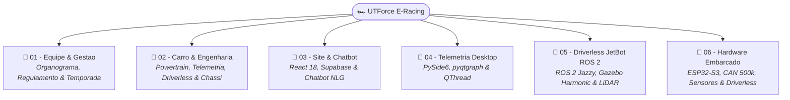

# 🏎️ UTForce E-Racing — Fórmula SAE Elétrico (UTFPR)

> A **UTForce E-Racing** é a equipe de engenharia e extensão universitária da **UTFPR Câmpus Ponta Grossa** dedicada a projetar, construir e competir com protótipos de alta performance de **Fórmula SAE 100% Elétrico** — orgulhosamente o **1º carro elétrico dos Campos Gerais**.

---

## 📌 Informações Rápidas & Repositórios
* **Instituição:** Universidade Tecnológica Federal do Paraná (UTFPR-PG).
* **Repositório do Site & Chatbot:** [SiteUTForce](file:///home/lucaschristen/Documentos/UTFPR/SiteUTForce)
* **Repositório do Software de Telemetria:** [Telemetria-Christen-UTFORCE](file:///home/lucaschristen/Documentos/UTFPR/Telemetria-Christen-UTFORCE)
* **Repositório da Plataforma Driverless:** [jetbot_ros-master](file:///home/lucaschristen/Documentos/jetbot_ros-master)
* **Competição Oficial:** Fórmula SAE Brasil (Realizada anualmente em Piracicaba/SP).
* **Atuação de Lucas Christen:**
  * 📡 **Hardware Embarcado & Telemetria:** Arquitetura distribuída de nós CAN a 500 kbps (VDN-Front, VDN-Rear, PCU, INU com ESP32-S3 Heltec V3 e T-Beam), condicionamento analógico (divisores, filtros RC, MCP3208/ADS131M08), Blackbox Raspberry Pi e link LoRa SX1262.
  * 🤖 **Sistemas Autônomos (*Formula Driverless*):** Desenvolvimento da plataforma de simulação física e controle autônomo em ROS 2 Jazzy + Gazebo Harmonic, percepção por LiDAR/câmera, odometria EKF e algoritmos reativos de corrida.
  * 📊 **Software de Telemetria Desktop:** Aplicativo em PySide6/pyqtgraph com concorrência em `QThread`, visualização em tempo real de 70+ sensores, comparação de voltas com interpolação contínua e status térmico do carro.
  * 🌐 **Engenharia de Software Web:** Desenvolvimento da Landing Page oficial e do Chatbot com motor determinístico NLG.

---

## 🧭 Base de Conhecimento e Documentação no Obsidian



### 📁 01 - Equipe & Gestão
* 👥 [[👥 Estrutura da Equipe, Organograma e Roster|Estrutura da Equipe, Organograma e Roster Oficial]]
* 🏆 [[🏆 Regulamento Formula SAE e Provas da Competicao|Regulamento Fórmula SAE, Scrutineering e Provas Estáticas/Dinâmicas]]
* 📅 [[📅 Ciclo de Engenharia e Temporada SAE|Ciclo de Engenharia em 6 Fases e Entregas Oficiais da SAE]]

### 📁 02 - Carro & Engenharia Veicular
* ⚡ [[⚡ Powertrain, Baterias e Sistema Trativo (Alta Tensao)|Powertrain, Baterias Li-Ion, Inversor e Segurança de Alta Tensão]]
* 📡 [[📡 Telemetria, Sensores e Aquisicao de Dados|Rede CAN Bus a 1 Mbps, Sensores de Pista e Telemetria Sem Fio]]
* 🤖 [[🤖 Sistemas Autonomos e Formula Driverless|Formula Student Driverless, Percepção de Cones, SLAM e EBS]]
* 🏎️ [[🏎️ Chassi, Dinamica Veicular, Freios e Aerodinamica|Chassi Spaceframe, Suspensão Double Wishbone, Freios e Downforce]]

### 📁 03 - Site Oficial & Chatbot Inteligente
* 🌐 **Visão Geral Completa do Site:** [[🌐 Site UTForce - Visao Geral|Hub de Engenharia Web e Chatbot]]
  * 🚀 [[🚀 Setup Local, Scripts e Deploy na Vercel|Setup Local, Scripts e Deploy na Vercel]]
  * 🧪 [[🧪 Bancada de Avaliacao e Metricas do Chatbot (eval-chatbot)|Bancada de Avaliação (105 Frases de Teste)]]
  * 🌐 [[🌐 Contrato da API Serverless e Endpoints|Contrato das Funções Serverless (/api/lead, /api/chat-log)]]
  * 🗄️ [[🗄️ Modelagem de Banco, Supabase SQL e RLS|Banco Relacional, Supabase SQL e Políticas RLS]]
  * 🛡️ [[🛡️ Seguranca, Redacao LGPD e Telemetria Anonima|Redação de PII no Cliente e Telemetria Sem Cookies]]
  * 🎨 [[🎨 Arquitetura React 18, Tailwind e Componentes UI|Design System Carbon & Crimson e Componentes]]
  * 🌍 [[🌍 Sistema de Rotas e Internacionalizacao (i18n)|Rotas com React Router e i18next Bilíngue]]
  * 💬 [[💬 Componente ChatWidget e Experiencia de Conversa|Componente ChatWidget e Funil de Conversão]]
  * 🪜 [[🪜 Cascata de Decisao de Intencoes em 8 Camadas|Cascata de 8 Camadas do matchIntent.js]]
  * 📐 [[📐 Similaridade por N-Gramas, IDF e Tolerancia Levenshtein|Matemática de N-Gramas, IDF e Levenshtein]]
  * 📝 [[📝 Geracao de Linguagem Natural (NLG) Baseada em Fatos|Geração de Linguagem Natural Factual sem LLM]]

### 📁 04 - Software de Telemetria (Desktop PySide6)
* 📡 **Visão Geral da Telemetria Desktop:** [[📡 Software de Telemetria UTForce - Visao Geral|Hub de Engenharia da Telemetria]]
  * 🚀 [[🚀 Setup, Dependencias e Execucao Local|Setup Local, Dependências e Execução Python]]
  * 📦 [[📦 Empacotamento Executavel com PyInstaller|Empacotamento Executável Portátil (.exe) com PyInstaller]]
  * 🔄 [[🔄 Simulador Multi-thread, Qt Signals e Pipeline de Dados|Arquitetura Concorrente QThread a 10 Hz e Qt Signals]]
  * 📊 [[📊 Dicionario Completo dos 70+ Sensores Automotivos|Dicionário Completo dos 70+ Sensores Veiculares]]
  * 📈 [[📈 Monitoramento em Tempo Real e Graficos Draggable (pyqtgraph)|Grade Dinâmica NxM e Drag-and-Drop de Gráficos]]
  * ⏱️ [[⏱️ Comparacao de Voltas, Delta T e Interpolacao Linear|Comparador de Voltas, Linha Síncrona e Interpolação Linear]]
  * 🏎️ [[🏎️ Status Visual do Carro e Alertas Termicos|Status do Carro, Pinos no Blueprint e Alertas Térmicos]]
  * 🔧 [[🔧 Setup Dinamico e Parametros de Suspensao|Setup Dinâmico com 14 Variáveis Mecânicas e Aerodinâmicas]]
* 🌟 **Portfólio Pessoal da Telemetria:** [[📡 Telemetria UTForce - Hub Pessoal & Portfolio|Hub de Portfólio Pessoal de Lucas Christen]]

### 📁 05 - Plataforma Autônoma Driverless (JetBot ROS 2)
* 🤖 **Visão Geral da Plataforma Driverless:** [[🤖 Plataforma Autonoma JetBot ROS 2 - Visao Geral|Hub de Robótica Autônoma]]
  * 🚀 [[🚀 Setup do Ambiente ROS 2 Jazzy, Gazebo Harmonic e Dependencias|Setup no Kubuntu 24.04, ROS 2 Jazzy e Gazebo Harmonic]]
  * 📦 [[📦 Modelo SDF 1.9 e Fisica DART do Robo|Modelo SDF 1.9, Inércias, Contato Esférico e DiffDrive]]
  * 🌐 [[🌐 Orquestrador de Launch Unificado (jetbot.launch.py)|Launch Declarativo com TFs Estáticos, RViz2 e Parâmetros]]
  * 🌉 [[🌉 Configuracao da Ponte ros_gz_bridge (bridge.yaml)|Ponte de Tópicos GZ Transport <-> ROS 2 DDS]]
  * 🗺️ [[🗺️ Gerador Procedural de Circuitos Fechados (gen_track.py)|Gerador Paramétrico de Autódromos por Séries de Fourier]]
  * 👁️ [[👁️ Cenas e Mundos de Simulacao (Worlds SDF)|Catálogo de Mundos: Pista, Mônaco e Labirinto com Obstáculos]]
  * 🏎️ [[🏎️ Controlador de Corrida Autonoma (race_follower.py)|Algoritmo de Corrida com Ajuste de Paredes por PCA e Follow-the-Gap]]
  * 📈 [[📈 Aprendizado Espacial de Velocidade por Trecho (AIMD Profiling)|Aprendizado de Pista por Trechos (AIMD) e Frenagem Antecipada]]
  * 🎯 [[🎯 Estimativa de Odometria e Contador de Voltas|Cronometragem de Voltas e Reancoragem Contra Deriva]]
  * 🔌 [[🔌 Camada de Atuacao e Motores Reais (I2C HATs)|Hardware Real: Drivers I2C para Motores DC e Display OLED]]
  * 🧠 [[🧠 Coleta de Dados e Navegacao por Deep Learning|Redes Neurais com PyTorch e Aceleração TensorRT na Câmera]]
* 🌟 **Portfólio Pessoal de Robótica:** [[🤖 JetBot ROS - Hub Pessoal & Portfolio|Hub de Portfólio Pessoal de Lucas Christen]]

### 📁 06 - Hardware Embarcado & Aquisição de Dados (ESP32, Raspberry Pi & Sensores)
* 📡 **Visão Geral da Telemetria Embarcada:** [[📡 Hardware de Telemetria Embarcada - Visao Geral|Hub de Hardware Embarcado]]
  * 🌐 [[🌐 Topologia Macro da Rede CAN 500k e Distribuicao dos Nos|Topologia Macro da Rede CAN 500k e Distribuição dos Nós]]
  * 🟢 [[🟢 No VDN-Front (ESP32 Heltec V3, Entradas Digitais e SPI)|Nó VDN-Front (ESP32 Heltec V3, Entradas Digitais e SPI)]]
  * 🟢 [[🟢 No VDN-Rear (ESP32 Heltec V3, Simetria e Sensores Traseiros)|Nó VDN-Rear (ESP32 Heltec V3, Simetria e Sensores Traseiros)]]
  * 🔵 [[🔵 No PCU (Controle, Powertrain, APS, Freios e Direcao)|Nó PCU (Controle, Powertrain, APS, Freios e Direção)]]
  * 🟣 [[🟣 No INU (ESP32 T-Beam, GPS NEO-M8N e IMU BNO085 9-DoF)|Nó INU (ESP32 T-Beam, GPS NEO-M8N e IMU BNO085 9-DoF)]]
  * ⚡ [[⚡ Alimentacao Eletrica, Protecoes TVS e Isolamento Galvanico|Alimentação Elétrica, Proteções TVS e Isolamento Galvânico]]
  * 📊 [[📊 Dicionario Completo de Canais, Fontes e Taxas de Amostragem (Hz)|Dicionário Completo de Canais, Fontes e Taxas de Amostragem (Hz)]]
  * ⏱️ [[⏱️ Sensores de Roda TLE4922 e Contagem por Hardware PCNT|Sensores de Roda TLE4922 e Contagem por Hardware PCNT]]
  * 📐 [[📐 Ride Height (Laser vs Potenciometro Linear) e Calibracao|Ride Height (Laser vs Potenciômetro Linear) e Calibração]]
  * 🛑 [[🛑 Transdutores de Pressao Hidraulica e APS Duplo Redundante|Transdutores de Pressão Hidráulica e APS Duplo Redundante]]
  * 🏎️ [[🏎️ Sensor de Angulo AS5600 e Célula de Torque com INA333|Sensor de Ângulo AS5600 e Célula de Torque com INA333]]
  * 🌡️ [[🌡️ Matriz Termica de Pneus MLX90614 e Sensores de Temperatura|Matriz Térmica de Pneus MLX90614 e Sensores de Temperatura]]
  * 🛰️ [[🛰️ Unidade Inercial BNO085 e GPS NEO-M8N com Sincronismo PPS|Unidade Inercial BNO085 e GPS NEO-M8N com Sincronismo PPS]]
  * ⚡ [[⚡ Circuitos Condicionadores (Divisores 33k-12k, Filtros RC e ADCs MCP3208-ADS131M08)|Circuitos Condicionadores (Divisores 33k-12k, Filtros RC e ADCs)]]
  * 🌐 [[🌐 Arquitetura CAN 2.0B (500 kbps), Transceivers SN65HVD230 e Terminacao|Arquitetura CAN 2.0B (500 kbps), Transceivers SN65HVD230 e Terminação]]
  * 📊 [[📊 Matriz de Mensagens CAN e Dicionario de IDs (DBC Veicular)|Matriz de Mensagens CAN e Dicionário de IDs (DBC Veicular)]]
  * 💻 [[💻 Arquitetura de Firmware PlatformIO (C++, FreeRTOS e Core Pinning)|Arquitetura de Firmware PlatformIO (C++, FreeRTOS e Core Pinning)]]
  * 🔴 [[🔴 Gateway e Logger Raspberry Pi (SocketCAN, Logs BLF e CSV)|Gateway e Logger Raspberry Pi (SocketCAN, Logs BLF e CSV)]]
  * ⚙️ [[⚙️ Calculos de Dinamica em Tempo Real (Slip, AeroBalance e G-Forces)|Cálculos de Dinâmica em Tempo Real (Slip, AeroBalance e G-Forces)]]
  * 🛡️ [[🛡️ Resiliencia contra Queda Abrupta de Energia e Modo Read-Only|Resiliência contra Queda Abrupta de Energia e Modo Read-Only]]
  * 📡 [[📡 Modulo LoRa SX1262, Bit-Packing Compacto e CRC16|Módulo LoRa SX1262, Bit-Packing Compacto e CRC16]]
  * 💻 [[💻 Estacao Receptora de Boxes (USB Serial Bridge e Integracao PySide6)|Estação Receptora de Boxes (USB Serial Bridge e Integração PySide6)]]
  * 🤖 [[🤖 Arquitetura de Transicao: Da Telemetria Convencional ao Driverless|Arquitetura de Transição: Da Telemetria Convencional ao Driverless]]
  * 🌉 [[🌉 Ponte CAN para ROS 2 (socketcan_bridge e Publicacao de Topicos)|Ponte CAN para ROS 2 (socketcan_bridge e Publicação de Tópicos)]]
  * 🧭 [[🧭 Fusao Sensorial (EKF com Rodas, IMU e GPS) para Odometria Autonoma|Fusão Sensorial (EKF com Rodas, IMU e GPS) para Odometria Autônoma]]
  * 🏎️ [[🏎️ Integracao com o Ecossistema Autonomo (JetBot ROS 2, IA-MONITOR e Controle)|Integração com o Ecossistema Autônomo (JetBot ROS 2, IA-MONITOR e Controle)]]
* 🌟 **Portfólio Pessoal de Hardware & IoT:** [[📡 Telemetria Embarcada & IoT - Hub Pessoal & Portfolio|Hub de Portfólio Pessoal de Lucas Christen]]

---

## ⚡ Comandos Rápidos

### 1. Plataforma Driverless (ROS 2 & Gazebo Harmonic)
```bash
cd "/home/lucaschristen/Documentos/jetbot_ros-master"
source /opt/ros/jazzy/setup.bash
# Executar corrida autônoma no circuito fechado com visualizador
ros2 launch gazebo_gz/launch/jetbot.launch.py world:=track.sdf race:=true
```

### 2. Software de Telemetria Desktop
```bash
cd "/home/lucaschristen/Documentos/UTFPR/Telemetria-Christen-UTFORCE"
python main.py
```

### 3. Portal Web & Chatbot
```bash
cd "/home/lucaschristen/Documentos/UTFPR/SiteUTForce"
npm run dev
```

---

* 🔗 Voltar para a [[📋 Central de Meus Projetos|Central de Meus Projetos]]
* 🏫 Voltar para o módulo de [[🏠 Painel Principal|Painel Principal (UTFPR)]]
* 🏠 Voltar para o [[🏠 Painel Principal|Painel Principal do Segundo Cérebro]]
